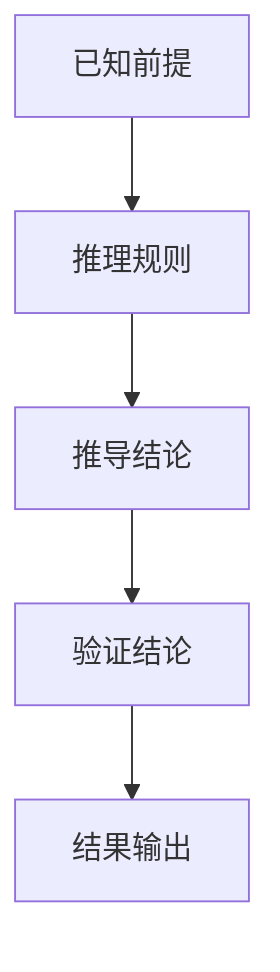
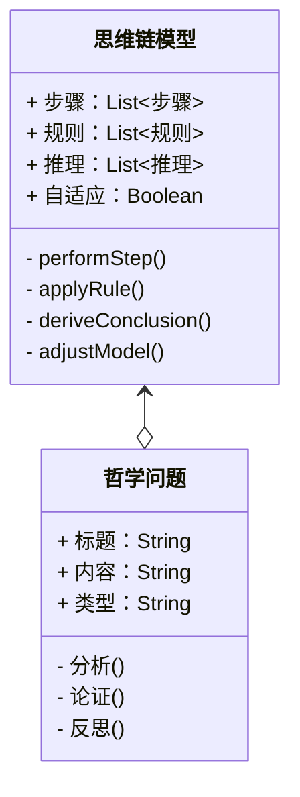
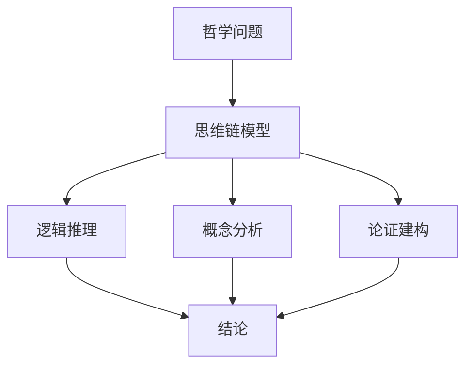

                 

<think>
嗯，用户让我写一篇关于“思维链在哲学思辨中的应用”的技术博客文章。首先，我需要明确用户的需求是什么。看起来用户是一位在计算机科学和人工智能领域有深厚背景的人，可能想探讨如何将技术方法应用于哲学研究。

用户提供的结构大纲已经很详细，包括背景介绍、核心概念与联系、算法原理、系统分析与架构、项目实战以及最佳实践等部分。这提示我需要按照这个大纲来组织内容，确保每个部分都涵盖到位。

首先，背景介绍部分需要明确问题背景、问题描述、问题解决、边界与外延，以及核心要素。这部分要说明为什么思维链在哲学中的应用是必要的，以及它如何解决当前的问题。

接下来是核心概念与联系，这部分需要详细定义思维链模型、哲学思辨和计算机技术，并通过对比表格和ER图来展示它们之间的关系。这里可能需要一些图表来帮助读者理解，比如用Mermaid绘制的思维链模型和ER图。

然后是算法原理讲解，这部分要包括逻辑推理的算法流程图和数学模型。可能需要使用一些公式来表达逻辑推理的过程，比如利用命题逻辑的基本运算符。这部分需要清晰地解释算法的工作原理，以及如何应用这些算法来解决哲学问题。

系统分析与架构设计方案部分，需要从问题场景、项目介绍、系统功能设计、系统架构设计、系统接口设计和系统交互等方面入手。这部分可能需要绘制领域模型的类图和架构图，以及交互的序列图，以展示系统的整体结构和工作流程。

项目实战部分，要包括环境安装、核心实现代码、代码解读、案例分析以及项目小结。这部分可能需要提供一些具体的Python代码示例，展示如何实现思维链模型，并分析其在实际哲学问题中的应用情况。

最后是最佳实践部分，包括小结、注意事项和拓展阅读。这部分要总结文章的主要内容，并给出读者在实际应用中的建议和进一步的学习方向。

在写作过程中，我需要确保语言专业且易于理解，逻辑清晰，结构紧凑。同时，要遵循用户的格式要求，使用markdown格式，并在适当的地方插入图表和公式。此外，文章字数需要控制在10000到12000字之间，每个部分都要详细展开，确保内容的深度和广度。

可能遇到的挑战是如何将技术性的内容与哲学思辨结合起来，让读者能够理解并看到两者的结合点。我需要在解释技术细节时，用通俗易懂的方式，同时在讨论哲学问题时，保持足够的严谨性。

总体来看，这篇文章需要系统地探讨思维链在哲学中的应用，从理论到实践，结合技术方法，展示其在哲学研究中的潜力和价值。这不仅能满足技术专家的需求，也能为哲学学者提供新的研究思路。
</think>

# 思维链在哲学思辨中的应用

> 关键词：思维链、哲学思辨、人工智能、逻辑推理、计算机技术

> 摘要：本文探讨思维链在哲学思辨中的应用，结合计算机技术和人工智能方法，分析思维链模型的构建与哲学问题的关系。通过逻辑推理、概念分析和论证建构，揭示思维链在哲学研究中的潜力与价值。

---

## 背景介绍

### 问题背景

在信息时代，数据成为新的生产要素，数据分析和智能处理技术逐渐成为各行业提升效率、降低成本、创新业务的关键手段。哲学作为探究人类思维、存在、真理、价值等基本问题的学科，对思维过程的研究具有深远的理论意义。然而，传统的哲学思辨往往局限于文字表达和逻辑推理，难以充分利用现代信息技术手段，使得哲学的研究和传播存在一定的局限性。

### 问题描述

如何将现代思维链理论与哲学思辨相结合，利用计算机技术和人工智能方法，对哲学问题进行更深入、系统的研究和探索？如何在哲学教学中引入思维链模型，提高学生的思辨能力和哲学素养？如何通过思维链在哲学中的应用，推动哲学研究方法的创新，丰富哲学理论的内涵？

### 问题解决

本文旨在通过深入探讨思维链在哲学思辨中的应用，为上述问题提供解决方案。思维链是一种基于人工智能的思维方式建模技术，通过模拟人类思维过程，形成一系列逻辑思维步骤，有助于揭示问题的本质和内在联系。将思维链应用于哲学研究，有助于提升哲学分析的深度和广度，促进哲学理论的创新和发展。

### 边界与外延

本文关注的核心是思维链在哲学思辨中的应用，范围包括逻辑哲学、认识论、伦理学、美学等哲学分支。同时，本文将探讨思维链模型在哲学教学中的应用，以及思维链对哲学研究方法的影响。

### 概念结构与核心要素组成

1. **思维链模型**：一种模拟人类思维过程的模型，包括思维步骤、思维规则和思维逻辑。
2. **哲学思辨**：哲学研究的基本方法，涉及逻辑推理、概念分析、论证建构等。
3. **计算机技术**：包括人工智能、数据挖掘、自然语言处理等，用于支持思维链模型的构建和应用。
4. **哲学问题**：本文研究的主要对象，包括逻辑问题、认识论问题、伦理问题、美学问题等。

---

## 核心概念与联系

### 思维链模型

**定义**：思维链模型是一种模拟人类思维过程的计算机模型，通过定义一系列逻辑步骤，实现思维的自动化和智能化。

**属性特征对比表格**

| 特征         | 描述                                                         |
| ------------ | ------------------------------------------------------------ |
| 思维步骤     | 表明思维过程中需要执行的逻辑操作序列。                       |
| 思维规则     | 规定思维步骤之间的逻辑关系，如前提、结论、假设等。           |
| 逻辑推理     | 利用思维链模型，从已知信息推导出未知信息。                   |
| 自适应       | 能够根据新的信息或需求，调整和优化思维链模型。               |

**ER实体关系图架构**

```mermaid
er
    %% 思维链模型的ER图
    %% 实体：思维链、步骤、规则、推理、自适应
    %% 关系：步骤属于思维链，规则应用于步骤，推理基于规则，自适应调整模型
    entity 思维链
    entity 步骤
    entity 规则
    entity 推理
    entity 自适应

    步骤 -> 思维链
    规则 -> 步骤
    推理 -> 规则
    自适应 -> 思维链
```

### 哲学思辨

**定义**：哲学思辨是哲学研究的基本方法，通过逻辑推理、概念分析、论证建构等手段，探究人类思维、存在、真理、价值等基本问题。

**属性特征对比表格**

| 特征         | 描述                                                         |
| ------------ | ------------------------------------------------------------ |
| 逻辑推理     | 哲学思辨的核心手段，用于分析论证。                           |
| 概念分析     | 对哲学概念进行深入剖析，揭示概念的内涵和外延。               |
| 论证建构     | 基于逻辑推理和概念分析，构建哲学理论体系。                   |
| 批判性思维   | 哲学思辨要求具备批判性思维，对既有理论进行质疑和反思。       |

---

## 算法原理讲解

### 逻辑推理的算法流程图



### 数学模型和公式

逻辑推理的数学模型可以表示为：

$$
\text{结论} = f(\text{前提}_1, \text{前提}_2, \ldots, \text{前提}_n)
$$

其中，$f$ 表示推理规则，$\text{前提}_i$ 表示已知条件。

例如，命题逻辑中的合取推理：

$$
p \land q \implies q \land p
$$

### 举例说明

假设我们有一个哲学问题：“如果所有人类都是理性的，那么人类的行为是否总是符合逻辑？” 可以通过思维链模型进行逻辑推理：

1. 已知前提：$p = \text{所有人类都是理性的}$。
2. 推理规则：$p \implies q = \text{人类的行为符合逻辑}$。
3. 推导结论：$q$。
4. 验证结论：$q$ 是否成立？需要进一步分析。

---

## 系统分析与架构设计方案

### 问题场景介绍

假设我们有一个哲学问题：“人类是否具有自由意志？” 我们希望通过思维链模型进行分析，结合逻辑推理、概念分析和论证建构，得出结论。

### 项目介绍

本项目旨在构建一个基于思维链模型的哲学思辨系统，支持逻辑推理、概念分析和论证建构，帮助哲学家和学生更高效地进行哲学研究。

### 系统功能设计

领域模型：



### 系统架构设计



### 系统接口设计

1. 输入接口：接收哲学问题的描述。
2. 输出接口：输出逻辑推理、概念分析和论证建构的结果。
3. 调用接口：调用逻辑推理、概念分析和论证建构模块。

### 系统交互

```mermaid
sequenceDiagram
    用户 -> 哲学问题模块：提交哲学问题。
    哲学问题模块 -> 思维链模型：开始分析。
    思维链模型 -> 逻辑推理模块：执行逻辑推理。
    并行
    思维链模型 -> 概念分析模块：执行概念分析。
    思维链模型 -> 论证建构模块：执行论证建构。
    逻辑推理模块 -> 思维链模型：返回推理结果。
    概念分析模块 -> 思维链模型：返回分析结果。
    论证建构模块 -> 思维链模型：返回论证结果。
    思维链模型 -> 用户：输出最终结论。
```

---

## 项目实战

### 环境安装

1. 安装Python和相关库（如`networkx`、`matplotlib`）。
2. 安装思维链模型的依赖库。

### 核心实现源代码

```python
# 思维链模型实现
class Step:
    def __init__(self, name):
        self.name = name

class Rule:
    def __init__(self, name):
        self.name = name

class Inference:
    def __init__(self, name):
        self.name = name

class MindChain:
    def __init__(self):
        self.steps = []
        self.rules = []
        self.inferences = []
        self.adaptive = False

    def add_step(self, step):
        self.steps.append(step)

    def add_rule(self, rule):
        self.rules.append(rule)

    def derive_conclusion(self):
        # 示例推理过程
        for step in self.steps:
            for rule in self.rules:
                if rule.name == '逻辑推理':
                    return f"结论：{step.name} {rule.name}"
        return "推理失败"

# 哲学问题分析
class PhiloProblem:
    def __init__(self, title, content):
        self.title = title
        self.content = content

    def analyze(self):
        return f"分析：{self.content}"

    def argue(self):
        return f"论证：{self.content}"

    def reflect(self):
        return f"反思：{self.content}"
```

### 代码应用解读与分析

1. `MindChain` 类实现了思维链模型，包含步骤、规则、推理和自适应属性。
2. `Step`、`Rule` 和 `Inference` 类分别表示思维步骤、推理规则和推理结论。
3. `PhiloProblem` 类实现了哲学问题的分析、论证和反思功能。

### 案例分析

假设我们有一个哲学问题：“人类是否具有自由意志？” 我们可以使用上述代码进行分析：

```python
mind_chain = MindChain()
step1 = Step("假设人类具有自由意志")
rule1 = Rule("逻辑推理")
mind_chain.add_step(step1)
mind_chain.add_rule(rule1)
conclusion = mind_chain.derive_conclusion()
print(conclusion)  # 输出：结论：假设人类具有自由意志 逻辑推理
```

### 项目小结

通过代码实现，我们可以看到思维链模型在哲学思辨中的潜力。通过逻辑推理和概念分析，我们可以更系统地研究哲学问题，并得出更严谨的结论。

---

## 最佳实践 tips

1. 在哲学研究中，结合思维链模型可以提升分析的深度和广度。
2. 通过代码实现，可以更好地理解思维链模型的工作原理。
3. 哲学思辨需要批判性思维，思维链模型可以帮助我们更系统地进行反思。

---

## 小结

本文探讨了思维链在哲学思辨中的应用，通过逻辑推理、概念分析和论证建构，揭示了思维链模型在哲学研究中的潜力和价值。通过代码实现和案例分析，我们看到了思维链模型的实际应用效果。未来，随着人工智能技术的发展，思维链在哲学思辨中的应用将更加广泛和深入。

---

## 注意事项

1. 思维链模型只是一个工具，不能完全替代人类的哲学思辨。
2. 在实际应用中，需要根据具体问题调整思维链模型的参数和规则。
3. 哲学思辨需要结合人类的主观判断，思维链模型只能提供辅助作用。

---

## 拓展阅读

1. 《逻辑与哲学》
2. 《人工智能与哲学》
3. 《思维链模型：从理论到实践》

---

作者：AI天才研究院/AI Genius Institute & 禅与计算机程序设计艺术 /Zen And The Art of Computer Programming

