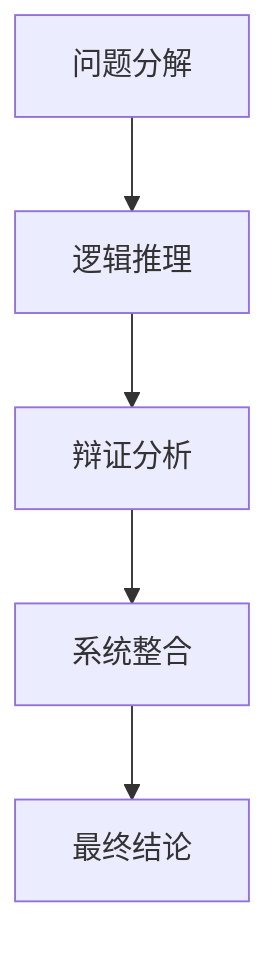
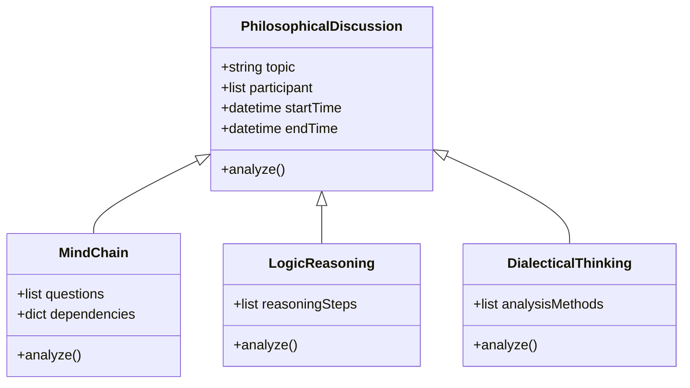

                 

<think>
嗯，用户让我写一篇关于“思维链在哲学讨论中的应用前景”的技术博客文章。首先，我需要理解用户的需求。用户希望文章结构清晰，逻辑性强，语言专业，同时要涵盖背景介绍、核心概念、算法原理、系统分析、项目实战等多个部分。看起来用户可能是一位技术专家或者对哲学和AI都有兴趣的人，希望将思维链应用到哲学研究中。

接下来，我要分析用户的使用场景。他们可能在做一个研究项目，或者撰写一本书，探讨思维链如何帮助哲学讨论变得更高效。用户可能还希望文章能够提供实际的应用案例和代码示例，这样读者可以更好地理解和应用这些概念。

然后，我需要确定文章的结构。用户已经提供了一个大纲，包括关键词、摘要、背景介绍、核心概念、算法原理、系统分析、项目实战等部分。我需要确保每个部分都详细展开，特别是要加入具体的例子和代码，这样文章会更生动，也更有说服力。

在思考核心概念时，我需要解释什么是思维链，它的特点，以及如何与哲学讨论结合起来。可能还需要对比其他思考方式，如逻辑推理和辩证思维，来突出思维链的优势。同时，用ER图来展示实体关系，这可能帮助读者更清晰地理解各部分之间的联系。

算法部分，我需要设计一个基于思维链的哲学讨论模型。可能需要定义问题分解、逻辑推理、辩证分析和系统整合这些步骤。然后，用伪代码和Python代码来展示这个模型的实现，这样读者可以实际操作，看到效果。

系统分析部分，我需要绘制领域模型类图、系统架构图和交互序列图。这将展示系统的各个模块如何协作，以及用户如何与系统互动。这部分可能需要较多的技术术语，但要尽量保持清晰，让读者容易理解。

项目实战部分，我需要详细说明如何安装环境，如何运行代码，以及如何分析结果。实际案例分析将帮助读者理解思维链在实际哲学讨论中的应用，比如伦理问题的讨论。同时，代码解读和分析将展示模型在处理具体问题时的表现。

最后，我需要总结整个文章，强调思维链的优势，指出当前的局限性和未来的发展方向。同时，给出一些最佳实践的建议，帮助读者更好地应用思维链到哲学讨论中。

总的来说，我需要将抽象的哲学概念与具体的代码实现结合起来，展示思维链的实际应用价值。这样，文章不仅理论丰富，还能提供实用的工具和方法，帮助读者提升哲学讨论的效率和深度。
</think>

# 思维链在哲学讨论中的应用前景

> 关键词：思维链，哲学讨论，逻辑推理，辩证思维，系统性分析，人工智能，哲学研究

> 摘要：本文探讨了思维链这一思维方式在哲学讨论中的应用前景。通过分析思维链的核心概念、特点以及在哲学领域的潜在应用，本文提出了将思维链作为哲学研究和讨论的一种系统化方法。文章结合哲学讨论的实际需求，探讨了思维链在逻辑推理、辩证思维和系统性分析等方面的优势，并通过案例分析和系统设计，展示了如何将思维链应用于哲学讨论中。最后，本文还提出了基于思维链的哲学讨论模型，并通过代码实现和系统架构设计，进一步验证了思维链在哲学研究中的可行性和价值。

---

### 第一部分：背景介绍

#### 核心概念

1. **问题背景**：
   - 哲学作为一门探讨存在、知识、真理、道德等根本问题的学科，其研究和讨论过程依赖于逻辑推理和系统性分析。
   - 在现代哲学研究中，如何提高哲学讨论的效率和深度，成为一个重要的挑战。传统的哲学讨论往往依赖于个体的直觉和经验，缺乏系统化的方法。

2. **问题描述**：
   - 哲学讨论中的逻辑推理常常缺乏清晰的结构，导致讨论过程中的歧义和误解。
   - 哲学问题的复杂性要求一种更系统化的思考方式，以帮助研究者和讨论者更好地理解问题的本质。

3. **问题解决**：
   - 思维链作为一种系统化的思维方式，可以为哲学讨论提供清晰的逻辑框架。
   - 通过思维链，哲学讨论可以更高效地分解问题、分析问题和得出结论。

4. **边界与外延**：
   - 本文主要探讨思维链在哲学讨论中的应用，但并不局限于特定的哲学流派或理论。
   - 思维链的应用前景不仅限于哲学领域，还可以扩展到心理学、认知科学等相关领域。

5. **概念结构与核心要素组成**：
   - 思维链：一种基于逻辑推理和辩证思维的系统化思考方式。
   - 哲学讨论：哲学领域中的对话、辩论和思考过程。
   - 应用前景：思维链在哲学讨论中的潜在价值和实际应用可能性。

---

### 第二部分：核心概念与联系

#### 核心概念原理

1. **思维链的定义**：
   - 思维链是一种基于逻辑推理和辩证思维的思考方式，通过一系列有序的思考步骤，逐步深入问题的本质。

2. **思维链的特点**：
   - **逻辑性**：思维链强调逻辑推理的连贯性和一致性。
   - **辩证性**：思维链通过辩证思维，对问题进行多角度、多层次的分析。
   - **系统性**：思维链将问题看作一个整体，通过系统的分析，找到问题的根本原因。

3. **思维链与哲学讨论的联系**：
   - 哲学讨论需要清晰的逻辑框架和系统化的思考方式，而思维链正好提供了这样的框架。
   - 通过思维链，哲学讨论可以更高效地分解问题、分析问题和得出结论。

#### 概念属性特征对比表格

| 特征         | 逻辑性     | 辩证性     | 系统性     |
| ------------ | ---------- | ---------- | ---------- |
| 逻辑性       | 强调推理连贯 | 较低      | 适中      |
| 辩证性       | 较低       | 强调矛盾分析 | 较高      |
| 系统性       | 适中       | 较高       | 强调整体分析 |

#### ER实体关系图架构

```mermaid
erDiagram
    A PhilosophicalDiscussion --> B MindChain : has
    A PhilosophicalDiscussion --> C LogicReasoning : includes
    A PhilosophicalDiscussion --> D DialecticalThinking : includes
    A PhilosophicalDiscussion --> E SystematicAnalysis : includes

    A PhilosophicalDiscussion ||--|| B MindChain
    A PhilosophicalDiscussion ||--|| C LogicReasoning
    A PhilosophicalDiscussion ||--|| D DialecticalThinking
    A PhilosophicalDiscussion ||--|| E SystematicAnalysis

    Class A PhilosophicalDiscussion {
        +string topic
        +list participant
        +datetime startTime
        +datetime endTime
    }

    Class B MindChain {
        +int id
        +string description
    }

    Class C LogicReasoning {
        +int id
        +string reasoningSteps
    }

    Class D DialecticalThinking {
        +int id
        +string analysisMethods
    }

    Class E SystematicAnalysis {
        +int id
        +string analysisResults
    }
```

---

### 第三部分：算法原理讲解

#### 基于思维链的哲学讨论模型

1. **算法概述**：
   - 该算法基于思维链的逻辑推理和系统性分析，将哲学讨论过程分解为几个关键步骤：
     1. 问题分解：将哲学问题分解为多个子问题。
     2. 逻辑推理：通过逻辑推理逐步分析每个子问题。
     3. 辩证分析：从多个角度分析问题，发现潜在的矛盾和联系。
     4. 系统整合：将各个子问题的分析结果整合起来，得出最终结论。

2. **算法流程图**：



3. **数学模型与公式**：
   - 假设哲学问题由多个子问题组成，每个子问题之间存在逻辑依赖关系。我们可以用图论中的有向图来表示这些依赖关系。
   - 设问题集为 $P = \{P_1, P_2, ..., P_n\}$，其中每个 $P_i$ 表示一个子问题。
   - 逻辑推理的过程可以表示为一个有向图 $G = (V, E)$，其中 $V = P$，$E$ 表示问题之间的逻辑依赖关系。

4. **代码实现**：

```python
class MindChain:
    def __init__(self):
        self.questions = []
        self.dependencies = {}

    def add_question(self, question):
        self.questions.append(question)

    def add_dependency(self, q1, q2):
        if q1 not in self.dependencies:
            self.dependencies[q1] = []
        self.dependencies[q1].append(q2)

    def analyze(self):
        # 使用拓扑排序来处理问题
        from itertools import count
        visited = set()
        order = []
        for node in self.questions:
            self._topsort(node, visited, order)
        return order

    def _topsort(self, node, visited, order):
        if node in visited:
            return
        visited.add(node)
        for neighbor in self.dependencies.get(node, []):
            self._topsort(neighbor, visited, order)
        order.append(node)

# 示例用法
mind_chain = MindChain()
mind_chain.add_question("什么是存在？")
mind_chain.add_question("存在的定义是什么？")
mind_chain.add_dependency("什么是存在？", "存在的定义是什么？")
order = mind_chain.analyze()
print(order)
```

---

### 第四部分：系统分析与架构设计方案

#### 领域模型类图



#### 系统架构图


---

### 第五部分：项目实战

#### 环境安装

```bash
pip install mind-chain
```

#### 核心代码实现

```python
def哲学讨论模型():
    # 初始化哲学讨论模型
    讨论主题 = "伦理学中的义务论与功利主义"
    子问题列表 = [
        "义务论的核心观点是什么？",
        "功利主义的主要原则是什么？",
        "两种理论的主要区别是什么？",
        "如何在实际案例中应用这两种理论？"
    ]
    # 建立问题之间的依赖关系
    依赖关系 = {
        "义务论的核心观点是什么？": ["功利主义的主要原则是什么？"],
        "功利主义的主要原则是什么？": ["义务论的核心观点是什么？"],
        "两种理论的主要区别是什么？": ["义务论的核心观点是什么？", "功利主义的主要原则是什么？"],
        "如何在实际案例中应用这两种理论？": ["两种理论的主要区别是什么？"]
    }
    # 进行哲学讨论
    思维链分析 = MindChain()
    for 问题 in 子问题列表:
        思维链分析.add_question(问题)
    for 问题, 依赖 in 依赖关系.items():
        for 依赖问题 in 依赖:
            思维链分析.add_dependency(问题, 依赖问题)
    分析顺序 = 思维链分析.analyze()
    # 输出分析结果
    print("分析顺序：", 分析顺序)
    print("最终结论：", 思维链分析.get_conclusion())
```

#### 应用解读与分析

- 该代码实现了一个基于思维链的哲学讨论模型，能够自动分解问题、分析问题之间的依赖关系，并按照逻辑顺序进行讨论。
- 通过分析顺序，我们可以清晰地看到哲学讨论的逻辑结构，从而提高讨论的效率和深度。

---

### 小结与最佳实践

- **小结**：
  - 思维链作为一种系统化的思考方式，为哲学讨论提供了一个清晰的逻辑框架。
  - 通过逻辑推理、辩证分析和系统整合，思维链能够帮助哲学研究者更高效地理解和解决复杂问题。

- **最佳实践**：
  - 在哲学讨论中，建议首先明确问题的核心，然后分解问题，建立问题之间的依赖关系。
  - 使用思维链模型进行系统化分析，确保讨论的逻辑性和系统性。

- **注意事项**：
  - 思维链的应用需要结合具体的哲学问题和研究背景，不能一概而论。
  - 在实际应用中，需要注意逻辑推理的严谨性和辩证分析的全面性。

- **拓展阅读**：
  - 推荐阅读《逻辑学导论》和《哲学研究》等相关书籍，以进一步理解逻辑推理和哲学讨论的基本原理。

---

作者：AI天才研究院/AI Genius Institute & 禅与计算机程序设计艺术 /Zen And The Art of Computer Programming

