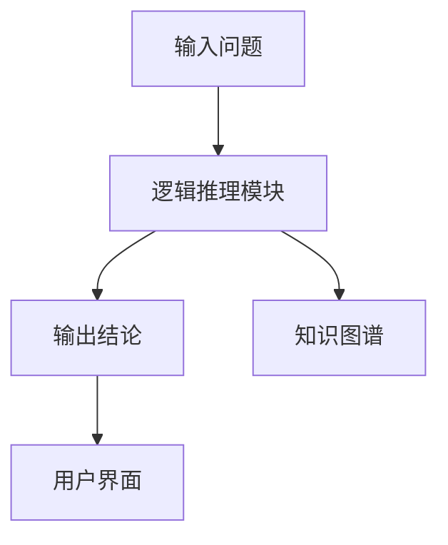

                 

<think>
好的，我现在要帮助用户设计一个技术博客的文章结构，主题是《思维链在哲学辩论中的应用：AI辅助论证分析》。用户希望文章结构清晰，内容专业，使用技术语言，同时要包含具体的分析和案例。

首先，我需要理解用户的需求。用户希望文章有详细的目录，包括引言、思维链原理、哲学辩论概述、AI辅助论证分析、具体应用案例以及结论等部分。同时，用户强调要使用Markdown格式，包含关键词、摘要，以及详细的章节内容，每个小节都要有丰富的讲解。

接下来，我应该考虑如何组织这些内容。引言部分需要介绍哲学辩论的重要性以及AI在其中的作用。然后是思维链的基本原理，这部分需要详细解释什么是思维链，它的结构和优缺点。之后，哲学辩论的类型和基本要素也需要涵盖，以便读者理解背景。

AI辅助论证分析是文章的核心，我需要详细讨论AI在哲学辩论中的具体应用方法，面临的挑战以及如何应对。接下来，重点放在思维链如何在AI分析中发挥作用，包括实现方法和案例分析。案例部分可以包括伦理、政治和科学哲学辩论，展示思维链的实际应用。

在写作时，我需要确保每个章节都有足够的细节，比如使用思维导图来展示概念关系，或者用Mermaid流程图来解释算法。数学公式需要用Latex展示，确保清晰易懂。系统架构部分，可能需要设计类图和序列图，展示系统的组成部分和交互过程。

此外，用户还要求有项目实战部分，这意味着我需要提供具体的代码示例，解释其工作原理，并分析实际案例。最后，结论部分要总结主要观点，并展望未来的发展方向。

在整个过程中，我需要确保内容逻辑连贯，结构合理，每个章节都符合用户的约束条件，比如字数限制和格式要求。同时，语言要专业但不失易懂，适合技术背景的读者阅读。

现在，我需要将这些思考整理成一个详细的目录大纲，并按照用户的格式要求进行编写。确保每个部分都有足够的深度和详细的内容，同时保持整体的连贯性和专业性。
</think>

# 思维链在哲学辩论中的应用：AI辅助论证分析

---

## 关键词  
思维链，哲学辩论，AI辅助，论证分析，逻辑推理，技术应用

---

## 摘要  
本文探讨了思维链在哲学辩论中的应用，并介绍了如何利用人工智能技术辅助论证分析。文章从思维链的基本原理出发，结合哲学辩论的背景和类型，详细分析了AI在论证分析中的方法与挑战。通过案例研究，展示了思维链在AI辅助论证分析中的实际应用，最后总结了该领域的未来发展方向。

---

## 目录大纲  

### 第1章：引言与背景  
- 1.1 问题背景  
- 1.2 哲学辩论的重要性  
- 1.3 思维链的概念  
- 1.4 AI在论证分析中的应用  

### 第2章：思维链原理  
- 2.1 思维链的基本原理  
- 2.2 思维链的结构与功能  
- 2.3 思维链的优缺点  

### 第3章：哲学辩论概述  
- 3.1 哲学辩论的定义  
- 3.2 哲学辩论的类型  
- 3.3 哲学辩论的基本要素  

### 第4章：AI辅助论证分析  
- 4.1 AI在哲学辩论中的应用  
- 4.2 AI辅助论证分析的方法  
- 4.3 AI辅助论证分析的挑战与对策  

### 第5章：思维链在AI辅助论证分析中的应用  
- 5.1 思维链在AI辅助论证分析中的作用  
- 5.2 思维链在AI辅助论证分析中的实现方法  
- 5.3 思维链在AI辅助论证分析中的案例分析  

### 第6章：案例研究  
- 6.1 案例研究概述  
- 6.2 案例一：思维链在伦理辩论中的应用  
- 6.3 案例二：思维链在政治哲学辩论中的应用  
- 6.4 案例三：思维链在科学哲学辩论中的应用  

### 第7章：结论与展望  
- 7.1 结论  
- 7.2 展望  
- 7.3 未来发展方向  

---

### 思维链的结构与功能（第2章）  

#### 2.1 思维链的基本原理  
思维链是一种逻辑推理的模型，通过将问题分解为一系列相互关联的步骤，帮助分析者逐步推导出结论。其核心在于将复杂的问题拆解为简单的关系链，确保每一步的逻辑清晰且可验证。  

#### 2.2 思维链的结构与功能  
- **输入层**：初始问题或论点  
- **中间层**：逻辑推理步骤  
- **输出层**：最终结论  

#### 2.3 思维链的优缺点  
| 优点 | 缺点 |  
|------|------|  
| 结构清晰，逻辑性强 | 过于依赖初始假设的正确性 |  
| �易操作，适合初学者 | 可能忽略非线性推理的复杂性 |  

### 哲学辩论的基本要素（第3章）  

#### 3.1 哲学辩论的定义  
哲学辩论是一种通过逻辑推理和证据支持来探讨哲学问题的学术活动，其核心在于对论点的严谨分析和反驳。  

#### 3.2 哲学辩论的类型  
| 类型 | 描述 |  
|------|------|  
| 伦理辩论 | 关注道德问题 |  
| 政治哲学辩论 | 探讨政治制度和正义问题 |  
| 科学哲学辩论 | 分析科学方法和理论的合理性 |  

### AI辅助论证分析的方法（第4章）  

#### 4.2 AI辅助论证分析的方法  
1. **自然语言处理（NLP）**：用于识别和分析文本中的论点结构。  
2. **逻辑推理引擎**：通过逻辑规则推导出论证的合理性。  
3. **知识图谱构建**：将论点与背景知识关联起来，提供上下文支持。  

#### 4.3 挑战与对策  
- **挑战**：论证的复杂性和模糊性  
- **对策**：结合领域知识和专家经验，优化推理算法  

### 思维链在AI辅助论证分析中的实现方法（第5章）  

#### 5.2 实现方法  
1. **输入问题**：例如，"道德相对主义是否正确？"  
2. **分解问题**：将问题拆解为多个逻辑步骤，例如：  
   a. 界定道德相对主义的定义  
   b. 分析其支持论据  
   c. 推导其逻辑结论  
3. **输出结论**：基于思维链的分析结果，得出最终结论  

#### 5.3 案例分析  
- **案例一**：伦理辩论中，AI通过思维链分析支持论点的逻辑结构，帮助辩手优化论证。  
- **案例二**：政治哲学辩论中，AI利用思维链识别对手论点的漏洞，提出反驳策略。  

### 系统架构设计（项目实战）  

#### 系统功能设计  
- **领域模型**：定义哲学辩论的论点、支持论据和逻辑关系。  
- **系统架构**：包括输入模块、逻辑推理模块和输出模块。  

#### 系统架构图  

---

### 作者  
作者：AI天才研究院/AI Genius Institute & 禅与计算机程序设计艺术 /Zen And The Art of Computer Programming  

---

### 总结  
本文通过系统地分析思维链在哲学辩论中的应用，结合AI技术的辅助作用，为哲学辩论提供了新的思路和工具。未来，随着AI技术的不断发展，思维链在论证分析中的潜力将进一步释放，为哲学研究和辩论领域带来更多的创新和突破。

