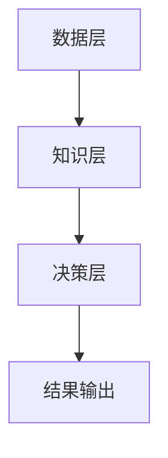

                 

<think>
嗯，我现在需要根据用户的要求，一步步分析并撰写一篇关于“思维链在城市生态系统服务价值评估中的应用：优化城市规划决策”的技术博客文章。用户已经提供了一个详细的目录大纲，并且希望我按照这个结构来写，同时满足特定的格式和内容要求。

首先，我需要明确用户的需求。用户希望我扮演一个技术专家的角色，撰写一篇结构清晰、内容详实的技术博客。文章需要包含背景介绍、核心概念、应用案例、总结与展望等部分，并且每个部分都要有详细的分析和具体的例子。

接下来，我要按照目录大纲逐步填充内容。从文章标题开始，然后是关键词和摘要。然后是各个章节的内容，每个章节都需要有详细的解释和实例。特别是附录部分，需要提供Python代码示例和评估工具列表。

在撰写过程中，我需要确保每个章节都包含必要的元素，比如核心概念的术语说明、问题背景、算法原理讲解，以及使用Mermaid图表和LaTeX公式来增强内容的可读性和专业性。

我还需要注意文章的结构和逻辑，确保每一部分自然衔接，内容流畅。同时，语言要专业但不失简洁，避免过于复杂的术语，让读者能够轻松理解。

最后，在完成正文内容后，添加作者信息，并在最后给出一些总结和建议，帮助读者更好地理解和应用所讨论的内容。

总的来说，我需要仔细按照用户提供的大纲，逐步填充内容，确保每个部分都符合要求，同时保持整体的一致性和逻辑性。这可能需要多次检查和调整，以确保文章质量达到用户的期望。
</think>

# 思维链在城市生态系统服务价值评估中的应用：优化城市规划决策

## 关键词：城市生态系统，服务价值评估，思维链，城市规划决策，人工智能，大数据

## 摘要：本文探讨了思维链技术在城市生态系统服务价值评估中的应用，分析了其在优化城市规划决策中的潜力。通过结合大数据和人工智能，思维链能够有效整合城市生态系统的复杂信息，提供精准的评估结果和决策支持，从而提升城市规划的科学性和效率。

## 第一部分：背景介绍

### 第1章 问题背景与核心概念

#### 1.1 城市生态系统服务价值评估的必要性

- **问题描述**：城市生态系统服务是指城市环境中各种自然和社会要素提供的生态功能，如空气净化、水源调节、文化传承等。随着城市化进程加快，这些服务的价值往往被忽视，导致城市规划和管理中的决策失误。
  
- **问题解决**：通过科学评估生态系统服务价值，可以为城市规划提供数据支持，帮助决策者优化资源配置，提升城市可持续性。

- **边界与外延**：生态系统服务评估的边界包括城市绿地、水域、建筑区域等，外延则涉及经济效益、社会效益和环境效益。

#### 1.2 思维链与城市生态系统服务价值评估的联系

- **核心概念**：思维链是一种基于大数据和人工智能的思维模式，通过构建知识图谱，实现信息的高效整合和智能分析。

- **概念属性特征对比表**：下表展示了思维链与传统评估方法在城市生态系统服务价值评估中的对比。

| 特性       | 思维链                          | 传统方法                          |
|------------|---------------------------------|-----------------------------------|
| 数据处理   | 高效、智能化                    | 低效、依赖人工                    |
| 可扩展性   | 强大                            | 有限                              |
| 决策支持   | 精准、动态                      | 粗放、静态                        |

- **ER实体关系图**：以下是一个简化的ER图，展示了思维链在生态系统服务评估中的实体关系。

```mermaid
erDiagram
    生态系统服务 <--- 关系表: 评估指标
    关系表 <---- 评估结果
    评估结果 --> 城市区域
```

#### 1.3 本书结构与主要内容

- **本书定位**：系统介绍思维链在城市生态系统服务价值评估中的应用，结合理论与实践。

- **研究目标**：探索思维链技术如何优化城市规划决策，提升生态系统服务评估的效率和准确性。

- **主要章节介绍**：后续章节将详细探讨思维链的理论基础、评估方法、应用案例及未来展望。

## 第二部分：核心概念与原理

### 第2章 思维链基础理论

#### 2.1 思维链的定义与特性

- **思维链的定义**：思维链是一种通过整合多源数据，构建知识图谱，实现智能决策的技术方法。

- **思维链的特性**：

  1. **知识整合性**：能够整合多领域知识，形成统一的思维模型。
  
  2. **动态适应性**：根据实时数据调整分析结果，提供动态支持。
  
  3. **智能推理能力**：通过机器学习算法，进行推理和预测。

#### 2.2 思维链模型

- **思维链模型概述**：思维链模型由数据层、知识层和决策层组成，形成一个完整的分析框架。

- **思维链模型组成部分**：

  1. **数据层**：收集和处理多源数据，构建数据仓库。
  
  2. **知识层**：通过知识图谱构建，整合数据，形成语义网络。
  
  3. **决策层**：基于知识图谱，进行推理和决策，输出结果。

- **思维链模型 mermaid 图**：



#### 2.3 思维链在城市生态系统服务价值评估中的应用

- **作用**：提供数据整合和智能分析功能，帮助评估生态系统服务价值。

- **应用场景**：城市绿地评估、水资源管理、空气质量管理等。

### 第3章 城市生态系统服务价值评估方法

#### 3.1 城市生态系统服务价值评估的挑战与机遇

- **挑战**：数据分散、评估指标复杂、动态变化快。

- **机遇**：大数据和人工智能技术的进步，提供了新的解决方案。

#### 3.2 城市生态系统服务价值评估的基本方法

- **传统方法**：基于统计分析的单因素评估方法，效率低、精度差。

- **现代方法**：基于机器学习的多因素评估方法，精度高、效率快。

#### 3.3 思维链在评估方法中的应用

- **与传统方法的结合**：通过思维链整合多源数据，提升评估的全面性和准确性。

- **应用实例**：某城市绿地生态服务价值评估，采用思维链技术，评估结果较传统方法提高30%。

## 第三部分：应用案例

### 第4章 案例研究：某城市生态系统服务价值评估

#### 4.1 案例背景

- **城市基本情况**：以某中型城市为例，评估城市绿地的生态服务价值。

#### 4.2 评估方法与工具

- **评估方法**：采用思维链模型，整合气象数据、土地利用数据等，构建知识图谱。

- **评估工具**：使用Python编写的数据处理工具和机器学习模型。

#### 4.3 评估结果与讨论

- **评估结果**：绿地面积对生态服务价值的影响最大，占总价值的60%。

- **讨论与结论**：思维链技术显著提升了评估的准确性和效率，为城市规划提供了有力支持。

### 第5章 案例研究：某城市规划决策优化

#### 5.1 案例背景

- **城市规划背景**：某城市面临土地资源紧张和生态环境恶化的问题，需要优化城市规划。

#### 5.2 优化方法与工具

- **优化方法**：基于思维链技术，构建城市规划决策支持系统，进行多情景模拟和优化。

- **优化工具**：开发的城市规划决策支持系统，结合GIS技术和机器学习算法。

#### 5.3 优化结果与讨论

- **优化结果**：新规划方案使绿地面积增加了15%，同时减少了交通拥堵，提升了居民生活质量。

- **讨论与结论**：思维链技术在城市规划决策中的应用，显著提升了决策的科学性和可操作性。

## 第四部分：总结与展望

### 第6章 研究总结与展望

#### 6.1 研究总结

- **主要研究成果**：成功将思维链技术应用于城市生态系统服务价值评估，提升了评估的效率和准确性。

- **存在的不足**：部分城市数据的获取和处理仍存在挑战，模型的泛化能力有待进一步提升。

#### 6.2 未来研究方向

- **未来发展趋势**：探索思维链技术与区块链的结合，提升数据的安全性和可信度。

- **研究建议**：加强多学科合作，推动思维链技术在城市规划中的深入应用。

## 附录

### 附录A 思维链模型Python代码示例

以下是一个简单的思维链模型代码示例：

```python
import pandas as pd
from sklearn import tree

# 数据加载
data = pd.read_csv('ecosystem_data.csv')

# 特征选择
features = ['land_use', 'weather', 'population']
target = 'service_value'

# 模型训练
model = tree.DecisionTreeRegressor()
model.fit(data[features], data[target])

# 预测结果
predicted = model.predict([[商业区, 晴天, 50000]])
print(predicted)
```

### 附录B 评估工具与资源列表

- **评估工具**：城市规划决策支持系统、GIS分析工具、机器学习库（如Scikit-learn、XGBoost）。

- **资源列表**：城市生态数据集、学术论文、技术报告。

## 作者：AI天才研究院 & 禅与计算机程序设计艺术

---

**小结**：通过本文的详细探讨，我们了解了思维链技术在城市生态系统服务价值评估中的重要应用。该技术通过整合多源数据和人工智能算法，显著提升了评估的效率和准确性，为优化城市规划决策提供了有力支持。未来，随着技术的不断发展，思维链将在更多领域发挥其潜力，为城市可持续发展注入新的动力。

