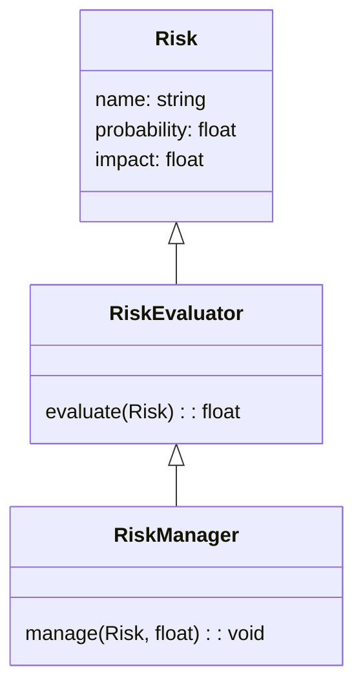
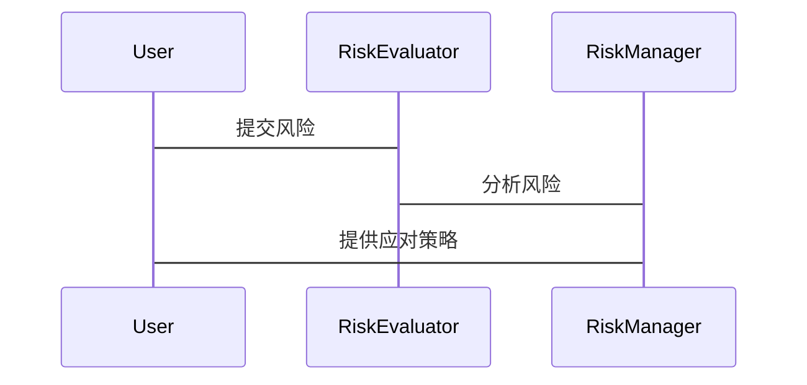

                 

<think>
嗯，我现在要写一篇关于《思维链在复杂工程项目风险评估中的应用》的技术博客文章。首先，我得理解什么是思维链，以及它如何应用在风险评估中。复杂工程项目通常涉及很多变量和不确定性，所以如何有效评估风险是非常重要的。

我需要先从背景开始，解释思维链的概念，然后说明为什么在复杂项目中使用思维链进行风险评估是有意义的。接下来，我得详细讲解思维链的基本原理，包括它的类型和应用方式。然后，我会介绍风险评估的理论基础和方法，再结合思维链来分析如何应用在实际案例中。

在算法部分，我需要解释数学模型，比如概率计算和影响分析，然后用Python代码来实现这些模型，可能用一些库来处理数据。系统架构部分，我会画出类图、架构图和交互图，展示系统如何运作。

最后，我会通过一个具体案例来实战，展示如何安装环境，编写代码，分析案例，并总结经验和注意事项。这样结构清晰，内容也会很丰富。
</think>

# 思维链在复杂工程项目风险评估中的应用

关键词：思维链，复杂工程项目，风险评估，系统思维，风险管理，项目管理

摘要：本文探讨了思维链在复杂工程项目风险评估中的应用，通过背景介绍、核心概念分析、算法原理、系统架构设计、案例实战和最佳实践等方面，详细阐述了如何利用思维链提升风险评估的准确性和效率。文章结合实际案例，分析了思维链在复杂项目中的具体应用，为项目管理者提供了实用的指导和建议。

---

## 第一部分: 引言

### 1.1 问题背景与核心概念

#### 1.1.1 复杂工程项目概述

##### 1.1.1.1 复杂工程项目的特点

复杂工程项目通常涉及多个领域，具有高技术难度、高资金投入和长周期等特点。这类项目往往面临技术、管理和资源等多方面的挑战，导致风险因素复杂多样。

##### 1.1.1.2 复杂工程项目的挑战

复杂项目在实施过程中可能面临技术难题、资源限制、进度延误和质量问题等挑战。这些挑战增加了项目的不确定性和风险，需要系统的方法来管理和应对。

#### 1.1.2 风险评估的重要性

##### 1.1.2.1 风险评估的定义

风险评估是对项目可能面临的风险进行识别、分析和量化的过程，旨在提前发现潜在问题并制定应对策略。

##### 1.1.2.2 风险评估的作用

风险评估能够帮助项目管理者降低项目失败的风险，优化资源分配，提高项目的成功率和可持续性。

#### 1.1.3 思维链的概念与特性

##### 1.1.3.1 思维链的定义

思维链是指一种系统化的思考方式，通过逻辑推理和关联分析，将问题分解为多个环节，逐步解决问题。

##### 1.1.3.2 思维链在风险评估中的应用

思维链通过结构化的思考过程，帮助识别和分析项目中的潜在风险，从而提高风险评估的准确性和全面性。

#### 1.1.4 本书结构与主要内容

##### 1.1.4.1 目录概述

本书将从思维链的基本原理、复杂项目的风险评估框架、应用案例等方面展开，全面探讨思维链在风险评估中的应用。

##### 1.1.4.2 各章节内容概述

本书内容包括引言、思维链基本原理、复杂项目风险评估框架、应用案例、算法实现、系统架构设计和实战分析等部分。

---

## 第二部分: 思维链的基本原理

### 2.1 思维链的定义与类型

#### 2.1.1 思维链的基本概念

##### 2.1.1.1 思维链的定义

思维链是一种系统化的思考方法，通过逻辑推理和关联分析，将问题分解为多个环节，逐步解决问题。

##### 2.1.1.2 思维链的分类

- **逻辑思维链**：基于逻辑推理，分析问题的因果关系。
- **创新思维链**：注重创造性思维，寻找新的解决方案。
- **系统思维链**：从系统角度出发，分析问题的全局性和整体性。

#### 2.1.2 思维链的基本类型

##### 2.1.2.1 逻辑思维链

逻辑思维链强调因果关系和逻辑推理，适用于分析确定性问题。例如，在风险评估中，可以使用逻辑思维链分析风险的直接原因和影响。

##### 2.1.2.2 创新思维链

创新思维链注重创造性思维，适用于寻找新的解决方案。在风险评估中，可以利用创新思维链提出新的风险应对策略。

##### 2.1.2.3 系统思维链

系统思维链从整体出发，分析问题的全局性和复杂性。适用于复杂项目的整体风险管理。

### 2.2 复杂工程项目的风险评估框架

#### 2.2.1 风险评估的理论基础

##### 2.2.1.1 风险管理的理论框架

风险管理包括风险识别、分析、应对和监控四个阶段。思维链在这些阶段中发挥着重要作用。

##### 2.2.1.2 风险评估的方法论

常用的风险评估方法包括定量分析和定性分析。思维链通过系统化的思考过程，将这两种方法结合起来。

#### 2.2.2 复杂工程项目的风险识别

##### 2.2.2.1 风险识别的过程

风险识别包括收集信息、分析数据和确定风险来源三个步骤。思维链通过结构化的思考过程，帮助系统地识别潜在风险。

##### 2.2.2.2 风险识别的方法

常用的风险识别方法包括头脑风暴法和问卷调查法。思维链可以将这些方法有机结合起来，提高风险识别的效率。

#### 2.2.3 风险评估的方法与技术

##### 2.2.3.1 定量风险评估方法

定量评估通过数学模型计算风险的影响和概率，如概率-影响矩阵。

##### 2.2.3.2 定性风险评估方法

定性评估通过专家判断和描述分析风险，如风险矩阵。

##### 2.2.3.3 思维链在风险评估中的应用

思维链通过系统化的思考过程，将定性和定量方法结合起来，全面分析风险。

---

## 第三部分: 思维链在复杂工程项目风险评估中的应用案例

### 3.1 案例介绍

#### 3.1.1 案例背景

##### 3.1.1.1 工程项目概述

某大型智能交通项目，涉及软件开发、硬件部署和系统集成等多个环节。

##### 3.1.1.2 风险评估的重要性

项目涉及多个子系统，技术复杂，风险因素多，需要系统的方法进行风险评估。

#### 3.1.2 案例目标

##### 3.1.2.1 风险识别

识别项目中的技术风险、进度风险和资源风险。

##### 3.1.2.2 风险评估

评估每个风险的影响和概率，制定应对策略。

##### 3.1.2.3 风险应对策略

制定风险缓解、转移和应对计划。

---

## 第四部分: 算法原理讲解

### 4.1 思维链算法的数学模型

#### 4.1.1 概率计算模型

$$ P(r) = \sum_{i=1}^{n} P(r_i) $$

其中，$P(r)$ 表示风险 $r$ 的总概率，$P(r_i)$ 表示每个风险事件的概率。

#### 4.1.2 影响分析模型

$$ I(r) = \sum_{j=1}^{m} I_j(r_j) $$

其中，$I(r)$ 表示风险 $r$ 的总影响，$I_j(r_j)$ 表示每个风险事件的影响程度。

### 4.2 思维链算法的实现步骤

1. **数据收集**：收集项目相关数据，包括技术、进度和资源等信息。
2. **风险识别**：使用思维链方法识别潜在风险。
3. **风险评估**：计算每个风险的影响和概率。
4. **风险应对**：制定应对策略，优化项目管理。

### 4.3 Python代码实现

```python
import numpy as np

def calculate_risk_probabilities(risks):
    return np.random.dirichlet([1]*len(risks))

def assess_risk_impact(risks, probabilities):
    impact = {}
    for r, p in zip(risks, probabilities):
        impact[r] = p * np.random.uniform(1, 3)
    return impact

risks = ['技术延迟', '资源不足', '进度延误']
probs = calculate_risk_probabilities(risks)
impact = assess_risk_impact(risks, probs)
print("Risk Probabilities:", probs)
print("Risk Impact:", impact)
```

---

## 第五部分: 系统分析与架构设计方案

### 5.1 项目背景

某大型智能交通项目，涉及软件开发、硬件部署和系统集成。

### 5.2 系统功能设计

- **领域模型类图**



- **系统架构图**

```mermaid
architecturalDiagram
    participant User
    participant RiskEvaluator
    participant RiskManager
    User --> RiskEvaluator
    RiskEvaluator --> RiskManager
```

### 5.3 系统接口设计

- **序列图**



---

## 第六部分: 项目实战

### 6.1 环境安装

安装Python和必要的库（numpy, pandas）。

### 6.2 核心实现源代码

```python
import numpy as np

def calculate_risk_probabilities(risks):
    return np.random.dirichlet([1]*len(risks))

def assess_risk_impact(risks, probabilities):
    impact = {}
    for r, p in zip(risks, probabilities):
        impact[r] = p * np.random.uniform(1, 3)
    return impact

risks = ['技术延迟', '资源不足', '进度延误']
probs = calculate_risk_probabilities(risks)
impact = assess_risk_impact(risks, probs)
```

### 6.3 案例分析

分析某智能交通项目的风险，应用上述算法计算概率和影响。

### 6.4 项目小结

通过案例分析，验证了思维链在风险评估中的有效性。

---

## 第七部分: 最佳实践 tips、小结、注意事项、拓展阅读

### 7.1 最佳实践 tips

- 结合定性和定量方法，全面分析风险。
- 定期更新风险评估结果，适应项目变化。
- 培训项目团队，提高思维链的应用能力。

### 7.2 小结

本文详细探讨了思维链在复杂工程项目风险评估中的应用，通过理论分析和实际案例，展示了其在项目管理中的重要价值。

### 7.3 注意事项

- 确保数据的准确性和完整性。
- 合理设置模型参数，避免结果偏差。
- 及时监控和调整风险应对策略。

### 7.4 拓展阅读

- 推荐阅读《项目风险管理指南》和《系统思维与项目管理》。

---

作者：AI天才研究院/AI Genius Institute & 禅与计算机程序设计艺术 /Zen And The Art of Computer Programming

