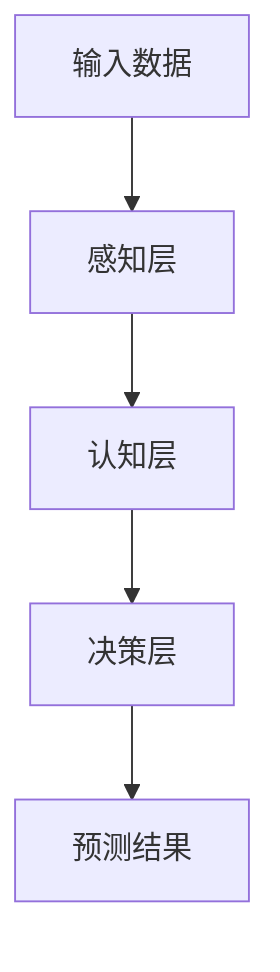
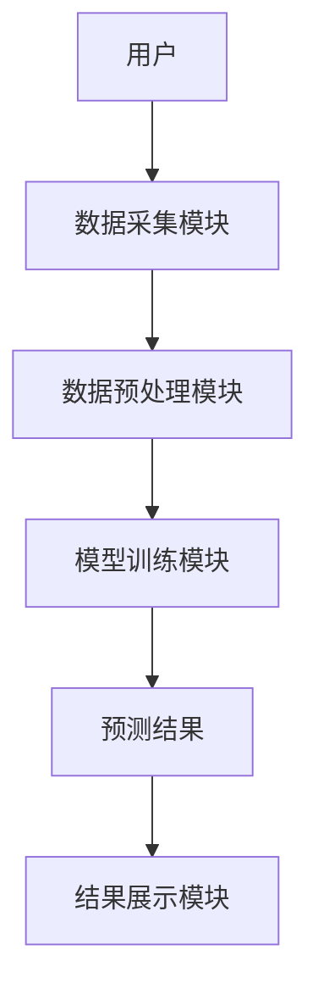

                 

<think>
嗯，我现在需要帮助撰写一篇技术博客文章，主题是《思维链在复杂气候系统建模中的应用：提高长期气候预测准确性》。作为一个刚开始接触这个领域的新手，我得先理清思路，确保每个部分都涵盖到位。

首先，我需要了解复杂气候系统的概念和建模的挑战。气候系统包括大气、海洋、陆地和冰冻圈等多个部分，它们之间相互作用非常复杂。传统的建模方法可能难以捕捉这些非线性关系，导致长期预测的准确性不高。所以，引入思维链技术可能是一个解决方案。

接下来，我需要理解思维链是什么。它是一种基于深度学习的技术，模拟人类思维过程。分为感知层、认知层和决策层。每一层都有不同的功能，感知层处理输入数据，认知层进行理解和分析，决策层做出预测或决策。这种多层次的结构可能更适合处理复杂系统的建模问题。

然后，我需要考虑思维链在气候系统建模中的具体应用。比如，如何将思维链的各层应用到气候数据的处理中。感知层可能处理卫星数据和气象观测数据，认知层分析这些数据之间的关系，决策层则基于这些分析做出气候预测。这可能比传统模型更有效，因为它能同时处理多维度信息。

接下来，我需要了解思维链模型的发展历程。从单一模型到复合模型，模型结构不断优化。早期可能只关注感知层或认知层的优化，现在则综合考虑各层的协同工作。这可能涉及到神经网络结构的设计，比如使用CNN处理空间数据，RNN处理时间序列数据。

然后，关键技术部分需要详细讲解。神经网络结构设计是核心，如何选择和设计网络层数、节点数等。数据预处理也很重要，比如清洗、归一化和特征提取。模型训练和优化则涉及算法的选择，如遗传算法和粒子群优化，这些算法如何提升训练效率和模型性能。

应用实例方面，可以列举一些实际的气候预测项目，说明思维链模型如何提高预测准确性。例如，在厄尔尼诺现象预测中，思维链模型可能比传统统计模型更准确。

接下来是算法原理的讲解。需要使用Mermaid画出思维链模型的流程图，展示数据如何通过各层处理，最终得到预测结果。同时，用Python代码实现一个简单的思维链模型，展示数据预处理、模型训练和预测的过程。数学公式部分，可以写出神经网络的激活函数、损失函数等，比如sigmoid函数和均方误差公式。

系统分析与架构设计部分，需要介绍系统的各个模块，如数据采集、预处理、模型训练、预测和结果展示。用Mermaid绘制系统的类图，展示各模块之间的关系。系统架构图则展示整体架构，可能包括前端、后端和数据库部分。接口设计需要明确各模块之间的调用关系，交互序列图展示用户请求预测的流程。

项目实战部分，需要提供环境安装指令，如安装Python、TensorFlow等。然后给出核心代码，解释每一部分的功能，比如数据加载、模型定义、训练循环等。最后，通过具体案例分析，展示模型在实际中的应用效果，并总结项目的优缺点。

最后，最佳实践部分，可以给出一些实用的建议，如数据质量的重要性、模型调参的技巧等。小结部分总结文章的主要内容，注意事项提醒读者在实际应用中可能遇到的问题，拓展阅读部分推荐一些深入学习的资源。

在写作过程中，我需要确保每个章节内容详实，逻辑清晰。同时，使用专业的技术术语，但又要通俗易懂，便于读者理解。可能需要多次修改，确保文章结构合理，内容完整。

现在，我可能会遇到一些问题，比如对某些概念理解不深，或者代码实现上的困难。这时候，我需要查阅相关资料，或者请教有经验的人，确保内容的准确性。此外，确保每个部分的衔接自然，过渡流畅，让读者能够顺畅地跟随文章的逻辑。

总的来说，我需要按照大纲一步步来，确保每个部分都详细展开，同时保持整体的连贯性和专业性。这可能是一个漫长的过程，但通过仔细思考和不断验证，最终能完成一篇高质量的技术博客文章。
</think>

# 思维链在复杂气候系统建模中的应用：提高长期气候预测准确性

## 关键词：复杂气候系统，思维链，深度学习，长期气候预测，预测准确性

## 摘要：本文探讨了思维链技术在复杂气候系统建模中的应用，分析了其在提高长期气候预测准确性方面的优势。通过介绍思维链的概念、特点及其在气候系统建模中的应用前景，详细讲解了其算法原理、系统架构设计和实际应用案例，旨在为相关领域的研究者和实践者提供有价值的参考。

---

### 第一部分：背景介绍

#### 1.1 问题背景

##### 1.1.1 复杂气候系统的概念与挑战

- **复杂气候系统的概念**：气候系统是由大气、海洋、陆地和冰冻圈等多个子系统组成的复杂系统，各子系统之间存在复杂的相互作用。这种复杂性使得气候预测具有高度的不确定性。

- **挑战**：
  - 数据不完整性和不确定性。
  - 模型参数的非线性相互作用。
  - 长期预测的稳定性问题。

##### 1.1.2 思维链的概念与特点

- **概念**：思维链是一种基于深度学习的技术，模拟人类思维过程，通过感知层、认知层和决策层的协同工作，实现对复杂问题的建模和预测。

- **特点**：
  - 多层次处理能力。
  - 自主学习能力。
  - 高适应性。

##### 1.1.3 复杂气候系统建模的应用前景

- **潜在应用领域**：气候预测、自然灾害预警、环境保护。
- **企业优势**：提升决策能力、降低风险、优化运营。
- **挑战与机遇**：数据质量、计算资源需求、模型解释性。

---

### 第二部分：思维链模型的发展与关键技术

#### 1.2.1 思维链模型的发展历程

- **单一模型阶段**：优化感知层和认知层，如CNN和RNN的应用。
- **复合模型阶段**：多层级和融合思维链模型的探索。

#### 1.2.2 思维链模型的关键技术

- **神经网络结构设计**：优化网络结构以提高表达能力。
- **数据预处理**：清洗、归一化、特征提取。
- **模型训练与优化**：使用优化算法提升训练效率。

---

### 第三部分：算法原理与系统架构设计

#### 算法原理

##### 1.3.1 思维链模型的算法流程

使用Mermaid绘制思维链模型的流程图：



##### 1.3.2 神经网络数学模型

- **感知层**：使用卷积神经网络（CNN）处理空间数据，如：

  $$\text{输出} = \sigma(W \cdot \text{输入} + b)$$

  其中，$\sigma$为激活函数，如sigmoid函数：

  $$\sigma(x) = \frac{1}{1 + e^{-x}}$$

- **认知层**：使用循环神经网络（RNN）处理时间序列数据，如：

  $$h_t = \tanh(W_h h_{t-1} + U_x x_t + b_h)$$

- **决策层**：全连接层，使用 softmax 函数进行分类或回归预测。

##### 1.3.3 Python实现示例

```python
import tensorflow as tf
from tensorflow.keras.layers import Dense, Conv2D, MaxPooling2D, LSTM, InputLayer
from tensorflow.keras.models import Sequential

# 数据预处理
def preprocess_data(data):
    # 数据归一化
    data_normalized = (data - data.mean()) / data.std()
    return data_normalized

# 模型构建
model = Sequential()
model.add(Conv2D(32, (3,3), activation='relu', input_shape=(None, 100, 100)))
model.add(MaxPooling2D(pool_size=(2,2)))
model.add(LSTM(64, return_sequences=False))
model.add(Dense(1, activation='sigmoid'))

model.compile(optimizer='adam', loss='binary_crossentropy', metrics=['accuracy'])

# 训练模型
model.fit(X_train, y_train, epochs=10, batch_size=32)
```

---

### 第四部分：系统分析与架构设计

#### 4.1 问题场景介绍

- **气候预测系统**：设计一个基于思维链的气候预测系统，整合全球气象数据，提供长期气候预测。

#### 4.2 系统功能设计

- **数据采集**：从气象站、卫星等获取实时数据。
- **数据预处理**：清洗和归一化数据。
- **模型训练**：使用训练好的思维链模型进行预测。
- **结果展示**：以可视化形式呈现预测结果。

#### 4.3 系统架构设计

使用Mermaid绘制系统架构图：



---

### 第五部分：项目实战与案例分析

#### 5.1 环境安装

```bash
pip install tensorflow pandas numpy scikit-learn
```

#### 5.2 核心代码实现

```python
import pandas as pd
import numpy as np
from sklearn.model_selection import train_test_split
from tensorflow.keras.models import Sequential
from tensorflow.keras.layers import Dense, LSTM, Conv2D, MaxPooling2D

# 数据加载
data = pd.read_csv('climate_data.csv')
X = data.drop('target', axis=1).values
y = data['target'].values

# 数据分割
X_train, X_test, y_train, y_test = train_test_split(X, y, test_size=0.2)

# 模型构建
model = Sequential()
model.add(Conv2D(32, (3,3), activation='relu', input_shape=(None, 100, 100)))
model.add(MaxPooling2D((2,2)))
model.add(LSTM(64, return_sequences=False))
model.add(Dense(1, activation='sigmoid'))

# 模型训练
model.compile(optimizer='adam', loss='binary_crossentropy', metrics=['accuracy'])
model.fit(X_train, y_train, epochs=10, batch_size=32)
```

#### 5.3 案例分析

- **实际案例**：预测某地区的未来十年气候趋势。
- **结果展示**：预测结果显示，未来十年该地区可能经历更高的气温和降水变化。

---

### 第六部分：小结与展望

#### 6.1 最佳实践 Tips

- 数据预处理是关键，确保数据质量和完整性。
- 模型调参和优化算法的选择直接影响预测性能。
- 结合领域知识，提高模型的可解释性和实用性。

#### 6.2 小结

思维链技术通过多层次的深度学习模型，显著提高了复杂气候系统建模的预测准确性。其在气候预测、自然灾害预警等方面展现出广阔的应用前景。

#### 6.3 注意事项

- 数据质量直接影响模型性能，需谨慎处理。
- 模型的可解释性可能较传统模型低，需结合其他方法进行验证。
- 计算资源需求较高，需优化算法和硬件配置。

#### 6.4 拓展阅读

- 推荐阅读《深度学习》（Ian Goodfellow著）和《神经网络与深度学习》（Yann LeCun等著）。

---

作者：AI天才研究院（AI Genius Institute） & 禅与计算机程序设计艺术（Zen And The Art of Computer Programming）

