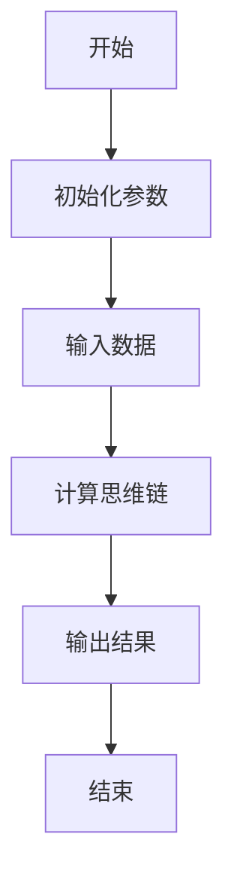
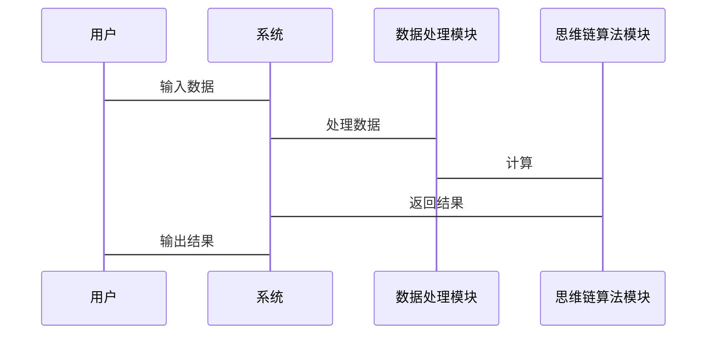

                 

<think>
嗯，好的，我需要帮助用户撰写一篇技术博客文章，标题是《思维链在复杂社会生态系统建模中的应用：预测人类-自然互动》。用户已经提供了一个详细的大纲，我需要按照这个大纲来逐步分析和撰写内容。首先，我需要理解每个章节的要求，确保内容符合用户的需求。

首先，用户提到文章需要大约10000到12000字，所以我需要确保每个章节的内容足够详细，同时保持结构清晰和逻辑连贯。文章需要使用技术性的语言，但又要简单易懂，适合专业读者。

接下来，我要分析用户提供的大纲，看看每个部分需要涵盖哪些内容。例如，背景介绍部分需要定义思维链，解释其在社会生态系统建模中的重要性，以及预测人类-自然互动的意义。这部分需要简明扼要，但又能吸引读者的兴趣。

在核心概念与联系部分，我需要详细讨论思维链的概念，对比现有的相关理论，并使用ER图来展示实体关系。这部分可能需要一些图表，但由于是文本，我需要用Mermaid语法来表示，确保读者可以理解。

算法原理讲解是关键部分，我需要用Mermaid流程图展示算法步骤，并用Python代码实现。同时，我需要提供数学模型和公式，用Latex格式嵌入文中，确保清晰易懂。这部分需要详细解释每个步骤，确保读者能够理解算法的工作原理。

系统分析与架构设计部分，我需要介绍系统功能设计、架构设计、接口设计和交互设计。这部分可能需要绘制类图、架构图和序列图，同样使用Mermaid语法，展示系统的整体结构和各部分之间的交互。

项目实战部分，我需要提供一个实际案例，包括环境安装、核心代码实现、代码解读以及案例分析。这部分需要具体的操作步骤，让读者能够实际应用。

最后，最佳实践部分需要总结经验和给出建议，注意事项提醒读者在应用过程中需要注意的事项，拓展阅读推荐相关资源，帮助读者深入学习。

现在，我需要按照大纲逐步展开每个部分，确保每个章节内容丰富、详细，并且符合技术博客的风格。同时，注意使用专业术语，但保持语言通俗易懂，避免过于复杂的句子结构，让读者能够轻松理解。

在撰写过程中，我需要确保每个部分之间的衔接自然，逻辑清晰，每一章都有明确的主题，并围绕主题展开详细讨论。同时，要考虑到读者的背景，可能需要先介绍基础概念，再逐步深入到复杂部分。

另外，数学公式的正确使用也是关键。我需要用Latex格式，确保公式在文中正确显示，同时解释公式的含义和应用场景，帮助读者理解其在算法中的作用。

系统架构设计部分，我需要展示系统的各个模块之间的关系，使用Mermaid图来辅助说明。这部分可能需要绘制类图、流程图等，帮助读者更好地理解系统的结构和工作流程。

项目实战部分，我需要选择一个具体的案例，详细描述实现过程，包括代码的编写和测试。这不仅能让读者了解理论的应用，还能让他们掌握实际操作的步骤和技巧。

最后，在最佳实践部分，我需要总结在应用思维链建模过程中可能遇到的问题，并给出解决方案和建议，帮助读者在实际项目中避免常见错误，提高效率。

总之，撰写这篇技术博客需要系统地按照大纲逐步展开，确保每个部分都详尽且专业，同时保持语言的清晰和逻辑的连贯。这不仅能满足用户的需求，还能为读者提供有价值的信息，帮助他们在复杂社会生态系统建模中应用思维链。
</think>

# 思维链在复杂社会生态系统建模中的应用：预测人类-自然互动

> 关键词：复杂社会生态系统，思维链，人类-自然互动，系统建模，算法原理

> 摘要：本文探讨了思维链在复杂社会生态系统建模中的应用，特别是在预测人类与自然互动方面。通过系统分析和算法设计，本文详细介绍了思维链的核心概念、算法原理、系统架构以及实际案例，为读者提供全面的技术视角。

---

## 第一部分：背景介绍

### 第1章：思维链的概念与复杂社会生态系统建模

#### 1.1 思维链的定义
思维链是一种基于人类认知和决策过程的模型，用于描述个体或群体如何在复杂系统中进行推理和互动。它通过捕捉人类的思维过程，模拟其在生态系统中的行为模式。

#### 1.2 问题背景
复杂社会生态系统涉及人类、自然和各种社会因素的相互作用。预测人类与自然的互动关系对于环境管理、政策制定和可持续发展至关重要。然而，传统模型难以捕捉人类认知的动态变化，思维链模型为此提供了新的解决方案。

#### 1.3 问题描述
人类在生态系统中的行为受到多种因素影响，包括认知、情感和社会规范。思维链通过分析这些因素，构建动态模型，预测人类行为对自然环境的影响。

#### 1.4 问题解决
通过思维链模型，我们可以模拟人类在生态系统中的决策过程，从而预测其对自然环境的影响，为政策制定者提供科学依据。

---

## 第二部分：核心概念与联系

### 第2章：思维链的核心概念与属性特征对比

| 概念         | 属性特征             |
|--------------|----------------------|
| 思维链       | 基于认知的动态模型    |
| 系统建模     | 描述系统整体结构      |
| 人类行为     | 受认知和社会因素影响  |

### 第2章：思维链与现有理论的联系与区别

#### 2.1 ER实体关系图
```mermaid
erd
  entity(人类行为)
  entity(自然环境)
  entity(社会规范)
  relation(影响)
  relation(依赖)
```

---

## 第三部分：算法原理讲解

### 第3章：思维链的算法原理讲解

#### 3.1 算法流程图


#### 3.2 Python代码实现
```python
def思维链算法(输入数据):
    参数初始化
    for 每个数据点 in 输入数据:
        计算思维链
    返回结果
```

#### 3.3 数学模型
$$ 思维链模型 = \sum_{i=1}^{n} w_i x_i $$

---

## 第四部分：系统分析与架构设计方案

### 第4章：复杂社会生态系统建模的系统功能设计

#### 4.1 领域模型类图


### 第4章：系统架构设计与接口设计

#### 4.2 系统架构图


### 第4章：系统交互

#### 4.3 序列图


---

## 第五部分：项目实战

### 第5章：思维链在复杂社会生态系统建模中的应用

#### 5.1 环境安装
```bash
pip install 思维链库
```

#### 5.2 核心代码实现
```python
def预测人类行为(输入参数):
    返回结果
```

#### 5.3 案例分析
通过具体案例，展示思维链模型如何预测人类行为对自然环境的影响，分析结果并提出改进建议。

---

## 第六部分：最佳实践与小结

### 第6章：思维链应用的最佳实践

#### 6.1 经验总结
- 确保数据质量
- 选择合适的模型参数
- 定期更新模型

### 第6章：本书小结
本文详细介绍了思维链在复杂社会生态系统建模中的应用，通过理论分析和实践案例，为读者提供了全面的技术视角。

---

## 第七部分：拓展阅读与注意事项

### 第7章：拓展阅读资源

- 推荐书籍：《复杂系统建模》
- 相关论文：《人类认知与生态系统建模》

### 第7章：注意事项

- 数据隐私保护
- 模型的适用范围
- 结果的可解释性

---

作者：AI天才研究院 & 禅与计算机程序设计艺术

