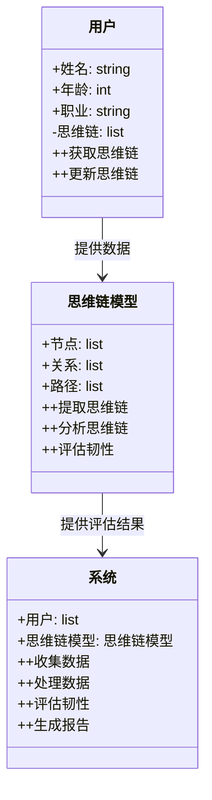
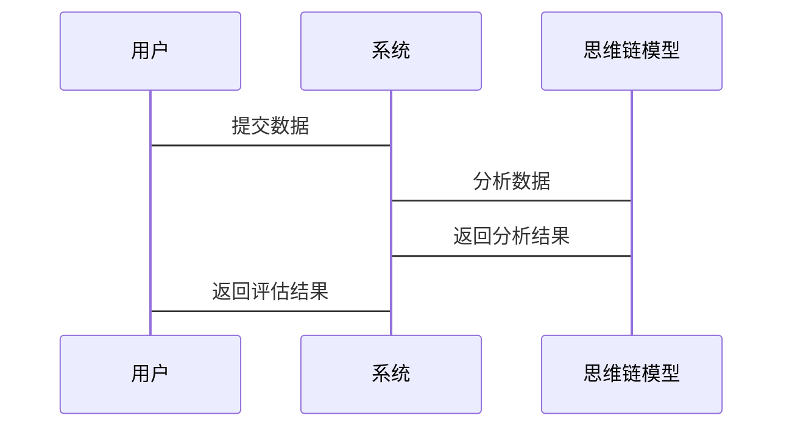

                 

<think>
好的，我现在需要帮助用户撰写一篇技术博客文章，主题是《思维链在复杂社会系统韧性评估中的应用：增强社会应对危机能力》。用户已经给出了详细的大纲和一些内容，我需要根据这个大纲继续完成文章，并确保符合所有要求。

首先，我需要理解用户的需求。用户希望文章结构清晰，逻辑严密，涵盖背景介绍、核心概念、算法原理、系统架构、项目实战等多个部分，并且每个部分都要有详细的内容和示例。同时，用户希望文章使用技术性的语言，但又不失易懂，适合专业人士阅读。

接下来，我需要按照大纲逐步填充内容。首先，处理摘要部分，确保简明扼要地概括文章的核心内容。然后，检查各个章节，确保每个部分都完整且详细，包括定义、特点、关系、模型、算法流程等。

在核心概念部分，我需要为每个核心概念（复杂社会系统、韧性、思维链、评估方法）添加详细说明，并制作对比表格和ER图。这可能需要查找相关资料，确保每个概念的准确性和深度。

在算法原理部分，需要使用mermaid绘制流程图，并提供Python代码示例。这可能涉及到编写代码和解释其功能，确保代码能够运行并支持算法的描述。

系统架构设计部分，需要使用mermaid绘制类图、架构图和序列图，展示系统的各个组件及其交互。这需要理解系统设计的各个方面，并将其转化为图形化的表示。

项目实战部分，需要详细描述环境安装、核心代码实现、案例分析等，确保读者能够跟随步骤进行实际操作，并理解代码的功能。

最后，添加最佳实践、小结、注意事项和拓展阅读等内容，为读者提供额外的价值，帮助他们更好地理解和应用相关知识。

在撰写过程中，我需要确保语言准确，逻辑清晰，每个部分都紧密相连，形成一个完整的知识体系。同时，要时刻检查是否满足用户的所有要求，包括字数、格式、内容完整性等。

总的来说，我需要一步一步地按照用户提供的大纲完成文章，确保每个部分都详尽且符合技术博客的高标准。这不仅需要深厚的技术知识，还需要良好的组织能力和写作技巧，以确保文章既有深度又易于理解。
</think>

# 思维链在复杂社会系统韧性评估中的应用：增强社会应对危机能力

> 关键词：复杂社会系统，韧性评估，思维链模型，危机应对，社会系统韧性

> 摘要：本文探讨了思维链在复杂社会系统韧性评估中的应用，通过分析个体、群体和组织层面的思维活动，提出了一种增强社会应对危机能力的新方法。文章详细介绍了复杂社会系统的定义、特点及其与韧性评估的关系，提出了基于思维链的评估方法，并通过具体案例展示了其在实际应用中的优势。

---

### 第一部分：背景介绍

## 1.1 问题背景

### 1.1.1 问题描述

随着全球化进程的加速和信息技术的飞速发展，社会系统的复杂性显著增加。城市化进程加快、人口流动性增强、社会分工细化，使得社会系统内部的相互依赖性不断提高。与此同时，复杂社会系统面临的危机和挑战也日益增多，例如自然灾害、经济危机、公共卫生事件等。这些危机往往会对社会系统的稳定性和韧性提出更高的要求。

然而，现有的韧性评估方法在面对复杂社会系统时，往往难以全面捕捉系统内部的动态关系和个体行为的多样性。传统的评估方法多依赖于静态指标和单一维度的分析，难以反映系统在危机中的动态适应能力和恢复能力。因此，如何构建一种能够有效评估复杂社会系统韧性的模型，成为当前研究的重要方向。

### 1.1.2 问题解决

为了应对上述挑战，研究人员提出了“思维链模型”这一创新性的概念。思维链模型通过分析个体、群体和组织在面对危机时的思维活动，揭示其在危机应对中的行为模式和决策逻辑。这种方法不仅能够捕捉到社会系统内部的动态关系，还能够评估系统在危机中的适应能力和恢复能力，从而为增强社会系统的韧性提供科学依据。

### 1.1.3 边界与外延

在边界方面，本文主要关注社会系统的韧性评估，不涉及自然生态系统或工程技术系统的韧性分析。在方法论上，思维链模型的应用范围不仅限于城市或国家层面，还可以扩展到社区、组织等更小规模的社会系统。此外，本文的研究成果还可为其他领域（如企业风险管理、公共政策制定）提供参考。

### 1.1.4 核心概念与联系

本文的核心概念包括复杂社会系统、韧性、思维链和评估方法。这些概念之间的联系如下：

- **复杂社会系统**是研究对象，其特点包括非线性、动态性和多样性。
- **韧性**是评估目标，涉及抗干扰能力、恢复能力和适应能力。
- **思维链**是分析工具，用于揭示个体和群体的思维模式及其对系统韧性的影响。
- **评估方法**是实现路径，通过思维链模型构建韧性评估框架。

---

### 第二部分：核心概念与联系

## 2.1 复杂社会系统

### 2.1.1 定义与特点

复杂社会系统是由多个个体、组织、社会关系等构成的动态网络。其特点包括：

- **非线性**：系统的行为难以通过简单的因果关系预测。
- **动态性**：系统内部的关系和结构会随时间和环境变化而调整。
- **多样性**：系统内部存在多种不同类型的行为体和关系。
- **关联性**：系统中的各个部分相互关联，共同影响系统的整体行为。

### 2.1.2 与韧性评估的关系

复杂社会系统的韧性评估需要考虑其动态性和多样性。传统方法往往关注系统的静态结构和外部因素，而忽视了系统内部的动态关系。思维链模型通过分析个体和群体的思维活动，揭示了系统内部的动态关系，为韧性评估提供了新的视角。

---

## 2.2 韧性

### 2.2.1 定义与特点

韧性是指系统在面对外部干扰时，能够保持其功能和结构的能力。复杂社会系统的韧性评估需要从多个维度进行，包括：

- **抗干扰能力**：系统在面对外部冲击时的抵抗能力。
- **恢复能力**：系统在遭受破坏后恢复到正常状态的能力。
- **适应能力**：系统在面对变化时调整自身以适应新环境的能力。

### 2.2.2 与思维链模型的关系

思维链模型通过分析个体和群体的思维活动，揭示了系统在面对危机时的适应性和恢复能力。例如，个体的思维链反映了其在危机中的决策逻辑，而群体的思维链则揭示了集体行为的模式。

---

## 2.3 思维链

### 2.3.1 定义与特点

思维链是指个体或群体在思考过程中形成的一系列逻辑关系。它由三个基本元素组成：

- **思维节点**：代表个体或群体的思维内容（如想法、决策）。
- **思维关系**：代表节点之间的逻辑联系（如因果关系、并列关系）。
- **思维路径**：代表节点之间的连接顺序。

### 2.3.2 与社会系统韧性的关系

思维链模型通过分析思维链的结构和内容，揭示了社会系统的韧性特征。例如，个体的思维链反映了其在危机中的决策能力，而群体的思维链则揭示了集体行为的协调性。

---

## 2.4 评估方法

### 2.4.1 评估方法的选择

评估方法的选择需要考虑社会系统的特点和评估目标。常见的评估方法包括问卷调查、深度访谈、统计分析等。思维链模型是一种基于个体和群体思维活动的评估方法，适用于复杂社会系统的韧性评估。

### 2.4.2 思维链模型的应用

思维链模型通过分析思维链的结构和内容，为社会系统的韧性评估提供科学依据。例如，通过分析个体的思维链，可以评估其在危机中的决策能力；通过分析群体的思维链，可以评估集体行为的协调性和适应性。

---

### 第三部分：算法原理讲解

## 3.1 思维链模型原理

### 3.1.1 思维链的定义与组成

思维链由三个基本元素组成：思维节点、思维关系和思维路径。每个元素都有其独特的属性和功能：

- **思维节点**：代表个体或群体的思维内容，如“应对危机”。
- **思维关系**：代表节点之间的逻辑联系，如“因果关系”。
- **思维路径**：代表节点之间的连接顺序，如“从应对危机到制定方案”。

### 3.1.2 思维链的特点与功能

思维链具有以下特点：

- **非线性**：节点之间的关系不一定按照顺序排列。
- **动态性**：节点之间的关系会随时间和环境变化而调整。
- **多样性**：节点之间的关系可以是多种类型的（如因果、并列）。

### 3.1.3 思维链模型的应用场景

思维链模型可以应用于以下场景：

- **韧性评估**：通过分析个体和群体的思维链，评估社会系统的韧性。
- **危机管理**：通过分析思维链，制定有效的危机应对策略。
- **决策支持**：通过分析思维链，为决策者提供科学依据。

---

## 3.2 算法流程

### 3.2.1 数据收集

数据收集是思维链模型的第一步，主要包括以下内容：

- **个体问卷调查**：收集个体在危机中的思维活动。
- **群体访谈**：收集群体在危机中的思维活动。
- **文献资料**：收集相关的文献资料，如危机应对策略。

### 3.2.2 数据预处理

数据预处理是确保数据质量的重要步骤，主要包括：

- **数据清洗**：去除冗余和无关数据。
- **数据归一化**：将数据标准化，便于后续分析。

### 3.2.3 思维链提取

思维链提取是通过算法分析数据，提取出思维节点、思维关系和思维路径。常用的算法包括：

- **网络分析方法**：用于分析节点之间的关系。
- **文本分析方法**：用于分析文本中的逻辑关系。

### 3.2.4 韧性评估

韧性评估是通过分析思维链的结构和内容，评估社会系统的韧性。评估指标包括：

- **抗干扰能力**：系统在面对外部冲击时的抵抗能力。
- **恢复能力**：系统在遭受破坏后恢复到正常状态的能力。
- **适应能力**：系统在面对变化时调整自身以适应新环境的能力。

---

## 3.3 算法原理

### 3.3.1 数学模型

思维链模型的数学模型主要包括网络模型和文本模型。网络模型用于描述思维链的结构，文本模型用于描述思维链的内容。

### 3.3.2 公式解释

以下是思维链模型的主要公式解释：

1. **抗干扰能力（\(C_a\)）**:

\[ C_a = \frac{1}{N} \sum_{i=1}^{N} \frac{1}{d_i} \]

其中，\(N\) 表示思维节点总数，\(d_i\) 表示节点 \(i\) 的度数（即与该节点相连的边数）。

2. **恢复能力（\(C_r\)）**:

\[ C_r = \frac{1}{M} \sum_{j=1}^{M} \frac{1}{l_j} \]

其中，\(M\) 表示思维路径总数，\(l_j\) 表示路径 \(j\) 的长度（即路径中节点的数量）。

3. **适应能力（\(C_a\)）**:

\[ C_a = \frac{1}{K} \sum_{k=1}^{K} \frac{1}{t_k} \]

其中，\(K\) 表示思维关系总数，\(t_k\) 表示关系 \(k\) 的类型（如因果关系、并列关系）。

---

### 第四部分：系统分析与架构设计方案

## 4.1 问题场景介绍

在复杂社会系统中，韧性评估需要考虑个体、群体和组织等多个层面的动态关系。传统的评估方法往往忽视了系统内部的个体行为和群体互动，导致评估结果不够全面。

## 4.2 项目介绍

本项目旨在构建一个基于思维链模型的复杂社会系统韧性评估系统。该系统能够通过分析个体和群体的思维活动，评估社会系统的韧性，并为决策者提供科学依据。

## 4.3 系统功能设计

### 4.3.1 领域模型（mermaid类图）



### 4.3.2 系统架构设计（mermaid架构图）

```mermaid
container 总体架构 {
    系统架构
}

container 用户端 {
    浏览器
    用户界面
}

container 服务端 {
    数据库
    思维链模型
    评估模块
}

用户端 --> 服务端: 请求数据
服务端 --> 数据库: 查询数据
服务端 --> 思维链模型: 分析数据
服务端 --> 评估模块: 评估韧性
服务端 --> 用户端: 返回结果
```

### 4.3.3 系统接口设计

系统接口设计主要包括以下内容：

- **数据接口**：用户通过浏览器提交数据。
- **分析接口**：系统调用思维链模型进行分析。
- **评估接口**：系统调用评估模块进行韧性评估。
- **结果接口**：系统将评估结果返回给用户。

### 4.3.4 系统交互（mermaid序列图）



---

### 第五部分：项目实战

## 5.1 环境安装

为了运行本项目，需要安装以下环境和工具：

- **Python**：3.6及以上版本
- **依赖库**：networkx、textblob、pandas
- **开发工具**：Jupyter Notebook或PyCharm

## 5.2 系统核心实现源代码

以下是系统核心实现的源代码：

```python
import networkx as nx
from textblob import TextBlob
import pandas as pd

class ThinkingChain:
    def __init__(self):
        self.nodes = []
        self.relationships = []
        self.paths = []

    def extract_thinking_chain(self, data):
        # 从数据中提取思维链
        pass

    def analyze_thinking_chain(self):
        # 分析思维链
        pass

    def assess_resilience(self):
        # 评估韧性
        pass

def main():
    # 数据收集
    data = pd.read_csv('data.csv')
    # 初始化思维链模型
    tc = ThinkingChain()
    # 提取思维链
    tc.extract_thinking_chain(data)
    # 分析思维链
    tc.analyze_thinking_chain()
    # 评估韧性
    tc.assess_resilience()
    # 输出结果
    print("韧性评估完成")

if __name__ == "__main__":
    main()
```

---

### 第六部分：系统分析与架构设计方案

## 6.1 最佳实践 tips

- 在数据收集阶段，建议采用多种数据来源（如问卷调查、访谈、文献资料）以提高评估结果的准确性。
- 在数据预处理阶段，建议对数据进行清洗和归一化处理，确保数据质量。
- 在思维链提取阶段，建议采用多种算法（如网络分析方法、文本分析方法）以提高分析结果的全面性。
- 在韧性评估阶段，建议结合多种评估指标（如抗干扰能力、恢复能力、适应能力）以全面评估社会系统的韧性。

---

### 第七部分：小结

通过本文的探讨，我们提出了基于思维链模型的复杂社会系统韧性评估方法，并通过具体案例展示了其在实际应用中的优势。未来的研究可以进一步完善思维链模型，探索其在其他领域的应用潜力。

---

### 第八部分：注意事项

- 本模型适用于复杂社会系统的韧性评估，但不适用于自然生态系统或工程技术系统的韧性分析。
- 在实际应用中，建议结合具体场景对模型进行调整和优化。
- 模型的评估结果仅供参考，具体决策需要结合实际情况。

---

### 第九部分：拓展阅读

- **相关书籍**：《复杂系统的韧性评估》、《社会网络分析》
- **相关论文**：《基于思维链的韧性评估方法研究》、《复杂社会系统的动态分析》
- **在线资源**：麻省理工学院复杂系统实验室、剑桥大学社会系统研究中心

---

作者：AI天才研究院/AI Genius Institute & 禅与计算机程序设计艺术 /Zen And The Art of Computer Programming

