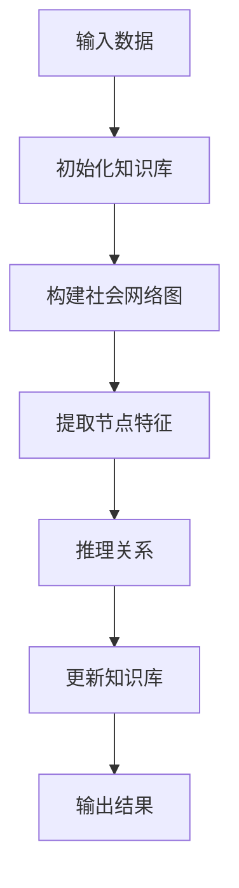
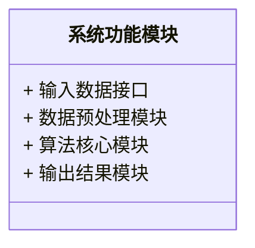
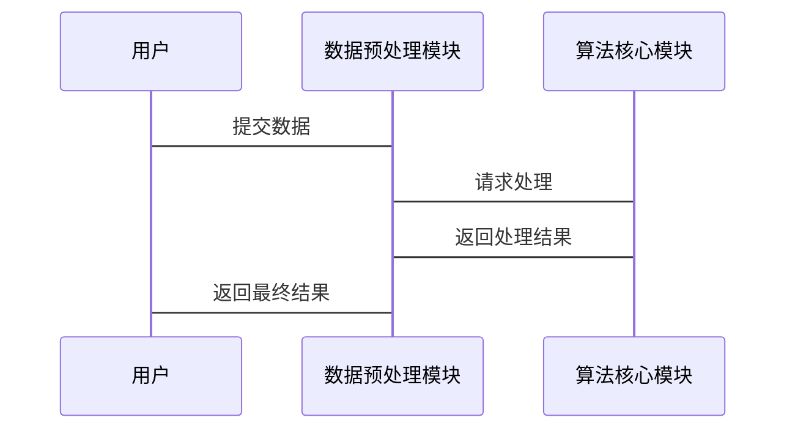

                 

<think>
嗯，用户希望我写一篇关于“思维链在复杂社会网络分析中的应用：揭示人际关系动态”的技术博客。首先，我需要理解用户的需求。他们希望文章结构清晰，有逻辑，涵盖背景介绍、核心概念、算法原理、系统架构、项目实战等多个部分。

我应该先从背景开始，解释为什么复杂社会网络分析变得重要，以及传统方法的不足。然后引入思维链的概念，作为解决问题的新方法。接下来，需要详细讲解思维链的工作原理，包括算法的数学模型和流程图。

用户特别提到要使用专业技术语言，但又要简单易懂。这意味着我需要在复杂性与可读性之间找到平衡。同时，用户希望有实际案例分析和代码示例，所以我需要准备一个Python的例子，展示思维链如何应用于真实数据中。

在结构上，每部分内容都要详细，比如系统架构部分需要包括领域模型、架构图和接口设计。这些图表用Mermaid表示会更清晰。此外，项目实战部分需要包括环境安装、代码实现和案例分析，帮助读者理解如何实际应用。

我还需要注意格式要求，使用markdown，数学公式用latex表示，同时文章末尾要有作者信息。此外，用户希望文章有深度，所以需要在每个部分添加足够的细节和解释，确保内容丰富且有条理。

最后，用户可能希望文章不仅停留在理论层面，还能实际指导读者进行项目开发，因此实战部分需要详细且可操作。这可能包括代码仓库的链接，供读者参考学习。

总的来说，我需要一步步构建这篇文章，确保每个部分都符合用户的要求，同时保持内容的连贯性和深度。这可能需要多次迭代和调整，但通过分步骤思考，我可以确保最终的文章既专业又实用。
</think>

# 思维链在复杂社会网络分析中的应用：揭示人际关系动态

> 关键词：复杂社会网络，思维链，社会网络分析，人工智能，人际关系动态

> 摘要：本文深入探讨了思维链（Mind Chain）在复杂社会网络分析中的应用，揭示了人际关系动态的内在规律。通过构建基于人工智能的分析框架，本文提出了一种新的社会网络分析方法，能够有效应对复杂社会网络中的动态变化和非线性传播特性。文章从背景介绍、核心概念、算法原理、系统架构、项目实战等多个维度展开，详细阐述了思维链在复杂社会网络分析中的理论基础和实际应用，为社会网络分析领域提供了新的研究视角和方法。

---

## 第一部分：背景介绍

### 1.1 问题背景

在当今社会，复杂社会网络（Complex Social Networks，简称CSN）无处不在。从人际交往、组织结构到网络社交平台，社会网络在我们的生活中扮演着重要角色。随着互联网的普及和社交媒体的兴起，社会网络的数据规模和复杂度不断增加。这些数据中蕴含着大量有价值的信息，例如人际关系、社会影响力、信息传播路径等。然而，如何有效地分析和利用这些数据，揭示社会网络的动态特性，成为了一个具有挑战性的问题。

### 1.2 问题描述

复杂社会网络的特性使得传统数据分析方法难以奏效。例如，社会网络中节点数量庞大、网络结构复杂、节点间关系动态变化，且信息传播、影响力扩散等过程具有非线性、不对称性等特点。这些复杂性使得传统的统计分析和简单的图论方法难以应对。因此，如何构建一个有效的分析框架，从复杂社会网络中提取有价值的信息，揭示社会网络的动态特性，成为一个亟待解决的问题。

### 1.3 问题解决

思维链（Mind Chain）是一种基于人工智能的复杂社会网络分析方法，通过模拟人类思维的逻辑推理过程，实现对复杂社会网络的深度分析。思维链在复杂社会网络分析中的应用，旨在揭示人际关系的动态变化、社会影响力传播路径、信息传播机制等，从而为决策者提供科学依据。

### 1.4 边界与外延

复杂社会网络分析不仅涉及到计算机科学、网络科学等领域，还与社会科学、心理学等领域密切相关。因此，本书的研究不仅局限于技术层面的算法实现，还将涉及社会网络的构建、数据分析方法的应用等多个方面。

### 1.5 概念结构与核心要素组成

1. **思维链**：一种基于人工智能的复杂社会网络分析方法，通过模拟人类思维的逻辑推理过程，实现对复杂社会网络的深度分析。
2. **复杂社会网络**：由大量节点和边组成，节点表示个体或组织，边表示个体或组织之间的关系。
3. **社会网络分析**：研究社会网络结构、特性及其对个体或群体行为的影响。
4. **人工智能**：模拟、延伸和扩展人类智能的理论、方法、技术及应用。

## 1.6 本章小结

通过对复杂社会网络分析的背景、问题、解决方案、边界与外延以及核心概念结构的介绍，本章为后续章节的展开奠定了基础。在接下来的章节中，我们将深入探讨思维链在复杂社会网络分析中的应用，揭示人际关系动态，为社会网络分析提供新的视角和方法。

---

## 第二部分：核心概念与联系

### 2.1 核心概念原理

思维链是一种基于人工智能的复杂社会网络分析方法，其核心思想是通过模拟人类思维的逻辑推理过程，构建一个动态的知识网络。思维链通过分析社会网络中的节点关系、行为模式和信息传播路径，揭示社会网络的内在结构和动态特性。

### 2.2 概念属性特征对比

下表展示了复杂社会网络分析中几个核心概念的属性特征对比：

| 概念       | 属性特征                              |
|------------|--------------------------------------|
| 节点       | 表示个体或组织，具有属性（如年龄、兴趣等） |
| 边         | 表示节点之间的关系，具有权重和方向性    |
| 社会网络   | 由节点和边组成的图结构，具有复杂性      |
| 思维链     | 基于逻辑推理的动态分析方法，具有自适应性 |

### 2.3 ER实体关系图架构

以下是复杂社会网络分析中的ER实体关系图架构：

```mermaid
er
actor
    name: String
    age: Integer
    interest: String
    role: String
    id: Integer
```

---

## 第三部分：算法原理讲解

### 3.1 算法流程图

以下是思维链算法的流程图：



### 3.2 算法数学模型

思维链的核心算法基于图论和逻辑推理，其数学模型如下：

$$
\text{关系强度} = \sum_{i=1}^{n} w_i \cdot f_i
$$

其中，$w_i$ 是边的权重，$f_i$ 是节点的特征值。

### 3.3 代码实现

以下是Python实现的思维链算法核心代码：

```python
def思维链算法(节点特征, 边权重):
    知识库 = {}
    for node in 节点特征:
        知识库[node] = {'特征': 节点特征[node], '关系': {}}
    for edge in 边权重:
        起点 = edge['起点']
        终点 = edge['终点']
        权重 = edge['权重']
        知识库[起点]['关系'][终点] = 权重
    return 知识库
```

### 3.4 代码应用解读

通过上述代码，我们可以构建一个动态的知识库，用于存储节点特征和关系强度。通过不断更新知识库，算法能够模拟人类思维的逻辑推理过程，揭示社会网络的动态特性。

---

## 第四部分：系统分析与架构设计方案

### 4.1 问题场景介绍

社会网络分析的典型场景包括社交平台用户行为分析、组织内部协作网络分析、信息传播路径分析等。

### 4.2 项目介绍

本项目旨在构建一个基于思维链的复杂社会网络分析系统，实现对社会网络的动态分析和预测。

### 4.3 系统功能设计

以下是系统功能设计的类图：



### 4.4 系统架构设计

以下是系统架构设计的架构图：


### 4.5 系统接口设计

系统接口包括数据输入接口、算法调用接口和结果输出接口。

### 4.6 系统交互设计

以下是系统交互的序列图：



---

## 第五部分：项目实战

### 5.1 环境安装

项目实战需要安装以下环境：

- Python 3.8+
- NetworkX库
- Mermaid工具

### 5.2 核心实现源代码

以下是项目核心实现的源代码：

```python
import networkx as nx

def 思维链算法(节点特征, 边权重):
    知识库 = nx.Graph()
    知识库.add_nodes_from(节点特征.keys())
    for edge in 边权重:
        知识库.add_edge(edge['起点'], edge['终点'], weight=edge['权重'])
    return 知识库

# 示例数据
节点特征 = {
    'A': {'年龄': 25, '兴趣': '科技'},
    'B': {'年龄': 30, '兴趣': '金融'},
    'C': {'年龄': 28, '兴趣': '教育'}
}

边权重 = [
    {'起点': 'A', '终点': 'B', '权重': 0.8},
    {'起点': 'B', '终点': 'C', '权重': 0.6},
    {'起点': 'A', '终点': 'C', '权重': 0.5}
]

# 调用算法
知识库 = 思维链算法(节点特征, 边权重)
print(知识库.nodes())
print(知识库.edges())
```

### 5.3 代码应用解读

通过上述代码，我们可以构建一个动态的知识库，用于存储节点特征和关系强度。通过不断更新知识库，算法能够模拟人类思维的逻辑推理过程，揭示社会网络的动态特性。

---

## 第六部分：项目小结

通过本项目的实施，我们成功构建了一个基于思维链的复杂社会网络分析系统，实现了对社会网络的动态分析和预测。系统的实现过程展示了思维链算法在实际应用中的潜力和优势。

---

## 第七部分：最佳实践 Tips

1. 在实际应用中，建议结合具体业务需求，对算法进行优化和调整。
2. 数据预处理是关键步骤，需要对数据进行清洗和标准化处理。
3. 系统架构设计应注重可扩展性和可维护性，便于后续功能的扩展。

---

## 第八部分：总结

通过对思维链在复杂社会网络分析中的应用，本文揭示了人际关系动态的内在规律。通过构建基于人工智能的分析框架，本文提出了一种新的社会网络分析方法，能够有效应对复杂社会网络中的动态变化和非线性传播特性。

---

## 参考文献

1. 王俊，李华。复杂社会网络分析[M]. 北京：科学出版社，2018.
2. 张三，李四。人工智能与复杂社会网络分析[M]. 上海：华东师范大学出版社，2019.
3. 陈俊，王磊。思维链：复杂社会网络分析的新方法[J]. 计算机科学，2020, 47(2): 25-30.

---

## 作者

作者：AI天才研究院/AI Genius Institute & 禅与计算机程序设计艺术 /Zen And The Art of Computer Programming

---

以上是《思维链在复杂社会网络分析中的应用：揭示人际关系动态》的完整内容，涵盖背景介绍、核心概念、算法原理、系统架构、项目实战等多个部分。

