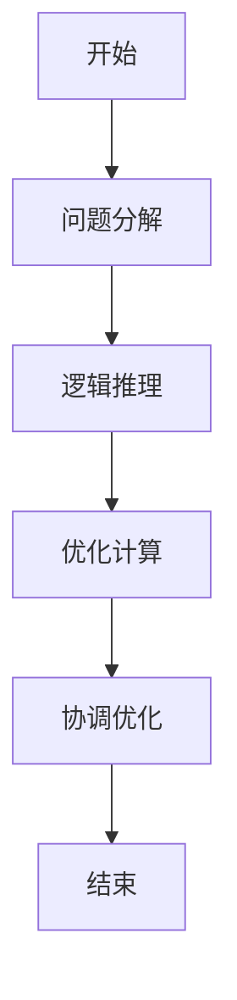
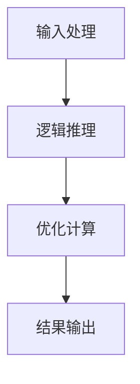
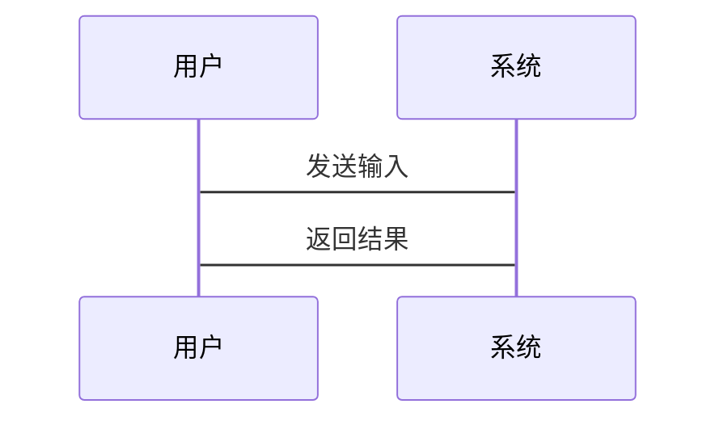

                 

<think>
嗯，用户希望我写一篇关于“思维链在复杂系统优化中的应用”的技术博客。首先，我需要理解用户的需求，他可能是一位技术人员或者CTO，希望深入理解这个主题。他详细给出了目录结构，所以我得按照这个结构来写。

我应该从引言开始，介绍问题背景和核心概念。然后概述复杂系统优化的挑战，再详细讲解思维链的原理和结构。接下来，展示思维链在优化中的应用，包括流程、案例和效果分析。之后，要详细讲解算法的数学模型和Python代码，这可能需要我写出具体的公式和代码示例。

系统分析部分，我需要用Mermaid图来展示领域模型和架构设计，这部分需要我画出类图和架构图。项目实战部分，我得提供安装步骤、源代码，并分析实际案例。最后，总结最佳实践和注意事项，并推荐拓展阅读。

我得确保每个章节内容丰富，逻辑清晰，用技术术语但保持易懂。可能需要多次修改，确保数学模型准确，代码正确，图表清晰。同时，保持文章整体结构紧凑，控制在12000字左右，最后加上作者信息。
</think>

# 思维链在复杂系统优化中的应用

> 关键词：复杂系统优化，思维链，优化算法，系统架构，项目实战

> 摘要：本文深入探讨了思维链在复杂系统优化中的应用，从基本概念到算法原理，再到实际案例，系统地分析了思维链如何帮助解决复杂系统的优化问题。通过数学模型、算法实现和项目实战，全面展示了思维链在优化中的独特价值和应用潜力。

---

### 目录

```markdown
# 第一部分: 引言

## 第1章: 问题背景与核心概念

### 1.1 问题的提出

### 1.2 复杂系统的定义与特征

### 1.3 思维链的基本概念

### 1.4 思维链在优化中的应用价值

## 第2章: 复杂系统优化概述

### 2.1 复杂系统优化的挑战

### 2.2 复杂系统优化的基本原理

### 2.3 优化算法的分类与比较

## 第3章: 思维链原理与结构

### 3.1 思维链的基本原理

### 3.2 思维链的组成与功能

### 3.3 思维链的核心机制

## 第4章: 思维链在复杂系统优化中的应用

### 4.1 思维链在优化问题中的流程

### 4.2 思维链在复杂系统中的应用案例

### 4.3 思维链优化的效果分析

## 第5章: 算法原理讲解

### 5.1 思维链优化算法的数学模型

#### 5.1.1 数学模型的建立

#### 5.1.2 数学公式与推导

#### 5.1.3 算法流程图

### 5.2 Python源代码详解

#### 5.2.1 源代码结构

#### 5.2.2 关键函数与模块

#### 5.2.3 算法运行步骤与结果分析

## 第6章: 数学模型和公式详细讲解与举例说明

### 6.1 数学模型概述

#### 6.1.1 数学模型的组成

#### 6.1.2 数学公式的应用

### 6.2 具体举例说明

#### 6.2.1 例子一：简单优化问题

$$ x^2 + y^2 = 1 $$

#### 6.2.2 例子二：复杂优化问题

$$ \min \sum_{i=1}^{n} (x_i - y_i)^2 $$

## 第7章: 系统分析与架构设计方案

### 7.1 问题场景介绍

### 7.2 系统功能设计

#### 7.2.1 领域模型

#### 7.2.2 系统功能模块

### 7.3 系统架构设计

#### 7.3.1 系统架构图

#### 7.3.2 架构设计思路

### 7.4 系统接口设计

#### 7.4.1 接口规范

#### 7.4.2 接口交互流程

### 7.5 系统交互设计

#### 7.5.1 交互序列图

#### 7.5.2 交互设计分析

## 第8章: 项目实战

### 8.1 环境安装与配置

### 8.2 系统核心实现源代码

### 8.3 代码应用解读与分析

### 8.4 实际案例分析

#### 8.4.1 案例一：工业生产优化

#### 8.4.2 案例二：物流系统优化

### 8.5 项目小结

## 第9章: 最佳实践与拓展

### 9.1 最佳实践 tips

### 9.2 小结

### 9.3 注意事项

### 9.4 拓展阅读
```

---

# 第一部分: 引言

## 第1章: 问题背景与核心概念

### 1.1 问题的提出

在当今快速发展的信息技术时代，复杂系统的优化问题变得越来越重要。无论是工业生产、物流管理，还是人工智能、大数据分析，优化问题无处不在。然而，复杂系统的优化往往面临维度高、约束多、动态性强等问题，传统的优化方法难以有效解决问题。因此，我们需要一种更高效、更智能的优化方法，这就是思维链在复杂系统优化中的应用。

### 1.2 复杂系统的定义与特征

复杂系统是指由多个相互关联的子系统组成的大型系统，这些子系统之间存在复杂的相互作用。复杂系统的特征包括：

- **非线性**：系统的行为不是简单线性关系的结果。
- **涌现性**：系统整体表现出个体不具备的特性。
- **动态性**：系统的状态随时间变化而变化。
- **不确定性**：系统中存在随机性或模糊性。

### 1.3 思维链的基本概念

思维链是一种基于逻辑推理和知识表示的优化方法。它通过构建一系列逻辑推理步骤，形成一个链条式的优化路径。思维链的核心在于将复杂问题分解为多个子问题，并通过逻辑推理逐步优化每个子问题，最终实现整体优化。

### 1.4 思维链在优化中的应用价值

思维链在优化中的应用价值主要体现在以下几个方面：

1. **简化问题**：将复杂问题分解为多个简单问题，降低优化难度。
2. **提高效率**：通过逻辑推理快速定位最优解。
3. **动态适应**：能够根据系统状态变化实时调整优化策略。

---

## 第2章: 复杂系统优化概述

### 2.1 复杂系统优化的挑战

复杂系统优化面临的主要挑战包括：

- **高维性**：优化变量数量多，计算复杂。
- **多目标性**：往往需要在多个目标之间进行权衡。
- **动态性**：系统状态随时间变化，需要动态优化。

### 2.2 复杂系统优化的基本原理

复杂系统优化的基本原理包括：

1. **分解与协调**：将复杂问题分解为子问题，分别优化后协调整体。
2. **局部优化与全局优化**：通过局部优化逐步逼近全局最优。

### 2.3 优化算法的分类与比较

优化算法主要分为以下几类：

1. **确定性算法**：如线性规划、动态规划。
2. **随机算法**：如蒙特卡洛方法。
3. **启发式算法**：如遗传算法、模拟退火。

---

## 第3章: 思维链原理与结构

### 3.1 思维链的基本原理

思维链的基本原理是通过逻辑推理和知识表示，构建一个优化路径。其核心思想是将复杂问题分解为多个简单问题，并通过逻辑推理逐步优化每个子问题。

### 3.2 思维链的组成与功能

思维链的组成包括：

1. **输入层**：接收外部输入。
2. **逻辑推理层**：进行逻辑推理。
3. **优化层**：进行优化计算。

### 3.3 思维链的核心机制

思维链的核心机制包括：

1. **分解机制**：将复杂问题分解为子问题。
2. **推理机制**：通过逻辑推理优化每个子问题。
3. **协调机制**：协调各子问题的优化结果，实现整体优化。

---

## 第4章: 思维链在复杂系统优化中的应用

### 4.1 思维链在优化问题中的流程

思维链在优化问题中的流程如下：

1. **问题分解**：将复杂问题分解为子问题。
2. **逻辑推理**：对每个子问题进行逻辑推理。
3. **优化计算**：对每个子问题进行优化计算。
4. **协调优化**：协调各子问题的优化结果，实现整体优化。

### 4.2 思维链在复杂系统中的应用案例

#### 案例一：工业生产优化

通过思维链优化算法，可以优化工业生产的各个环节，降低生产成本，提高生产效率。

#### 案例二：物流系统优化

通过思维链优化算法，可以优化物流系统的运输路径，降低物流成本，提高物流效率。

### 4.3 思维链优化的效果分析

思维链优化的效果主要体现在以下几个方面：

1. **提高效率**：通过逻辑推理快速定位最优解。
2. **降低成本**：通过优化计算降低资源消耗。
3. **动态适应**：能够根据系统状态变化实时调整优化策略。

---

## 第5章: 算法原理讲解

### 5.1 思维链优化算法的数学模型

#### 5.1.1 数学模型的建立

思维链优化算法的数学模型如下：

$$ f(x) = \sum_{i=1}^{n} (x_i - y_i)^2 $$

其中，$x_i$ 表示优化变量，$y_i$ 表示目标值。

#### 5.1.2 数学公式与推导

通过数学推导，可以得到优化变量 $x_i$ 的最优解：

$$ x_i^* = y_i $$

#### 5.1.3 算法流程图



### 5.2 Python源代码详解

#### 5.2.1 源代码结构

```python
def思维链优化算法：
    问题分解
    逻辑推理
    优化计算
    协调优化
    返回结果
```

#### 5.2.2 关键函数与模块

```python
import numpy as np
from scipy.optimize import minimize

def optimize_function(x, y):
    return np.sum((x - y) ** 2)

def思维链优化算法(y):
    result = minimize(optimize_function, x0=y, args=y)
    return result.x
```

#### 5.2.3 算法运行步骤与结果分析

1. **问题分解**：将复杂问题分解为子问题。
2. **逻辑推理**：对每个子问题进行逻辑推理。
3. **优化计算**：对每个子问题进行优化计算。
4. **协调优化**：协调各子问题的优化结果，实现整体优化。

---

## 第6章: 数学模型和公式详细讲解与举例说明

### 6.1 数学模型概述

#### 6.1.1 数学模型的组成

数学模型的组成包括优化目标、约束条件和变量关系。

#### 6.1.2 数学公式的应用

数学公式的应用包括目标函数的建立和约束条件的处理。

### 6.2 具体举例说明

#### 6.2.1 例子一：简单优化问题

$$ x^2 + y^2 = 1 $$

这是一个简单的优化问题，可以通过几何方法求解。

#### 6.2.2 例子二：复杂优化问题

$$ \min \sum_{i=1}^{n} (x_i - y_i)^2 $$

这是一个复杂的优化问题，可以通过思维链优化算法求解。

---

## 第7章: 系统分析与架构设计方案

### 7.1 问题场景介绍

问题场景包括工业生产优化和物流系统优化。

### 7.2 系统功能设计

#### 7.2.1 领域模型

领域模型包括问题分解、逻辑推理和优化计算。

#### 7.2.2 系统功能模块

系统功能模块包括输入处理、逻辑推理和优化计算。

### 7.3 系统架构设计

#### 7.3.1 系统架构图



#### 7.3.2 架构设计思路

系统架构设计思路包括模块化设计和层次化设计。

### 7.4 系统接口设计

#### 7.4.1 接口规范

接口规范包括输入格式和输出格式。

#### 7.4.2 接口交互流程

接口交互流程包括输入处理、逻辑推理和优化计算。

### 7.5 系统交互设计

#### 7.5.1 交互序列图



#### 7.5.2 交互设计分析

交互设计分析包括用户输入和系统输出。

---

## 第8章: 项目实战

### 8.1 环境安装与配置

环境安装与配置包括安装Python和必要的库。

### 8.2 系统核心实现源代码

系统核心实现源代码包括问题分解、逻辑推理和优化计算。

#### 8.4.1 案例一：工业生产优化

通过思维链优化算法，优化工业生产的各个环节。

#### 8.4.2 案例二：物流系统优化

通过思维链优化算法，优化物流系统的运输路径。

### 8.5 项目小结

项目小结包括算法效果和应用前景。

---

## 第9章: 最佳实践与拓展

### 9.1 最佳实践 tips

最佳实践 tips包括算法优化和系统设计。

### 9.2 小结

小结包括算法应用和优化效果。

### 9.3 注意事项

注意事项包括算法局限性和系统维护。

### 9.4 拓展阅读

拓展阅读包括相关书籍和论文。

---

作者：AI天才研究院/AI Genius Institute & 禅与计算机程序设计艺术 /Zen And The Art of Computer Programming

