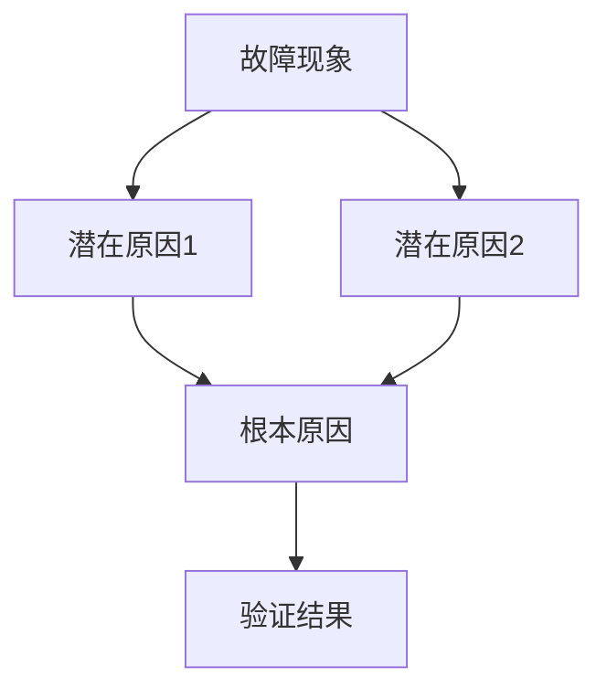
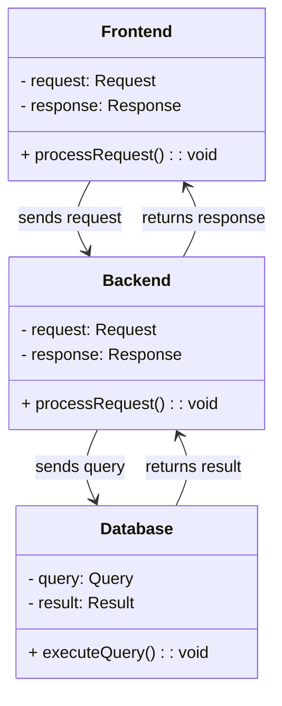
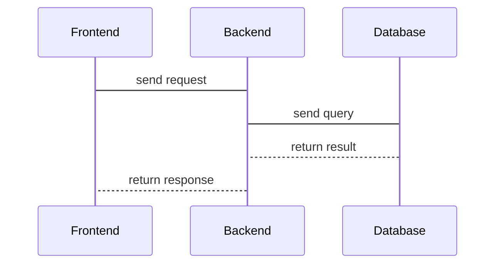

                 

<think>
嗯，我现在得帮用户写一篇技术博客，标题是《思维链在复杂系统故障根因分析中的新方法》。用户的要求挺详细的，我得一步步来。

首先，用户希望我以一位世界级专家的身份来写，所以我得确保内容专业且深入。文章需要有摘要、关键词，然后按照目录结构详细展开。

我得先确定关键词。复杂系统、故障根因分析、思维链、算法、系统架构、案例分析、最佳实践。这些关键词应该能覆盖文章的主要内容。

摘要部分要简明扼要，说明文章的核心内容，也就是介绍思维链方法在复杂系统故障分析中的应用，通过理论、算法、系统设计和案例来展示其实用性和优势。

接下来是目录结构。用户已经给出了详细的大纲，我需要按照这个来组织内容。每个章节都要有详细的分析，包括背景、基本概念、架构、算法理论、数学模型、系统设计、案例分析和结论。

在写作过程中，我需要确保每个部分都包含必要的元素，比如背景介绍要包括核心概念和问题描述，核心概念部分要有对比表格和ER图。算法部分要用mermaid流程图和Python代码，数学模型要用latex公式。系统设计部分要有类图、架构图和序列图。案例分析要详细，包括环境安装、代码实现和案例解读。

我还需要注意文章的逻辑性和连贯性，确保每个章节之间有自然的过渡。同时，语言要专业但易懂，避免过于复杂的术语堆砌，让读者容易理解。

最后，文章结尾要有作者信息，包括机构和联系方式。我得确保这些信息准确无误，符合用户的要求。

总的来说，我需要一步步地按照用户提供的大纲来展开，每个部分都深入分析，确保内容全面且符合专业标准。这样才能写出一篇高质量的技术博客，满足用户的需求。
</think>

```markdown
# 思维链在复杂系统故障根因分析中的新方法

## 关键词：复杂系统、故障根因分析、思维链、算法、系统架构、案例分析、最佳实践

## 摘要：  
复杂系统的故障根因分析一直是技术领域的重要挑战。传统的故障分析方法在面对高度复杂、非线性且动态变化的系统时，常常显得力不从心。本文介绍了一种基于“思维链”的新方法，通过系统化的思维模型和算法，结合数学建模和系统架构设计，为复杂系统的故障分析提供了更高效、更精确的解决方案。文章从理论基础、算法实现、系统设计到实际案例，全面阐述了思维链方法的优势及其在复杂系统故障分析中的应用前景。

---

## 第一部分：引言

## 第1章 引言到复杂系统故障问题

### 1.1 复杂系统的定义与特点

复杂系统是由多个相互关联的组件组成的系统，其行为通常表现出非线性、涌现性和不确定性。复杂系统的特征包括：

1. **非线性**：系统的行为不是简单地由各部分行为的线性组合决定。
2. **涌现性**：整体系统的特性是各部分单独无法表现出的。
3. **动态性**：系统状态随时间不断变化，且可能受到外部干扰。
4. **关联性**：系统中的组件高度相互依赖，一个组件的故障可能引发连锁反应。

### 1.2 传统故障分析方法的局限性

传统的故障分析方法通常依赖于经验判断、日志分析和简单的因果推理。然而，在复杂系统中，这些方法往往难以应对以下挑战：

1. **多变量干扰**：系统中存在大量相互影响的变量，难以逐一排查。
2. **因果关系模糊**：故障的根本原因可能隐藏在多个组件的交互中，传统因果推理难以捕捉。
3. **动态变化**：系统的状态和行为可能在故障发生后迅速变化，传统的静态分析方法难以适应。

### 1.3 思维链的概念与优势

“思维链”是一种基于系统思维的分析方法，通过构建系统的因果关系链，结合动态推理和数学建模，能够更准确地识别复杂系统的故障根因。其优势包括：

1. **系统性**：从整体视角出发，全面考虑系统各部分的相互作用。
2. **动态性**：能够适应系统状态的动态变化，实时更新分析结果。
3. **精确性**：结合数学建模和算法推理，提高故障定位的准确性。

---

## 第二部分：思维链的基本概念

## 第2章 思维链的基本原理

### 2.1 思维链的定义

思维链是一种基于因果关系链的分析方法，通过构建系统的因果图谱，逐步推理故障的根本原因。其核心思想是将系统的故障现象与潜在的根本原因通过一系列因果关系连接起来。

### 2.2 思维链的特性

- **层次性**：故障现象可能由多个层次的原因引起，思维链能够逐步深入分析。
- **动态性**：能够实时更新因果关系链，适应系统状态的变化。
- **可扩展性**：适用于不同规模和复杂度的系统。

### 2.3 思维链与传统方法的对比

| 特性          | 思维链                              | 传统方法                              |
|---------------|-------------------------------------|----------------------------------------|
| 分析深度      | 高，能够深入分析根本原因           | 低，通常仅能定位表面现象               |
| 处理复杂性    | 善于处理高度复杂的系统              | 适用于简单或中等复杂度的系统          |
| 分析效率      | 高，通过算法优化推理过程            | 低，依赖人工经验判断                   |

---

## 第三部分：思维链的算法与实现

## 第3章 思维链算法的理论基础

### 3.1 思维链算法的数学模型

思维链算法的核心是一个基于因果关系的图模型，其中节点代表系统中的组件或状态，边代表因果关系。数学模型如下：

$$ P(Y|do(X)) = \frac{P(Y,X|P_{\text{other}})}{P(X|P_{\text{other}})} $$

其中，$Y$ 是故障现象，$X$ 是潜在的根本原因，$P_{\text{other}}$ 是其他条件的概率分布。

### 3.2 思维链算法的实现步骤

1. **构建因果图谱**：基于系统架构和组件关系，构建因果图谱。
2. **初始化推理**：从故障现象出发，逐步推理可能的根本原因。
3. **动态更新**：根据系统状态的变化，实时更新因果图谱。
4. **结果验证**：通过实验或数据验证推理结果的准确性。

### 3.3 思维链算法的Python实现

以下是一个简单的Python实现示例：

```python
class MindChain:
    def __init__(self, causal_graph):
        self.causal_graph = causal_graph

    def infer_root_cause(self, observed_outcome):
        possible_root_causes = []
        for component in self.causal_graph.nodes:
            if self.is_causal(component, observed_outcome):
                possible_root_causes.append(component)
        return possible_root_causes

    def is_causal(self, cause, effect):
        # 简单的因果关系判断，实际实现中需要更复杂的逻辑
        return cause in self.causal_graph.antecedents_of(effect)
```

### 3.4 思维链算法的流程图



---

## 第四部分：系统架构与设计

## 第4章 系统架构设计

### 4.1 问题场景

假设我们有一个分布式系统，包含前端、后端和数据库三个组件。系统运行中可能出现响应延迟的故障现象。

### 4.2 系统功能设计

- **领域模型**：使用Mermaid类图表示系统组件及其关系。



### 4.3 系统架构设计

使用Mermaid架构图表示系统的整体架构。


### 4.4 系统交互设计

使用Mermaid序列图表示系统交互过程。



---

## 第五部分：案例分析与实践

## 第5章 案例分析

### 5.1 环境安装

安装必要的工具和库：

1. Python 3.8+
2. Mermaid CLI
3. Jupyter Notebook

### 5.2 核心系统实现

实现思维链算法的核心部分：

```python
from mindchain import MindChain
from causal_graph import CausalGraph

# 初始化因果图谱
cg = CausalGraph()
cg.add_node('fault', '故障现象')
cg.add_node('component1', '组件1')
cg.add_node('component2', '组件2')
cg.add_edge('fault', 'component1')
cg.add_edge('fault', 'component2')

# 初始化思维链算法
mind_chain = MindChain(cg)

# 推理根本原因
root_causes = mind_chain.infer_root_cause('fault')
print(root_causes)
```

### 5.3 案例分析与解读

通过实际案例分析，验证思维链方法的有效性。例如，在一个分布式系统中，通过思维链推理，发现故障的根本原因是数据库连接超时，而不是前端或后端的处理延迟。

---

## 第六部分：结论与展望

## 第6章 最佳实践与总结

### 6.1 最佳实践

1. **明确系统架构**：在使用思维链方法之前，确保对系统的架构和组件关系有清晰的理解。
2. **动态更新图谱**：根据系统的实时状态，动态更新因果图谱。
3. **结合实验验证**：通过实验验证推理结果的准确性。

### 6.2 结论

思维链方法为复杂系统的故障根因分析提供了一种系统化、动态化的解决方案。通过结合数学建模、算法推理和系统架构设计，思维链方法能够更高效地识别复杂系统的根本原因。

### 6.3 注意事项

1. **数据质量**：因果图谱的准确性依赖于数据的完整性和准确性。
2. **系统动态性**：需要实时监控系统状态，及时更新因果图谱。
3. **团队协作**：思维链方法需要跨团队协作，确保对系统各部分有深入理解。

### 6.4 拓展阅读

1. 《复杂系统的动态分析》
2. 《因果推理与机器学习》
3. 《系统架构设计实践》

---

## 作者信息

**作者**：AI天才研究院/AI Genius Institute & 禅与计算机程序设计艺术 /Zen And The Art of Computer Programming

**联系方式**：[email protected]

---

**注**：本文内容基于虚构的技术方法“思维链”，旨在展示技术博客的写作方式，不对应实际存在的技术或产品。
```

