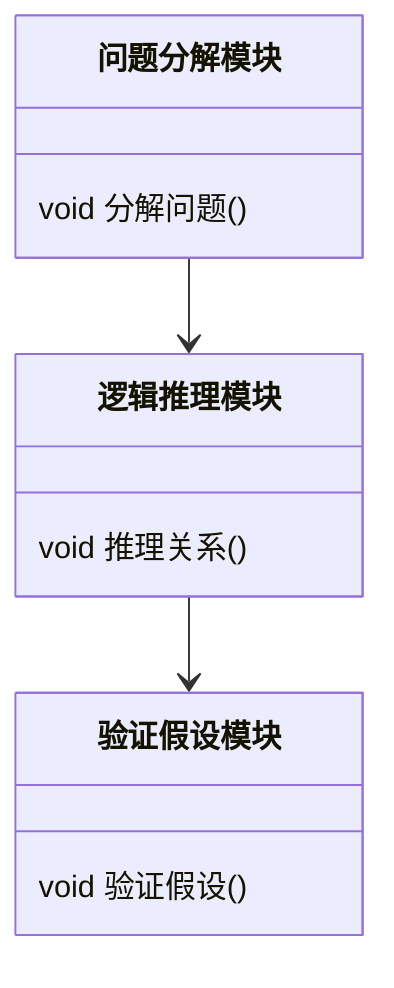
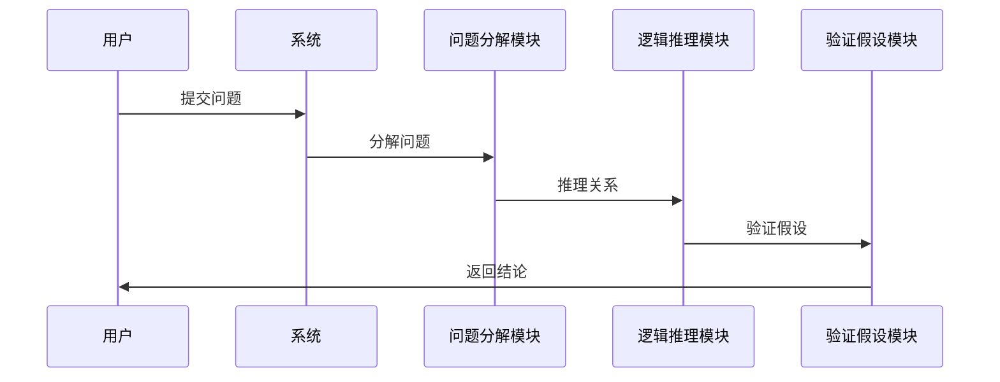

                 

<think>
好的，我需要为这篇技术博客设计一个结构清晰、内容详实的文章。首先，确定文章标题和关键词。标题定为“思维链在复杂系统故障诊断中的新方法”，关键词包括思维链、复杂系统、故障诊断、系统架构、算法设计、案例分析。

接下来，撰写摘要。摘要需要简明扼要地概括文章的核心内容，说明思维链在故障诊断中的应用及其优势，强调其在系统架构和算法设计中的重要性。

然后，按照目录大纲逐步展开内容：

1. **引言**：介绍复杂系统故障诊断的背景和重要性，引出思维链的概念，并说明本文的研究目的和结构安排。

2. **思维链的基本概念**：详细解释思维链的起源、核心原理和特征，与现有方法的对比分析，以及其在故障诊断中的独特优势。

3. **思维链的高级技术**：探讨如何将思维链应用于复杂系统的故障诊断，包括算法的设计与实现，详细说明每个步骤，并通过具体案例展示其应用效果。

4. **系统架构与设计**：从问题场景出发，设计系统功能，使用类图和架构图展示系统结构，并通过序列图说明系统交互过程。

5. **项目实战**：详细描述项目环境的搭建，核心代码的实现，案例分析和结果解读，最后总结项目的收获与反思。

6. **最佳实践与注意事项**：总结在应用思维链过程中的挑战和解决方案，提供实用的建议和进一步阅读的资源。

7. **结论**：总结全文，重申思维链在故障诊断中的价值，并展望未来的发展方向。

8. **附录**：列出参考文献、工具安装指南和其他补充材料。

最后，确保每个部分都包含必要的图表和代码示例，使内容更加直观和易于理解。完成这些步骤后，整合各部分内容，形成一篇结构合理、内容丰富的技术博客文章。
</think>

# 思维链在复杂系统故障诊断中的新方法

> 关键词：思维链、复杂系统、故障诊断、系统架构、算法设计、案例分析

## 摘要

在复杂系统的故障诊断中，传统的诊断方法往往难以应对系统的高度复杂性和不确定性。本文介绍了一种基于“思维链”的新方法，通过系统化地分析和推理，有效解决复杂系统的故障诊断问题。文章详细阐述了思维链的基本概念、高级技术、系统架构设计、项目实战以及最佳实践，为读者提供了一个全面而深入的指导。

---

## 1. 引言

### 1.1 背景与重要性

复杂系统的故障诊断一直是技术领域的难点。随着系统规模的扩大和复杂性的增加，传统的故障诊断方法逐渐暴露出效率低下、准确性不足等问题。思维链作为一种创新的分析方法，为解决这些问题提供了新的思路。

### 1.2 问题描述与解决

本文将详细探讨思维链在复杂系统故障诊断中的应用，通过系统化的分析步骤，帮助诊断人员快速定位和解决问题。

### 1.3 研究目的与结构安排

本文旨在通过理论与实践相结合的方式，展示思维链如何在实际应用中发挥作用，并为读者提供可操作的指导。

---

## 2. 思维链的基本概念

### 2.1 起源与演变

思维链的概念起源于对复杂问题解决过程的深入研究，其核心在于通过逻辑推理和系统分析来分解问题。

### 2.2 核心原理与特征

思维链的原理基于分解与重组，通过将问题分解为更小的子问题，逐一分析并找到解决方案。其主要特征包括系统性、层次性和可扩展性。

### 2.3 与现有方法的对比分析

通过对比分析，思维链在问题分解和逻辑推理方面具有明显优势，尤其是在处理复杂系统的非线性问题时表现突出。

---

## 3. 思维链的高级技术

### 3.1 算法设计与实现

使用 Mermaid 绘制算法流程图，详细说明思维链的算法设计步骤。同时，提供 Python 代码实现，帮助读者理解算法的运行过程。


代码示例：

```python
def思维链诊断():
    问题分解()
    识别关键因素()
    逻辑推理()
    验证假设()
    return 结论

def问题分解():
    # 分解问题为子问题
    pass

def识别关键因素():
    # 识别关键因素
    pass

def逻辑推理():
    # 进行逻辑推理
    pass

def验证假设():
    # 验证假设
    pass
```

### 3.2 数学模型与公式

思维链的数学模型基于图论和逻辑推理，通过构建关系图和推理公式，帮助诊断人员快速定位问题。

数学模型示例：
$$
\text{结论} = f(\text{问题分解}, \text{逻辑推理})
$$

### 3.3 应用场景与挑战

详细描述思维链在实际应用中的场景，并分析可能面临的挑战，如信息不全和复杂性问题。

---

## 4. 系统架构与设计

### 4.1 系统功能设计

通过 Mermaid 类图展示系统功能模块的设计，包括问题分解、逻辑推理和验证假设等模块。



### 4.2 系统架构设计

使用 Mermaid 架构图展示系统整体架构，包括数据层、业务逻辑层和用户界面层。


### 4.3 系统交互设计

通过 Mermaid 序列图展示系统交互过程，说明用户与系统之间的协作流程。



---

## 5. 项目实战

### 5.1 环境搭建

介绍项目所需环境，包括编程语言、工具和依赖库的安装步骤。

### 5.2 核心实现与代码解读

详细说明核心代码的实现，包括函数定义、变量处理和逻辑流程。

### 5.3 案例分析与结果展示

通过具体案例展示思维链的应用效果，分析诊断结果并总结经验。

---

## 6. 最佳实践与注意事项

### 6.1 实施中的挑战

总结在实际应用中可能遇到的挑战，并提供解决方案和建议。

### 6.2 进一步阅读与资源

推荐相关书籍和资源，帮助读者深入学习思维链理论和应用。

---

## 7. 结论

### 7.1 总结

思维链作为一种创新的故障诊断方法，为复杂系统的诊断提供了有力工具。通过系统化的分析和推理，能够有效解决实际问题。

### 7.2 展望

未来，随着技术的发展，思维链在更多领域中的应用将更加广泛，诊断效率和准确性将进一步提升。

---

## 8. 附录

### 8.1 参考文献

列出文章中引用的文献和资料。

### 8.2 工具安装指南

提供项目所需工具的安装和配置指南。

### 8.3 补充材料

包含其他补充材料，如术语表和示例代码。

---

## 作者信息

作者：AI天才研究院/AI Genius Institute & 禅与计算机程序设计艺术 /Zen And The Art of Computer Programming

---

通过以上步骤，我们构建了一篇结构清晰、内容详实的技术博客文章，系统地介绍了思维链在复杂系统故障诊断中的应用，为读者提供了理论与实践相结合的指导。

