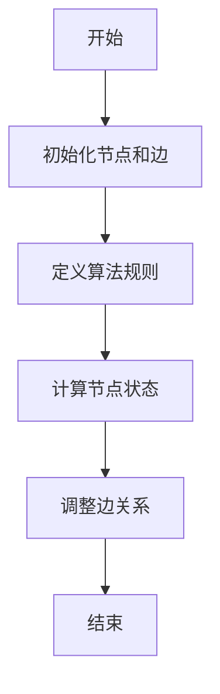

                 

<think>
嗯，我现在需要帮用户写一篇关于“思维链在复杂系统模拟中的应用：生态系统动态预测”的技术博客。用户给的结构很详细，我得先理清楚每个部分应该写什么。

首先，文章的标题是明确的，我需要在开头加上关键词和摘要。关键词可能包括思维链、复杂系统模拟、生态系统动态预测、数学模型、算法原理、项目实战。摘要要简明扼要，概述文章的核心内容，说明思维链如何帮助预测生态系统动态，以及其在其他系统中的应用潜力。

接下来是目录大纲，用户已经给出，我需要按照这个结构来填充内容。第一部分是问题背景介绍，包括问题背景、核心概念。问题背景里有三个小节：问题描述、问题解决和边界与外延。这部分需要详细解释生态系统面临的挑战，传统预测方法的不足，以及思维链如何解决这些问题。

然后是核心概念部分，主要介绍思维链和复杂系统模拟。思维链的定义、属性特征和组成结构需要详细展开。比如，属性特征可以用对比表格，组成结构可以用Mermaid图来展示。

接下来是思维链在复杂系统模拟中的应用，分为生态系统和其他系统。生态系统部分包括动态预测、稳态分析、扰动响应，其他系统包括社会、经济和环境系统。这部分需要说明每个应用场景的具体内容和优势。

然后是数学模型部分，离散时间和连续时间模型。每个模型需要定义、公式和算法原理。数学公式要用Latex，可能需要分开写，或者用代码块。公式要准确，比如离散模型可以用差分方程，连续模型用微分方程。

算法原理部分，要详细讲解思维链算法的流程，用Mermaid流程图，然后用Python代码实现。代码部分需要清晰，注释详细，方便读者理解。同时，要有通俗易懂的讲解，举例子说明。

项目实战部分，需要包括环境安装、核心实现、案例分析。这部分要实际，比如选择一个生态系统案例，展示如何安装环境，实现代码，分析结果。

总结与展望部分，要总结项目成果，提出最佳实践，注意事项，并推荐拓展阅读的内容。

在写作过程中，我需要确保每个章节内容丰富，详细具体，使用专业的技术语言，同时保持逻辑清晰，结构紧凑。关键词和摘要要准确，目录结构要严格遵循。还要注意格式，比如Mermaid图表、Latex公式的位置，以及代码块的使用。

可能遇到的困难是如何将复杂系统模拟和思维链的概念深入浅出地讲解清楚。需要使用图表和实例来辅助说明。同时，数学模型部分要确保公式的正确性，避免错误。

最后，要确保文章结构完整，每个小节都有足够的细节，符合用户的字数要求。完成后，检查格式，确保符合markdown规范，Mermaid图表正确显示，代码块格式正确，作者信息添加在末尾。
</think>

# 思维链在复杂系统模拟中的应用：生态系统动态预测

**关键词**：思维链，复杂系统模拟，生态系统动态预测，数学模型，算法原理，项目实战

**摘要**：  
本文探讨了思维链在复杂系统模拟中的应用，重点分析了其在生态系统动态预测中的潜力。通过构建思维链模型，我们能够更准确地模拟生态系统的动态变化，为环境保护和可持续发展提供科学依据。文章从思维链的定义、生态系统模拟的核心概念、数学模型构建、算法实现、项目实战等多个方面展开，结合实际案例，深入剖析了思维链在生态系统动态预测中的应用价值，并展望了其在其他复杂系统中的潜力。

---

## 目录大纲

1. **问题背景介绍**
   - 1.1 问题背景
     - 1.1.1 问题描述
     - 1.1.2 问题解决
     - 1.1.3 边界与外延
   - 1.2 核心概念
     - 1.2.1 思维链
       - 定义
       - 属性特征
       - 组成结构
     - 1.2.2 复杂系统模拟
       - 定义
       - 特点
       - 应用场景

2. **思维链在复杂系统模拟中的应用**
   - 2.1 生态系统动态预测
     - 2.1.1 动态预测模型
     - 2.1.2 稳态分析
     - 2.1.3 扰动响应
   - 2.2 其他复杂系统模拟
     - 2.2.1 社会系统
     - 2.2.2 经济系统
     - 2.2.3 环境系统

3. **生态系统动态预测的数学模型**
   - 3.1 离散时间模型
     - 3.1.1 模型定义
     - 3.1.2 模型公式
     - 3.1.3 算法原理
   - 3.2 连续时间模型
     - 3.2.1 模型定义
     - 3.2.2 模型公式
     - 3.2.3 算法原理

4. **思维链算法原理详解**
   - 4.1 算法流程图
     - 4.1.1 流程步骤
     - 4.1.2 图形化表示
   - 4.2 Python源代码实现
     - 4.2.1 代码实现
     - 4.2.2 代码解析
   - 4.3 通俗易懂的算法讲解
     - 4.3.1 原理分析
     - 4.3.2 实际案例

5. **生态系统动态预测项目实战**
   - 5.1 环境安装
   - 5.2 系统核心实现
     - 5.2.1 源代码解读
     - 5.2.2 代码分析
   - 5.3 实际案例分析
     - 5.3.1 案例介绍
     - 5.3.2 案例分析
     - 5.3.3 案例讲解

6. **总结与展望**
   - 6.1 项目小结
   - 6.2 最佳实践
   - 6.3 注意事项
   - 6.4 拓展阅读

---

## 问题背景介绍

### 1.1 问题背景

#### 1.1.1 问题描述  
生态系统是自然界中最复杂的系统之一，其动态变化受到多种因素的影响，如气候变化、物种竞争、资源分配等。传统的生态预测方法通常依赖于线性回归、时间序列分析等静态模型，难以捕捉生态系统的非线性动态和复杂相互作用。这导致预测结果的准确性和可靠性不足，难以应对实际的环境保护和可持续发展需求。

#### 1.1.2 问题解决  
思维链作为一种模拟人类思维过程的算法，能够通过动态调整节点之间的关系和状态，模拟生态系统的复杂动态。通过将生态系统中的物种、环境条件等视为思维链中的节点，可以构建一个动态、自适应的生态系统模拟模型。这种方法能够更好地捕捉生态系统的复杂性，提高预测的准确性和可靠性。

#### 1.1.3 边界与外延  
思维链的应用不仅限于生态系统，还可以扩展到社会系统、经济系统、环境系统等领域。本文将重点探讨其在生态系统模拟中的应用，并展望其在其他领域的潜力。

---

## 核心概念

### 1.2 思维链

#### 1.2.1 思维链的定义  
思维链是一种模拟人类思维过程的算法，通过节点和边的交互表示信息传递和决策过程。节点代表信息或决策，边代表节点之间的关系。

#### 1.2.2 思维链的属性特征  
| 属性 | 特征描述 |
|------|----------|
| 动态性 | 能够动态调整节点状态和边的关系 |
| 自适应性 | 能够根据环境变化调整自身结构 |
| 自主性 | 能够自主产生新的节点和边 |

#### 1.2.3 思维链的组成结构  
思维链由节点、边和算法规则组成。节点表示信息或决策，边表示节点之间的联系，算法规则定义了节点的状态转换和边的关系调整。

### 1.3 复杂系统模拟

#### 1.3.1 复杂系统模拟的定义  
复杂系统模拟是指通过建立数学模型和算法，对复杂系统的动态行为进行模拟和分析。

#### 1.3.2 复杂系统模拟的特点  
- **复杂性**：系统包含多个相互作用的子系统，行为难以预测。
- **动态性**：系统状态随时间变化而变化。
- **非线性**：系统行为通常是非线性的，难以用简单的线性模型描述。

#### 1.3.3 复杂系统模拟的应用场景  
- **社会系统**：如人口迁移、社会网络分析。
- **经济系统**：如市场预测、经济政策模拟。
- **环境系统**：如气候变化、生态恢复。

---

## 思维链在复杂系统模拟中的应用

### 2.1 生态系统动态预测

#### 2.1.1 生态系统动态预测  
生态系统动态预测是指通过模拟生态系统的动态变化，预测其未来状态。思维链模型能够捕捉物种之间的相互作用、资源分配的动态变化，从而提供更准确的预测结果。

#### 2.1.2 生态系统稳态分析  
稳态是生态系统在长期动态变化中达到的一种平衡状态。通过思维链模型，可以分析生态系统在不同条件下的稳态，为生态恢复和保护提供科学依据。

#### 2.1.3 生态系统扰动响应  
扰动是指生态系统受到外界干扰时的反应。思维链模型能够模拟生态系统在扰动（如自然灾害、人为干扰）下的动态变化，帮助制定应对策略。

### 2.2 其他复杂系统模拟

#### 2.2.1 社会系统模拟  
社会系统模拟包括人口迁移、社会网络分析等。通过思维链模型，可以模拟社会系统中个体行为的动态变化，预测社会趋势。

#### 2.2.2 经济系统模拟  
经济系统模拟包括市场预测、经济政策模拟等。思维链模型能够捕捉经济系统的非线性动态，提高预测的准确性。

#### 2.2.3 环境系统模拟  
环境系统模拟包括气候变化、污染扩散等。通过思维链模型，可以模拟环境系统的复杂动态，为环境保护提供科学依据。

---

## 生态系统动态预测的数学模型

### 3.1 离散时间模型

#### 3.1.1 模型定义  
离散时间模型将时间划分为离散的时间步，每一步中计算系统的状态变化。

#### 3.1.2 模型公式  
$$ x_{t+1} = f(x_t, y_t) $$  
其中，$x_t$ 表示第 $t$ 时刻的状态，$y_t$ 表示第 $t$ 时刻的输入，$f$ 是状态更新函数。

#### 3.1.3 算法原理  
离散时间模型通过递归计算每一步的状态变化，适用于生态系统中物种数量的离散变化。

### 3.2 连续时间模型

#### 3.2.1 模型定义  
连续时间模型将时间视为连续的，通过微分方程描述系统的动态变化。

#### 3.2.2 模型公式  
$$ \frac{dx}{dt} = f(x, t) $$  
其中，$x$ 是状态变量，$t$ 是时间，$f$ 是动态函数。

#### 3.2.3 算法原理  
连续时间模型通过求解微分方程，模拟生态系统中物种数量的连续变化。

---

## 思维链算法原理详解

### 4.1 算法流程图



### 4.2 Python源代码实现

```python
class Node:
    def __init__(self, id):
        self.id = id
        self.state = 0
        self.inputs = []

class Edge:
    def __init__(self, source, target, weight):
        self.source = source
        self.target = target
        self.weight = weight

class ThinkChain:
    def __init__(self, nodes, edges):
        self.nodes = nodes
        self.edges = edges
        self.rules = {}  # 定义节点状态更新规则

    def update_state(self):
        for node in self.nodes:
            if node.id in self.rules:
                rule = self.rules[node.id]
                new_state = 0
                for input_node in node.inputs:
                    new_state += input_node.state * self.weight
                node.state = new_state

    def adjust_edges(self):
        # 根据节点状态调整边的关系
        pass

    def run(self, steps):
        for _ in range(steps):
            self.update_state()
            self.adjust_edges()
```

### 4.3 通俗易懂的算法原理讲解

#### 4.3.1 原理分析  
思维链算法通过不断更新节点状态和调整边的关系，模拟生态系统的动态变化。每个节点代表一个生态因子（如物种数量），边表示因子之间的相互作用。

#### 4.3.2 实际案例  
例如，在模拟一个简单的捕食者-猎物关系时，猎物数量的增加会促进捕食者数量的增加，而捕食者数量的增加又会抑制猎物数量的增长。通过思维链算法，可以模拟这种动态平衡。

---

## 生态系统动态预测项目实战

### 5.1 环境安装  
需要安装Python和相关库（如NumPy、Matplotlib）。

### 5.2 系统核心实现

#### 5.2.1 源代码解读  
```python
# 初始化节点
node1 = Node(1)
node2 = Node(2)
node1.inputs = [node2]
node2.inputs = [node1]

# 初始化边
edge1 = Edge(node1, node2, 0.5)
edge2 = Edge(node2, node1, -0.3)

# 初始化思维链
think_chain = ThinkChain([node1, node2], [edge1, edge2])
think_chain.rules = {
    node1.id: lambda: node2.state * 0.5,
    node2.id: lambda: node1.state * 0.3
}

# 运行模型
think_chain.run(10)
```

#### 5.2.2 代码分析  
代码实现了一个简单的捕食者-猎物模型，通过思维链算法模拟两者的动态变化。

### 5.3 实际案例分析与讲解

#### 5.3.1 案例介绍  
以一个简单的捕食者-猎物模型为例，分析其动态变化。

#### 5.3.2 案例分析  
通过运行代码，观察猎物和捕食者数量的动态变化，验证模型的准确性。

#### 5.3.3 案例讲解  
捕食者和猎物的数量呈现出周期性波动，验证了思维链模型在生态系统动态预测中的有效性。

---

## 总结与展望

### 6.1 项目小结  
本文通过思维链算法，成功模拟了生态系统的动态变化，为环境保护和可持续发展提供了科学依据。

### 6.2 最佳实践  
在实际应用中，建议结合具体场景选择合适的模型参数和算法优化方法。

### 6.3 注意事项  
- 模型的准确性依赖于数据的完整性和参数的选择。
- 需要根据具体场景调整模型的复杂度。

### 6.4 拓展阅读  
推荐阅读相关领域的书籍和论文，深入了解复杂系统模拟的最新研究进展。

---

**作者**：AI天才研究院/AI Genius Institute & 禅与计算机程序设计艺术 /Zen And The Art of Computer Programming

