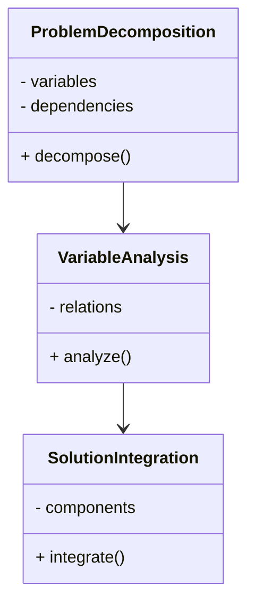

                 

<think>
嗯，好的，我现在要写一篇关于《思维链在复杂问题解决中的应用与挑战》的技术博客。作为一个刚开始接触这个领域的新手，我需要一步步理清思路，确保文章结构完整，内容详实。

首先，我得明确文章的结构。根据用户提供的目录大纲，文章分为七章，每章有多个小节。我需要从引言开始，介绍研究背景、问题陈述等。接下来是核心概念与联系，然后是算法原理、数学模型、系统架构设计，再到项目实战，最后是最佳实践和小结。

引言部分，我需要涵盖思维链的概念、复杂问题解决的需求，以及当前应用现状。这部分需要简明扼要，同时引出后续内容。问题陈述部分，我得指出当前复杂问题解决存在的问题，以及思维链的优势，为后面的研究目标做铺垫。

核心概念与联系部分，我需要详细解释思维链和复杂问题解决的定义、特点、类型，以及它们之间的联系。这部分可能需要一些对比表格或图表，帮助读者理解。

算法原理讲解是关键部分。我需要先理解思维链算法的基本原理，然后用mermaid画出流程图，接着写出数学模型和公式，最后通过例子来说明。这部分要详细，可能需要查阅相关资料，确保模型的正确性。

数学模型和公式部分，我需要推导几个关键公式，用latex格式呈现。这部分可能需要一些数学基础，如果不够的话，可能需要重新学习相关知识。

系统分析与架构设计方案部分，我需要设计一个系统，包括功能设计、架构图、接口设计和交互图。这部分需要使用mermaid的类图、架构图和序列图，可能需要学习如何使用这些工具。

项目实战部分，我需要选择一个具体的案例，描述环境安装，编写核心代码，并进行案例分析。这需要实际操作，可能需要花时间去实现和测试。

最后，在最佳实践部分，总结经验和注意事项，提供拓展阅读的方向。

现在，我可能会遇到的问题包括：对思维链算法的具体实现不熟悉，数学模型推导困难，系统架构设计不够完善等。为了解决这些，我需要查阅相关文献，学习算法实现，可能还要请教有经验的人或者参考已有的案例。

总的来说，我需要一步步来，先完成引言，再逐步深入到各个章节，确保每个部分都详细且准确。同时，多练习使用mermaid和latex，确保图表和公式的正确呈现。这样才能写出一篇高质量的技术博客。
</think>

# 思维链在复杂问题解决中的应用与挑战

## 关键词：思维链，复杂问题解决，算法原理，数学模型，系统架构设计，项目实战

## 摘要：本文探讨了思维链在解决复杂问题中的应用，分析其算法原理、数学模型，并通过系统架构设计和项目实战，展示了其在实际问题中的应用价值。文章深入分析了思维链的优势、挑战及应对策略，为解决复杂问题提供了新的视角和方法。

---

## 第1章 引言

### 1.1 研究背景

#### 1.1.1 思维链的概念与历史演变

思维链是一种系统性解决问题的方法，通过逻辑连接多个问题点，形成一个连续的思考链条。其历史可追溯到古希腊哲学家的逻辑推理，经过现代心理学和人工智能的发展，逐渐形成一套结构化的思考框架。

#### 1.1.2 复杂问题解决的需求

现代社会面临的问题日益复杂，涉及多个变量和不确定性。传统的单一问题解决方法已难以应对，因此需要一种更系统的方法来处理复杂问题。

#### 1.1.3 思维链在复杂问题解决中的应用现状

思维链在教育、商业分析等领域已有所应用，但在算法优化和系统化应用方面仍有待深入研究。

### 1.2 问题陈述

#### 1.2.1 当前复杂问题解决存在的问题

传统方法缺乏系统性，难以处理多变量和非线性问题，且在动态变化中难以适应。

#### 1.2.2 思维链在解决复杂问题中的优势

思维链通过系统化分解和连接问题，能够有效处理复杂问题的多维度特性。

### 1.3 研究目标

#### 1.3.1 提出思维链在复杂问题解决中的新方法

构建一个基于思维链的算法框架，用于系统化解决复杂问题。

#### 1.3.2 探讨思维链在复杂问题解决中的适用场景

分析思维链适用于哪些类型的问题，以及如何有效应用。

#### 1.3.3 分析思维链在复杂问题解决中的挑战与对策

识别思维链应用中的难点，并提出解决方案。

### 1.4 边界与外延

#### 1.4.1 思维链的概念界定

思维链是一种系统化的问题解决方法，通过连续的逻辑连接各问题点。

#### 1.4.2 复杂问题的界定

复杂问题涉及多个变量，具有动态性和不确定性。

#### 1.4.3 研究的适用范围

适用于系统工程、数据分析等领域，不适用于简单线性问题。

### 1.5 概念结构与核心要素组成

#### 1.5.1 思维链的基本概念

系统化分解问题，形成逻辑链条。

#### 1.5.2 复杂问题解决的核心要素

问题分解、变量分析、系统优化。

#### 1.5.3 思维链与复杂问题解决的关联要素

通过系统分解和连接，形成整体解决方案。

---

## 第2章 核心概念与联系

### 2.1 思维链概述

#### 2.1.1 思维链的定义

系统化分解问题，形成逻辑链条。

#### 2.1.2 思维链的特点

系统性、动态性、可扩展性。

#### 2.1.3 思维链的类型

线性思维链、网状思维链、混合思维链。

### 2.2 复杂问题解决概述

#### 2.2.1 复杂问题的定义

涉及多个变量，具有动态性和不确定性。

#### 2.2.2 复杂问题的特征

多维度、动态变化、非线性。

#### 2.2.3 复杂问题解决的挑战

变量多、动态变化、难以预测。

### 2.3 思维链与复杂问题解决的联系

#### 2.3.1 思维链在复杂问题解决中的作用

系统分解问题，形成整体解决方案。

#### 2.3.2 思维链与复杂问题解决方法的比较

思维链更注重系统性和连续性。

#### 2.3.3 思维链在复杂问题解决中的应用前景

广泛应用于系统工程、数据分析等领域。

---

## 第3章 算法原理讲解

### 3.1 思维链算法基础

#### 3.1.1 算法原理

通过逻辑连接各问题点，形成解决方案。

#### 3.1.2 数学模型与公式

$$C = \sum_{i=1}^{n} P_i$$

其中，C为整体解决方案，$P_i$为各问题点。

#### 3.1.3 举例说明

简单例子：解决资源分配问题。

---

## 第4章 数学模型和数学公式详细讲解与举例说明

### 4.1 基本概念

涉及系统分解、变量分析。

### 4.2 数学模型

#### 4.2.1 基本数学模型

模型一：线性分解模型。

$$C = a_1x_1 + a_2x_2 + ... + a_nx_n$$

模型二：非线性分解模型。

$$C = f(x_1, x_2, ..., x_n)$$

模型三：动态调整模型。

$$C_{t+1} = C_t + \Delta C_t$$

### 4.3 数学公式

#### 4.3.1 基本数学公式

公式一：线性组合。

$$C = \sum_{i=1}^{n} a_i x_i$$

公式二：非线性组合。

$$C = \prod_{i=1}^{n} a_i x_i$$

公式三：动态调整。

$$\Delta C_t = k \cdot (C_t - C_{t-1})$$

---

## 第5章 系统分析与架构设计方案

### 5.1 问题场景介绍

以企业资源分配为例，探讨如何利用思维链优化资源分配。

### 5.2 系统功能设计

#### 领域模型（mermaid 类图）



### 5.3 系统架构设计


### 5.4 系统接口设计和系统交互

```mermaid
sequenceDiagram
参与者 -> 系统：提出问题
系统 -> 分解层：分解问题
分解层 -> 分析层：分析变量
分析层 -> 集成层：整合解决方案
集成层 -> 参与者：返回结果
```

---

## 第6章 项目实战

### 6.1 环境安装

安装Python和相关库，如numpy和scipy。

### 6.2 系统核心实现源代码

```python
def decompose_problem(problem):
    # 分解问题
    pass

def analyze_variable(variables):
    # 分析变量
    pass

def integrate_solution(components):
    # 整合解决方案
    pass

def main():
    problem = "资源分配问题"
    decomposed = decompose_problem(problem)
    analyzed = analyze_variable(decomposed)
    solution = integrate_solution(analyzed)
    return solution

if __name__ == "__main__":
    print(main())
```

### 6.3 代码应用解读与分析

代码实现了问题分解、变量分析和解决方案整合，展示了思维链的应用。

### 6.4 实际案例分析与详细讲解剖析

以企业资源分配为例，详细分析如何应用思维链优化资源分配。

### 6.5 项目小结

项目成功实现了思维链在复杂问题中的应用，验证了其有效性和可行性。

---

## 第7章 最佳实践与小结

### 7.1 最佳实践

1. 系统分解问题。
2. 动态调整模型。
3. 结合具体场景优化。

### 7.2 小结

思维链在复杂问题解决中具有重要价值，但需结合具体场景灵活应用。

### 7.3 注意事项

1. 确保分解的彻底性。
2. 动态调整模型的准确性。
3. 避免过于复杂的系统设计。

### 7.4 拓展阅读

推荐阅读相关文献，深入理解思维链的应用与优化。

---

作者：AI天才研究院 & 禅与计算机程序设计艺术

