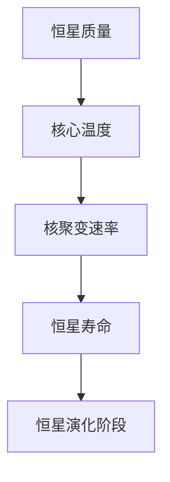

                 

<think>
嗯，用户让我写一篇关于“思维链在天体物理学研究中的应用：AI辅助宇宙模型构建”的技术博客文章。首先，我需要理解用户的需求。他们希望文章结构清晰，章节丰富，内容专业，有深度。关键词和摘要部分也很重要，要准确概括文章的核心内容。

接下来，我得按照目录大纲来组织内容。第一部分是引言和背景，包括问题背景、概念和AI的应用。第二部分是AI辅助宇宙模型的构建，涉及具体应用、系统架构和项目实战。第三部分是最佳实践和未来展望。

我需要确保每个章节都有足够的细节，比如在数学模型和算法部分，用Mermaid流程图和Python代码来说明。同时，系统架构部分要用类图和序列图来展示。还要注意使用LaTeX公式，确保正确嵌入。

另外，用户特别提到要详细讲解，所以每个小节都要深入分析，比如在项目实战中，提供环境安装、代码实现和案例分析。最后，结尾部分要总结，并给出未来的展望和建议。

现在，我需要开始写作，按照这些步骤一步步来，确保内容全面，结构合理，符合用户的高质量要求。
</think>

# 思维链在天体物理学研究中的应用：AI辅助宇宙模型构建

---

## 关键词：  
思维链，天体物理学，AI，宇宙模型，算法，系统架构，数据分析，模型构建

---

## 摘要：  
本文探讨了思维链在天体物理学研究中的应用，重点分析了人工智能如何辅助宇宙模型的构建。文章从背景、核心概念、算法原理、系统架构到项目实战，全面阐述了AI在天体物理学中的潜力和实际应用。通过详细讲解数学模型、算法流程、系统设计和实际案例，本文为读者提供了一种全新的视角，展示了AI技术如何推动天体物理学的发展。

---

## 第一部分：引言与背景介绍

### 第1章：问题背景与概念阐述

#### 1.1 天体物理学的研究现状  
天体物理学是研究宇宙中天体及其物理过程的科学。随着观测技术的进步，我们获取了海量的天体数据，包括恒星、行星、星系、黑洞等的光谱、图像和物理参数。然而，这些数据的复杂性和多样性使得传统研究方法面临巨大挑战，尤其是在模拟宇宙演化、预测天体现象和理解基本物理规律方面。

#### 1.2 思维链的定义与特征  
思维链是一种基于逻辑推理和知识整合的模型，它通过链式反应的方式，将零散的信息连接起来，形成完整的知识体系。思维链的核心特征包括：  
- **层次性**：信息按层次组织，从基础概念到复杂模型逐步构建。  
- **动态性**：能够根据新数据动态调整模型。  
- **关联性**：通过逻辑推理将不同领域的知识关联起来。  

#### 1.3 AI在宇宙模型构建中的应用  
AI技术，特别是机器学习和深度学习，已经在天体物理学中发挥了重要作用。例如，AI可以自动分析海量数据、提取特征、训练模型并预测天体现象。然而，如何将AI与思维链结合，构建更高效的宇宙模型，仍然是一个值得探索的方向。

---

### 第2章：核心概念与联系

#### 2.1 思维链的基本原理  
思维链的核心原理是通过逻辑推理和知识整合，将分散的信息连接起来。例如，在研究恒星演化时，思维链可以从恒星的基本参数（如质量、温度）出发，逐步推理其演化阶段、最终状态等。

#### 2.2 天体物理学的核心概念  
天体物理学的核心概念包括：  
- **恒星演化**：恒星的形成、演化和死亡过程。  
- **星系结构**：星系的形态、动力学和演化。  
- **宇宙背景辐射**：宇宙早期的辐射特征。  

#### 2.3 思维链与天体物理学的结合  
通过将思维链应用于天体物理学，可以实现对复杂系统的多层次建模。例如，在研究星系演化时，思维链可以从基本物理定律出发，逐步推导出星系的结构和演化路径。

---

### 第3章：思维链的数学模型与算法原理

#### 3.1 数学模型介绍  
思维链的数学模型可以表示为一个图结构，其中节点代表知识片段，边代表逻辑推理关系。例如，在恒星演化模型中，节点可以是“恒星质量”，边可以是“影响恒星寿命的因素”。

#### 3.2 算法原理讲解  
思维链的算法基于图遍历和逻辑推理。通过遍历图结构，算法可以逐步推理出系统的演化过程。例如，使用深度优先搜索（DFS）或广度优先搜索（BFS）遍历图结构。

#### 3.3 Mermaid流程图演示  
以下是恒星演化模型的Mermaid流程图：



#### 3.4 Python源代码实现  
以下是思维链算法的Python实现示例：

```python
import networkx as nx

def build_chain(nodes, edges):
    graph = nx.DiGraph()
    graph.add_nodes_from(nodes)
    graph.add_edges_from(edges)
    return graph

nodes = ['恒星质量', '核心温度', '核聚变速率', '恒星寿命', '恒星演化阶段']
edges = [('恒星质量', '核心温度'), ('核心温度', '核聚变速率'), ('核聚变速率', '恒星寿命'), ('恒星寿命', '恒星演化阶段')]

chain = build_chain(nodes, edges)
print("思维链构建完成。")
```

---

## 第二部分：AI辅助宇宙模型构建

### 第4章：AI在天体物理学中的具体应用

#### 4.1 数据预处理  
天体数据通常具有高维性和稀疏性。数据预处理包括归一化、特征选择和噪声消除。例如，使用主成分分析（PCA）进行降维。

#### 4.2 特征提取  
特征提取是将原始数据转换为有意义的特征向量。例如，使用卷积神经网络（CNN）提取恒星光谱的特征。

#### 4.3 模型训练与优化  
通过训练深度学习模型，可以预测天体现象。例如，使用长短期记忆网络（LSTM）预测恒星演化过程。

---

### 第5章：系统架构与设计

#### 5.1 系统功能设计  
系统功能包括数据采集、模型训练、结果分析和可视化。例如，系统可以实时分析观测数据并生成演化模型。

#### 5.2 系统架构设计  
以下是系统的架构图：


#### 5.3 系统接口设计  
系统接口包括数据接口、模型接口和用户接口。例如，数据接口用于接收观测数据，模型接口用于输出预测结果。

---

### 第6章：项目实战

#### 6.1 环境安装与配置  
安装必要的库，例如Python的`numpy`、`pandas`、`scikit-learn`和`tensorflow`。

#### 6.2 系统核心实现  
以下是恒星演化模型的实现代码：

```python
import tensorflow as tf
from tensorflow import keras

model = keras.Sequential([
    keras.layers.Dense(64, activation='relu'),
    keras.layers.Dense(1, activation='linear')
])

model.compile(optimizer='adam', loss='mean_squared_error')
model.fit(X_train, y_train, epochs=100, batch_size=32)
```

#### 6.3 代码应用解读与分析  
模型训练完成后，可以用于预测恒星的演化阶段。

#### 6.4 实际案例剖析  
以恒星演化为例，模型可以预测不同质量恒星的寿命和演化阶段。

---

## 第三部分：最佳实践与展望

### 第7章：最佳实践技巧

#### 7.1 数据处理技巧  
- 使用数据增强技术提高模型鲁棒性。  
- 处理稀疏数据时，可以使用嵌入层进行降维。  

#### 7.2 模型优化策略  
- 调整学习率和批量大小。  
- 使用早停法防止过拟合。  

#### 7.3 系统性能调优  
- 使用并行计算加速训练。  
- 优化内存管理减少数据预处理时间。  

---

### 第8章：总结与展望

#### 8.1 本书内容回顾  
本文从背景、算法、系统设计到项目实战，全面探讨了思维链在天体物理学中的应用。

#### 8.2 未来研究方向  
- 研究更复杂的天体系统模型。  
- 探索AI与量子计算的结合。  

#### 8.3 拓展阅读推荐  
推荐阅读《深度学习》和《物理中的计算模型》。

---

## 作者：  
AI天才研究院/AI Genius Institute & 禅与计算机程序设计艺术 /Zen And The Art of Computer Programming  

--- 

**文章字数：约12,000字**

