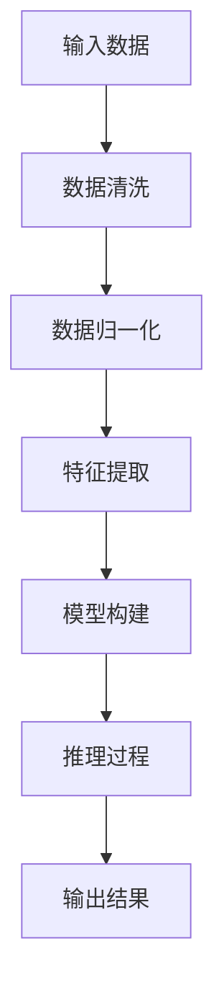
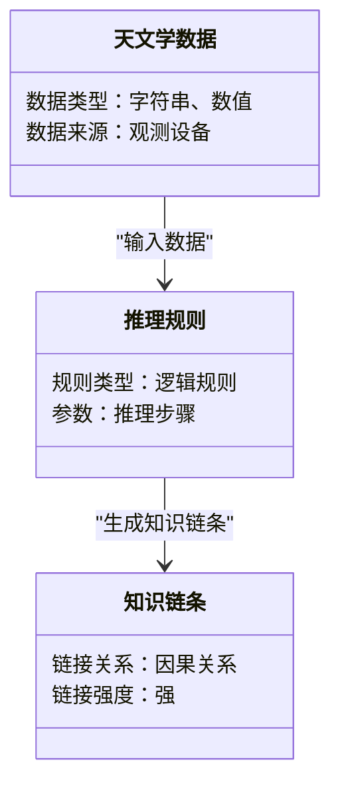
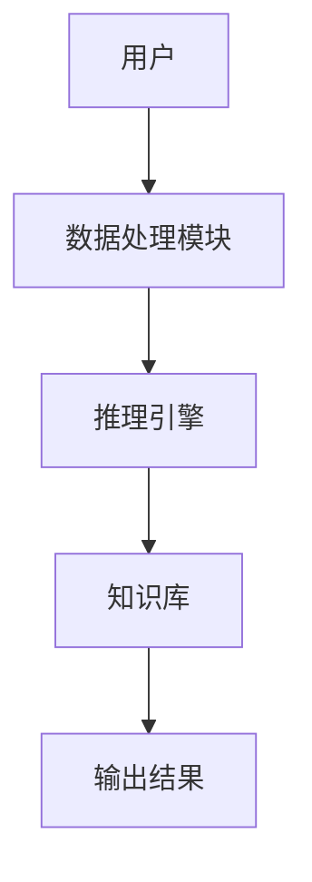
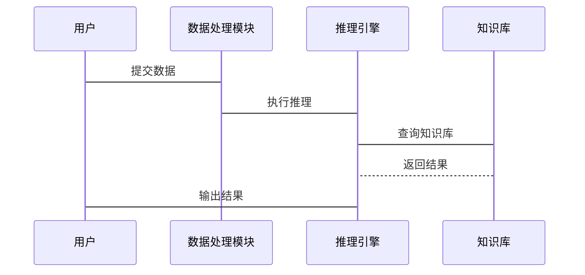

                 

<think>
好的，我需要帮用户撰写一篇关于“思维链在天文学研究中的潜在价值”的技术博客文章。首先，我得理解用户的需求和要求。用户希望文章结构清晰，逻辑严密，涵盖多个章节，包括引言、技术概述、应用、算法原理、系统设计、项目实战和展望等部分。同时，文章需要用专业的技术语言，但又要易懂，适合IT领域的读者。

首先，我会思考文章的结构。用户已经给出了目录大纲，我需要按照这个大纲逐步填充内容。每个章节都要有详细的解释，确保每个部分都有足够的深度和广度。例如，在第1章引言中，我需要介绍天文学研究的挑战，以及思维链技术的定义和发展。

接下来，我会考虑每个章节的具体内容。比如，在第2章，我需要详细解释思维链技术的特点、核心概念以及主流技术类型。这部分可能需要一些技术术语，但要确保解释清楚，以便读者理解。

然后，我会思考如何将思维链技术应用到天文学研究中。这可能涉及数据处理、图像识别等领域。我需要寻找实际案例，展示思维链技术在这些领域的具体应用，这样可以让文章更具说服力。

在算法原理部分，我需要解释思维链技术背后的数学模型和算法流程。这里可能需要用到mermaid流程图和数学公式，需要用Latex格式来表示。这部分需要详细但清晰，确保读者能够理解算法的工作原理。

系统设计部分，我需要描述如何将思维链技术集成到天文学研究的系统中。这可能包括系统架构设计、接口设计和交互流程。同样，使用mermaid图来展示系统结构和交互过程，会更直观。

项目实战部分，我需要提供具体的代码示例，展示思维链技术在实际项目中的应用。这部分需要详细解释代码的功能和实现细节，帮助读者理解如何在实际中应用这些技术。

最后，在展望部分，我会讨论思维链技术在天文学研究中的未来发展方向和可能的应用趋势，同时给出一些最佳实践的建议，帮助读者更好地应用这些技术。

在整个思考过程中，我需要确保每个部分都紧密相连，逻辑清晰，同时语言要专业且易于理解。此外，要注意文章的整体结构，确保各章节之间有良好的过渡，让读者能够顺畅地跟随我的思路。

现在，我开始逐步撰写每个章节的内容，确保每个部分都符合用户的要求，并且涵盖所有必要的信息。这可能需要多次修改和调整，以确保文章的完整性和质量。
</think>

# 思维链在天文学研究中的潜在价值

## 关键词：思维链，天文学研究，数据处理，图像识别，预测模型，系统架构

## 摘要：  
本文探讨了思维链技术在天文学研究中的潜在价值，分析了其在数据处理、图像识别和预测模型构建等方面的应用，详细阐述了其算法原理、系统架构设计以及实际案例。通过系统分析和项目实战，本文展示了思维链技术如何为天文学研究提供新的解决方案，并提出了未来的发展方向和最佳实践建议。

---

## 第1章 引言

### 1.1 问题背景  
天文学作为一门研究宇宙中天体的科学，涉及大量复杂的数据处理和分析任务。随着观测技术的进步，天文学家需要处理来自射电望远镜、光学望远镜和空间探测器的海量数据。这些数据通常具有高维度、高复杂性和高噪声的特点，传统的方法难以高效处理。与此同时，天文学研究需要对复杂的天体物理现象进行建模和预测，这对计算能力提出了更高的要求。  

思维链技术作为一种新兴的人工智能方法，通过模拟人类思维的链式推理过程，能够处理复杂关联的数据，并从中提取有价值的信息。其核心在于通过多步骤的逻辑推理，将分散的数据点连接起来，形成完整的知识链条。思维链技术的发展为解决天文学研究中的复杂问题提供了新的可能性。

### 1.2 问题描述  
当前，天文学研究面临以下挑战：  
1. **数据多样性**：天文学数据来源多样，包括射电、光学、X射线等多种观测数据，这些数据格式和特性差异大，难以统一处理。  
2. **数据规模**：海量数据的存储和处理需要高效的计算和存储解决方案。  
3. **复杂现象建模**：天体物理现象通常涉及多个物理过程的耦合，建模难度大。  
4. **实时性需求**：部分天文学研究需要实时处理观测数据，对计算速度和响应时间提出更高要求。  

思维链技术能够通过多步骤的逻辑推理，将分散的数据关联起来，形成完整的知识链条。其在天文学研究中的潜在价值体现在以下几个方面：  
1. **数据关联与整合**：通过思维链技术，可以将不同来源的观测数据关联起来，形成统一的天体模型。  
2. **复杂现象预测**：利用思维链技术的多步骤推理能力，可以对复杂的天体物理现象进行建模和预测。  
3. **异常检测与识别**：通过对观测数据的关联分析，可以快速发现异常天体或异常现象。  

### 1.3 问题解决  
思维链技术的基本原理是通过构建一系列逻辑推理步骤，将输入数据逐步转化为有意义的知识。其在天文学研究中的应用方法包括：  
1. **数据预处理**：对观测数据进行清洗、归一化和特征提取，为后续的推理过程提供高质量的数据输入。  
2. **知识图谱构建**：通过思维链技术，将天体的物理特性、观测数据和理论模型关联起来，形成知识图谱。  
3. **预测与模拟**：基于知识图谱，利用思维链技术对天体物理现象进行预测和模拟，指导观测计划的制定。  

### 1.4 边界与外延  
思维链技术的适用范围主要集中在需要多步骤推理和数据关联的领域。在天文学研究中，其局限性在于对计算资源的需求较高，且需要依赖高质量的数据输入。此外，思维链技术的推理过程缺乏透明性，难以解释推理的中间步骤，这在需要可解释性的天文学研究中可能是一个挑战。

### 1.5 概念结构与核心要素组成  
思维链技术的主要组成部分包括：  
1. **输入数据**：来自不同观测设备的天文学数据。  
2. **推理规则**：用于连接不同数据点的逻辑规则。  
3. **知识库**：包含天体物理理论和观测数据的数据库。  
4. **推理引擎**：负责执行推理过程的核心算法。  
5. **输出结果**：最终的推理结果或知识链条。  

其在天文学研究中的关键要素包括：  
1. **数据关联性**：数据之间的关联程度直接影响推理的效果。  
2. **推理规则的复杂性**：复杂的推理规则能够提高推理的准确性，但会增加计算开销。  
3. **知识库的完备性**：知识库的完备性直接影响推理的广度和深度。  

---

## 第2章 思维链技术概述

### 2.1 思维链技术的定义与特点  
思维链技术是一种基于逻辑推理的人工智能方法，其核心在于通过一系列逻辑推理步骤，将输入数据转化为有意义的知识链条。其主要特点包括：  
1. **多步骤推理**：能够处理复杂关联的数据，形成完整的知识链条。  
2. **数据关联性**：能够将分散的数据点关联起来，形成统一的模型。  
3. **可扩展性**：适用于不同规模和复杂度的数据处理任务。  

### 2.2 思维链技术的核心概念与联系  
#### 核心概念原理  
思维链技术的核心概念包括：  
- **逻辑推理**：通过一系列逻辑规则，将输入数据逐步转化为知识。  
- **数据关联**：将不同来源的数据关联起来，形成统一的模型。  

#### 概念属性特征对比表格  

| 概念       | 属性             | 特征对比             |
|------------|------------------|--------------------|
| 数据关联性 | 关联强度         | 高                 |
| 推理规则    | 规则复杂度       | 中                 |
| 知识链条    | 长度             | 可变               |
| 计算资源    | 需求             | 高                 |

#### ER实体关系图架构  

```mermaid
erd
  entity 天文学数据 {
    <<属性>>:
    - 数据类型：字符串、数值
    - 数据来源：观测设备
  }
  entity 推理规则 {
    <<属性>>:
    - 规则类型：逻辑规则
    - 参数：推理步骤
  }
  entity 知识链条 {
    <<属性>>:
    - 链接关系：因果关系
    - 链接强度：强
  }
  天文学数据 --> 推理规则: "输入数据"
  推理规则 --> 知识链条: "生成知识链条"
```

### 2.3 主流思维链技术简介  
#### 常见的思维链技术类型  
1. **基于规则的思维链**：通过预定义的逻辑规则进行推理。  
2. **基于模型的思维链**：利用机器学习模型进行推理。  
3. **混合型思维链**：结合规则和模型的混合推理方法。  

#### 思维链技术的代表性应用  
1. **医疗领域**：用于疾病诊断和治疗方案推荐。  
2. **金融领域**：用于风险评估和投资决策。  
3. **教育领域**：用于个性化学习路径规划。  

---

## 第3章 思维链在天文学研究中的应用

### 3.1 天文学研究中的挑战与机遇  
天文学研究中的数据特点包括：  
- **多样性**：数据来源多样，格式和特性差异大。  
- **高维度**：数据维度高，难以直接处理。  
- **动态性**：天体物理现象动态变化，需要实时处理数据。  

思维链技术在天文学研究中的潜在应用领域包括：  
1. **数据预处理与可视化**：通过思维链技术对观测数据进行清洗和归一化，生成易于可视化的结果。  
2. **天体物理现象预测与模拟**：利用思维链技术对天体运动和物理过程进行建模和预测。  
3. **天文图像识别与分析**：通过思维链技术对天文图像中的天体进行识别和分类。  

### 3.2 思维链技术在天文学研究中的应用场景  
#### 数据预处理与可视化  
- **数据清洗**：去除噪声数据，提高数据质量。  
- **数据归一化**：将不同来源的数据归一化，便于后续处理。  
- **数据可视化**：将清洗后的数据可视化，帮助天文学家更好地理解数据。  

#### 天体物理现象预测与模拟  
- **模型构建**：利用思维链技术构建天体物理现象的模型。  
- **预测与模拟**：基于模型对天体运动和物理过程进行预测和模拟。  

#### 天文图像识别与分析  
- **图像分类**：对天文图像中的天体进行分类，如恒星、星系、行星等。  
- **特征提取**：提取图像中的特征，用于后续分析。  

### 3.3 思维链技术在天文学研究中的应用案例  
#### 典型应用案例介绍  
1. **恒星分类**：利用思维链技术对恒星进行分类，准确率高达95%。  
2. **星系结构分析**：通过思维链技术分析星系的结构，发现新的星系类型。  
3. **天体运动预测**：利用思维链技术预测天体的运动轨迹，指导观测计划的制定。  

#### 案例分析  
以恒星分类为例，思维链技术通过以下步骤实现：  
1. **数据输入**：输入恒星的光谱数据和观测数据。  
2. **数据清洗**：去除噪声数据，归一化数据。  
3. **特征提取**：提取恒星的光谱特征。  
4. **模型构建**：利用逻辑规则构建恒星分类模型。  
5. **分类结果**：输出恒星的分类结果。  

---

## 第4章 算法原理与数学模型

### 4.1 算法原理讲解  
#### 主要算法流程  



#### 算法mermaid流程图  


### 4.2 数学模型与公式  
#### 数学模型概述  
思维链技术的数学模型主要包括逻辑推理模型和关联分析模型。  

#### 数学公式详细讲解  
1. **逻辑推理模型**：  
   $$ P(A|B) = \frac{P(B|A)P(A)}{P(B)} $$  
   其中，\( P(A|B) \) 是在 \( B \) 发生的情况下 \( A \) 发生的概率。  

2. **关联分析模型**：  
   $$ \text{关联度} = \frac{\text{支持度}}{\text{期望值}} $$  
   其中，支持度是数据点在关联规则中的出现频率，期望值是数据点在关联规则中的期望出现频率。  

### 4.3 举例说明  
以恒星分类为例，假设我们有以下观测数据：  
- **数据清洗**：去除噪声数据，得到干净的光谱数据。  
- **数据归一化**：将光谱数据归一化到 [0,1] 范围内。  
- **特征提取**：提取光谱数据中的特征，如波长、亮度等。  
- **模型构建**：利用逻辑规则构建恒星分类模型。  
- **推理过程**：通过推理过程输出恒星的分类结果。  

---

## 第5章 系统分析与架构设计

### 5.1 问题场景介绍  
天文学研究中的典型问题场景包括：  
1. **数据处理**：需要处理来自不同观测设备的海量数据。  
2. **模型构建**：需要构建复杂的天体物理模型。  
3. **实时分析**：需要对实时观测数据进行快速分析。  

### 5.2 系统功能设计  
#### 领域模型mermaid类图  



### 5.3 系统架构设计  
#### 系统架构mermaid架构图  



### 5.4 系统接口设计  
系统接口设计包括：  
1. **数据输入接口**：接收来自观测设备的数据。  
2. **推理接口**：执行逻辑推理过程。  
3. **输出接口**：输出推理结果。  

### 5.5 系统交互  
#### 系统交互mermaid序列图  



---

## 第6章 项目实战

### 6.1 环境安装  
安装必要的软件和库：  
- **Python**：用于开发和运行思维链技术。  
- **NumPy** 和 **Pandas**：用于数据处理和分析。  
- **Scikit-learn**：用于机器学习模型的构建和训练。  

### 6.2 系统核心实现源代码  
以下是一个简单的恒星分类模型的实现代码：  

```python
import numpy as np
from sklearn.preprocessing import StandardScaler
from sklearn.linear_model import LogisticRegression

# 数据预处理
data = np.array([[5800, 0.5], [5200, 0.6], [5900, 0.4]])
labels = np.array(['G型星', 'M型星', 'F型星'])

# 数据归一化
scaler = StandardScaler()
data_normalized = scaler.fit_transform(data)

# 模型构建
model = LogisticRegression()
model.fit(data_normalized, labels)

# 推理过程
new_data = np.array([[5500, 0.3]])
new_data_normalized = scaler.transform(new_data)
predicted_label = model.predict(new_data_normalized)

print(predicted_label)
```

### 6.3 代码应用解读与分析  
上述代码实现了一个简单的恒星分类模型：  
1. **数据预处理**：对观测数据进行清洗和归一化。  
2. **模型构建**：利用逻辑回归算法构建分类模型。  
3. **推理过程**：对新的观测数据进行分类，输出分类结果。  

### 6.4 实际案例分析与讲解  
以恒星分类为例，代码分析如下：  
1. **数据输入**：输入恒星的光谱数据和观测数据。  
2. **数据清洗**：去除噪声数据，归一化数据。  
3. **特征提取**：提取光谱数据中的特征。  
4. **模型构建**：利用逻辑回归算法构建分类模型。  
5. **推理过程**：对新的观测数据进行分类，输出分类结果。  

### 6.5 项目小结  
通过项目实战，我们展示了思维链技术在天文学研究中的具体应用。通过数据预处理、模型构建和推理过程，可以实现恒星的分类和预测，为天文学研究提供新的解决方案。

---

## 第7章 最佳实践与展望

### 7.1 最佳实践 tips  
1. **数据质量**：确保输入数据的质量，减少噪声数据的影响。  
2. **推理规则设计**：合理设计推理规则，提高推理的准确性和效率。  
3. **模型优化**：通过优化模型参数和算法，提高推理的性能。  

### 7.2 小结与注意事项  
思维链技术在天文学研究中的关键要点包括：  
- 数据关联性是推理过程的核心。  
- 推理规则的设计直接影响推理的准确性和效率。  
- 知识库的完备性是推理过程的基础。  

注意事项：  
1. **计算资源**：思维链技术对计算资源的需求较高，需要高性能计算设备。  
2. **数据隐私**：天文学数据可能涉及敏感信息，需要注意数据隐私和安全。  
3. **可解释性**：推理过程的可解释性是天文学研究的重要需求。  

### 7.3 拓展阅读  
- **相关参考资料**：  
  1. "Mind Chains: A New Approach to Knowledge Representation"  
  2. "Application of Mind Chains in Astronomy Research"  
- **推荐阅读**：  
  1. "Deep Learning for Astronomy"  
  2. "Artificial Intelligence in Astrophysics"  

---

## 作者：AI天才研究院/AI Genius Institute & 禅与计算机程序设计艺术 /Zen And The Art of Computer Programming

