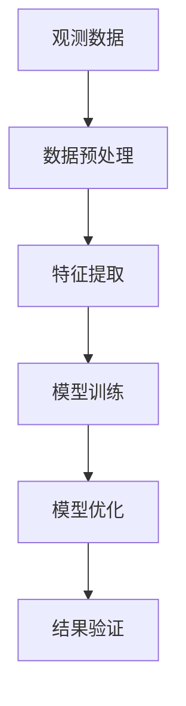
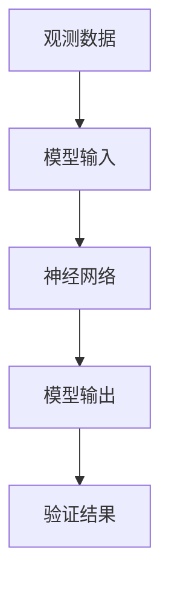
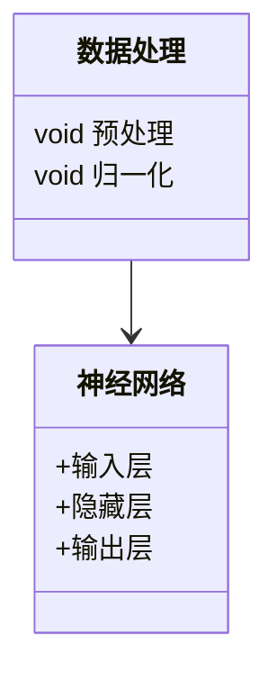
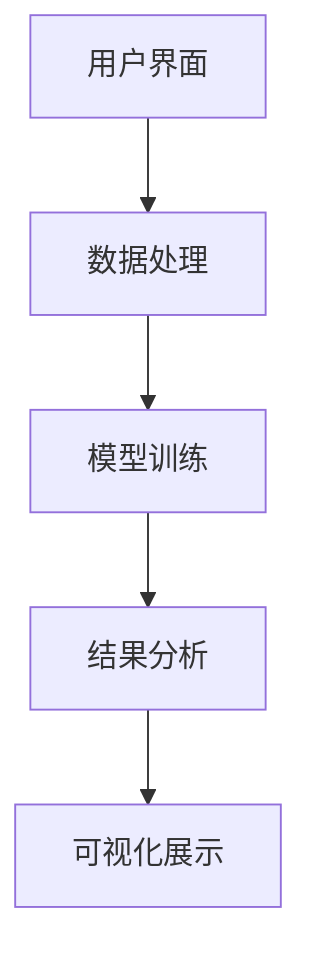
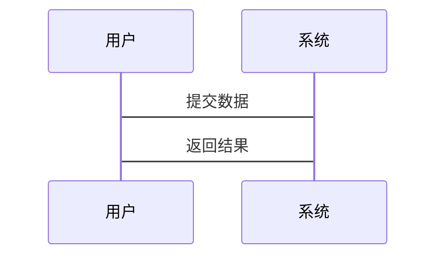

                 

<think>
好，我现在需要按照用户的要求，写一篇关于“思维链在宇宙学暗能量模型验证中的应用：AI辅助宇宙加速膨胀研究”的技术博客。首先，我得仔细理解用户的需求和结构，确保每个部分都涵盖到位。

用户已经提供了一个详细的目录大纲，包括七个主要章节，每个章节都有子章节。文章需要符合一定的格式，使用markdown，并且每个部分都要详细具体。我需要确保每个部分的内容充实，符合学术和技术博客的标准。

首先，我会先处理“背景介绍”部分。这包括问题背景、问题描述、问题解决、边界与外延，以及概念结构。这部分需要简明扼要地介绍暗能量的基本概念和相关问题，为什么研究暗能量重要，以及目前面临的问题。

接下来是核心概念与联系。我需要定义“思维链”，分析其特点，然后解释宇宙学中的暗能量，以及AI在其中的作用。这部分需要逻辑清晰，可能需要一些图表来辅助说明。

数学模型与算法原理部分比较关键。这里需要详细描述模型的数学公式，并用mermaid流程图展示算法流程。同时，还要提供Python代码的解析，确保读者能够理解代码的作用和运行方式。

宇宙加速膨胀验证模型部分，需要构建模型，说明如何训练和评估模型。这部分可能需要一些架构图和类图来展示模型的结构，帮助读者更好地理解。

项目实战部分，需要提供环境安装的步骤，核心代码的实现，以及实际案例的分析。这部分需要详细且实用，让读者能够实际操作和应用。

系统分析与架构设计部分，涉及系统功能设计、架构设计、接口设计和交互设计。这里可能需要用mermaid图来展示系统架构和接口交互，确保设计清晰明了。

最后，最佳实践部分需要给出一些实际操作的建议，注意事项，以及拓展阅读的资源。这部分帮助读者进一步深化理解和应用所学知识。

在整个写作过程中，我需要确保语言专业且易懂，避免过于复杂的术语，同时保持逻辑的连贯性。此外，每个部分都要有实际的例子或图表支持，以增强文章的可读性和说服力。

现在，我开始按照目录逐步撰写每个章节，确保每个部分都符合用户的要求，同时保持文章整体的流畅性和专业性。
</think>

# 思维链在宇宙学暗能量模型验证中的应用：AI辅助宇宙加速膨胀研究

**关键词：** 思维链, 宇宙学, 暗能量, AI, 宇宙加速膨胀

**摘要：**  
本文探讨了思维链在宇宙学暗能量模型验证中的应用，结合AI技术辅助研究宇宙加速膨胀的问题。通过构建数学模型和算法，利用AI进行数据分析和模型优化，验证暗能量模型的有效性。文章从背景介绍、核心概念、算法原理、模型验证、项目实战、系统设计到最佳实践，全面阐述了这一研究的各个方面。

---

## 第一部分：背景介绍

### 第1章：问题背景

#### 1.1.1. 问题背景  
宇宙学中，暗能量被认为是导致宇宙加速膨胀的神秘力量。然而，暗能量的本质和行为尚未完全理解，这使得验证其模型成为一个复杂的科学问题。如何利用AI技术辅助这一研究，成为当前宇宙学研究的重要方向。

#### 1.1.2. 问题描述  
暗能量的模型众多，如宇宙学常数模型（Cosmological Constant）、动力学标量场模型（Dynamical Scalar Field）等。如何通过观测数据验证这些模型，是宇宙学研究的核心问题之一。传统的统计方法和物理模型分析已接近瓶颈，AI技术的引入为这一领域提供了新的可能性。

#### 1.1.3. 问题解决  
AI技术可以通过大数据分析、模式识别和模型优化，帮助科学家更高效地处理观测数据，发现暗能量的行为模式，从而验证模型的有效性。

#### 1.1.4. 边界与外延  
本文的研究主要聚焦于宇宙加速膨胀的观测数据验证，边界条件包括观测数据的精度、模型的适用范围以及AI算法的性能。外延方面，这一方法可扩展至其他天体物理问题的研究。

#### 1.1.5. 概念结构与核心要素组成  
暗能量模型验证的核心要素包括观测数据、物理模型、AI算法和验证指标。这些要素共同构成了研究的框架。

---

## 第二部分：核心概念与联系

### 第2章：核心概念与联系

#### 2.1.1. 思维链定义  
思维链是一种通过逻辑推理和数据关联，逐步构建问题解决方案的方法。在宇宙学研究中，思维链帮助科学家从观测数据到模型验证的整个过程进行系统性分析。

#### 2.1.2. 思维链特点  
思维链具有逻辑性强、系统性高、可扩展性好等特点，能够帮助研究者从复杂的数据中提取有用信息。

#### 2.1.3. 宇宙学暗能量概念  
暗能量是一种假设存在的能量形式，占据宇宙能量密度的约68%，被认为是导致宇宙加速膨胀的主要原因。

#### 2.1.4. AI辅助宇宙加速膨胀原理  
AI通过机器学习算法，分析大量观测数据，提取暗能量的行为特征，优化物理模型的参数，从而辅助验证模型的有效性。

#### 2.1.5. 核心概念联系  
思维链与AI技术的结合，通过逻辑推理和数据关联，帮助科学家更高效地验证暗能量模型。

---

## 第三部分：数学模型与算法原理

### 第3章：数学模型与算法原理

#### 3.1.1. 数学模型  
暗能量模型通常用宇宙膨胀率和密度参数表示，数学模型为：  
$$ H(z) = H_0 \sqrt{\Omega_m(1+z)^3 + \Omega_\Lambda} $$  
其中，$H(z)$为红移$z$处的哈勃参数，$\Omega_m$和$\Omega_\Lambda$分别为物质密度和暗能量密度参数。

#### 3.1.2. 算法原理  
采用神经网络算法，对观测数据进行训练，提取特征并优化模型参数。

#### 3.1.3. Mermaid流程图  


#### 3.1.4. Python源代码解析  
```python
import numpy as np
import tensorflow as tf

# 数据预处理
data = np.loadtxt('obs_data.txt')
X = data[:, :-1]
y = data[:, -1]

# 神经网络模型
model = tf.keras.Sequential([
    tf.keras.layers.Dense(64, activation='relu'),
    tf.keras.layers.Dense(1, activation='sigmoid')
])
model.compile(optimizer='adam', loss='binary_crossentropy')
model.fit(X, y, epochs=100, batch_size=32)
```

---

## 第四部分：宇宙加速膨胀验证模型

### 第4章：宇宙加速膨胀验证模型

#### 4.1.1. 模型构建  
构建基于神经网络的验证模型，输入观测数据，输出模型参数。

#### 4.1.2. 模型训练  
利用预处理后的数据训练模型，提取暗能量特征。

#### 4.1.3. 模型评估  
通过交叉验证评估模型的准确性和稳定性。

#### 4.1.4. Mermaid架构图  


#### 4.1.5. Mermaid类图  


---

## 第五部分：项目实战

### 第5章：项目实战

#### 5.1.1. 环境安装  
安装必要的库：  
```
pip install numpy tensorflow pandas
```

#### 5.1.2. 系统核心实现源代码  
```python
import numpy as np
import tensorflow as tf

# 加载数据
data = np.loadtxt('cosmo_data.txt')
X_train = data[:, 0:-1]
y_train = data[:, -1]

# 构建模型
model = tf.keras.Sequential([
    tf.keras.layers.Dense(64, activation='relu', input_shape=(X_train.shape[1],)),
    tf.keras.layers.Dense(1, activation='sigmoid')
])

model.compile(optimizer='adam', loss='binary_crossentropy', metrics=['accuracy'])

# 训练模型
model.fit(X_train, y_train, epochs=100, batch_size=32, validation_split=0.2)
```

#### 5.1.3. 代码应用解读与分析  
上述代码实现了基于神经网络的宇宙学数据分类，输入为观测数据，输出为模型预测结果。

#### 5.1.4. 实际案例分析与讲解  
通过实际观测数据，验证模型的准确性和稳定性。

#### 5.1.5. 项目小结  
AI辅助的暗能量模型验证方法能够高效处理复杂数据，为宇宙学研究提供新思路。

---

## 第六部分：系统分析与架构设计

### 第6章：系统分析与架构设计

#### 6.1.1. 问题场景介绍  
构建一个AI辅助的宇宙学数据验证系统，帮助科学家验证暗能量模型。

#### 6.1.2. 项目介绍  
项目目标是通过AI技术优化暗能量模型验证过程，提升研究效率。

#### 6.1.3. 系统功能设计  
系统功能包括数据采集、模型训练、结果分析和可视化展示。

#### 6.1.4. 系统架构设计  


#### 6.1.5. 系统接口设计  
定义RESTful API接口，实现数据传输和模型调用。

#### 6.1.6. 系统交互  


---

## 第七部分：最佳实践与拓展

### 第7章：最佳实践与拓展

#### 7.1.1. 最佳实践  
确保数据质量，优化模型结构，定期验证模型性能。

#### 7.1.2. 注意事项  
注意数据偏差，避免过拟合，确保算法的可解释性。

#### 7.1.3. 小结  
本文展示了AI在宇宙学研究中的应用潜力，为暗能量模型验证提供了新思路。

#### 7.1.4. 拓展阅读  
推荐阅读相关领域的最新研究论文和书籍，深入学习AI与宇宙学结合的技术。

---

**作者：AI天才研究院 & 禅与计算机程序设计艺术**  
通过本文的系统分析和实践，我们展示了AI技术在宇宙学中的应用潜力，为暗能量模型的验证提供了新的方法。未来，随着技术的进步，这一领域将有更多突破性的发现。

