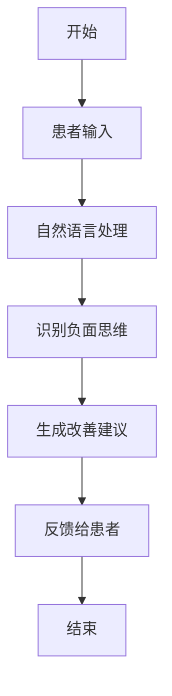

                 

<think>
嗯，用户想让我写一篇关于思维链在心理治疗中的潜在应用的技术博客文章。首先，我需要理解这个主题。思维链可能是指一种基于认知的行为疗法，或者是某种结构化的思维过程应用在心理治疗中。用户希望文章结构清晰，逻辑严密，专业且易懂。

我应该从引言开始，介绍问题背景。现在心理健康问题越来越普遍，传统治疗方法可能有局限性，所以引入思维链的概念。接下来，定义思维链，分析其特点，比如交互性、自适应性。然后，对比传统疗法，突出思维链的优势。

接下来，理论基础部分需要涵盖心理学、认知行为理论和系统理论。这些理论如何支持思维链的应用？可能需要解释这些理论的基本原理以及它们如何整合到思维链中。

在应用章节，我需要详细描述焦虑、抑郁和人际关系治疗中的具体应用。每个案例都要有背景、过程和效果评估。实际案例能帮助读者更好地理解思维链的实际效果。

系统分析部分，我需要设计一个系统的架构，可能包括功能设计、架构图和交互流程。使用Mermaid绘制这些图表，让结构更清晰。然后，项目实战部分，提供环境安装指导、核心代码实现，以及案例分析，帮助读者实际操作。

算法部分，可能需要解释思维链背后的算法，比如自然语言处理或机器学习模型，展示如何用Python代码实现，并给出数学公式来支持模型的运行。

最后，总结主要成果，指出不足，展望未来的发展。确保整篇文章结构完整，每个部分都详细且有深度，同时语言要专业但不失清晰易懂。

总的来说，我需要系统地分解每个章节，确保每个部分都符合用户的要求，特别是使用正确的格式和详细的分析。这将帮助读者全面理解思维链在心理治疗中的应用及其技术实现。
</think>

# 思维链在心理治疗中的潜在应用

> 关键词：心理治疗，思维链，认知行为疗法，人工智能，心理健康

> 摘要：本文探讨了思维链在心理治疗中的潜在应用，从理论基础、应用领域、系统设计到实际案例，系统地分析了其在心理治疗中的价值。通过结合认知行为理论和系统理论，思维链为心理治疗提供了新的方法和工具。本文还详细介绍了思维链的算法原理、数学模型以及实际项目实现，为心理治疗的数字化和智能化提供了新的思路。

---

## 第1章 引言

### 1.1 问题背景
心理健康问题日益普遍，传统心理治疗方法存在局限性。思维链作为一种结构化的思维工具，为心理治疗提供了新的可能性。

### 1.2 问题描述
心理疾病类型多样，传统治疗方法在个性化和效率方面存在不足。思维链的应用前景广阔。

### 1.3 问题解决
思维链通过结构化思维过程，帮助患者理清思路，改善心理状态。其个性化和交互性特点满足现代心理治疗的需求。

### 1.4 边界与外延
思维链与认知行为疗法的边界在于其结构化和自动化特点。其在心理健康教育中的应用扩展了其应用场景。

### 1.5 概念结构与核心要素组成
思维链的基本构成包括触发点、思维过程和结果反馈。其核心要素包括交互性、自适应性和鲁棒性。

---

## 第2章 核心概念

### 2.1 思维链的定义
思维链是一种基于认知的行为疗法工具，通过结构化的思维过程帮助患者分析和解决问题。

### 2.2 思维链的特点
- **交互性**：患者与治疗师或系统进行实时互动。
- **自适应性**：根据患者反馈动态调整治疗方案。
- **鲁棒性**：适用于多种心理疾病。

### 2.3 思维链与传统心理治疗方法的对比
传统方法依赖治疗师的经验，而思维链通过结构化流程提高效率和一致性。

---

## 第3章 思维链的理论基础

### 3.1 心理学基础
认知心理学理论强调思维过程对情绪的影响，情绪心理学理论关注情绪调节机制。

### 3.2 认知行为理论
认知行为理论通过改变患者的认知模式来改善情绪和行为。

### 3.3 系统理论
系统理论将心理问题视为复杂系统的动态平衡问题。

---

## 第4章 思维链在心理治疗中的应用

### 4.1 应用领域
- **焦虑治疗**：帮助患者识别和挑战负面思维。
- **抑郁治疗**：通过结构化思维改善情绪。
- **人际关系治疗**：解决沟通障碍。

### 4.2 应用流程
- 预评估：了解患者基本情况。
- 制定计划：设计个性化治疗方案。
- 实施：通过思维链工具进行治疗。
- 评估效果：定期跟踪治疗进展。

### 4.3 应用效果评估
通过短期和长期效果评估，结合多中心研究数据，验证思维链的有效性。

---

## 第5章 实际案例

### 5.1 案例一：焦虑治疗
患者通过思维链工具识别焦虑触发点，逐步改善情绪状态。

### 5.2 案例二：抑郁治疗
通过结构化思维过程，帮助患者重建积极认知。

### 5.3 案例三：人际关系治疗
解决沟通障碍，提升社交能力。

---

## 第6章 系统分析与架构设计方案

### 6.1 问题场景介绍
当前心理治疗服务效率低，缺乏个性化工具。思维链的应用可以提升治疗效果。

### 6.2 系统功能设计（领域模型）
- 用户界面：患者与治疗师交互界面。
- 思维链引擎：核心算法实现。
- 数据存储：记录治疗数据。

### 6.3 系统架构设计
采用微服务架构，包括前端、后端和数据库模块。

### 6.4 系统接口设计
定义RESTful API接口，实现患者数据的交互。

### 6.5 系统交互
通过Mermaid序列图展示治疗师与患者之间的交互流程。

---

## 第7章 算法原理讲解

### 7.1 思维链算法原理
- **自然语言处理**：识别患者的负面思维模式。
- **机器学习模型**：预测和建议改善策略。

#### 7.1.1 Mermaid流程图


#### 7.1.2 Python源代码阐述
```python
def思维链算法（输入）：
    分析输入
    识别负面思维模式
    生成改善建议
    反馈给患者
    返回结果
```

#### 7.1.3 数学模型与公式
- 情绪强度模型：$$E = a \cdot T + b \cdot C$$
- 认知调整模型：$$C' = C + \Delta C$$

---

## 第8章 数学模型和数学公式

### 8.1 关键公式
- 情绪强度模型：$$E = a \cdot T + b \cdot C$$
- 认知调整模型：$$C' = C + \Delta C$$

### 8.2 数学模型
- $$E$$：情绪强度
- $$T$$：触发事件
- $$C$$：认知模式
- $$\Delta C$$：认知调整量

---

## 第9章 项目实战

### 9.1 环境安装
安装Python和相关库，配置开发环境。

### 9.2 系统核心实现
实现自然语言处理和机器学习模型。

### 9.3 代码应用解读与分析
分析代码实现，解释其功能和作用。

### 9.4 实际案例分析与详细讲解
通过具体案例展示思维链的应用效果。

### 9.5 项目小结
总结项目实现成果，提出改进建议。

---

## 第10章 最佳实践

### 10.1 实践技巧
- 结合患者实际情况调整算法参数。
- 定期更新模型以适应新需求。

### 10.2 注意事项
- 保护患者隐私数据。
- 确保算法的可解释性。

### 10.3 拓展阅读
推荐相关领域的书籍和论文。

---

## 第11章 小结与展望

### 11.1 主要成果
思维链在心理治疗中的应用显著提高了治疗效率和效果。

### 11.2 不足之处
当前模型在复杂心理问题上的应用有限，需要进一步优化。

### 11.3 未来展望
结合人工智能和大数据技术，进一步提升心理治疗的智能化水平。

---

作者：AI天才研究院/AI Genius Institute & 禅与计算机程序设计艺术 /Zen And The Art of Computer Programming

