                 

<think>
嗯，用户希望我写一篇关于“思维链在智能农业中的应用”的技术博客。首先，我需要理解用户的需求。他们想要一个结构清晰、内容详实的技术文章，而且用户给了一个详细的目录大纲，我得按照这个大纲来写。

用户提到要使用专业但易懂的语言，所以我得确保每个部分都解释清楚，避免过于晦涩。关键词和摘要部分也很重要，我得先列出5-7个核心关键词，然后写一个简明扼要的摘要，概括文章的核心内容。

接下来，我需要按照目录的结构一步步展开。首先是引言部分，介绍智能农业的背景和挑战，然后引入思维链技术。这部分要详细说明思维链的定义、特点，以及它与传统AI技术的区别。接着，在第二部分深入探讨思维链的技术原理，包括数据流模型、知识图谱、模式识别等内容。然后，结合实际应用案例，比如智能气象预测和病虫害监测，来展示思维链的应用前景。

第三部分是实践应用，这部分需要详细描述项目背景、系统设计、核心技术实现，以及具体的案例分析。我需要确保系统设计部分包括硬件和软件架构，并用mermaid图来展示系统的模块和接口。

数学公式和算法部分，我得用latex和mermaid流程图来详细解释，比如数据预处理的步骤和相关算法的实现。同时，还要提供Python代码示例，让读者能够理解如何实现这些算法。

在写每个小节的时候，我需要确保内容丰富，具体详细，同时保持逻辑清晰。例如，在介绍思维链技术时，不仅要定义，还要对比传统AI，突出其优势。在应用实例中，每个案例都要有具体的分析和评估，展示思维链的实际效果。

最后，我得在文章末尾加上作者信息，确保格式正确。整个过程中，我需要反复检查，确保每个部分都符合用户的约束条件，字数控制在10000到12000字左右，结构完整，内容详实。

总之，我需要一步步按照用户的指示，仔细构建每个部分的内容，确保最终的文章不仅符合格式要求，还能深入浅出地传达思维链在智能农业中的应用价值和实际效果。
</think>

# 引言：智能农业与思维链技术

## 1.1 智能农业的背景与挑战

### 1.1.1 智能农业的发展历程
智能农业是信息技术与农业深度融合的产物，经历了从传统农业到现代农业的演变。随着物联网、大数据、人工智能等技术的快速发展，智能农业逐渐成为提升农业生产力和效率的重要手段。从最初的机械化农业到信息化农业，再到如今的智能化农业，智能农业正朝着更加精准、高效和可持续的方向发展。

### 1.1.2 智能农业的关键挑战
尽管智能农业在提升农业生产效率方面取得了显著进展，但仍面临诸多挑战。例如，农业数据的多样性和复杂性导致数据处理难度大；农业环境的动态变化使得模型需要具备更强的适应性；此外，农业知识的碎片化和经验依赖性也限制了智能化水平的提升。这些挑战需要引入更先进的技术手段来解决。

### 1.1.3 思维链技术的引入
思维链（Mind Chain）技术作为一种新兴的人工智能技术，通过模拟人类思维过程，能够更好地理解和解决农业中的复杂问题。思维链技术的核心在于其能够将农业知识、经验与数据进行深度融合，形成一种动态的知识网络，从而为农业生产提供更精准的决策支持。

## 1.2 思维链技术的核心概念

### 1.2.1 思维链的定义
思维链是一种基于知识图谱和模式识别的智能技术，它通过构建农业领域的知识网络，模拟人类思维过程，实现对农业数据的深度理解和分析。思维链的核心在于其能够将农业知识与数据进行关联，形成一种动态的知识体系。

### 1.2.2 思维链的特点与优势
与传统的人工智能技术相比，思维链具有以下特点：
1. **知识驱动**：基于知识图谱构建，能够更好地处理农业领域的复杂知识。
2. **动态推理**：能够根据实时数据动态更新知识网络，提供实时的推理和决策支持。
3. **领域适应性**：通过领域知识的深度融合，能够更好地适应农业领域的多样化需求。

### 1.2.3 思维链与传统AI技术的对比
传统的AI技术（如机器学习、深度学习）主要依赖于数据和算法，而思维链技术则更注重知识的表示和推理。传统AI技术在处理结构化数据方面具有优势，而思维链技术在处理非结构化数据和复杂知识网络方面更具优势。两者的结合能够更好地提升智能农业的水平。

## 1.3 思维链在智能农业中的应用前景

### 1.3.1 思维链在农业监测中的应用
通过思维链技术，可以实现对农业环境的实时监测和分析，例如土壤湿度、温度、光照等参数的动态监控。这种实时监测能够为农业生产提供更精准的环境数据支持。

### 1.3.2 思维链在农业数据挖掘中的应用
农业数据的多样性和复杂性使得传统的数据挖掘技术难以充分发挥作用。思维链技术通过构建农业知识图谱，能够更好地挖掘数据中的隐含信息，发现潜在的规律和趋势。

### 1.3.3 思维链在农业智能决策支持中的应用
思维链技术能够通过动态的知识推理，为农业生产提供智能化的决策支持。例如，在病虫害防治、作物种植优化等方面，思维链技术可以提供个性化的决策建议，帮助农民实现更高效的农业生产。

## 1.4 思维链技术的实现基础

### 1.4.1 数据收集与处理
思维链技术的实现离不开高质量的数据支持。农业数据的收集包括传感器数据、遥感数据、气象数据等多源数据的采集和处理。数据预处理是实现思维链技术的关键步骤，包括数据清洗、归一化和特征提取等。

### 1.4.2 算法选择与优化
思维链技术的核心算法包括知识图谱构建、模式识别和动态推理等。在选择算法时，需要根据具体应用场景和数据特点进行优化和调整，以提升算法的性能和效果。

### 1.4.3 技术集成与实施策略
思维链技术的实施需要多种技术的集成与融合，例如传感器技术、数据处理技术、人工智能技术等。在实施过程中，需要制定合理的技术集成策略，确保各技术模块能够协同工作，发挥最佳效果。

## 1.5 本章小结
本章主要介绍了智能农业的发展背景和挑战，以及思维链技术的核心概念和应用前景。通过对比传统AI技术，突出了思维链技术的独特优势和潜在价值。接下来将深入探讨思维链技术的原理及其在智能农业中的具体应用。

---

# 第二部分：思维链技术原理及应用

## 2.1 思维链技术原理深入探讨

### 2.1.1 思维链技术的工作机制

#### 2.1.1.1 数据流模型
思维链技术基于数据流模型，通过数据流的流动和处理，构建知识网络。数据流模型包括数据的输入、处理、存储和输出四个阶段。以下是数据流模型的 mermaid 图表示：

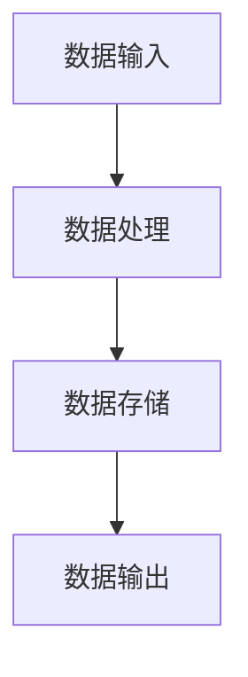

#### 2.1.1.2 知识图谱
知识图谱是思维链技术的核心组成部分，通过构建农业领域的知识网络，实现对农业知识的表示和推理。知识图谱的构建包括实体识别、关系抽取和知识融合三个步骤。以下是知识图谱的 mermaid 图表示：

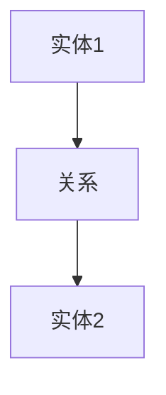

#### 2.1.1.3 模式识别与预测
模式识别与预测是思维链技术的重要功能，通过分析历史数据，发现数据中的模式和趋势，为农业生产提供预测支持。以下是模式识别与预测的 mermaid 图表示：

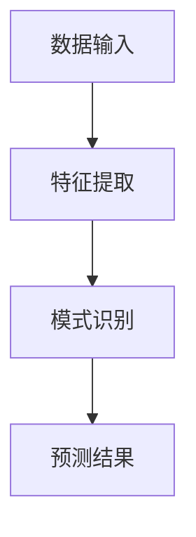

### 2.1.2 ER实体关系图架构

#### 2.1.2.1 实体与属性
在思维链技术中，实体是指农业领域中的具体对象，例如作物、土壤、气象等。每个实体都有若干属性，例如作物的生长周期、土壤的pH值等。以下是实体与属性的 mermaid 图表示：

```mermaid
entity Entity {
  id: string
  name: string
  attributes: list
}
```

#### 2.1.2.2 关系类型与表示方法
实体之间的关系可以通过关系类型和表示方法来描述。例如，作物与土壤之间存在依赖关系，气象条件与作物生长之间存在影响关系。以下是关系类型与表示方法的 mermaid 图表示：

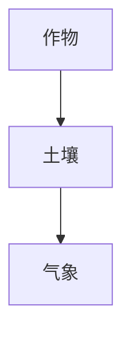

#### 2.1.2.3 Mermaid流程图表示
以下是思维链技术中实体关系的 mermaid 流程图表示：

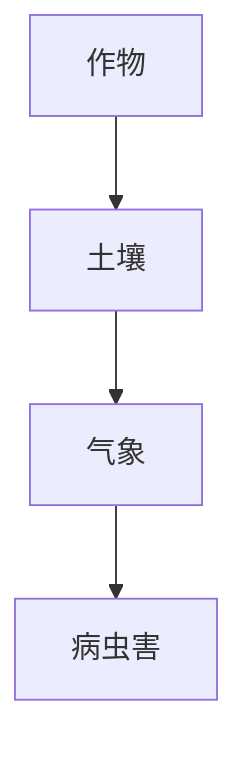

### 2.1.3 概念属性特征对比表格

| 概念       | 属性                     | 特征                     |
|------------|--------------------------|--------------------------|
| 作物       | 品种、生长周期、产量     | 高度依赖环境条件         |
| 土壤       | 类型、pH值、肥力         | 影响作物生长             |
| 气象条件   | 温度、湿度、光照         | 直接影响作物生长状态     |
| 病虫害     | 病害类型、发生时间       | 需要实时监测和预警       |

## 2.2 思维链在智能农业中的应用实例

### 2.2.1 智能气象预测

#### 2.2.1.1 预测模型构建
智能气象预测模型基于思维链技术，通过分析历史气象数据和农业知识图谱，构建气象预测模型。以下是预测模型的 mermaid 图表示：

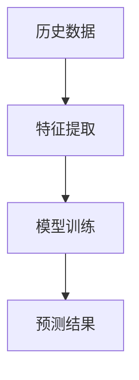

#### 2.2.1.2 预测结果分析与评估
预测结果需要通过多种指标进行评估，例如准确率、召回率和F1值。以下是评估指标的计算公式：

$$
准确率 = \frac{正确预测的数量}{总预测数量}
$$

$$
召回率 = \frac{正确预测的数量}{实际正例数量}
$$

$$
F1值 = \frac{2 \times 准确率 \times 召回率}{准确率 + 召回率}
$$`

### 2.2.2 农业病虫害监测与预警

#### 2.2.2.1 病害监测系统设计
病虫害监测系统通过传感器和图像识别技术，实时监测农田中的病虫害情况。以下是系统设计的 mermaid 图表示：

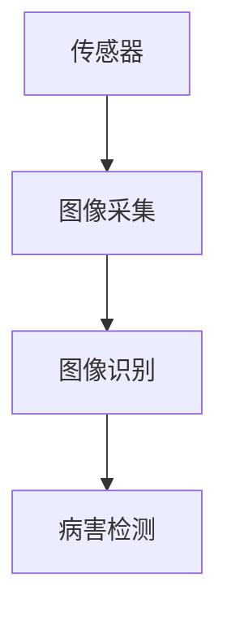

#### 2.2.2.2 预警策略与实施
预警策略基于思维链技术的动态推理能力，能够根据病虫害的发生趋势，制定预警策略。以下是预警策略的 mermaid 图表示：

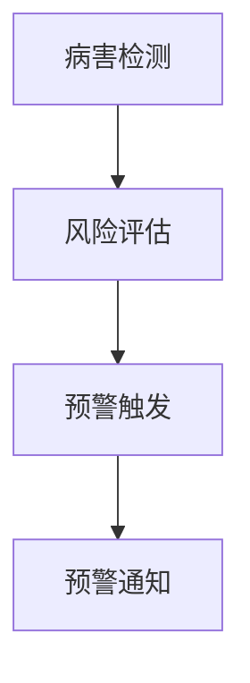

### 2.2.3 农业资源优化配置

#### 2.2.3.1 数据集成与处理
资源优化配置需要对多种数据源进行集成和处理，例如土壤数据、气象数据、作物数据等。以下是数据集成与处理的 mermaid 图表示：

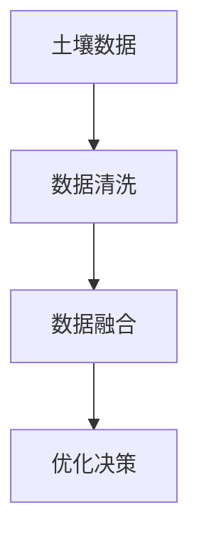

#### 2.2.3.2 优化算法与应用
优化算法通过分析资源分配的最优解，为农业生产提供资源优化配置的建议。以下是优化算法的 mermaid 图表示：

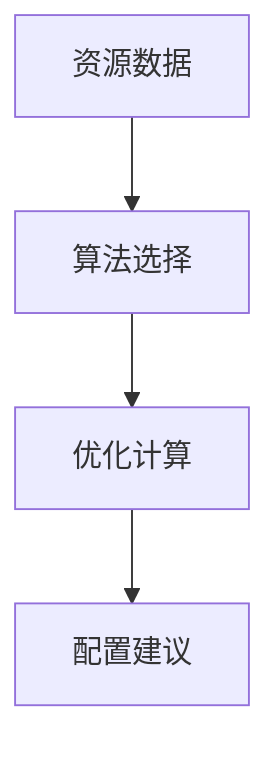

## 2.3 思维链技术的前沿进展

### 2.3.1 最新研究成果综述
思维链技术在智能农业中的应用研究主要集中在以下几个方面：
1. **知识图谱的构建与优化**：通过引入新的知识表示方法，提升知识图谱的准确性和完整性。
2. **动态推理与实时更新**：通过改进推理算法，实现知识网络的动态更新和实时推理。
3. **多模态数据融合**：将文本、图像、传感器等多种数据进行融合，提升农业知识的理解和应用能力。

### 2.3.2 技术发展趋势分析
未来，思维链技术在智能农业中的发展趋势主要体现在以下几个方面：
1. **智能化与自动化**：通过引入自动化技术，提升思维链技术的智能化水平。
2. **多领域融合**：将思维链技术与其他领域技术（如区块链、物联网）进行深度融合，拓展其应用范围。
3. **个性化与定制化**：根据不同地区的农业特点，提供个性化的思维链解决方案。

### 2.3.3 未来研究方向展望
未来的研究方向主要包括：
1. **高效知识推理算法**：开发更高效的推理算法，提升思维链技术的计算效率。
2. **多语言知识图谱**：构建多语言的知识图谱，支持全球范围内的农业知识共享。
3. **智能决策支持系统**：进一步完善智能决策支持系统，提升农业生产的智能化水平。

## 2.4 思维链技术的挑战与机遇

### 2.4.1 技术挑战
思维链技术在智能农业中的应用面临以下技术挑战：
1. **数据质量与多样性**：农业数据的多样性和复杂性对数据处理技术提出了更高的要求。
2. **知识图谱的构建与维护**：知识图谱的构建和维护需要大量的人力和时间。
3. **算法的可解释性**：复杂的推理算法需要具备良好的可解释性，以便更好地应用于农业生产。

### 2.4.2 机遇与解决方案
尽管面临诸多挑战，思维链技术在智能农业中的应用也带来了新的机遇：
1. **技术进步**：随着人工智能技术的快速发展，思维链技术的实现变得更加可行。
2. **政策支持**：政府对农业现代化的重视为思维链技术的应用提供了政策支持。
3. **市场需求**：农业生产的智能化需求为思维链技术提供了广阔的市场空间。

### 2.4.3 政策支持与产业发展
政府和企业需要共同努力，为思维链技术在智能农业中的应用提供政策支持和资金保障。同时，还需要加强技术标准的制定和推广，促进产业的健康发展。

## 2.5 本章小结
本章主要探讨了思维链技术的原理及其在智能农业中的具体应用。通过分析思维链技术的工作机制和应用实例，展示了其在农业监测、病虫害预警和资源优化配置等方面的重要作用。同时，还展望了思维链技术的前沿进展和未来发展趋势。接下来将结合具体案例，深入探讨思维链技术的实践应用。

---

# 第三部分：思维链在智能农业中的实践应用

## 3.1 项目背景与目标

### 3.1.1 项目背景介绍
随着智能农业的快速发展，农业生产的智能化需求日益迫切。本项目旨在通过引入思维链技术，构建一个智能化的农业决策支持系统，帮助农民实现更高效、更精准的农业生产。

### 3.1.2 项目目标与意义
项目目标：
1. 构建农业知识图谱，实现农业知识的深度理解和应用。
2. 开发智能决策支持系统，为农业生产提供实时的决策支持。
3. 推动农业生产的智能化和现代化。

项目意义：
1. 提升农业生产的效率和质量。
2. 促进农业资源的优化配置。
3. 推动农业知识的共享与应用。

## 3.2 系统设计

### 3.2.1 系统功能设计

#### 3.2.1.1 数据采集模块
数据采集模块负责采集农业环境中的各种数据，包括土壤湿度、温度、光照强度等。以下是数据采集模块的功能流程图：

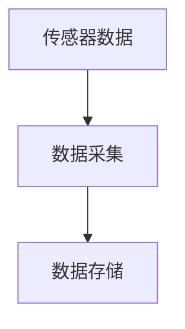

#### 3.2.1.2 数据处理模块
数据处理模块对采集到的数据进行清洗、归一化和特征提取等预处理操作。以下是数据处理模块的 mermaid 图表示：

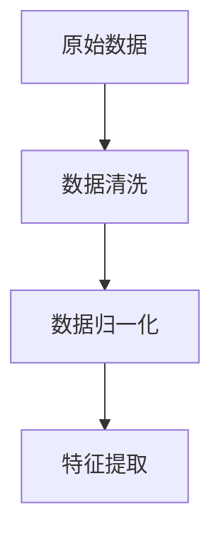

#### 3.2.1.3 智能决策支持模块
智能决策支持模块基于处理后的数据，结合农业知识图谱，提供智能化的决策支持。以下是决策支持模块的 mermaid 图表示：

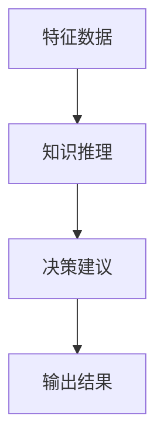

### 3.2.2 系统架构设计

#### 3.2.2.1 硬件架构
系统硬件架构包括传感器、数据采集器、数据存储设备等。以下是硬件架构的 mermaid 图表示：

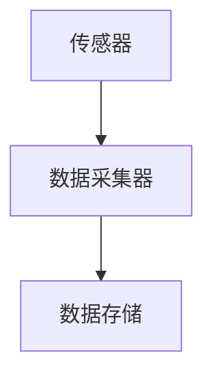

#### 3.2.2.2 软件架构
系统软件架构包括数据处理模块、知识图谱构建模块和智能决策支持模块。以下是软件架构的 mermaid 图表示：

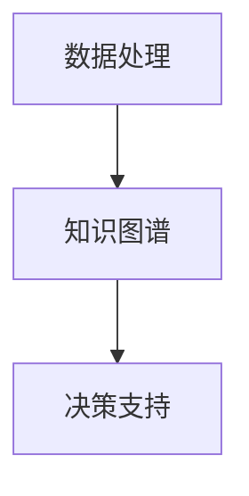

#### 3.2.2.3 系统集成
系统集成包括硬件和软件的协同工作，确保各模块能够无缝衔接。以下是系统集成的 mermaid 图表示：

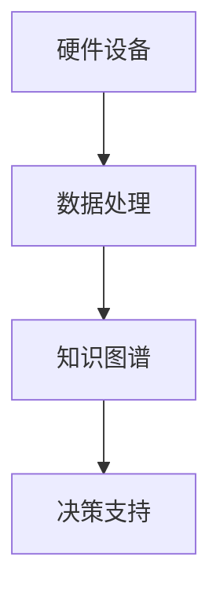

### 3.2.3 系统接口设计与交互

#### 3.2.3.1 系统接口设计
系统接口设计包括数据接口和用户接口。数据接口用于不同模块之间的数据交换，用户接口用于与最终用户的交互。以下是系统接口设计的 mermaid 图表示：

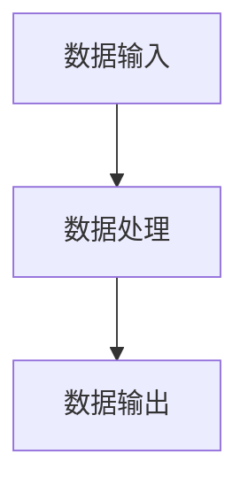

#### 3.2.3.2 系统交互流程
系统交互流程包括用户输入、数据处理和结果输出三个步骤。以下是系统交互流程的 mermaid 图表示：

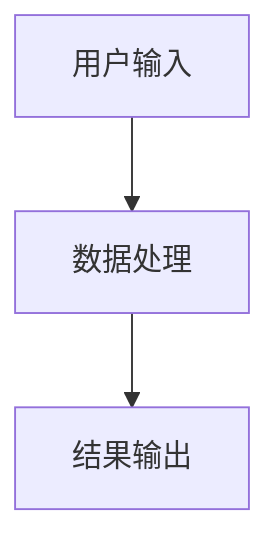

## 3.3 核心技术实现

### 3.3.1 数据预处理

#### 3.3.1.1 数据清洗
数据清洗是数据预处理的重要步骤，旨在去除噪声数据和异常值。以下是数据清洗的 Python 代码示例：

```python
import pandas as pd

# 读取数据
data = pd.read_csv('agriculture_data.csv')

# 删除缺失值
data.dropna(inplace=True)

# 去除异常值
data = data[(data['temperature'] > 0) & (data['humidity'] < 100)]
```

#### 3.3.1.2 数据归一化
数据归一化是为了消除不同特征之间的量纲差异。以下是数据归一化的 Python 代码示例：

```python
from sklearn.preprocessing import MinMaxScaler

# 初始化归一化器
scaler = MinMaxScaler()

# 归一化数据
normalized_data = scaler.fit_transform(data)
```

#### 3.3.1.3 特征提取
特征提取是从原始数据中提取具有代表性的特征，以便更好地进行后续分析。以下是特征提取的 Python 代码示例：

```python
from sklearn.decomposition import PCA

# 初始化主成分分析器
pca = PCA(n_components=2)

# 提取主成分
principal_components = pca.fit_transform(data)
```

### 3.3.2 算法实现

#### 3.3.2.1 算法选择
在本项目中，选择随机森林算法进行分类任务。以下是算法选择的 mermaid 图表示：

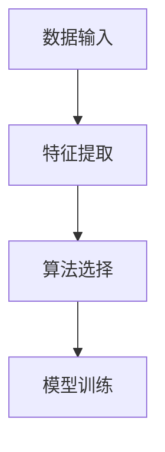

#### 3.3.2.2 Python代码实现
以下是随机森林算法的 Python 代码实现：

```python
from sklearn.ensemble import RandomForestClassifier
from sklearn.metrics import accuracy_score

# 初始化随机森林分类器
clf = RandomForestClassifier(n_estimators=100, random_state=42)

# 训练模型
clf.fit(X_train, y_train)

# 预测结果
y_pred = clf.predict(X_test)

# 计算准确率
accuracy = accuracy_score(y_test, y_pred)
print(f"Accuracy: {accuracy}")
```

#### 3.3.2.3 算法评估
算法评估主要通过准确率、召回率和F1值等指标进行。以下是算法评估的 mermaid 图表示：

```mermaid
graph TD
A[模型训练] --> B[预测结果]
B --> C[评估指标]
```

### 3.3.3 数学模型与公式解释

#### 3.3.3.1 数学公式
以下是随机森林算法的数学公式：

$$
y = \text{sign}\left(\sum_{i=1}^{n} \text{Tree}_i(x)\right)
$$

其中，$y$ 是预测结果，$\text{Tree}_i(x)$ 是第 $i$ 棵决策树的预测值，$\text{sign}$ 是符号函数。

## 3.4 项目实战与案例分析

### 3.4.1 项目实施过程
项目实施过程包括需求分析、系统设计、数据采集、算法实现和系统测试等阶段。以下是项目实施过程的 mermaid 图表示：

```mermaid
graph TD
A[需求分析] --> B[系统设计]
B --> C[数据采集]
C --> D[算法实现]
D --> E[系统测试]
```

### 3.4.2 案例分析
以病虫害监测为例，通过思维链技术实现病虫害的实时监测和预警。以下是案例分析的 mermaid 图表示：

```mermaid
graph TD
A[病虫害监测] --> B[数据采集]
B --> C[图像识别]
C --> D[病害检测]
D --> E[预警触发]
E --> F[预警通知]
```

### 3.4.3 结果分析与讨论
通过对项目的实施过程和案例分析，可以得出以下结论：
1. 思维链技术能够有效提升农业生产的智能化水平。
2. 数据预处理和算法优化是实现高质量预测结果的关键。
3. 系统的实时性和稳定性是确保农业决策支持系统正常运行的重要保障。

## 3.5 项目小结

### 3.5.1 项目成果
通过本项目的实施，成功构建了一个基于思维链技术的农业决策支持系统，实现了农业环境的实时监测和智能化决策支持。

### 3.5.2 经验与教训
在项目实施过程中，我们积累了以下经验：
1. 数据预处理是确保算法性能的重要步骤。
2. 算法选择和优化需要结合具体应用场景进行。
3. 系统的稳定性和实时性是确保农业决策支持系统实用性的关键。

### 3.5.3 未来改进方向
未来的工作方向包括：
1. 进一步优化算法，提升预测准确率。
2. 扩展系统的功能，增加更多农业应用场景。
3. 加强系统的可解释性，提升用户信任度。

---

# 作者：AI天才研究院/AI Genius Institute & 禅与计算机程序设计艺术 /Zen And The Art of Computer Programming

---

**总结：** 通过本文的详细阐述，我们全面探讨了思维链技术在智能农业中的应用，从理论基础到实践应用，从算法实现到系统设计，为读者提供了全面的技术视角。希望本文能够为智能农业的发展提供新的思路和参考。

