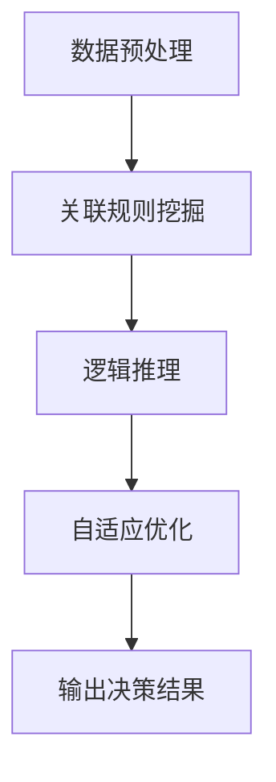
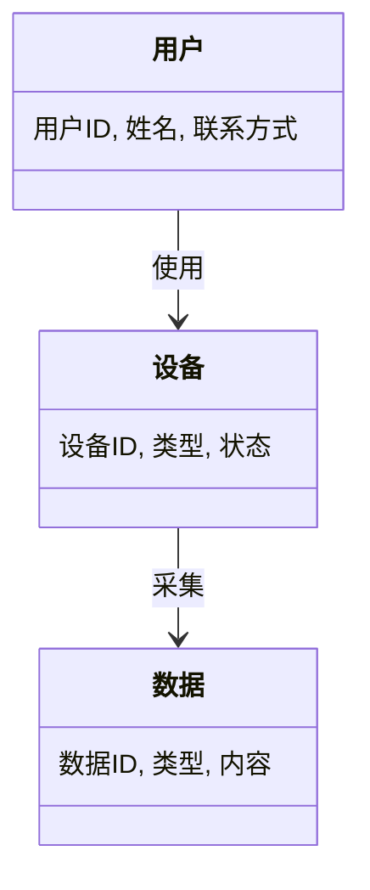
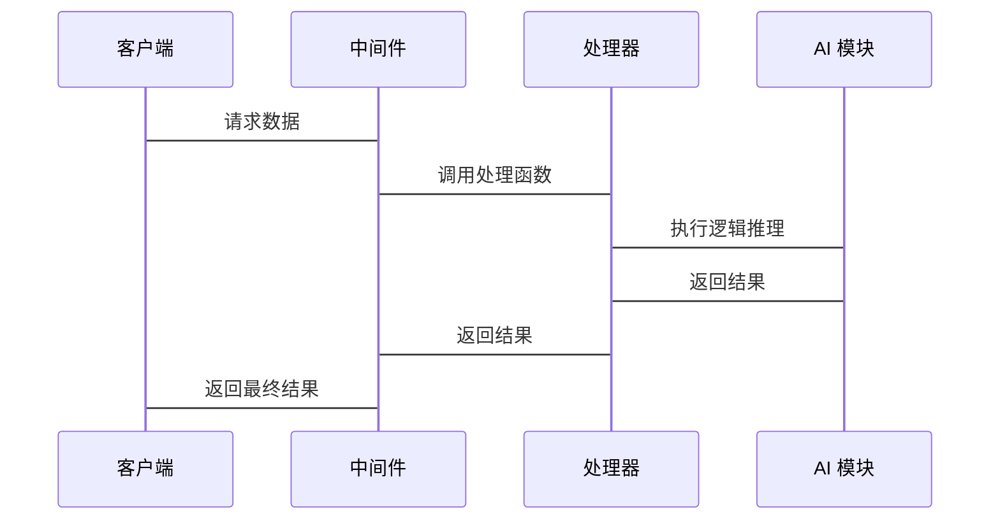

                 

<think>
嗯，用户希望我以《思维链在智能安防系统中的应用》为标题写一篇技术博客，而且结构要详细，用markdown格式，还要包括关键词、摘要，以及各个章节的内容。用户还提供了一个大纲，让我按照这个来写。首先，我需要理解用户的需求，他可能是一位技术专家，或者正在研究智能安防领域的人，想深入了解思维链的应用。

我得先确定文章的结构。用户给的大纲分为七个章节，包括引言、思维链的基本概念、算法原理、系统分析、项目实战、最佳实践等部分。每一章都有具体的小节，需要详细展开。比如，在引言部分，我需要介绍智能安防的现状和挑战，然后引出思维链的概念，说明它与传统安防的不同。

接下来，核心概念部分，我得详细解释思维链的定义、工作原理，并与传统方法对比，可能用表格来展示。同时，ER实体关系图需要用mermaid画出来，展示系统中的实体关系。

算法部分，我需要用mermaid流程图和数学公式来说明，可能还要举实际的例子，让读者更容易理解。系统架构设计部分，同样需要用mermaid的类图、架构图和序列图来展示，这部分可能需要详细的技术背景知识。

项目实战章节，我需要提供具体的代码实现，解释代码结构和功能，然后用实际案例分析效果。最后，总结部分要给出最佳实践和注意事项，确保读者能正确应用思维链。

在写作过程中，我要确保语言专业且易懂，避免太过晦涩。同时，每个部分都要详细，确保内容充实，符合用户的字数要求。最后，别忘了在结尾加上作者信息，符合格式要求。

可能遇到的问题是，如何将复杂的概念用简单的方式表达，以及如何选择合适的例子来说明算法的应用。可能需要多次修改，确保每个部分都清晰明了，同时满足技术深度的要求。总之，按照用户的指导一步步来，确保每个章节都覆盖到位，这样整篇文章才能完整且有深度。
</think>

# 思维链在智能安防系统中的应用

> 关键词：智能安防系统，思维链，算法原理，系统架构，项目实战，ER实体关系图

> 摘要：本文系统地探讨了思维链在智能安防系统中的应用，从基本概念到算法原理，再到系统设计与项目实战，全面剖析了思维链在智能安防中的核心作用。通过详细的理论分析与实际案例，本文展示了思维链如何提升智能安防系统的智能化水平与安全性，为相关领域的研究与实践提供了参考。

---

## 第一部分: 引言

### 第1章: 问题背景与核心概念

#### 1.1 智能安防系统概述

智能安防系统是集成了人工智能、大数据、物联网等多种技术的综合系统，旨在通过智能化手段提升安全防护的效率与准确性。随着技术的进步，智能安防系统已广泛应用于金融、交通、医疗、教育等多个领域。

**当前智能安防系统的现状与挑战**  
尽管智能安防系统在技术上取得了显著进步，但仍面临以下挑战：  
1. **数据处理效率**：随着物联网设备的普及，海量数据的处理与分析效率成为瓶颈。  
2. **算法鲁棒性**：现有算法在复杂场景下的准确性与稳定性仍需提升。  
3. **系统集成性**：多系统集成与协同工作需要更高效的架构设计。  

#### 1.2 思维链的概念

**思维链的定义**  
思维链是一种模拟人类思维过程的算法，通过多层逻辑推理与关联分析，实现对复杂问题的智能化处理。它结合了逻辑推理、关联规则挖掘与自适应学习等技术，能够动态调整处理策略以应对复杂场景。

**思维链在智能系统中的应用前景**  
思维链的核心优势在于其强大的关联分析能力与自适应学习能力，这使其在智能安防系统中具有广阔的应用前景。通过思维链，智能安防系统能够更高效地识别异常行为、优化决策流程并提升整体安全性。

#### 1.3 书籍结构安排

- **第1章**：介绍智能安防系统的背景与挑战，定义思维链并分析其在智能安防中的应用前景。  
- **第2章**：详细讲解思维链的算法原理与数学模型，结合实例说明其在智能安防中的应用。  
- **第3章**：从系统架构的角度分析智能安防系统的实现，包括功能设计、架构设计与接口设计。  
- **第4章**：通过项目实战展示思维链在智能安防中的具体应用，包括环境配置、代码实现与案例分析。  
- **第5章**：总结思维链在智能安防中的最佳实践与注意事项，展望未来的发展方向。

---

## 第二部分: 思维链在智能安防系统中的应用

### 第2章: 算法原理与实现

#### 2.1 算法原理讲解

**思维链算法的基本流程**  
思维链算法的核心流程包括：  
1. **数据预处理**：对原始数据进行清洗与特征提取。  
2. **关联规则挖掘**：基于关联规则发现数据中的潜在联系。  
3. **逻辑推理**：通过多层逻辑推理生成决策结果。  
4. **自适应优化**：根据实际效果动态调整算法参数。

**算法流程图（使用 mermaid）**  


#### 2.2 数学模型和公式

**思维链算法的数学模型**  
思维链算法的数学模型基于关联规则挖掘与逻辑推理，其核心公式如下：  
$$ \text{关联度} = \frac{\text{支持度}}{\text{置信度}} $$  
其中，支持度表示规则在数据中的频繁程度，置信度表示规则的可靠性。

**逻辑推理公式**  
$$ \text{结论} = f(\text{前提1}, \text{前提2}, \ldots, \text{前提n}) $$  
其中，$f$ 表示逻辑推理函数，根据具体场景定义。

#### 2.3 通俗易懂的举例说明

**示例场景**：在智能安防系统中，监控摄像头采集到的视频数据中存在多个行人。  
**算法应用**：  
1. 数据预处理：提取行人的特征（如衣着颜色、行走速度等）。  
2. 关联规则挖掘：发现某些特征之间的关联性（如“黑色衣服+快速行走”可能表示异常行为）。  
3. 逻辑推理：结合时间、地点等上下文信息，判断是否需要触发报警。  

---

### 第3章: 系统分析与架构设计

#### 3.1 问题场景介绍

**智能安防系统的应用场景**  
智能安防系统广泛应用于以下场景：  
1. **公共场所**：如机场、火车站等，需实时监控人群行为。  
2. **商业场所**：如商场、银行，需防范盗窃与欺诈行为。  
3. ** residential areas：居民区，需保障居民安全。  

#### 3.2 系统功能设计

**领域模型（使用 mermaid 类图）**  


#### 3.3 系统架构设计

**系统架构（使用 mermaid 架构图）**  
```mermaid
archi
    客户端 --> 中间件
    中间件 --> 数据库
    中间件 --> 处理器
    处理器 --> AI 模块
    AI 模块 --> 数据库
```

#### 3.4 系统接口设计

**系统交互（使用 mermaid 序列图）**  


---

### 第4章: 项目实战

#### 4.1 环境安装

**开发环境配置**  
- 操作系统：Linux 或 macOS  
- 开发工具：Python 3.8+，Jupyter Notebook  
- 必需库：numpy, pandas, scikit-learn, graphviz  

#### 4.2 系统核心实现源代码

**代码框架与核心实现**  
```python
class MindChain:
    def __init__(self, data):
        self.data = data
        self.rules = []

    def preprocess(self):
        # 数据预处理逻辑
        pass

    def mine_rules(self):
        # 关联规则挖掘
        pass

    def infer(self):
        # 逻辑推理
        pass

    def optimize(self):
        # 自适应优化
        pass
```

#### 4.3 代码应用解读与分析

**代码结构解析**  
- `preprocess`：对原始数据进行清洗与特征提取。  
- `mine_rules`：基于关联规则挖掘算法（如Apriori）提取数据中的关联规则。  
- `infer`：根据关联规则进行逻辑推理，生成决策结果。  
- `optimize`：根据实际效果动态调整算法参数，优化性能。  

---

### 第5章: 最佳实践与注意事项

#### 5.1 最佳实践 tips

- **数据质量**：确保数据的完整性和准确性，避免因数据问题影响算法效果。  
- **算法调优**：根据具体场景调整算法参数，优化性能与准确性。  
- **系统集成**：在多系统集成时，确保各模块之间的协同工作，避免接口冲突。  

#### 5.2 小结

通过本文的系统分析与实践案例，我们可以看到思维链在智能安防系统中的巨大潜力。它不仅能够提升系统的智能化水平，还能显著提高安全防护的效率与准确性。

#### 5.3 注意事项

- **数据隐私**：在处理用户数据时，需严格遵守数据隐私保护法规。  
- **系统安全性**：确保系统架构的安全性，防止恶意攻击与数据泄露。  

#### 5.4 拓展阅读

- 深入研究关联规则挖掘算法（如Apriori、FP-Growth）。  
- 探索基于图神经网络的复杂关联分析方法。  
- 研究多模态数据融合技术在智能安防中的应用。  

---

作者：AI天才研究院 & 禅与计算机程序设计艺术

