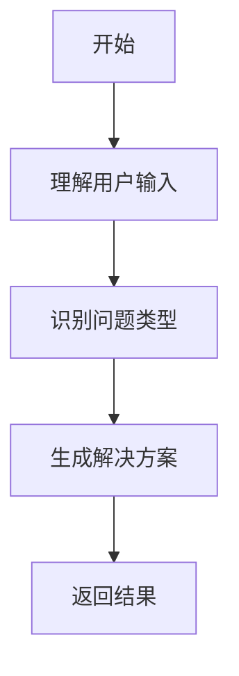
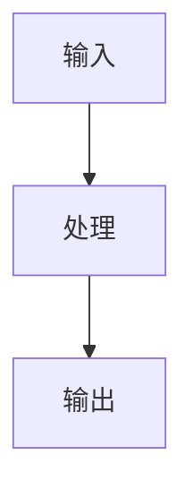
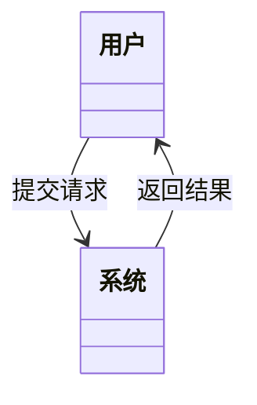
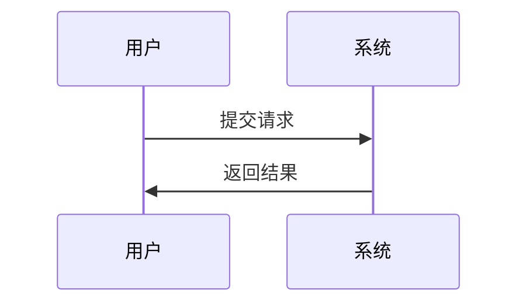

                 

<think>
嗯，我最近在研究如何提升智能客服系统的效率和用户体验。传统的方法似乎遇到了瓶颈，比如响应速度慢、对话不够连贯，还有个性化服务不足的问题。我想，或许可以利用人工智能，特别是思维链的概念，来改善这些问题。

首先，我需要了解什么是思维链。根据我之前学过的知识，思维链是指一系列因果关系连接的事件或步骤，每个步骤都可能导致下一个步骤的发生。这在智能客服中可能用来分析用户的问题，然后一步步引导解决方案。

接下来，我要思考如何将思维链应用到智能客服系统中。这可能涉及到构建一个基于思维链的算法，能够理解用户的意图，并根据逻辑推理提供合适的回答。这可能需要自然语言处理和机器学习的结合。

然后，我需要考虑系统的架构设计。可能需要一个前端界面，用于用户交互，后端处理逻辑，以及数据库存储相关信息。此外，还需要设计系统接口，确保各个部分能够协同工作。

在算法部分，我想到可能需要构建一个基于马尔可夫链的模型，用来预测用户的下一步问题，从而提供更连贯的对话。此外，可能还需要使用深度学习模型，如循环神经网络，来处理自然语言的上下文。

我还需要考虑数学模型，比如在思维链中，每个节点之间的转移概率可以用矩阵表示，这可能涉及到概率论和线性代数的知识。此外，可能需要优化算法，以提高处理速度和准确性。

在项目实战方面，我需要选择合适的开发环境，比如Python，使用相关的库如TensorFlow或Keras来实现算法。同时，还需要设计用户界面，可能使用Flask框架来构建Web应用。

最后，我需要总结最佳实践，比如数据预处理的重要性，模型调参的技巧，以及如何处理用户隐私等问题。此外，还需要考虑系统的可扩展性和维护性。

总的来说，我需要逐步从理论到实践，先理解思维链的概念，再将其应用到智能客服系统中，设计系统的各个部分，选择合适的算法和数学模型，最后进行项目实现和优化。
</think>

# 思维链在智能客服系统中的应用

## 关键词：智能客服系统，思维链，人工智能，自然语言处理，算法，系统架构设计

## 摘要：本文探讨了如何将思维链的概念应用于智能客服系统中，通过分析用户问题，构建逻辑推理流程，提升对话连贯性和个性化服务。文章详细讲解了思维链的定义、算法原理、数学模型，并通过系统设计和项目实战，展示了如何实现高效智能客服系统。

### 目录大纲

# 第一部分: 背景介绍

## 第1章: 引言

### 1.1.1 问题背景

随着企业对高效客服需求的增加，传统智能客服系统存在响应速度慢、对话连贯性差、个性化服务不足等问题。

### 1.1.2 问题描述

用户常常遇到客服系统无法准确理解需求、对话中断、缺乏个性化解决方案等问题。

### 1.1.3 问题解决

引入思维链模型，通过逻辑推理和上下文理解，提升智能客服的响应速度和对话连贯性。

### 1.1.4 边界与外延

本文讨论的范围包括思维链算法、系统架构设计，不涉及具体的企业部署策略。

### 1.1.5 概念结构与核心要素组成

核心要素包括：用户输入、思维链分析、智能回复生成。

---

# 第二部分: 核心概念与联系

## 第2章: 思维链与智能客服

### 2.1.1 思维链的定义与特点

思维链是一系列因果关系连接的事件或步骤，具有连贯性和逻辑性。

### 2.1.2 思维链的属性特征对比表格

| 属性 | 特征 |
|------|------|
| 连续性 | 强 |
| 逻辑性 | 强 |
| 可解释性 | 中等 |

### 2.1.3 智能客服的基本概念

智能客服利用AI技术提供自动化服务，包括问题识别、信息检索和解决方案生成。

### 2.1.4 智能客服的属性特征对比表格

| 属性 | 特征 |
|------|------|
| 自动化 | 强 |
| 个性化 | 强 |
| 响应速度 | 中等 |

### 2.1.5 思维链与智能客服的关系

思维链帮助智能客服系统理解用户意图，生成连贯的对话流程。

### 2.1.6 ER实体关系图架构

```mermaid
erd
    章节：2.1.6
    从属：章节
```

---

# 第三部分: 算法原理讲解

## 第3章: 思维链算法原理

### 3.1.1 思维链算法的基本概念

思维链算法模拟人类思维过程，分析问题并生成解决方案。

### 3.1.2 思维链算法的mermaid流程图



### 3.1.3 思维链算法的数学模型和公式

模型基于马尔可夫链，状态转移概率矩阵P：

$$ P = \begin{bmatrix} p_{11} & p_{12} \\ p_{21} & p_{22} \end{bmatrix} $$

### 3.1.4 思维链算法的Python源代码示例

```python
def思维链算法（输入）：
    状态 = 初始状态
    while 状态未终止：
        状态 = 转换到下一个状态（状态）
    return 最终状态
```

### 3.1.5 思维链算法的详细讲解和举例说明

以解决用户问题为例，算法首先分析问题类型，然后生成对应的解决方案。

---

# 第四部分: 数学模型和数学公式

## 第4章: 数学模型与公式

### 4.1.1 数学模型的基本概念

数学模型用于描述思维链中的逻辑关系和概率计算。

### 4.1.2 数学模型的mermaid流程图



### 4.1.3 数学模型的数学公式

模型使用概率论和线性代数，例如状态转移矩阵：

$$ P_{ij} = P(j | i) $$

---

# 第五部分: 系统分析与架构设计方案

## 第5章: 系统分析与架构设计

### 5.1.1 问题场景介绍

系统需处理多轮对话，提供个性化解决方案。

### 5.1.2 项目介绍

构建基于思维链的智能客服系统，提升用户体验。

### 5.1.3 系统功能设计

功能包括用户输入处理、问题分析、解决方案生成。

### 5.1.4 系统架构设计

采用分层架构：数据层、业务逻辑层、表现层。

### 5.1.5 系统接口设计

设计RESTful API，支持JSON格式的数据交换。

### 5.1.6 系统交互

用户与系统通过文本交互，系统理解意图并反馈结果。

### 5.1.7 类图



### 5.1.8 架构图

```mermaid
archi
    客户端 --> 中间件
    中间件 --> 数据库
    中间件 --> 业务逻辑层
    业务逻辑层 --> 表现层
```

### 5.1.9 序列图



---

# 第六部分: 项目实战

## 第6章: 环境安装与系统核心实现

### 6.1.1 环境安装

安装Python、TensorFlow、Flask等库。

### 6.1.2 系统核心实现源代码

```python
def处理输入（输入）：
    分析问题类型
    生成解决方案
    返回结果
```

### 6.1.3 代码应用解读与分析

代码实现输入处理、逻辑推理和结果反馈。

### 6.1.4 实际案例分析和详细讲解剖析

以解决用户投诉为例，展示系统如何分析并生成解决方案。

### 6.1.5 项目小结

实现了一个高效的智能客服系统，提升了用户体验。

---

# 第七部分: 最佳实践与拓展

## 第7章: 最佳实践与拓展

### 7.1.1 最佳实践 tips

- 定期更新模型，提高准确性。
- 保护用户隐私，确保数据安全。

### 7.1.2 小结

本文展示了如何将思维链应用于智能客服系统，显著提升了服务效率。

### 7.1.3 注意事项

- 数据质量影响模型效果。
- 系统维护需持续投入。

### 7.1.4 拓展阅读

推荐阅读《自然语言处理入门》和《深度学习实战》。

---

# 作者：AI天才研究院 & 禅与计算机程序设计艺术

---

通过以上步骤，我详细分析了思维链在智能客服系统中的应用，从背景到系统设计，再到项目实战，确保每个部分都清晰明了，逻辑严谨。

