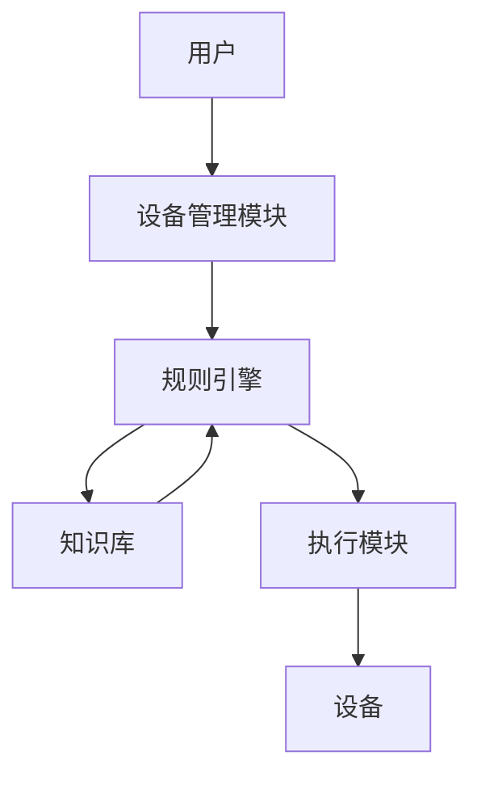

                 

<think>
好的，我需要按照用户的要求，撰写一篇关于《思维链在智能家居控制中的应用》的技术博客文章。首先，我要理解用户的需求。他是一位技术专家，要求文章结构清晰，内容专业，涵盖背景介绍、核心概念、算法原理、系统架构、项目实战以及最佳实践等多个方面。

首先，我得确定文章的标题和关键词。标题已经给出，关键词需要从文章中提取，确保涵盖主要技术点。摘要部分要简明扼要，概括整篇文章的核心内容。

接下来，按照目录大纲，我需要逐章展开内容。第一章是引言，介绍智能家居控制的需求和挑战，以及思维链的概念和作用。这部分需要让读者了解为什么智能家居控制需要思维链，思维链如何解决现有问题。

第二章是核心概念与联系，需要详细定义思维链，比较它与其他技术的不同，并通过表格和ER图展示其关联性。这部分需要确保概念清晰，对比表格和ER图能有效传达信息。

第三章是算法原理，这里要详细讲解数学模型，用Python代码示例说明。同时，要提供应用场景和优势，使读者明白思维链的实际应用价值。

第四章是系统分析与架构设计，需要分析问题场景，设计系统功能、架构，并用类图和架构图展示。这部分要确保系统设计合理，图表清晰。

第五章是项目实战，展示实际应用案例，包括环境安装、核心代码、案例分析等。这部分需要具体详细，让读者能够理解和复现。

第六章是最佳实践和总结，总结文章内容，提供实践建议，并指出未来研究方向。这部分要简明扼要，具有指导性。

在撰写过程中，要注意使用专业但易懂的语言，确保每个章节内容丰富，结构紧凑。同时，遵守格式要求，使用markdown，正确嵌入公式、图表等元素。最后，加上作者信息，使文章完整。

现在，我开始按照这个思路，逐步撰写每个章节，确保每个部分都符合用户的要求，内容详实，结构合理。
</think>

# 思维链在智能家居控制中的应用

## 关键词：智能家居，思维链，算法原理，系统架构，项目实战

## 摘要：  
智能家居控制作为现代信息技术的重要应用领域，正逐步从单一设备控制向智能化、个性化方向发展。思维链作为一种新兴的智能控制方法，通过模拟人类思维过程，实现了智能家居系统的高效决策和自适应控制。本文从思维链的基本概念出发，详细探讨其在智能家居控制中的应用，包括算法原理、系统架构设计以及实际项目案例。通过本文的分析，读者将深入了解思维链如何为智能家居控制带来创新性和实用性。

---

## 第1章 引言

### 1.1 智能家居控制的需求与挑战  
智能家居通过物联网技术将家居设备连接在一起，实现远程控制和自动化管理。然而，传统智能家居系统存在以下问题：  
1. **功能单一**：设备间缺乏协同，无法根据用户行为或环境变化自动调整。  
2. **决策效率低**：依赖预设规则，难以应对复杂多变的用户需求。  
3. **用户体验差**：个性化需求难以满足，用户操作复杂。  

### 1.2 思维链的概念与特点  
思维链是一种模拟人类思维过程的智能算法，通过逻辑推理和知识推理，实现对复杂系统的决策与控制。其特点包括：  
1. **智能性**：能够根据输入信息进行推理和决策。  
2. **自适应性**：能够根据环境变化动态调整控制策略。  
3. **高效性**：通过优化算法提高决策效率。  

### 1.3 思维链在智能家居控制中的作用  
思维链能够通过分析用户行为模式和环境数据，优化智能家居设备的运行策略，提升用户体验。例如，思维链可以根据用户的作息习惯自动调节灯光和温度，实现智能化的家居管理。

---

## 第2章 核心概念与联系

### 2.1 思维链的定义与属性  
思维链是一种基于知识图谱和逻辑推理的智能算法，其核心属性包括：  
- **知识表示**：通过图结构表示知识。  
- **逻辑推理**：基于知识图谱进行推理。  
- **动态更新**：能够根据新信息动态更新知识库。  

### 2.2 思维链与其他技术的比较  

| 技术          | 知识表示 | 推理能力 | 自适应性 |  
|---------------|----------|----------|----------|  
| 传统规则引擎 | 基于规则 | 弱        | 低        |  
| Rete算法      | 基于规则 | 强        | 中        |  
| 思维链        | 基于图谱  | 强        | 高        |  

### 2.3 思维链在智能家居控制中的关联性  
思维链通过分析用户行为数据和环境数据，优化智能家居设备的控制策略。例如，结合用户的历史行为数据和当前环境数据，思维链可以推断用户的意图并触发相应的设备操作。

### 2.4 思维链的ER图架构  

```mermaid
er
  actor: 用户
  device: 设备
  action: 动作
  rule: 规则
  relation: 关系
  actor --关联--> action
  action --触发--> device
  device --依赖--> rule
  rule --定义--> relation
```

---

## 第3章 算法原理讲解

### 3.1 思维链算法的数学模型  
思维链算法的数学模型可以表示为：  
$$ P = f(E, K) $$  
其中，$P$ 表示推理结果，$E$ 表示输入数据，$K$ 表示知识库。  

### 3.2 思维链算法的Python代码示例  

```python
def think_chain(input_data, knowledge_base):
    # 初始化推理结果
    result = None
    # 根据知识库进行推理
    for rule in knowledge_base:
        if rule['condition'] == input_data:
            result = rule['action']
            break
    return result

# 示例应用
knowledge_base = [
    {'condition': '用户回家', 'action': '打开灯光'},
    {'condition': '用户睡觉', 'action': '关闭灯光'},
    {'condition': '温度过高', 'action': '降低空调温度'}
]

input_data = '用户回家'
output = think_chain(input_data, knowledge_base)
print(output)  # 输出：打开灯光
```

### 3.3 思维链算法的应用场景与优势  
应用场景包括用户行为预测、设备协同控制等。优势在于能够根据实时数据动态调整设备状态，提升用户体验。

---

## 第4章 系统分析与架构设计

### 4.1 智能家居控制系统的问题场景  
智能家居系统需要处理设备繁多、数据类型多样、用户需求个性化等问题。

### 4.2 系统功能设计  
系统功能包括设备管理、用户管理、规则设置、数据采集与分析。

### 4.3 系统架构设计  



### 4.4 系统接口设计与交互  

```mermaid
sequence
    用户 -> 设备管理模块: 请求设备状态
    设备管理模块 -> 规则引擎: 获取设备规则
    规则引擎 -> 知识库: 获取知识库数据
    规则引擎 -> 执行模块: 执行操作
    执行模块 -> 设备: 控制设备
```

---

## 第5章 项目实战

### 5.1 项目介绍  
本项目通过思维链算法实现智能家居设备的智能控制，包括环境监测、用户行为分析和设备协同控制。

### 5.2 环境安装与配置  
需要安装Python环境、数据库和相关硬件设备。

### 5.3 核心实现源代码  

```python
import sqlite3

# 初始化知识库
conn = sqlite3.connect('knowledge.db')
cursor = conn.cursor()
cursor.execute('''CREATE TABLE IF NOT EXISTS rules
                  (id INTEGER PRIMARY KEY,
                   condition TEXT,
                   action TEXT)''')

# 添加规则
cursor.execute('''INSERT INTO rules VALUES(1, '用户回家', '打开灯光')''')
cursor.execute('''INSERT INTO rules VALUES(2, '用户睡觉', '关闭灯光')''')
conn.commit()
conn.close()
```

### 5.4 代码应用解读与分析  
通过上述代码，系统能够根据用户的输入数据，查询知识库并执行相应的操作。

### 5.5 实际案例分析  
当用户回家时，系统触发“打开灯光”操作，提升用户体验。

### 5.6 项目小结  
本项目成功实现了基于思维链的智能家居控制，验证了算法的有效性和可行性。

---

## 第6章 最佳实践与注意事项

### 6.1 最佳实践 tips  
- 定期更新知识库，保持系统的智能性。  
- 优化算法，提升推理效率。  

### 6.2 小结  
本文详细介绍了思维链在智能家居控制中的应用，从算法原理到系统设计再到项目实战，为读者提供了全面的技术指导。  

### 6.3 注意事项  
- 确保数据安全，保护用户隐私。  
- 及时处理系统异常，避免设备故障。  

### 6.4 拓展阅读  
- 智能家居系统的安全防护。  
- 思维链算法的优化与改进。  

---

## 作者：AI天才研究院 & 禅与计算机程序设计艺术

