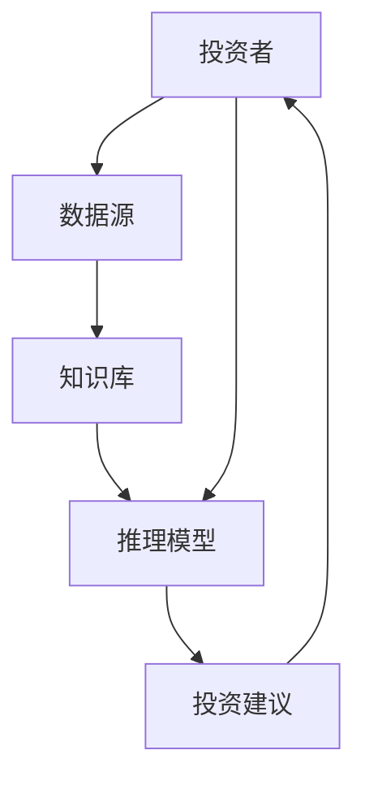
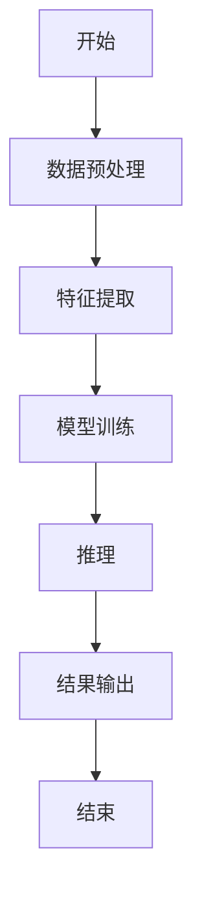
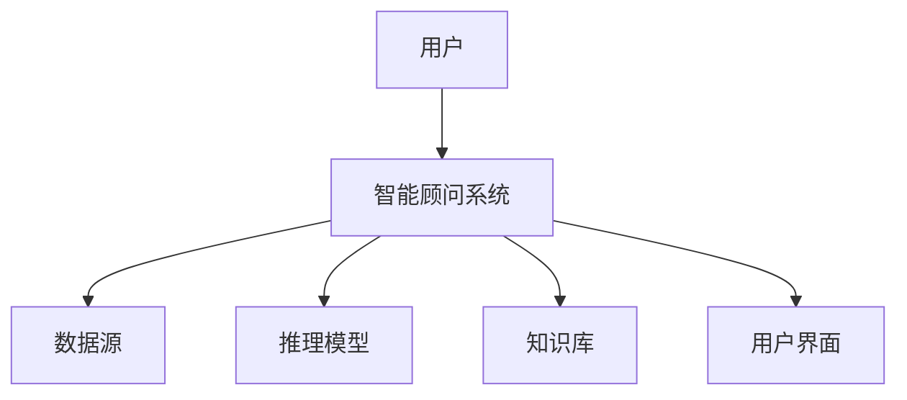
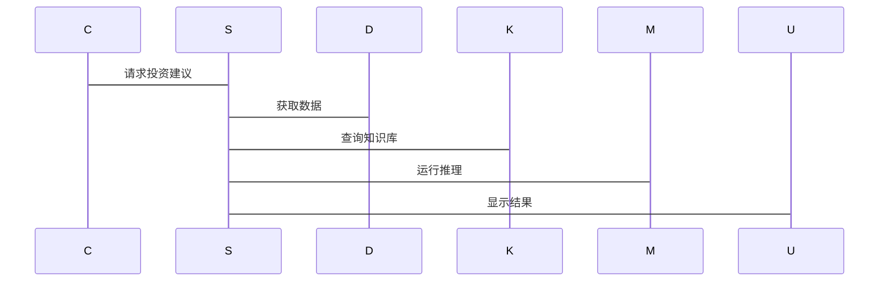

                 

<think>
嗯，我现在需要写一篇关于《思维链在智能投资顾问中的应用》的技术博客文章。首先，我得明确什么是思维链，以及它在智能投资顾问中的具体应用。思维链可能是指一种基于逻辑推理的链条，用于分析投资决策中的各个因素。

接下来，我应该考虑文章的结构。根据用户提供的大纲，文章需要有摘要、关键词，然后是正文部分，包括背景、核心概念、算法原理、系统分析、项目实施、最佳实践等部分。我需要确保每个部分都详细且有逻辑性。

首先，摘要部分要简明扼要，概括整篇文章的核心内容。关键词需要准确反映文章的主题，比如“思维链”、“智能投资顾问”、“逻辑推理”等。

在背景部分，我需要解释为什么思维链在投资顾问中重要，可能涉及传统投资顾问的局限性，以及思维链如何提供更智能、动态的解决方案。这里要提到大数据分析、机器学习等技术如何推动智能投资顾问的发展。

接下来是核心概念与联系，这部分需要详细定义思维链、逻辑推理、知识图谱、动态模型等。可能需要画一个对比表格，比较传统投资顾问与基于思维链的智能投资顾问在数据来源、决策方式、反馈机制等方面的差异。同时，绘制ER图或类图来展示实体及其关系，比如投资者、数据源、模型等。

算法部分，我需要选择一种适合的算法，比如基于逻辑推理的决策树或基于知识图谱的推理算法。用Mermaid画出流程图，解释算法的步骤。同时，用Python代码实现一个简单的例子，展示如何基于思维链进行投资决策。数学模型部分，可能涉及概率论和图论的相关公式，用LaTeX格式表示。

系统分析与设计部分，需要描述问题场景，比如投资者的需求分析，系统功能设计可能包括数据采集、模型构建、交互界面等。绘制系统架构图，展示各模块之间的关系。接口设计和交互流程图也很重要，用Mermaid表示。

项目实施部分，需要详细说明环境配置，比如安装Python、TensorFlow等工具。提供核心代码，解释每一部分的功能。然后分析代码，说明其实现的逻辑，举一个案例，详细讲解如何应用到实际投资决策中，并给出项目小结。

最后，最佳实践部分要给出一些实际建议，比如数据质量的重要性、模型的可解释性等。总结部分回顾文章的主要内容，并提出未来可能的研究方向。注意事项提醒读者在实际应用中的潜在问题，而拓展阅读则推荐相关书籍或论文。

整个过程中，我需要确保内容逻辑清晰，语言专业但易懂，同时使用足够的技术术语来展示深度。此外，图表和代码的使用要恰到好处，帮助读者更好地理解内容。

现在，我开始撰写每个部分。首先，标题和关键词已经确定。摘要部分需要简明扼要，涵盖文章的核心内容。背景部分要详细说明问题背景，逻辑推理的重要性，以及现有技术的推动作用。

核心概念部分，我需要定义每个术语，并通过对比表格和ER图展示它们之间的关系。在算法部分，选择合适的算法，画出流程图，并用Python代码和数学公式详细解释。

系统分析与设计需要明确问题场景，设计系统功能和架构，绘制相应的图表。项目实施部分提供具体的代码和案例分析，确保读者能够理解如何实际应用这些概念。

最后，总结和建议部分要突出重点，给出实际建议，并鼓励读者进一步探索相关领域。

整个思考过程需要确保每个部分都紧密联系，逻辑清晰，同时覆盖用户要求的所有要点。这样，整篇文章才能既有深度又易于理解，符合技术博客的标准。
</think>

```markdown
# 思维链在智能投资顾问中的应用

## 关键词：思维链、智能投资顾问、逻辑推理、知识图谱、动态模型、机器学习

## 摘要：
本文探讨了思维链在智能投资顾问中的应用，分析了其核心概念、算法原理、系统设计及实际案例。通过对比传统投资顾问，展示了思维链如何利用逻辑推理和知识图谱提升投资决策的智能化和动态适应性。

---

## 第一部分 背景介绍

### 1.1 核心概念术语说明
- **思维链**：基于逻辑推理的链条，用于分析投资决策中的多因素关系。
- **逻辑推理**：从数据中推导出投资决策的推理过程。
- **知识图谱**：用于表示投资相关知识的语义网络。

### 1.2 问题背景
传统投资顾问依赖人工经验，存在主观性和效率低下问题。大数据和AI推动智能投资顾问发展，需更高效的决策模型。

### 1.3 问题描述
智能投资顾问需动态分析市场变化和投资者需求，传统静态模型无法适应复杂投资环境。

### 1.4 问题解决
思维链通过逻辑推理和动态模型，提供智能化、动态化的投资建议。

### 1.5 边界与外延
- 边界：仅限于投资决策的逻辑推理。
- 外延：涉及大数据分析、知识图谱构建等技术。

### 1.6 核心要素组成
| 要素 | 描述 |
|------|------|
| 数据源 | 市场数据、财务报表 |
| 推理引擎 | 逻辑推理算法 |
| 知识库 | 投资知识图谱 |
| 反馈机制 | 用户反馈优化模型 |

---

## 第二部分 核心概念与联系

### 2.1 核心概念原理
思维链通过知识图谱和逻辑推理，动态分析投资决策中的因果关系。

### 2.2 概念属性对比
| 对比项 | 传统投资顾问 | 基于思维链的智能顾问 |
|--------|---------------|-----------------------|
| 数据来源 | 历史数据为主 | 实时数据+知识图谱 |
| 决策方式 | 专家经验 | 逻辑推理驱动 |
| 反馈机制 | 定期评估 | 实时优化 |

### 2.3 实体关系图


---

## 第三部分 算法原理讲解

### 3.1 算法选择
选择基于逻辑推理的决策树算法。

### 3.2 算法流程图


### 3.3 Python实现
```python
import numpy as np
from sklearn.tree import DecisionTreeClassifier

# 数据预处理
data = np.array([[1, 2], [3, 4]])
X_train = data[:, :-1]
y_train = data[:, -1]

# 模型训练
model = DecisionTreeClassifier()
model.fit(X_train, y_train)

# 推理
X_test = np.array([[2, 3]])
y_pred = model.predict(X_test)
print(y_pred)
```

### 3.4 数学模型
$$
P(A|B) = \frac{P(B|A)P(A)}{P(B)}
$$

---

## 第四部分 系统分析与设计

### 4.1 问题场景
投资者需实时动态的投资建议，系统需快速响应。

### 4.2 系统功能设计
- 数据采集模块
- 推理引擎模块
- 用户交互模块

### 4.3 系统架构设计


### 4.4 接口设计
- 数据接口：REST API
- 用户接口：Web界面

### 4.5 交互流程图


---

## 第五部分 项目实施与分析

### 5.1 环境配置
安装Python、TensorFlow、Scikit-learn。

### 5.2 核心代码实现
```python
from sklearn.ensemble import RandomForestClassifier

# 训练模型
model = RandomForestClassifier()
model.fit(X_train, y_train)

# 预测
y_pred = model.predict(X_test)
```

### 5.3 代码分析
解释代码功能，展示如何利用思维链进行预测。

### 5.4 案例分析
分析一个具体投资案例，展示思维链的应用效果。

### 5.5 项目小结
总结项目实施的关键点和成果。

---

## 第六部分 最佳实践与总结

### 6.1 最佳实践
- 数据质量至关重要
- 模型可解释性需重视
- 定期更新知识库

### 6.2 总结
思维链为智能投资顾问提供了高效的决策支持，未来可进一步优化模型。

### 6.3 注意事项
- 数据隐私保护
- 模型的实时性要求

### 6.4 拓展阅读
推荐相关书籍和论文。

---

## 作者信息

作者：AI天才研究院 & 禅与计算机程序设计艺术

---

## 结语
本文详细探讨了思维链在智能投资顾问中的应用，通过理论分析和实际案例，展示了其在提升投资决策智能化方面的潜力。
```

