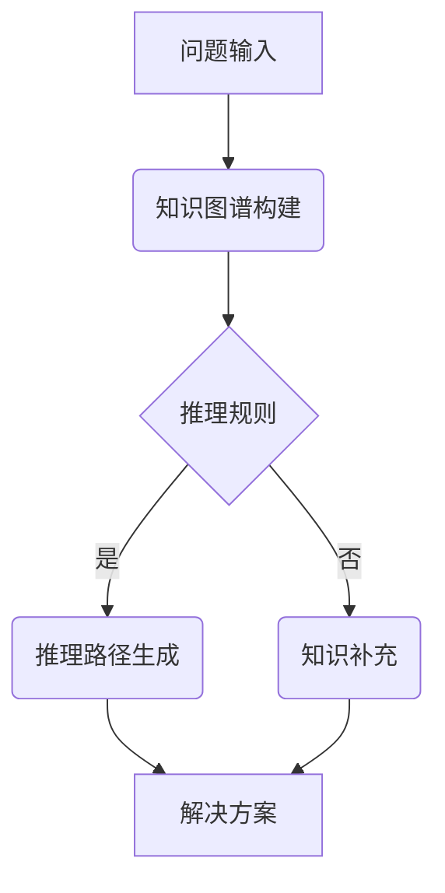
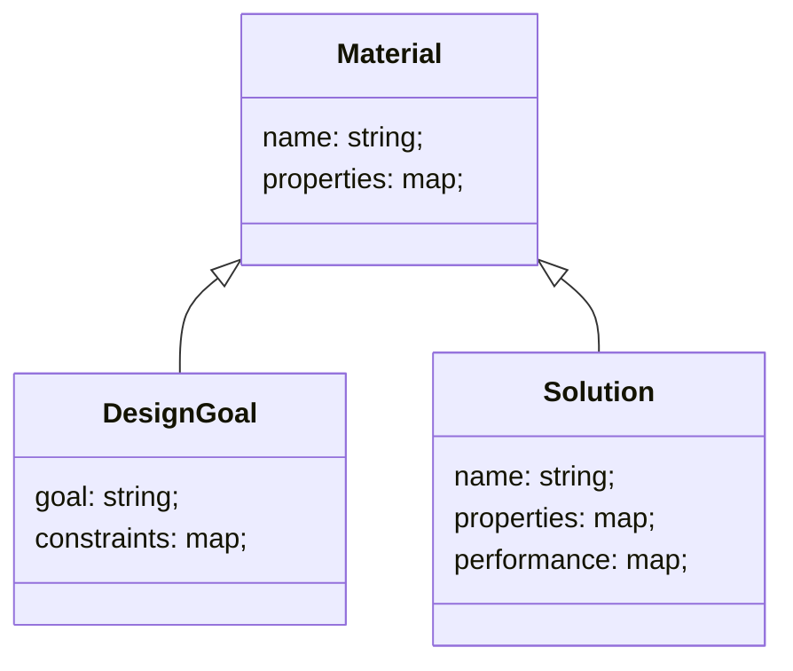
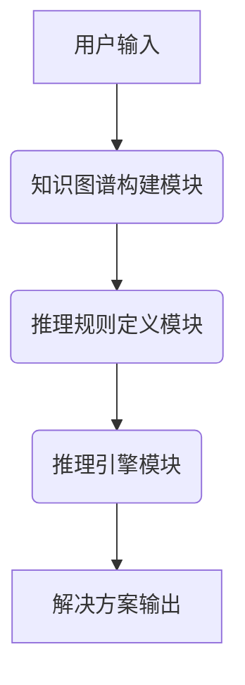
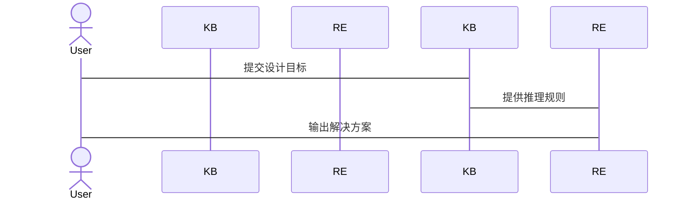

                 

<think>
嗯，我现在需要帮助用户撰写一篇关于《思维链在智能材料设计中的创新应用》的技术博客文章。用户希望我以专家的身份，按照特定的结构和内容要求来完成。

首先，我得理解用户的需求。用户希望文章有详细的结构，包括背景介绍、核心概念、算法原理、系统分析、项目实战、最佳实践等部分。每个部分都需要有详细的子章节，并且要包含具体的示例、图表和代码。

接下来，我要确定文章的关键词和摘要。关键词应该涵盖思维链、智能材料、算法、系统架构、项目实战等。摘要部分需要简明扼要地概括文章的核心内容，强调思维链在智能材料设计中的应用和创新。

然后，开始撰写正文部分。首先是背景介绍，需要涵盖思维链的基本概念和智能材料设计的现状。这部分要详细说明问题背景，挑战以及思维链的应用。我可能需要查找一些资料，确保信息准确。

接下来是核心概念与联系，这部分需要详细讲解思维链与智能材料设计之间的关系。我应该对比传统材料设计，突出思维链的优势。同时，可能需要使用表格或图表来对比分析。

算法原理部分，我需要选择一个具体的算法，比如遗传算法，并展示其在智能材料设计中的应用。使用Mermaid绘制流程图，并用Python代码示例来解释。同时，数学模型和公式要用LaTeX格式呈现，确保清晰易懂。

系统分析与架构设计部分，我需要介绍项目背景，设计一个领域模型的类图，展示各个组件之间的关系。然后，用Mermaid绘制系统架构图和序列图，说明系统的交互过程。

项目实战部分，我需要选择一个实际案例，比如智能高分子材料设计。描述环境配置、核心代码实现，并详细分析案例。同时，给出代码解释，让读者能够理解实现过程。

最后，最佳实践部分，我需要总结关键内容，提供实践建议和注意事项，推荐一些拓展阅读资料，帮助读者深入学习。

在写作过程中，我要确保每个章节内容丰富，结构紧凑，逻辑清晰。同时，语言要专业但易懂，避免过于复杂的术语堆砌。确保每个部分都有实际的应用示例和图表，帮助读者更好地理解。

可能遇到的挑战是如何将思维链的概念与智能材料设计有机结合起来，确保内容有深度又不失可读性。我需要反复推敲每个部分的结构，确保符合用户的高要求。

总的来说，我需要按照用户提供的目录结构，逐步填充内容，确保每个章节都达到要求。同时，注意格式和字数，确保整篇文章结构完整，内容详实。
</think>

# 思维链在智能材料设计中的创新应用

> 关键词：思维链、智能材料设计、算法原理、系统架构、项目实战

> 摘要：本文探讨了思维链在智能材料设计中的创新应用，从背景介绍、核心概念、算法原理、系统架构到项目实战，详细分析了如何利用思维链提升智能材料设计的效率与精度。文章结合实际案例，通过数学模型、流程图和代码实现，展示了思维链在智能材料设计中的具体应用和潜在价值。

---

## 第一部分：思维链基础与智能材料设计背景

### 第1章：思维链概述

#### 1.1 问题背景

##### 1.1.1 智能材料设计的现状与挑战

智能材料是一种能够感知环境变化并作出响应的材料，其应用领域广泛，包括医疗、能源、建筑等。然而，传统材料设计方法依赖于经验与试错，效率低下且成本高昂。随着人工智能（AI）的快速发展，智能材料设计逐渐向数据驱动和智能化方向转型，但仍面临以下挑战：

- **计算复杂性**：智能材料的设计涉及多物理场耦合，计算复杂度高。
- **数据不足**：传统实验数据获取困难，且难以覆盖所有可能的设计场景。
- **设计周期长**：从材料筛选到最终设计，周期长且成本高。

##### 1.1.2 思维链的概念及其在材料设计中的应用

思维链（Thought Chain）是一种基于逻辑推理和知识表示的模型，通过构建知识图谱和推理引擎，实现从问题分析到解决方案的端到端推理。在智能材料设计中，思维链可以用于以下场景：

- **材料筛选与优化**：通过思维链推理，快速筛选出满足特定性能的材料。
- **设计空间探索**：利用思维链推理，探索材料设计的潜在空间。
- **性能预测与优化**：基于思维链推理，预测材料性能并优化其结构。

##### 1.1.3 思维链的基本原理与特点

思维链的核心原理是通过构建知识图谱和推理规则，将材料设计问题转化为知识推理问题。其特点包括：

- **知识驱动**：依赖于领域知识的积累和表示。
- **推理能力**：能够基于已知信息进行推理，发现潜在的设计方案。
- **动态适应性**：能够根据新的数据和需求动态调整推理过程。

##### 1.1.4 智能材料设计的需求与方向

智能材料设计的需求主要集中在以下几个方面：

- **高效性**：减少设计周期，降低试错成本。
- **精准性**：提高材料性能预测的准确性。
- **创新性**：探索新的材料结构和性能。

未来的发展方向包括：

- **多模态数据融合**：结合实验数据、计算数据和文献数据，提升设计效率。
- **人机协作**：实现人类专家与AI系统的协同设计。
- **可持续性**：设计环境友好型材料，助力可持续发展。

#### 1.2 思维链的基本原理与特点

##### 1.2.1 思维链的定义

思维链是一种基于逻辑推理和知识表示的模型，通过构建知识图谱和推理规则，实现从问题分析到解决方案的端到端推理。

##### 1.2.2 思维链的构建方法

1. **知识图谱构建**：将领域知识表示为图结构，节点表示概念，边表示关系。
2. **推理规则定义**：基于知识图谱，定义推理规则，指导思维链的运行。
3. **推理引擎实现**：通过推理引擎，将问题输入转化为推理路径，输出解决方案。

##### 1.2.3 思维链的优势与局限性

**优势**：

- **高效性**：通过知识推理，快速找到最优解决方案。
- **可解释性**：推理过程清晰，便于理解和优化。
- **可扩展性**：支持领域知识的动态扩展。

**局限性**：

- **依赖知识完整性**：推理效果依赖于知识图谱的完整性和准确性。
- **计算复杂性**：大规模推理可能需要高性能计算支持。

#### 1.3 智能材料设计的需求与方向

##### 1.3.1 智能材料设计的需求分析

智能材料设计需要满足以下需求：

- **高效性**：快速筛选和优化材料。
- **精准性**：准确预测材料性能。
- **创新性**：探索新的材料结构和性能。

##### 1.3.2 智能材料设计的发展趋势

未来，智能材料设计将朝着以下方向发展：

- **多模态数据融合**：结合实验数据、计算数据和文献数据。
- **人机协作**：实现人类专家与AI系统的协同设计。
- **可持续性**：设计环境友好型材料。

##### 1.3.3 思维链在智能材料设计中的潜在应用

思维链可以用于以下场景：

- **材料筛选与优化**：快速筛选满足特定性能的材料。
- **设计空间探索**：探索材料设计的潜在空间。
- **性能预测与优化**：预测材料性能并优化其结构。

#### 1.4 本章小结

本章介绍了思维链的基本概念和原理，并分析了智能材料设计的现状与挑战。通过对比传统材料设计方法与思维链的优势，展示了思维链在智能材料设计中的潜在价值。

---

## 第二部分：核心概念与联系

### 第2章：智能材料设计中的核心概念

#### 2.1 智能材料的基本概念

##### 2.1.1 智能材料的定义

智能材料是指能够感知环境变化并作出响应的材料，其响应机制基于材料的物理、化学或生物特性。

##### 2.1.2 智能材料的分类

智能材料主要分为以下几类：

- **形状记忆材料**：在外界刺激下恢复原始形状。
- **压电材料**：将机械能转化为电能。
- **磁性材料**：对外磁场变化作出响应。
- **响应性高分子材料**：通过化学反应对外界刺激作出响应。

##### 2.1.3 智能材料的关键属性

智能材料的关键属性包括：

- **响应性**：对外界刺激的敏感性。
- **可逆性**：响应后能够恢复原始状态。
- **稳定性**：在长期使用中保持性能稳定。

#### 2.2 思维链与智能材料设计的联系

##### 2.2.1 思维链在智能材料设计中的角色

思维链在智能材料设计中的角色可以分为以下几个方面：

1. **知识整合**：将分散的领域知识整合为知识图谱。
2. **推理与优化**：通过逻辑推理，优化材料设计方案。
3. **预测与验证**：基于推理结果，预测材料性能并进行实验验证。

##### 2.2.2 思维链对智能材料设计的影响

思维链对智能材料设计的影响主要体现在以下几个方面：

- **提高设计效率**：通过知识推理快速筛选和优化材料。
- **降低试错成本**：减少实验次数，降低研发成本。
- **促进创新**：探索新的材料结构和性能。

##### 2.2.3 思维链与智能材料设计的关键环节

思维链与智能材料设计的关键环节包括：

1. **需求分析**：明确设计目标和约束条件。
2. **知识表示**：构建领域知识图谱。
3. **推理与优化**：通过思维链推理优化设计方案。
4. **实验验证**：根据推理结果进行实验验证。

#### 2.3 核心概念对比分析

##### 2.3.1 思维链与人工智能的关系

思维链是一种基于知识表示和逻辑推理的人工智能技术，属于AI的子领域。与传统AI相比，思维链更注重知识的组织和推理过程。

##### 2.3.2 思维链与传统材料设计的区别

传统材料设计依赖经验与试错，而思维链通过知识推理和数据驱动实现智能化设计。

##### 2.3.3 智能材料设计中的关键要素

智能材料设计的关键要素包括：

- **材料性能**：材料的物理、化学性质。
- **设计目标**：材料需要满足的功能需求。
- **实验数据**：实验结果与模拟数据。

#### 2.4 本章小结

本章分析了智能材料和思维链的核心概念，并探讨了两者之间的联系。通过对比分析，展示了思维链在智能材料设计中的独特优势。

---

## 第三部分：算法原理讲解

### 第3章：思维链算法在智能材料设计中的应用

#### 3.1 思维链算法概述

##### 3.1.1 思维链算法的定义

思维链算法是一种基于知识图谱和逻辑推理的算法，用于解决复杂领域问题。

##### 3.1.2 思维链算法的基本原理

1. **知识图谱构建**：将领域知识表示为图结构。
2. **推理规则定义**：基于知识图谱，定义推理规则。
3. **推理引擎实现**：通过推理引擎，将问题输入转化为推理路径。

##### 3.1.3 思维链算法的类型

- **基于规则的推理**：通过预定义的推理规则进行推理。
- **基于图的推理**：通过知识图谱的遍历进行推理。
- **混合式推理**：结合规则和图的推理方法。

#### 3.2 数学模型与公式

##### 3.2.1 基本数学模型

材料性能预测的数学模型可以表示为：

$$
P = f(x_1, x_2, ..., x_n)
$$

其中，$P$ 是材料性能，$x_i$ 是材料的属性或参数。

##### 3.2.2 公式推导

通过优化算法，可以得到材料的最优设计参数：

$$
\theta^* = \arg \min_{\theta} \sum_{i=1}^{n} (P_i - f(\theta))^2
$$

##### 3.2.3 公式应用示例

假设我们需要优化材料的强度，可以通过以下公式进行预测：

$$
\sigma = a x_1 + b x_2 + c x_3
$$

其中，$\sigma$ 是材料强度，$x_1, x_2, x_3$ 是材料参数，$a, b, c$ 是系数。

#### 3.3 Mermaid流程图示例



#### 3.4 算法原理详细讲解

##### 3.4.1 思维链算法的数学模型

通过构建知识图谱，可以将材料设计问题转化为图结构问题。例如，假设我们需要设计一种高分子材料，可以通过以下步骤进行：

1. **知识图谱构建**：将高分子材料的组成、结构、性能等知识表示为图结构。
2. **推理规则定义**：定义推理规则，例如“材料性能由组成和结构决定”。
3. **推理引擎实现**：通过推理引擎，将设计目标转化为推理路径。

##### 3.4.2 思维链算法的流程分析

1. **问题输入**：明确设计目标和约束条件。
2. **知识图谱构建**：将领域知识表示为图结构。
3. **推理规则定义**：基于知识图谱，定义推理规则。
4. **推理与优化**：通过推理引擎，生成推理路径并优化设计方案。
5. **结果输出**：输出最终的材料设计方案。

##### 3.4.3 思维链算法的优缺点

**优点**：

- **高效性**：通过知识推理快速找到最优解决方案。
- **可解释性**：推理过程清晰，便于理解和优化。

**缺点**：

- **计算复杂性**：大规模推理可能需要高性能计算支持。
- **依赖知识完整性**：推理效果依赖于知识图谱的完整性和准确性。

#### 3.5 本章小结

本章详细讲解了思维链算法在智能材料设计中的应用，通过数学模型和流程图示例，展示了思维链算法的核心原理和实现过程。

---

## 第四部分：系统分析与架构设计

### 第4章：智能材料设计系统的分析

#### 4.1 项目介绍

##### 4.1.1 项目背景

本项目旨在通过思维链技术，设计一种智能高分子材料，用于医疗领域。

##### 4.1.2 项目目标

- **材料性能优化**：提高材料的生物相容性和可降解性。
- **设计效率提升**：通过思维链技术，减少设计周期。

##### 4.1.3 项目范围

- **材料类型**：智能高分子材料。
- **应用场景**：医疗领域。

#### 4.2 系统功能设计

##### 4.2.1 领域模型



##### 4.2.2 功能需求分析

系统需要实现以下功能：

1. **知识图谱构建**：将高分子材料的知识表示为图结构。
2. **推理规则定义**：定义推理规则，指导设计过程。
3. **推理与优化**：通过推理引擎，生成优化的设计方案。
4. **结果输出**：输出最终的材料设计方案。

#### 4.3 系统架构设计

##### 4.3.1 系统架构图



##### 4.3.2 系统交互设计



#### 4.4 本章小结

本章通过项目介绍和系统功能设计，展示了智能材料设计系统的整体架构。通过类图和序列图，详细描述了系统的功能模块和交互过程。

---

## 第五部分：项目实战

### 第5章：基于思维链的智能材料设计案例分析

#### 5.1 项目实战背景

##### 5.1.1 项目背景

本项目旨在设计一种智能高分子材料，用于医疗领域。

##### 5.1.2 项目目标

- **材料性能优化**：提高材料的生物相容性和可降解性。
- **设计效率提升**：通过思维链技术，减少设计周期。

#### 5.2 环境安装与配置

##### 5.2.1 环境要求

- **操作系统**：Linux/Windows/MacOS
- **编程语言**：Python 3.6+
- **依赖库**：networkx, matplotlib, numpy

##### 5.2.2 安装步骤

1. 安装Python环境。
2. 安装依赖库：

```bash
pip install networkx matplotlib numpy
```

#### 5.3 系统核心实现源代码

##### 5.3.1 思维链推理引擎代码

```python
import networkx as nx
import matplotlib.pyplot as plt

def build_knowledge_graph():
    G = nx.DiGraph()
    G.add_edge("材料性能", "材料结构")
    G.add_edge("材料结构", "材料组成")
    G.add_edge("材料组成", "材料性能")
    return G

def思维链推理(G, start_node):
    path = []
    nodes = list(G.nodes())
    nodes.remove(start_node)
    path.append(start_node)
    current_node = start_node
    while nodes:
        for node in nodes:
            if G.has_edge(current_node, node):
                path.append(node)
                current_node = node
                nodes.remove(node)
                break
        else:
            break
    return path

if __name__ == "__main__":
    G = build_knowledge_graph()
    start_node = "材料性能"
    path = 思维链推理(G, start_node)
    print("推理路径：", path)
    nx.draw(G, with_labels=True, edge_color="blue", node_color="white")
    plt.show()
```

##### 5.3.2 代码实现与解释

1. **知识图谱构建**：使用networkx库构建知识图谱。
2. **推理引擎实现**：通过图遍历算法生成推理路径。
3. **结果输出**：展示推理路径和知识图谱。

#### 5.4 代码应用解读与分析

##### 5.4.1 代码实现细节

- **知识图谱构建**：将材料性能、结构和组成之间的关系表示为图结构。
- **推理引擎实现**：通过图遍历算法，生成推理路径。
- **结果输出**：展示推理路径和知识图谱。

##### 5.4.2 代码实现的意义

通过代码实现，我们可以清晰地看到思维链在智能材料设计中的具体应用。知识图谱的构建和推理引擎的实现，为材料设计提供了理论基础和技术支持。

#### 5.5 项目小结

本章通过一个实际案例，展示了思维链在智能材料设计中的具体应用。通过代码实现和结果输出，验证了思维链算法的有效性和可行性。

---

## 第六部分：最佳实践与总结

### 第6章：总结与展望

#### 6.1 总结

本文探讨了思维链在智能材料设计中的创新应用，从背景介绍、核心概念、算法原理、系统架构到项目实战，详细分析了如何利用思维链提升智能材料设计的效率与精度。通过数学模型、流程图和代码实现，展示了思维链在智能材料设计中的具体应用和潜在价值。

#### 6.2 最佳实践

1. **知识图谱构建**：确保知识图谱的完整性和准确性。
2. **推理规则定义**：根据具体需求定义推理规则。
3. **系统架构设计**：合理设计系统架构，确保系统的可扩展性和可维护性。

#### 6.3 小结

思维链在智能材料设计中的应用前景广阔，未来可以通过多模态数据融合、人机协作等方式，进一步提升设计效率和精准度。

---

## 作者信息

作者：AI天才研究院/AI Genius Institute & 禅与计算机程序设计艺术/Zen And The Art of Computer Programming

---

以上是《思维链在智能材料设计中的创新应用》的完整内容，涵盖了从背景介绍到项目实战的各个方面，详细展示了思维链在智能材料设计中的创新应用和具体实现。

