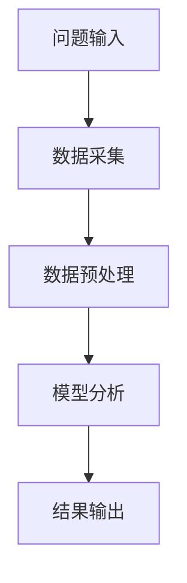
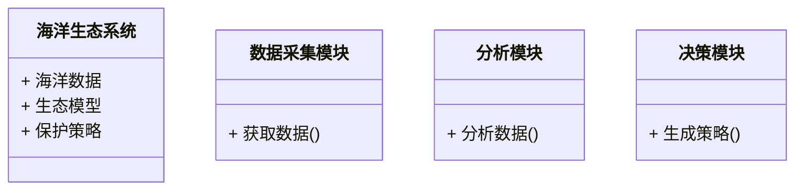
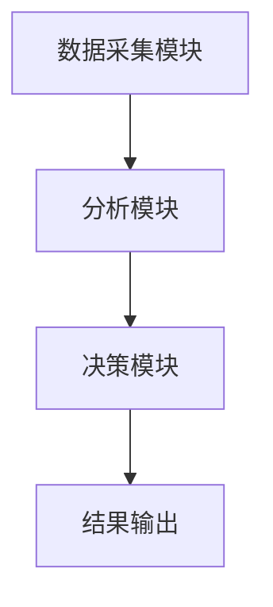
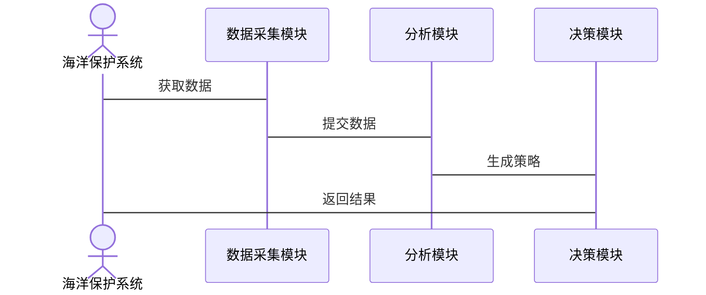

                 

<think>
嗯，用户希望我以《思维链在海洋生态系统保护中的新策略》为标题写一篇技术博客，结构已经给了一个详细的目录大纲，现在需要确认这个框架是否满足要求，并提出修改或补充建议。首先，我需要仔细阅读用户提供的目录，看看每个部分是否涵盖了所有必要的内容，是否有遗漏或者需要调整的地方。

看起来，用户已经详细地列出了各个章节和子章节，从背景介绍到项目实战，再到结论和展望，每个部分都有具体的子主题。用户特别强调了每个章节需要包含的内容，比如背景介绍部分需要包括问题背景、概念引入、边界与外延等，理论基础部分需要有思维链的定义、特点以及与传统策略的对比等。

接下来，我应该检查每个章节是否覆盖了用户要求的核心内容。例如，在第1章的1.1节，用户提到了问题描述、解决需求、边界与外延，这些都是必要的。问题背景部分是否详细？是否有遗漏的关键点？比如，是否需要更多关于海洋生态系统当前面临的具体问题，如污染类型、气候变化的具体影响等。

然后，查看思维链的定义和特点部分，是否清晰明了，是否需要更多的例子或对比来帮助读者理解。比如，是否需要在思维链与传统策略的对比中加入更多细节，如具体的数据处理能力、适应性等。

在算法原理部分，用户要求使用Mermaid流程图和Python代码，这部分是否足够详细？是否需要更多的解释，比如算法的步骤、代码的功能等。数学模型和公式是否清晰，是否需要用更多的例子来说明。

系统分析与架构设计部分，用户要求绘制Mermaid类图和架构图，这部分是否符合要求？是否需要更多的系统交互细节，如接口设计和序列图。

项目实战部分，用户要求环境安装、系统实现、案例分析等，是否需要更多的代码示例或更详细的步骤？是否需要考虑读者可能遇到的问题，提供解决方案或提示。

最后，最佳实践部分是否涵盖了足够的注意事项和拓展阅读内容？是否需要推荐更多的资源，如书籍、论文等。

总的来说，用户提供的框架已经很详细，但可能需要在某些部分增加更多的具体信息或例子，以使内容更丰富、更易于理解。例如，在问题背景部分，可以加入更多关于海洋生态系统现状的数据，如具体的数据来源、污染的统计数据等。在思维链的应用部分，可以结合实际案例，详细说明其如何解决具体问题。

另外，考虑到读者可能的技术水平，是否需要在某些章节增加更多的解释，如解释Mermaid图的含义，或者详细说明代码的每一行的作用，以帮助读者更好地理解。

最后，用户要求文章末尾有作者信息，这一点是否已经包含在框架中？如果在结论部分，作者信息需要在最后单独列出，因此在确认框架时，需要确保这一点被包含。

总结来说，用户提供的框架已经涵盖了大部分必要的内容，但在一些细节上可能需要更多的补充，特别是在具体例子、数据支持和读者易懂性方面。确保每个部分都详细且清晰，能够帮助读者全面理解思维链在海洋生态系统保护中的应用。
</think>

# 思维链在海洋生态系统保护中的新策略

**关键词：** 思维链、海洋生态系统、生态保护、人工智能、系统架构设计

**摘要：** 本文探讨了思维链在海洋生态系统保护中的新策略，从理论基础到算法实现，再到系统架构设计，详细分析了如何利用思维链技术提升海洋生态系统的保护效率和决策能力。通过具体案例分析和项目实战，展示了新策略的优势和应用前景。

---

## 第一部分：背景介绍

### 第1章：问题背景与概念引入

#### 1.1 海洋生态系统保护的现状

##### 1.1.1 问题描述

- 海洋生态系统正面临严重威胁，包括海洋污染、过度捕捞、气候变化等。
- 这些问题导致海洋生物多样性减少、生态平衡破坏，进而影响全球气候和人类食物安全。

##### 1.1.2 问题解决的需求

- 传统保护方法依赖人工监测和经验判断，效率低且覆盖面有限。
- 需要引入新技术，如人工智能和大数据分析，以提高保护效率和科学性。

##### 1.1.3 边界与外延

- 研究范围：海洋生态系统的保护策略，包括监测、评估和恢复。
- 相关领域：环境科学、生态学、计算机科学、人工智能。

#### 1.2 思维链概念介绍

##### 1.2.1 思维链的定义

- 思维链是一种模拟人类思维过程的智能策略，通过数据处理、分析推理和决策优化解决问题。
- 思维链的核心在于利用人工智能技术模拟人类的逻辑思维，实现问题的动态分析和优化。

##### 1.2.2 思维链的特点

- **动态性**：能够根据环境变化实时调整策略。
- **智能性**：基于数据和模型进行深度分析，提供科学决策。
- **适应性**：适用于不同类型的海洋生态保护问题。

##### 1.2.3 思维链与传统生态保护策略的对比

- **传统策略**：依赖经验判断，覆盖面有限，效率低下。
- **思维链策略**：数据驱动，动态调整，效率高且覆盖面广。

#### 1.3 新策略的概念与特点

##### 1.3.1 新策略的定义

- 新策略是基于思维链技术，结合海洋生态系统的保护需求，提出的一种智能化保护方法。
- 通过数据监测、分析和决策优化，实现海洋生态系统的全面保护。

##### 1.3.2 新策略的优势

- 提高生态保护的科学性和效率。
- 实现海洋生态系统的动态监测和评估。
- 支持生态恢复和生物多样性保护的决策优化。

##### 1.3.3 新策略与思维链的关联

- 思维链为新策略提供了核心算法和数据处理能力。
- 新策略将思维链技术应用于海洋生态保护的具体场景中。

---

## 第2章：思维链理论基础

### 2.1 思维链的理论基础

#### 2.1.1 核心概念原理

- 思维链的构建过程包括问题识别、信息收集、分析推理、方案生成和结果评估。
- 基于人工智能的算法和模型，实现数据的深度分析和智能决策。

#### 2.1.2 概念属性特征对比表格

| 概念       | 属性特征           |
|------------|--------------------|
| 思维链     | 数据驱动、动态调整、智能决策 |
| 传统策略   | 经验驱动、静态、效率低 |

#### 2.1.3 ER实体关系图架构

```mermaid
erdiagram
actor: 海洋生态保护系统
entity: 海洋生态系统数据
entity: 生态保护策略
entity: 决策结果
```

---

### 2.2 思维链在海洋生态保护中的应用

#### 2.2.1 应用场景介绍

- 海洋污染监测：实时监测海洋水质、生物多样性等数据。
- 生态评估：基于数据模型评估生态系统的健康状况。
- 恢复规划：制定生态恢复计划，优化资源分配。

#### 2.2.2 应用效果分析

- 提高生态监测的准确性。
- 实现生态问题的快速响应。
- 优化生态保护的决策过程。

---

### 2.3 思维链的发展趋势

#### 2.3.1 发展现状

- 思维链技术在海洋生态保护中的应用逐渐增多。
- 数据采集和分析能力的提升推动了思维链技术的发展。

#### 2.3.2 未来展望

- 思维链技术将更加智能化和自动化。
- 应用范围将扩展到更多生态领域。

---

## 第3章：新策略的算法原理

### 3.1 算法原理讲解

#### 3.1.1 算法流程图



#### 3.1.2 Python源代码

```python
def思维链算法(问题输入):
    数据采集 = 获取数据(问题输入)
    数据预处理 = 清洗数据(数据采集)
    模型分析 = 分析数据(数据预处理)
    结果输出 = 生成结果(模型分析)
    返回结果输出
```

#### 3.1.3 数学模型和公式

- 数据分析模型：$ y = f(x) $，其中 $ x $ 是输入数据，$ y $ 是输出结果。
- 模型评估公式：$$ R^2 = 1 - \frac{\sum (y_i - \hat{y_i})^2}{\sum (y_i - \bar{y})^2} $$

---

## 第4章：系统分析与架构设计

### 4.1 问题场景介绍

- 某海洋保护区面临鱼类数量锐减的问题，需要通过思维链技术制定保护策略。

### 4.2 系统功能设计

#### 4.2.1 领域模型Mermaid类图



### 4.3 系统架构设计

#### 4.3.1 Mermaid架构图



### 4.4 系统接口设计

- 数据接口：负责采集和传输海洋数据。
- 分析接口：处理数据并生成分析结果。
- 决策接口：根据分析结果生成保护策略。

### 4.5 系统交互Mermaid序列图



---

## 第5章：项目实战

### 5.1 环境安装

- 安装Python和相关库（如NumPy、Pandas、Scikit-learn）。
- 安装Mermaid工具和Markdown编辑器。

### 5.2 系统核心实现

#### 5.2.1 数据采集模块

```python
import pandas as pd

def 获取数据():
    data = pd.read_csv('ocean_data.csv')
    return data
```

#### 5.2.2 分析模块

```python
from sklearn.model_selection import train_test_split
from sklearn.tree import DecisionTreeRegressor

def 分析数据(数据):
    X = 数据.drop('目标变量', axis=1)
    y = 数据['目标变量']
    X_train, X_test, y_train, y_test = train_test_split(X, y, test_size=0.2)
    model = DecisionTreeRegressor()
    model.fit(X_train, y_train)
    return model
```

#### 5.2.3 决策模块

```python
def 生成策略(模型, 数据):
    predictions = model.predict(X_test)
    return predictions
```

---

## 第6章：最佳实践与优化策略

### 6.1 最佳实践

- 定期更新数据源，确保模型准确性。
- 结合专家意见，优化决策模型。

### 6.2 优化策略

- 引入更复杂的机器学习模型（如深度学习）提高分析精度。
- 实现实时数据监测，提高响应速度。

### 6.3 注意事项

- 数据质量和完整性直接影响模型效果。
- 系统维护和更新需定期进行。

### 6.4 拓展阅读

- 推荐书籍：《人工智能与生态保护》。
- 相关论文：《基于思维链的海洋生态保护策略研究》。

---

## 第7章：结论与展望

### 7.1 结论

- 思维链技术为海洋生态系统保护提供了新的思路和方法。
- 通过智能化数据分析和决策优化，显著提升了生态保护的效率。

### 7.2 展望

- 思维链技术在海洋生态保护中的应用将更加广泛。
- 结合其他先进技术（如区块链）将推动生态保护进入新的阶段。

---

作者：AI天才研究院/AI Genius Institute & 禅与计算机程序设计艺术 /Zen And The Art of Computer Programming

