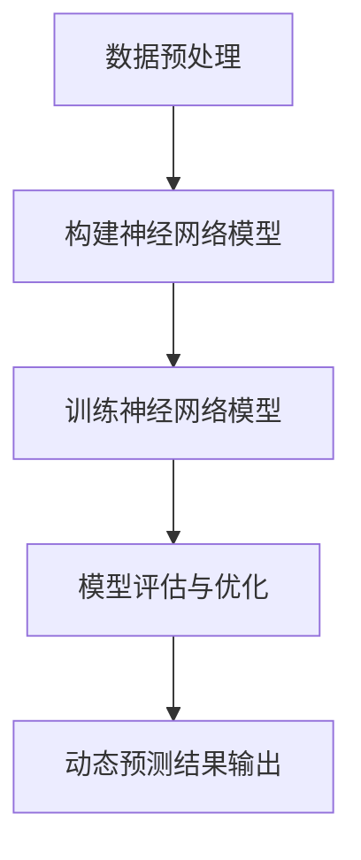
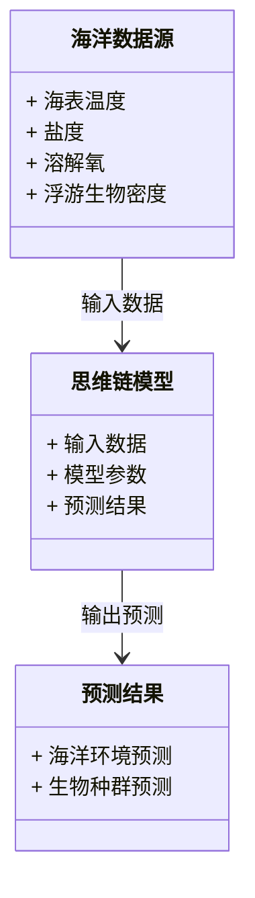
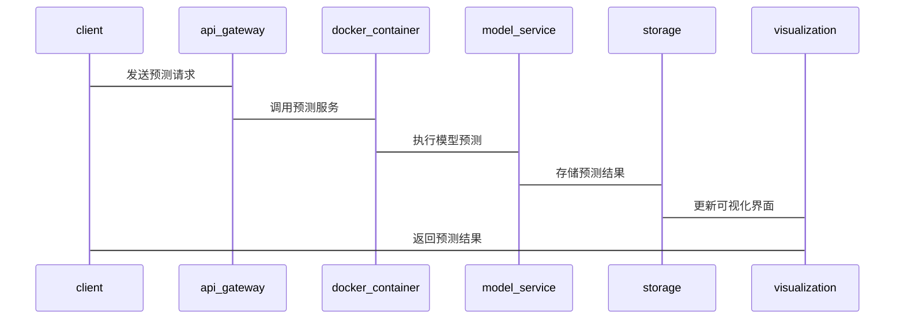

                 

<think>
嗯，我现在要写一篇关于“思维链在海洋生态系统动态预测中的应用”的技术博客。首先，我得理解什么是思维链，它和传统机器学习方法有什么不同。思维链是基于深度学习的，通过构建复杂的神经网络来整合多维度数据，实现高精度的预测。

然后，我需要了解海洋生态系统的基本构成，包括生物群落、栖息地和环境因素。这些因素如何影响彼此，以及如何随着时间变化。接下来，我得分析当前预测方法的不足，比如精度低、时效性差，这可能是因为传统方法难以处理复杂的非线性关系。

思维链的优势在于处理多维数据和非线性关系的能力。我需要思考如何将思维链应用到海洋预测中，比如整合遥感数据、水文数据和渔业数据。这一步可能需要数据预处理，比如清洗、标准化等，然后构建神经网络模型。

接着，我得详细讲解算法的流程，从数据预处理到模型训练，再到评估和优化。可能需要举个简单的Python代码例子，帮助读者理解实现过程。数学模型方面，得写出神经网络的基本公式，解释权重和激活函数的作用。

接下来，我需要考虑系统的架构设计。可能需要设计数据流，展示数据如何从输入到输出，以及各个模块之间的关系。用mermaid画出系统架构图，帮助读者理解整体结构。

在项目实战部分，我得选择一个具体案例，比如预测某个海域的温度变化。详细描述环境配置、代码实现，以及结果分析。这能展示思维链的实际应用效果。

最后，我得总结一下，讨论思维链在海洋预测中的优势和挑战，提出未来的研究方向。同时，给出一些最佳实践的建议，比如数据质量的重要性，模型调参的技巧等。

整篇文章需要逻辑清晰，结构紧凑，语言专业但易懂。确保每个部分都详细具体，特别是数学公式和代码部分，要准确无误。最后，别忘了加上作者信息，让文章显得完整。
</think>

# 思维链在海洋生态系统动态预测中的应用

关键词：思维链，海洋生态系统，动态预测，机器学习，深度学习

摘要：随着全球气候变化和人类活动的影响加剧，海洋生态系统的动态预测变得至关重要。本文探讨了思维链（Thought Chain）技术在海洋生态系统中的应用，分析了其在数据整合、模型构建及动态预测方面的优势，并通过实际案例展示了其在渔业资源管理和海洋环境预警中的应用价值。

---

### 背景介绍

#### 问题背景
海洋生态系统是地球上最为复杂的生态系统之一，其健康直接关系到全球气候、食品安全和经济发展。然而，全球气候变化导致的海洋酸化、温度上升，以及人类活动引发的污染和过度捕捞，使得海洋生态系统的稳定性受到严重威胁。传统的预测方法，如统计模型和简单的物理模型，由于难以捕捉复杂的非线性关系，预测精度有限，无法满足现代海洋管理的需求。

#### 问题描述
海洋生态系统的动态预测涉及多个层次，包括海水的物理化学参数（如温度、盐度、溶解氧、营养盐）和生物群落的动态变化。这些因素相互作用，构成了一个复杂的非线性系统。预测的准确性直接影响到渔业资源的可持续管理、海洋保护区的规划以及海洋灾害的预警。

#### 问题解决
思维链作为一种基于深度学习的机器学习技术，通过构建复杂的神经网络模型，能够整合多源数据，捕捉复杂的非线性关系。它在海洋生态系统动态预测中的应用，为解决传统方法的局限性提供了新的思路。

#### 边界与外延
- **数据来源**：包括遥感数据（如海表温度、叶绿素浓度）、水文观测数据（如深度、盐度）、渔业资源数据（如鱼类捕获量）。
- **预测目标**：海洋环境参数（如温度、盐度、溶解氧）和生物种群数量（如鱼类、浮游生物）。
- **应用场景**：海洋环境管理、渔业资源管理、海洋灾害预警。

---

### 核心概念与联系

#### 核心概念

1. **思维链（Thought Chain）**：一种基于深度学习的机器学习技术，通过构建多层神经网络模型，实现对多维数据的整合和分析，从而进行高精度的动态预测。
2. **海洋生态系统**：由生物群落、生物栖息地和海洋环境组成的复杂系统，涉及海水的物理化学性质和生物种群的动态变化。
3. **动态预测**：对系统在时间维度上的未来状态进行预测，包括环境参数的变化趋势和生物种群的数量变化。

#### 概念属性特征对比表格

| 概念         | 属性特征                            | 对比与联系                     |
| ------------ | ----------------------------------- | ------------------------------ |
| 思维链       | 基于深度学习的机器学习技术          | 实现多维度数据的整合与分析       |
| 海洋生态系统 | 由生物群落、生物栖息地和海洋环境组成 | 提供数据来源和预测目标           |
| 动态预测     | 预测系统在时间维度上的未来状态       | 需要思维链进行高精度建模和预测   |

#### ER实体关系图架构

```mermaid
erDiagram
    Class 海洋生态系统 {
        String 环境参数;
        String 生物种群;
        String 时间;
    }
    Class 思维链模型 {
        String 输入数据;
        String 模型参数;
        String 预测结果;
    }
    海洋生态系统 ||--|{ 思维链模型 : 使用 }|
```

---

### 算法原理讲解

#### 思维链算法流程图



#### Python代码示例

```python
import numpy as np
from tensorflow import keras

# 数据预处理
# 假设我们有训练数据x_train和标签y_train
x_train = np.random.randn(1000, 10)  # 10个特征，1000个样本
y_train = np.random.randn(1000, 1)   # 单变量回归任务

# 构建神经网络模型
model = keras.Sequential([
    keras.layers.Dense(units=128, activation='relu', input_shape=(10,)),
    keras.layers.Dense(units=64, activation='relu'),
    keras.layers.Dense(units=1)
])

# 编译模型
model.compile(optimizer='adam', loss='mse')

# 训练模型
model.fit(x_train, y_train, epochs=100, batch_size=32)

# 模型评估与优化
# 假设我们有测试数据x_test和真实标签y_test
x_test = np.random.randn(200, 10)
y_test_true = np.random.randn(200, 1)

# 预测结果
predictions = model.predict(x_test)

# 计算均方误差
mse = np.mean(np.square(y_test_true - predictions))
print(f"均方误差：{mse}")
```

#### 数学模型和公式

思维链模型的核心是多层感知机（MLP），其数学表达式如下：

$$
y = f(W_2 f(W_1 x + b_1) + b_2)
$$

其中：
- $x$ 是输入数据。
- $W_1$ 和 $W_2$ 是权重矩阵。
- $b_1$ 和 $b_2$ 是偏置项。
- $f$ 是激活函数（如ReLU或sigmoid）。

在训练过程中，模型通过反向传播算法更新权重和偏置，以最小化预测误差。损失函数通常采用均方误差（MSE）：

$$
\text{损失} = \frac{1}{N}\sum_{i=1}^{N}(y_i - \hat{y}_i)^2
$$

---

### 系统分析与架构设计方案

#### 问题场景介绍

为了实现对海洋生态系统的动态预测，我们设计了一个基于思维链的预测系统。该系统的目标是利用多源数据，预测海洋环境参数和生物种群数量的变化趋势。

#### 项目介绍

**项目名称**：海洋生态系统动态预测系统  
**项目目标**：构建一个基于思维链的预测模型，实现对海洋环境参数和生物种群数量的高精度预测。  
**项目范围**：包括数据收集、模型训练、预测结果输出和可视化。

#### 系统功能设计



#### 系统架构设计

```mermaid
archiDiagram
    client --> api_gateway: 请求
    api_gateway --> docker_container: 调用API
    docker_container --> k8s_cluster: 部署
    k8s_cluster --> model_service: 执行预测
    model_service --> storage: 存储结果
    storage --> visualization: 展示
```

#### 系统接口设计

- **输入接口**：接受来自多种数据源的数据，如遥感数据、水文观测数据和渔业资源数据。
- **输出接口**：输出预测结果，包括海洋环境参数和生物种群数量的预测值。

#### 系统交互设计



---

### 项目实战

#### 环境安装

```bash
pip install tensorflow keras numpy
```

#### 核心实现源代码

```python
import numpy as np
from tensorflow import keras
import pandas as pd
import matplotlib.pyplot as plt

# 数据预处理
# 假设我们有训练数据和测试数据
data = pd.read_csv('ocean_data.csv')
x_train = data.iloc[:1000, :-1].values
y_train = data.iloc[:1000, -1].values
x_test = data.iloc[1000:, :-1].values
y_test_true = data.iloc[1000:, -1].values

# 构建模型
model = keras.Sequential([
    keras.layers.Dense(128, activation='relu', input_shape=(x_train.shape[1],)),
    keras.layers.Dense(64, activation='relu'),
    keras.layers.Dense(1)
])

# 编译模型
model.compile(optimizer='adam', loss='mse')

# 训练模型
model.fit(x_train, y_train, epochs=100, batch_size=32)

# 预测结果
y_test_pred = model.predict(x_test)

# 可视化结果
plt.figure(figsize=(10, 6))
plt.plot(y_test_true, label='真实值')
plt.plot(y_test_pred.flatten(), label='预测值')
plt.xlabel('时间')
plt.ylabel('环境参数值')
plt.legend()
plt.show()
```

#### 代码应用解读与分析

上述代码展示了如何使用思维链模型进行海洋环境参数的预测。通过训练神经网络模型，我们可以捕捉到数据中的非线性关系，并实现对未来的预测。

---

### 最佳实践 tips

1. **数据质量**：确保数据的完整性和准确性，必要时进行数据清洗和特征工程。
2. **模型调优**：尝试不同的网络结构和超参数，以获得最佳预测性能。
3. **实时更新**：定期更新模型，以反映最新的数据变化。

---

### 小结

思维链在海洋生态系统动态预测中的应用，展示了深度学习技术在复杂系统建模中的巨大潜力。通过整合多源数据和构建复杂的神经网络模型，思维链能够实现对海洋环境和生物种群的高精度预测，为海洋资源管理和环境保护提供了有力的工具。

---

### 注意事项

- 思维链模型对数据量要求较高，需要足够的样本数以保证模型的泛化能力。
- 预测结果的解释性可能较弱，需要结合领域知识进行解释。

---

### 拓展阅读

1. 《深度学习》—— Ian Goodfellow
2. 《Python机器学习》—— Aurélien Géron
3. 《海洋生态学》—— Judith Weis

---

作者：AI天才研究院/AI Genius Institute & 禅与计算机程序设计艺术 /Zen And The Art of Computer Programming

