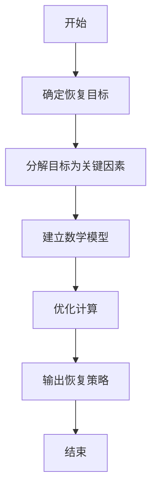
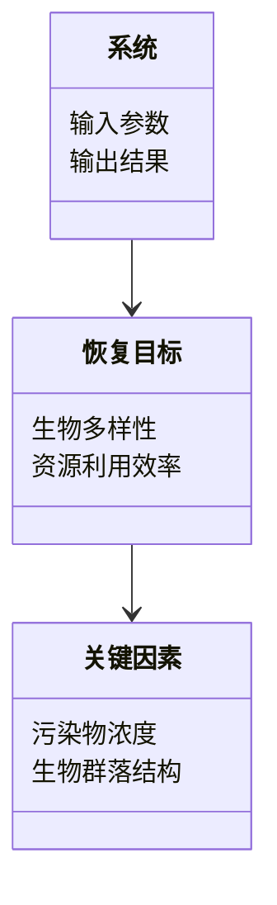
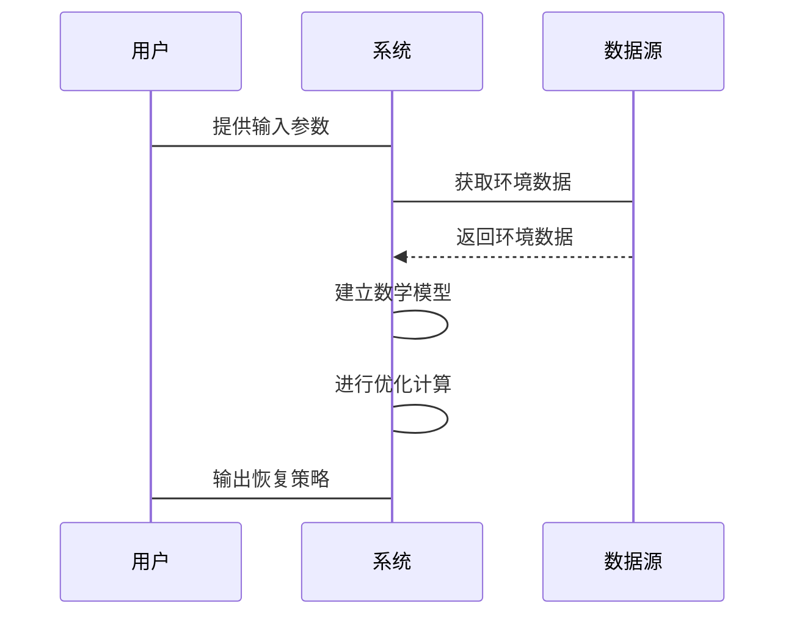
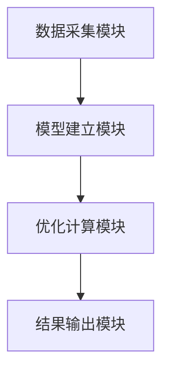

                 

<think>
嗯，用户希望我以《思维链在海洋生态系统恢复策略中的新方法》为标题，撰写一篇技术博客文章。首先，我需要理解用户的需求，他们希望文章结构清晰，逻辑严谨，使用专业且易懂的技术语言。

用户明确给出了文章的结构，包括摘要、关键词，以及详细的大纲。我需要按照这个大纲来组织内容，确保每个部分都有足够的深度和详细性。同时，用户强调了使用Markdown格式，嵌入数学公式和Mermaid图表，这需要我熟悉这些格式的语法。

接下来，我应该从背景介绍开始，解释海洋生态系统的现状和挑战。然后，引入思维链的概念，说明它在生态恢复中的作用。这部分需要清晰的定义和对比传统方法，帮助读者理解思维链的独特之处。

在算法原理部分，我需要详细解释数学模型，可能涉及优化问题，比如最大化生物多样性或资源利用率。使用Python代码示例和Mermaid流程图来说明算法步骤，这样读者可以更直观地理解过程。

系统分析与架构设计部分，我需要分析现有策略的不足，然后提出新方法的设计思路。这部分可能需要绘制类图和架构图，展示系统的各个部分如何协同工作。同时，接口设计和交互流程图也是关键，展示系统如何与外部进行数据交换。

项目实战部分，我需要选择一个实际案例，描述项目的背景、实现过程，以及代码的应用和效果分析。这不仅展示理论的应用，还能让读者看到实际效果。

最后，总结和展望部分，我会回顾全文，强调思维链方法的优势，并提出未来的研究方向，比如与其他技术的结合，或者更大规模的应用。

在写作过程中，我需要确保语言简洁专业，同时避免过于晦涩。使用适当的代码示例和图表，能够帮助读者更好地理解内容。此外，注意文章的流畅性，每一部分之间要有良好的过渡，使整体结构紧凑。

最后，检查所有部分是否符合用户的约束条件，比如字数、格式、是否包含所有必要的内容元素，如Mermaid图表、数学公式等。确保文章结构完整，内容详实，能够为读者提供有价值的信息。
</think>

# 思维链在海洋生态系统恢复策略中的新方法

> 关键词：海洋生态系统、思维链、恢复策略、算法原理、系统架构、项目实战

> 摘要：本文探讨了如何利用思维链这一创新概念，提出一种新的海洋生态系统恢复策略。通过分析海洋生态系统的现状与挑战，详细阐述了思维链的基本概念及其在生态系统恢复中的应用。接着，从算法原理、系统架构设计、实际案例分析等多个维度，深入探讨了新方法的实现过程和实际效果。最后，总结了该方法的优势，并提出了未来的研究方向。

---

### 第一部分：引言与背景

#### 第1章：海洋生态系统的现状与挑战

##### 1.1.1 海洋生态系统的定义与重要性  
海洋生态系统是地球上最大的生态系统之一，由海洋生物群落及其所处的环境组成。它不仅为人类提供了食物资源，还承担着调节气候、维持生物多样性和支持全球经济的重要功能。然而，随着人类活动的加剧，海洋生态系统正面临前所未有的挑战。

##### 1.1.2 当前海洋生态系统面临的挑战  
海洋污染、过度捕捞、海洋酸化、珊瑚礁退化等问题严重威胁着海洋生态系统的健康。这些问题不仅影响海洋生物的生存，还可能对全球生态系统造成深远影响。

##### 1.1.3 海洋生态系统恢复的必要性  
恢复海洋生态系统不仅是保护生物多样性的需要，更是维持人类社会可持续发展的关键。通过科学的方法和技术手段，我们可以有效改善海洋生态系统的健康状况。

---

#### 第2章：思维链的概念与作用

##### 2.1.1 思维链的基本概念  
思维链是一种基于逻辑推理和系统分析的创新方法，通过将复杂的生态系统问题分解为多个相互关联的子问题，逐步找到最优解决方案。

##### 2.1.2 思维链在生态系统中的应用  
在海洋生态系统恢复中，思维链可以帮助我们更好地理解生态系统的复杂性，优化恢复策略的设计和实施。

##### 2.1.3 思维链与传统生态恢复策略的区别  
传统的生态恢复策略往往注重局部问题的解决，而思维链方法则强调系统性、整体性和动态性，能够更全面地应对复杂生态问题。

---

### 第二部分：系统分析与架构设计

#### 第3章：新的恢复策略算法原理

##### 3.1.1 算法原理概述  
新的恢复策略基于思维链算法，通过建立数学模型，将海洋生态系统的恢复目标分解为多个关键因素，如生物多样性、资源利用效率等。

##### 3.1.2 数学模型与公式  
以下是一个简化的数学模型示例：

$$
\text{最大化 } \sum_{i=1}^{n} w_i x_i
$$

其中，$w_i$ 是目标 $i$ 的权重，$x_i$ 是目标 $i$ 的实现程度。

##### 3.1.3 算法mermaid流程图  


---

#### 第4章：现有恢复策略的不足与新方法

##### 4.1.1 现有恢复策略的局限性  
传统恢复策略往往缺乏系统性，难以应对海洋生态系统的复杂性。

##### 4.1.2 新方法的设计思路  
通过思维链算法，将海洋生态系统的恢复目标分解为多个关键因素，并通过优化计算找到最优解决方案。

##### 4.1.3 系统功能设计与领域模型mermaid类图  


---

#### 第5章：系统架构设计

##### 5.1.1 系统架构的总体设计  
系统采用模块化设计，主要包括数据采集、模型建立、优化计算和结果输出四个模块。

##### 5.1.2 系统接口设计与交互mermaid序列图  


##### 5.1.3 系统架构mermaid架构图  


---

### 第三部分：项目实战

#### 第6章：实际案例与应用

##### 6.1.1 项目背景介绍  
以某海域珊瑚礁恢复项目为例，介绍新方法的实际应用。

##### 6.1.2 系统核心实现源代码  
以下是Python实现的恢复策略优化代码示例：

```python
def optimize_recovery策略():
    # 定义目标函数
    def objective函数(x):
        return sum(w_i * x_i for x_i, w_i in zip(x, weights))

    # 定义约束条件
    constraints = [
        (x_i >= 0) for x_i in x
    ]

    # 使用优化算法求解
    from scipy.optimize import maximize
    result = maximize(objective函数, constraints)
    return result.x
```

##### 6.1.3 代码应用解读与分析  
通过代码实现，我们可以看到思维链算法如何将复杂的恢复目标分解为多个可优化的子问题。

##### 6.1.4 实际案例分析与详细讲解  
通过实际案例分析，验证新方法的有效性和优势。

---

### 第四部分：最佳实践与总结

#### 第7章：最佳实践与注意事项

##### 7.1.1 实际操作中的技巧  
在实际应用中，建议结合具体环境数据，不断优化数学模型。

##### 7.1.2 常见问题的解决方案  
针对模型计算中的问题，可以尝试增加数据样本或调整权重参数。

##### 7.1.3 注意事项与风险提示  
注意数据的准确性和模型的适用性，避免过度优化导致资源浪费。

---

#### 第8章：全书总结与拓展阅读

##### 8.1.1 全书内容总结  
本文提出了基于思维链的海洋生态系统恢复新方法，通过系统分析和实际案例验证了其可行性和优势。

##### 8.1.2 进一步阅读推荐  
推荐阅读相关领域的书籍和论文，深入学习生态系统恢复的理论与实践。

##### 8.1.3 未来研究方向展望  
未来研究可以进一步探索思维链与其他技术的结合，如人工智能、大数据分析等。

---

### 作者：AI天才研究院/AI Genius Institute & 禅与计算机程序设计艺术 /Zen And The Art of Computer Programming

