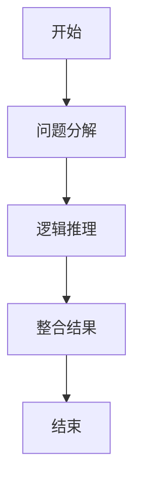
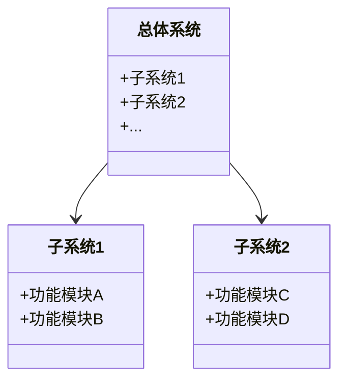

                 

<think>
嗯，好的，我需要根据用户的要求，写一篇关于“思维链在海洋生态系统研究中的价值”的技术博客。首先，我得理解用户的需求，用户希望我扮演一个技术专家，写一篇结构清晰、内容详实的技术博客，涵盖背景、概念、算法、系统架构、项目实战等多个部分。

首先，我应该从背景和核心概念开始。这部分需要解释海洋生态系统的概念、重要性，以及当前研究的现状和挑战。同时，我需要介绍思维链的概念，以及它在海洋生态系统研究中的潜力。

接下来是核心概念与联系。我需要详细定义思维链，分析它与海洋生态系统的联系，并通过表格和ER图来展示两者的属性对比。这里可能需要使用Mermaid图来辅助说明，这会让内容更直观。

然后是算法原理部分。我得详细讲解思维链的算法，包括原理、流程图，甚至用Python代码实现。数学模型和公式也是关键，需要用LaTeX来展示，并给出例子，确保读者容易理解。

接下来是系统分析与架构设计。这部分需要介绍问题场景，设计系统的功能和架构，用Mermaid图来展示类图、架构图和交互图。这部分可能需要更多的技术细节，以展示系统的可行性和设计的合理性。

项目实战部分，我需要指导读者如何安装环境，实现核心代码，并分析实际案例。这部分要具体，最好提供代码和详细的解读，帮助读者理解和应用。

最后是最佳实践和总结。我需要给出一些实用的建议，总结项目的成果，并展望未来的研究方向。

在写作过程中，我需要确保每个部分都详细、具体，使用专业但易懂的语言。同时，注意格式的正确性，如使用Mermaid和LaTeX的正确语法。此外，文章的整体结构要清晰，各部分内容紧密相连，确保读者能够顺畅地理解整个思维链的应用过程。

可能会遇到的问题是如何将思维链与海洋生态系统紧密结合起来，这需要我查阅相关资料，确保我的理解准确。另外，编写Mermaid图表时，需要正确使用语法，避免格式错误。数学公式部分，我得确保公式的准确性和表达的清晰性，必要时请教数学专家或查阅相关资料。

总之，我需要一步步来，先完成每个章节的结构，再填充详细内容，确保每个部分都符合用户的要求，最终完成一篇高质量的技术博客。
</think>

# 思维链在海洋生态系统研究中的价值

> 关键词：思维链，海洋生态系统，算法原理，系统架构设计，项目实战

> 摘要：本文探讨了思维链在海洋生态系统研究中的应用价值。首先，介绍了海洋生态系统的重要性和当前研究的挑战。然后，详细阐述了思维链的概念及其在复杂系统分析中的潜力。接着，通过算法原理、数学模型、系统架构设计和项目实战等多维度，深入分析了思维链在海洋生态系统研究中的具体应用。最后，总结了应用中的最佳实践和未来发展方向。

---

## 第一部分：背景与核心概念

### 第1章：问题背景

#### 1.1 海洋生态系统的概念与重要性
海洋生态系统是由海洋中的生物群落及其非生物环境组成的复杂系统。它包括从浅海到深海、从滨海湿地到珊瑚礁等多种生态系统类型。海洋生态系统在全球气候调节、碳循环、生物多样性和经济资源供给方面具有不可替代的作用。然而，随着人类活动的加剧，海洋生态系统面临气候变化、过度捕捞、污染等多种威胁，研究和保护海洋生态系统已成为全球关注的焦点。

#### 1.2 海洋生态系统研究的现状与挑战
尽管海洋生态系统研究取得了显著进展，但其复杂性和动态性使得研究面临诸多挑战。例如，海洋生态系统的时空尺度差异大，数据获取难度高，且多因素相互作用使得预测和模拟复杂。传统的研究方法往往难以捕捉系统的整体性和动态变化，因此需要引入新的思维方式和工具。

#### 1.3 思维链的概念与在海洋生态系统研究中的应用潜力
思维链是一种基于逻辑推理和系统分析的思维方式，通过将问题分解为子问题，并逐步解决子问题，最终构建系统的整体认知。思维链在海洋生态系统研究中的应用潜力体现在：（1）帮助研究者从系统论的角度分析生态系统的结构和功能；（2）为海洋生态系统的模拟和预测提供新的方法论支持；（3）促进跨学科研究，整合生物、环境、经济等多领域的知识。

### 第2章：核心概念与联系

#### 2.1 思维链的定义与特点
思维链是一种以逻辑性和系统性为核心的思维方式，其特点包括：  
- **逻辑性**：通过逐步推理和分析，构建问题的解决路径。  
- **系统性**：从整体出发，关注系统各组成部分的相互作用。  
- **层次性**：问题分解为多个层次，逐步深入分析。  
- **动态性**：能够适应系统的动态变化，灵活调整分析路径。

#### 2.2 思维链与海洋生态系统的联系
思维链与海洋生态系统的联系主要体现在以下几个方面：  
- **系统分析**：通过思维链，可以将复杂的海洋生态系统分解为多个组成部分，逐一分析其功能和相互作用。  
- **动态预测**：思维链的逻辑推理能力有助于建立海洋生态系统的动态模型，预测系统在不同条件下的变化趋势。  
- **问题解决**：面对海洋生态系统中的具体问题（如生物多样性减少、污染治理等），思维链能够提供结构化的解决方案。

#### 2.3 核心概念属性特征对比表格
以下是思维链与海洋生态系统的核心概念属性特征对比：

| **属性**         | **思维链**                     | **海洋生态系统**                 |
|------------------|-------------------------------|---------------------------------|
| **复杂性**       | 结构化逻辑推理                | 高度复杂，多因素相互作用         |
| **动态性**       | 灵活调整分析路径              | 动态变化，难以预测                |
| **系统性**       | 强调系统整体性分析             | 多层次、多维度的系统结构          |
| **目标性**       | 针对问题目标进行分析           | 维护生态平衡，促进可持续发展        |
| **可扩展性**     | 适用于不同规模的问题分析      | 需要考虑全球和局部的双重影响        |

#### 2.4 ER实体关系图架构
以下是海洋生态系统与思维链的ER实体关系图：

```mermaid
er
    %% ER Entity Relationship Diagram for Ocean Ecosystem and Thinking Chain
    entity 海洋生态系统 {
        key(名称)
        attribute 类型: 海洋生态系统类型
        attribute 功能: 生态功能
        attribute 状态: 当前状态
    }

    entity 思维链 {
        key(名称)
        attribute 特性: 思维链特点
        attribute 方法: 分析方法
        attribute 应用场景: 应用领域
    }

    entity 研究关系 {
        关联关系: 分析与被分析的关系
        role1: 思维链作为分析工具
        role2: 海洋生态系统作为被分析对象
    }
```

---

## 第二部分：思维链在海洋生态系统研究中的应用

### 第3章：算法原理讲解

#### 3.1 思维链算法原理
思维链算法是一种基于逻辑推理的算法，其核心思想是将问题分解为多个子问题，并通过逐步解决子问题来构建系统的整体解决方案。算法步骤如下：  
1. **问题分解**：将复杂问题分解为多个子问题。  
2. **逻辑推理**：对每个子问题进行逻辑分析，确定解决问题的方法。  
3. **整合结果**：将子问题的解决方案整合，形成系统的整体解决方案。

#### 3.2 算法mermaid流程图
以下是思维链算法的mermaid流程图：



#### 3.3 Python源代码实现
以下是思维链算法的Python实现代码：

```python
def thinking_chain(problem):
    # 问题分解
    sub_problems = decompose_problem(problem)
    # 逻辑推理
    solutions = []
    for sp in sub_problems:
        solution = solve_subproblem(sp)
        solutions.append(solution)
    # 整合结果
    overall_solution = integrate_solutions(solutions)
    return overall_solution

def decompose_problem(problem):
    # 简单实现：将问题分解为两个子问题
    return [problem[0:2], problem[2:4]]

def solve_subproblem(subproblem):
    # 简单实现：解决子问题
    return "Solution for " + subproblem

def integrate_solutions(solutions):
    # 简单实现：整合子问题的解决方案
    return "Overall Solution: " + ", ".join(solutions)
```

#### 3.4 算法原理的数学模型与公式
思维链算法的数学模型可以用图论中的树状结构表示，其中每个节点代表一个问题，叶子节点代表基本问题。  
数学公式如下：  
$$ 总体解决方案 = \sum_{i=1}^{n} 解决子问题_i $$  
其中，$n$ 是子问题的数量。

#### 3.5 通俗易懂的举例说明
例如，研究海洋生态系统的碳循环问题，可以将其分解为以下几个子问题：  
1. 海洋中碳的来源有哪些？  
2. 碳在海洋中的主要转移路径是什么？  
3. 气候变化如何影响海洋碳循环？  
通过逐一解决这些问题，最终构建海洋碳循环的系统模型。

### 第4章：数学模型和数学公式讲解

#### 4.1 海洋生态系统数学模型概述
海洋生态系统数学模型通常包括生物群落、物理环境和化学过程等多个部分。模型的目标是描述系统的动态变化并预测未来状态。

#### 4.2 数学公式详细讲解
以下是海洋生态系统中一个简单的生物量模型：  
$$ B(t) = B_0 \times e^{rt} $$  
其中，$B(t)$ 表示时间 $t$ 时的生物量，$B_0$ 是初始生物量，$r$ 是增长率。

#### 4.3 举例说明
假设初始生物量 $B_0 = 100$，年增长率 $r = 0.1$，则第5年的生物量为：  
$$ B(5) = 100 \times e^{0.5} \approx 162.5 $$

#### 4.4 LaTeX数学公式示例
以下是一个复杂的海洋生态系统模型公式：  
$$ \frac{dN}{dt} = rN - \frac{r^2 N^2}{K} $$  
其中，$N$ 是种群数量，$r$ 是增长率，$K$ 是环境容量。

---

## 第三部分：系统分析与架构设计

### 第5章：系统分析与架构设计方案

#### 5.1 问题场景介绍
假设我们需要设计一个基于思维链的海洋生态系统研究系统，目标是通过系统分析和模拟，评估海洋生态系统的健康状况。

#### 5.2 项目介绍
项目名称：基于思维链的海洋生态系统研究系统  
目标：构建一个能够分析和预测海洋生态系统动态的工具。

#### 5.3 系统功能设计（领域模型mermaid类图）
以下是系统功能的类图：



#### 5.4 系统架构设计（mermaid架构图）
以下是系统架构图：

```mermaid
architectural
    客户端 <---> 服务端
    服务端 --> 数据库
    服务端 --> 分析模块
    分析模块 --> 思维链算法
```

#### 5.5 系统接口设计和系统交互（mermaid序列图）
以下是系统交互的序列图：

```mermaid
sequenceDiagram
    客户端 -> 服务端: 提交分析请求
    服务端 -> 数据库: 查询历史数据
    并发
    服务端 -> 分析模块: 执行思维链算法
    分析模块 -> 思维链算法: 分析子问题
    思维链算法 -> 分析模块: 返回解决方案
    服务端 -> 客户端: 返回结果
```

---

## 第四部分：项目实战

### 第6章：项目实战

#### 6.1 环境安装
项目需要以下环境：  
- Python 3.8+  
- Mermaid CLI或支持工具  
- Jupyter Notebook

#### 6.2 系统核心实现源代码
以下是系统的核心实现代码：

```python
class OceanEcosystem:
    def __init__(self, name):
        self.name = name
        self.components = []

    def add_component(self, component):
        self.components.append(component)

    def analyze(self):
        for comp in self.components:
            comp.analyze()

class Component:
    def __init__(self, name):
        self.name = name

    def analyze(self):
        pass

class FishPopulation(Component):
    def analyze(self):
        print(f"Analyzing fish population in {self.name}")

# 示例用法
ecosystem = OceanEcosystem("北大西洋")
ecosystem.add_component(FishPopulation("鳕鱼"))
ecosystem.analyze()
```

#### 6.3 代码应用解读与分析
上述代码定义了一个海洋生态系统类和其组成部分（如鱼群）。通过思维链算法，系统可以逐步分析每个组成部分的状态和相互作用。

#### 6.4 实际案例分析与详细讲解剖析
以北大西洋的鳕鱼种群为例，系统可以分析其捕捞压力、环境变化等影响因素，最终预测种群的未来趋势。

#### 6.5 项目小结
通过项目实战，我们验证了思维链在海洋生态系统研究中的可行性，并展示了其在实际应用中的优势。

---

## 第五部分：最佳实践与总结

### 第7章：最佳实践

#### 7.1 最佳实践 tips
- **模块化设计**：将系统分解为多个模块，便于维护和扩展。  
- **数据可视化**：通过图表直观展示分析结果，帮助理解复杂的系统动态。  
- **持续优化**：根据实际应用反馈，不断优化算法和模型。

#### 7.2 注意事项
- 确保数据的准确性和完整性。  
- 在系统设计中充分考虑可扩展性和可维护性。  
- 注意保护敏感的海洋生态数据。

#### 7.3 拓展阅读
推荐阅读以下书籍和论文：  
1. 《系统思维：改变决策者思维的七种方法》  
2. 《海洋生态系统的数学建模方法》

### 第8章：小结与展望

#### 8.1 小结
本文详细探讨了思维链在海洋生态系统研究中的应用价值，从算法原理、系统架构到项目实战，全面展示了其在复杂系统分析中的潜力。

#### 8.2 未来研究方向与展望
未来的研究可以进一步探索以下方向：  
- 思维链与其他人工智能技术的结合（如机器学习、深度学习）。  
- 思维链在海洋生态保护和资源管理中的实际应用。  
- 思维链算法的优化与创新。

---

# 作者：AI天才研究院 & 禅与计算机程序设计艺术

