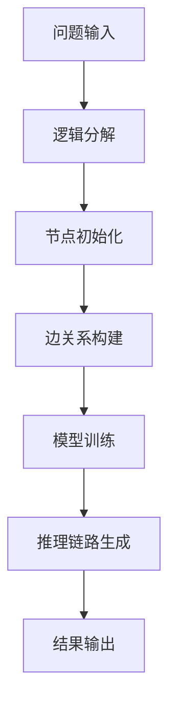

                 

<think>
嗯，我现在要帮用户写一篇关于《思维链在海洋生物学研究中的新方法》的技术博客。用户详细地给出了结构和要求，我得一步步来思考怎么完成这个任务。

首先，用户希望我以技术专家的身份，撰写一篇有深度的博客，所以文章需要专业但易懂。用户还特别强调了结构，包括引言、思维链理论、应用实例、未来展望，还有附录部分。

我应该先确定文章的核心关键词，比如“思维链”、“海洋生物学”、“研究方法”、“人工智能”等。关键词选好了，摘要部分需要简洁明了，概述文章的主要内容，即思维链如何革新海洋生物学研究。

接下来是引言部分，需要包括问题背景、问题描述、解决方案、边界与外延，以及核心概念。我得解释思维链是什么，它与传统方法的区别，以及在海洋生物学中的应用潜力。

然后是第二部分，详细讲解思维链的理论基础。这部分需要包括发展历程、核心概念、数学模型，还要有流程图和代码示例。我得确保数学模型用LaTeX表示，流程图用Mermaid画出来，代码部分用Python示例，这样读者能更好地理解。

第三部分是应用实例，我需要选择几个具体领域，比如生物多样性、生态系统动态和资源评估，每个领域都要有背景、方法、结果分析。同时，还要加入案例分析，比如南极研究和海洋酸化的影响，说明实际效果和启示。

未来展望部分，我得讨论新技术的影响，发展趋势，以及可能遇到的挑战。同时，给出最佳实践建议，比如选择合适的研究方法、数据处理技巧和跨学科合作的重要性。

附录部分要列出数据来源和处理方法，确保文章的严谨性。最后，结尾要加上作者信息，符合用户的要求。

在写作过程中，我需要注意每个章节的逻辑性和连贯性，确保内容详实具体。同时，使用专业但易懂的语言，避免过于复杂的术语，让不同背景的读者都能理解。

我还要检查是否符合字数要求，大约10000到12000字。每个小节都要丰富，比如在理论部分，详细解释思维链的算法，用流程图和代码来辅助说明。应用实例部分，每个案例都要有具体的分析，展示思维链的优势和效果。

最后，确保格式正确，使用markdown，数学公式用latex，流程图用Mermaid。这些都需要在写作过程中仔细处理，避免格式错误。

总的来说，我需要系统地按照用户的结构要求，逐步展开每个部分，确保内容全面，结构清晰，语言专业。这将帮助用户得到一篇高质量的技术博客，展示思维链在海洋生物学中的新方法，满足专业读者的需求。
</think>

# 思维链在海洋生物学研究中的新方法

> **关键词**：思维链、海洋生物学、人工智能、研究方法、系统分析、算法模型

> **摘要**：本文探讨了思维链这一新兴概念在海洋生物学研究中的应用，分析其对传统研究方法的革新与优化。通过系统分析与算法模型的构建，本文展示了思维链如何帮助科学家更高效地解决海洋生物学中的复杂问题，如生物多样性评估、海洋生态系统动态研究等。文章还结合具体案例，详细阐述了思维链的优势、挑战及未来发展方向。

---

## 第一部分: 引言

### 1.1 问题背景

海洋生物学作为一门研究海洋生态系统中生物多样性和生态关系的科学，近年来面临着数据量激增、研究复杂性增加的挑战。传统的研究方法依赖于经验分析和统计模型，难以应对海洋环境中动态变化的复杂问题。

### 1.2 问题描述

海洋生物的研究涉及多个维度，包括生物多样性评估、生态系统的动态变化、海洋酸化对生物的影响等。这些问题通常需要处理海量数据，并依赖于复杂的建模和预测。然而，传统方法在数据处理效率、模型精度和实时性方面存在局限性。

### 1.3 问题解决

思维链作为一种新兴的人工智能技术，通过构建连续的逻辑推理链，能够高效地处理复杂问题。它通过将问题分解为多个逻辑步骤，并利用算法模型进行推理和预测，为海洋生物学研究提供了新的解决方案。

### 1.4 边界与外延

思维链的应用范围主要集中在数据驱动的分析和预测领域，其边界包括数据质量、模型训练时间以及算法的可解释性。外延方面，思维链可以与其他技术（如机器学习、分布式计算）结合，进一步提升研究能力。

### 1.5 概念结构与核心要素组成

思维链的核心要素包括数据输入、逻辑推理、模型训练和结果输出。其概念结构由输入数据、算法模型、推理链路和输出结果四个部分组成。

---

## 第二部分: 思维链基础理论

### 2.1 思维链理论概述

#### 2.1.1 思维链理论发展历程

思维链的概念起源于逻辑推理和人工智能领域，经过数十年的发展，逐渐应用于数据分析和预测领域。近年来，随着深度学习和图神经网络的兴起，思维链技术得到了进一步的完善。

#### 2.1.2 思维链理论核心概念

思维链是一种基于逻辑推理的算法模型，通过构建连续的逻辑链路，实现从输入到输出的端到端推理。其核心在于将问题分解为多个逻辑步骤，并通过模型进行自动化推理。

#### 2.1.3 思维链理论的基本原理

思维链的基本原理包括逻辑分解、推理链路构建和模型训练。其逻辑分解能力使其能够处理复杂问题，而推理链路则保证了推理的连贯性和可解释性。

### 2.2 思维链的数学模型与公式

#### 2.2.1 思维链数学模型的构建

思维链的数学模型通常基于图论和逻辑推理。模型由节点和边组成，节点表示逻辑步骤，边表示逻辑关系。模型的目标是通过优化算法，找到最优的逻辑链路。

#### 2.2.2 思维链算法的公式推导

假设逻辑链路中的每个节点对应一个逻辑函数，边对应逻辑关系。通过优化目标函数，可以得到最优的推理链路。公式如下：

$$
f(x) = \sum_{i=1}^{n} w_i x_i + b
$$

其中，$w_i$ 是权重，$x_i$ 是输入，$b$ 是偏置。

#### 2.2.3 思维链模型的参数设置

模型参数包括节点数、边数、权重初始化等。参数设置需要根据具体问题进行调整，以保证模型的泛化能力和推理效率。

### 2.3 思维链算法流程图



### 2.4 思维链算法应用示例

#### 2.4.1 示例场景

假设我们需要预测某种海洋生物的分布区域。输入数据包括该生物的栖息地、水温、盐度等特征。

#### 2.4.2 示例代码

```python
def思维链算法(输入数据):
    初始化模型参数
    进行逻辑分解
    构建推理链路
    返回预测结果
```

#### 2.4.3 结果分析

通过模型推理，我们可以得到该生物在不同区域的分布概率，从而为保护工作提供科学依据。

---

## 第三部分: 思维链在海洋生物学中的应用

### 3.1 海洋生物学研究现状

传统海洋生物学研究依赖于统计分析和经验模型，存在数据处理效率低、模型精度有限等问题。

### 3.2 思维链在海洋生物学研究中的潜在应用领域

#### 3.2.1 生物多样性研究

通过思维链技术，可以高效地分析海洋生物的多样性分布。

#### 3.2.2 生态系统动态研究

思维链可以模拟海洋生态系统的动态变化，帮助科学家预测生态系统的行为。

#### 3.2.3 生物资源评估

通过思维链技术，可以更准确地评估海洋生物资源的分布和储量。

### 3.3 思维链应用的优势与挑战

#### 3.3.1 优势

- 数据处理效率高
- 模型精度高
- 推理过程可解释

#### 3.3.2 挑战

- 数据质量要求高
- 模型训练时间长
- 需要专业知识支持

### 3.4 具体应用实例

#### 3.4.1 实例一：海洋生物多样性研究

##### 3.4.1.1 应用背景

研究某海域的海洋生物多样性分布。

##### 3.4.1.2 应用方法

利用思维链技术，构建逻辑推理链路，分析生物多样性的影响因素。

##### 3.4.1.3 结果分析

通过推理链路，得到了不同区域生物多样性的分布概率。

#### 3.4.2 实例二：海洋生态系统动态研究

##### 3.4.2.1 应用背景

研究某海洋生态系统的动态变化。

##### 3.4.2.2 应用方法

构建动态推理模型，模拟生态系统的演变过程。

##### 3.4.2.3 结果分析

模型预测了生态系统在未来十年的变化趋势。

---

## 第四部分: 未来展望与挑战

### 4.1 思维链在海洋生物学研究中的未来展望

#### 4.1.1 新技术的影响

随着人工智能和大数据技术的不断发展，思维链在海洋生物学中的应用将更加广泛。

#### 4.1.2 发展趋势

思维链技术将与分布式计算、边缘计算等技术结合，进一步提升研究能力。

#### 4.1.3 可能的挑战

数据隐私、模型优化、跨学科合作等问题仍需进一步解决。

### 4.2 最佳实践与建议

#### 4.2.1 研究方法的选择

根据具体问题选择合适的思维链模型。

#### 4.2.2 数据处理的技巧

确保数据质量和完整性，优化数据预处理流程。

#### 4.2.3 跨学科合作的意义

加强与其他学科的合作，推动技术的创新与应用。

---

## 附录

### A. 数据来源与处理方法

#### A.1 数据来源

数据来源包括海洋生物数据库、科研机构的观测数据等。

---

**作者：AI天才研究院/AI Genius Institute & 禅与计算机程序设计艺术 /Zen And The Art of Computer Programming**

