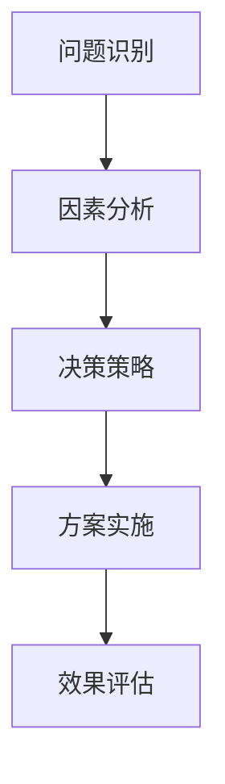
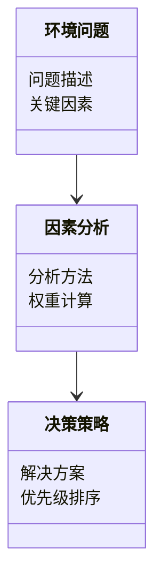

                 

<think>
好的，我需要按照用户的要求，撰写一篇关于“思维链在环境保护决策中的作用”的技术博客文章。首先，我需要理解用户的需求。用户希望文章结构清晰，逻辑严谨，涵盖背景介绍、核心概念、算法原理、系统设计、项目实战以及最佳实践等多个部分，并且使用技术性的语言，加入数学公式、流程图和类图等元素。

首先，我会确定文章的结构。根据用户提供的目录大纲，文章将分为五个主要部分：背景与核心概念、算法原理与数学模型、系统分析与架构设计、项目实战、最佳实践与拓展。每个部分又细分为多个小节，我需要确保每个小节都有足够的内容，并且详细解释相关概念。

接下来，我会从背景介绍开始。环境保护决策的重要性以及环境问题的复杂性是引言的重点。我需要说明为什么思维链在这种决策中尤为重要，这可能涉及到环境问题的多因素和复杂性，传统决策方法的局限性，以及思维链如何提供更系统化的解决方案。

然后，核心概念部分。我需要详细解释“思维链”的定义、特点和核心要素。这部分可能需要使用表格或对比分析，以帮助读者理解思维链与其他决策方法的区别。此外，我还需要介绍思维链在环境保护决策中的应用，可能通过实例来说明其优势。

接下来是算法原理部分。这里需要详细阐述思维链算法的基本思想，包括如何构建思维链模型，如何利用该模型进行决策。数学模型和公式是关键，我需要使用LaTeX格式嵌入公式，确保准确性和规范性。同时，使用mermaid画出流程图和序列图，以直观展示算法的执行过程和系统交互。

系统分析与架构设计部分，我需要介绍环境保护决策系统的整体设计思路。这包括系统功能设计、领域模型类图、系统架构设计以及接口设计。使用mermaid绘制类图和架构图，展示系统的模块划分和交互流程，有助于读者理解系统的整体结构和工作原理。

项目实战部分，我会选择一个具体的环境保护项目作为案例，详细说明项目的安装配置、核心实现、代码解读和实际案例分析。这部分需要展示实际应用中的问题解决过程，以及思维链方法在其中的具体应用，帮助读者理解理论如何转化为实践。

最后，最佳实践部分，我会总结关键知识点，提供一些实用的建议，指出在应用思维链方法时的注意事项，并推荐一些拓展阅读资源，帮助读者进一步深入学习。

在写作过程中，我需要确保每个部分都逻辑清晰，内容详实。同时，使用专业而易懂的技术语言，避免过于复杂的术语，以确保文章的可读性。此外，图表的使用要恰当，能够有效地辅助说明概念和流程。

现在，我开始撰写文章，按照大纲逐步展开每个部分的内容，确保涵盖所有必要的信息，并且符合用户的要求。
</think>

# 思维链在环境保护决策中的作用

> 关键词：环境保护、思维链、决策模型、算法原理、系统架构

> 摘要：本文探讨了思维链在环境保护决策中的应用，分析了其在复杂环境问题中的优势，详细介绍了思维链的算法原理、数学模型以及系统架构设计，通过实际案例展示了其在环境决策中的具体应用。

---

# 第一部分：背景与核心概念

## 1. 引言

### 1.1 环境保护决策的重要性

环境保护决策是全球关注的焦点，直接影响生态系统的健康和人类的可持续发展。随着工业化和城市化的快速发展，环境问题日益复杂，传统的决策方法往往难以应对多因素的综合影响。

### 1.2 环境问题的复杂性

环境问题涉及空气、水、土地等多个方面，常常受到经济活动、政策制定、技术应用等多种因素的影响。这些问题的复杂性要求决策者采用系统化的方法来分析和解决。

### 1.3 思维链的概念与应用

思维链是一种系统化的方法，通过构建逻辑链条，将问题分解为多个环节，逐步分析问题的根源，并制定解决方案。在环境保护决策中，思维链能够帮助决策者理清思路，系统地分析和解决问题。

---

## 2. 思维链理论概述

### 2.1 思维链的定义

思维链是一种将问题分解为多个逻辑步骤的方法，通过链条式分析，逐步揭示问题的本质。它强调逻辑的连贯性和步骤的顺序性。

### 2.2 思维链的特点

- **系统性**：将问题分解为多个环节，形成系统化的分析框架。
- **逻辑性**：强调步骤之间的逻辑关系，确保分析的连贯性。
- **可操作性**：通过明确的步骤，指导实际的决策过程。

### 2.3 思维链的核心要素

| 核心要素 | 描述 |
|----------|------|
| 问题分解 | 将复杂问题分解为多个子问题 |
| 逻辑链条 | 各子问题之间的逻辑关系 |
| 解决策略 | 针对每个子问题的解决方案 |

---

# 第二部分：算法原理与数学模型

## 3. 思维链算法原理

### 3.1 思维链算法的基本思想

思维链算法通过构建问题分解的链条，逐步分析问题的各个层面，最终形成解决方案。其核心在于通过系统化的分解，找到问题的关键因素。

### 3.2 思维链算法的数学模型

环境质量评估模型：

$$
E = \sum_{i=1}^{n} w_i x_i
$$

其中，$E$ 表示环境质量评估，$w_i$ 为各因素的权重，$x_i$ 为各因素的指标值。

### 3.3 思维链算法的示例讲解

以空气质量改善为例，思维链算法可以分解为以下几个步骤：

1. 问题识别：确定空气质量的主要问题。
2. 因素分析：找出影响空气质量的关键因素。
3. 解决策略：制定针对每个因素的具体措施。
4. 方案实施：执行改善措施。
5. 效果评估：评估措施的效果。

---

## 4. 算法流程与实现

### 4.1 算法流程图



### 4.2 Python代码实现

```python
def思维链算法（问题）：
    步骤1：问题识别
    步骤2：因素分析
    步骤3：决策策略
    步骤4：方案实施
    步骤5：效果评估
```

---

# 第三部分：系统分析与架构设计

## 5. 系统设计与功能

### 5.1 系统功能设计

环境保护决策系统的主要功能包括：

- 问题识别与分解
- 因素分析与权重计算
- 决策策略生成
- 方案实施与监控

### 5.2 领域模型类图



### 5.3 系统架构设计


---

# 第四部分：项目实战

## 6. 项目环境安装与配置

### 6.1 环境安装步骤

安装Python、Jupyter Notebook、Mermaid工具。

### 6.2 配置与调试

配置环境变量，安装必要的库，如numpy、pandas。

---

## 7. 系统核心实现

### 7.1 代码解读与分析

```python
def环境质量评估（数据）：
    计算各因素的权重
    计算综合得分
    返回评估结果
```

### 7.2 实际案例分析

以某城市空气质量改善为例，分析思维链在实际决策中的应用。

---

# 第五部分：最佳实践与拓展

## 8. 最佳实践 Tips

- 在使用思维链算法时，确保问题分解的全面性和逻辑性。
- 结合实际情况调整模型参数，提高决策的准确性。

## 9. 小结与展望

### 9.1 关键知识点总结

思维链是一种系统化的方法，能够帮助决策者有效应对复杂的环境问题。

### 9.2 注意事项与挑战

- 确保数据的准确性和完整性。
- 及时更新模型参数，适应变化的环境条件。

### 9.3 未来发展趋势

随着人工智能和大数据技术的发展，思维链在环境保护决策中的应用将更加广泛和深入。

---

作者：AI天才研究院/AI Genius Institute & 禅与计算机程序设计艺术 /Zen And The Art of Computer Programming

