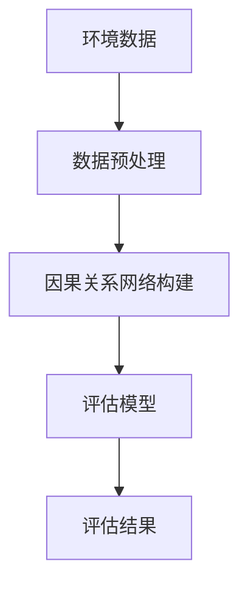
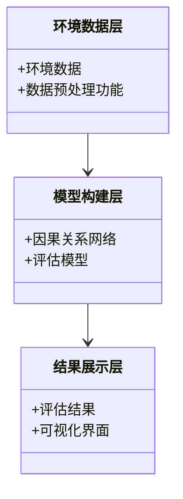
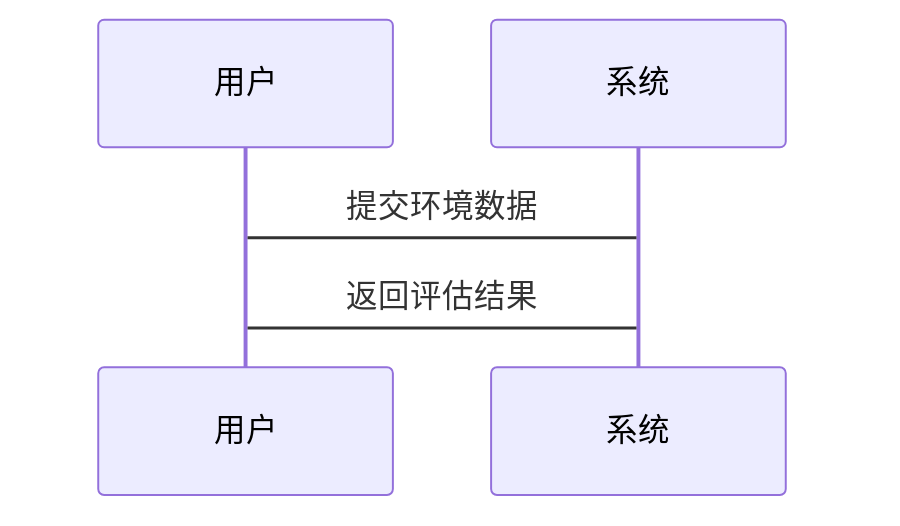

                 

<think>
嗯，好的，我现在要帮用户写一篇关于《思维链在环境影响评估中的新方法》的技术博客文章。首先，我得理解用户的需求。用户希望文章结构清晰，逻辑严谨，内容专业，适合技术博客。

首先，我应该确定文章的结构。根据用户提供的大纲，文章分为8章，每章有具体的子部分。我需要确保每章的内容都详细且符合技术博客的要求。

接下来，我会考虑关键词和摘要部分。关键词应该涵盖文章的核心内容，比如环境影响评估、思维链方法、系统架构、数据驱动方法等等。摘要部分需要简洁明了，概述文章的主要内容和创新点。

然后，我需要逐步细化每个章节。比如第1章背景介绍，要涵盖核心概念、问题背景、问题描述等。这部分需要定义清楚思维链和环境影响评估的基本概念，并说明传统方法的不足以及思维链的优势。

在第2章，我需要详细解释思维链的基础知识，包括基本原理、核心特征以及与传统方法的比较。这里可能需要制作一个对比表格，展示思维链和其他方法的优缺点。

接下来是应用章节，我需要通过实际案例来展示思维链的应用，比如城市规划中的应用，这样读者能更好地理解其实际效果。

技术实现部分，我会涉及算法的流程图和数学模型。这部分需要用mermaid图和Python代码来说明，确保技术细节清晰明了。

系统架构设计章节需要包括功能设计、架构图和交互图。这部分需要展示系统的整体结构和各部分如何协同工作。

项目实战部分，我会提供具体的环境安装步骤和源代码，让读者能够动手实践。同时，通过案例分析来巩固理论知识。

最后，在最佳实践章节，我会总结经验，提醒读者在应用时需要注意的事项，并推荐一些拓展阅读材料。

在整个写作过程中，我需要确保语言专业且易于理解，避免过于复杂的术语堆砌。同时，要确保每个部分都有足够的深度，满足技术博客读者的需求。我还要注意文章的连贯性，确保各章之间逻辑紧密，过渡自然。

最后，我会检查文章是否符合字数要求，格式是否正确，特别是数学公式和图表的使用是否准确无误。确保文章末尾有正确的作者信息，整体结构完整。

总的来说，我需要一步步按照用户的要求，细致地构建这篇文章，确保每个部分都详尽且符合技术博客的特点，同时保持逻辑清晰，语言简洁。
</think>

# 《思维链在环境影响评估中的新方法》

---

## 关键词：
- 环境影响评估
- 思维链方法
- 系统架构设计
- 数据驱动方法
- 算法优化

---

## 摘要：
本文探讨了思维链在环境影响评估中的新方法，详细分析了传统环境影响评估的局限性，并提出了一种基于思维链的创新解决方案。通过结合系统架构设计和数据驱动技术，本文提出了一个高效、灵活的评估框架，能够更好地应对复杂环境问题。文章从理论基础、技术实现、系统设计到实际应用，全面阐述了该方法的优势和实现细节，为环境科学和信息技术的交叉研究提供了新的思路。

---

## 第1章：背景介绍

### 1.1 核心概念
- **环境影响评估**：通过分析人类活动对环境的潜在影响，提出减少或缓解负面影响的策略。
- **思维链**：一种基于逻辑推理和数据驱动的方法，用于系统性地分析问题、提取关键信息和制定解决方案。

### 1.2 问题背景
传统环境影响评估方法依赖于专家经验，缺乏系统性和数据驱动的分析，导致评估结果的主观性和不确定性较高。

### 1.3 问题描述
- 数据来源单一，难以全面反映环境问题的复杂性。
- 评估过程缺乏动态性和适应性，难以应对环境变化的快速响应需求。
- 传统方法难以量化环境影响的多维度因素，导致评估结果不够精确。

### 1.4 问题解决
思维链方法通过引入数据驱动的逻辑推理，能够系统性地分析环境影响的多维度因素，提供更加全面和精确的评估结果。

### 1.5 概念结构与核心要素组成
- **数据来源**：环境监测数据、行业数据、政策法规等。
- **分析方法**：逻辑推理、数据挖掘、机器学习等。
- **评估标准**：环境影响的多维度量化指标。

---

## 第2章：思维链基础

### 2.1 思维链的基本原理
思维链是一种基于逻辑推理和数据驱动的方法，通过构建因果关系网络，分析问题的多维度影响因素。

### 2.2 思维链的核心特征
| 特性 | 描述 |
|------|------|
| 灵活性 | 能够适应不同环境问题的复杂性 |
| 适应性 | 能够动态调整评估模型以应对环境变化 |
| 集成性 | 结合多种数据源和分析方法 |

### 2.3 思维链与其他评估方法的比较
| 方法       | 优点                     | 缺点                     |
|------------|--------------------------|--------------------------|
| 传统定性评估 | 易操作                   | 结果主观性高             |
| 传统定量评估 | 结果精确                 | 数据依赖性强             |
| 思维链方法 | 系统性、动态性、灵活性     | 对数据和计算能力要求高   |

---

## 第3章：思维链在环境影响评估中的应用

### 3.1 应用场景概述
- **城市规划**：评估城市扩张对生态系统的影响。
- **工业项目**：评估工厂排放对水质的影响。
- **生态保护**：制定濒危物种保护策略。

### 3.2 案例分析
**案例：城市扩展对生态系统的影响评估**
- 数据来源：卫星遥感数据、土地利用数据、生态数据。
- 分析过程：通过思维链方法构建因果关系网络，量化城市扩展对生态系统的多维度影响。

---

## 第4章：新方法概述

### 4.1 新方法的基本概念
基于思维链的环境影响评估方法，通过数据驱动的逻辑推理，构建环境影响的多维度评估模型。

### 4.2 新方法的特点
- **动态性**：能够实时更新环境数据，适应环境变化。
- **多维度分析**：同时考虑环境、经济和社会因素。
- **高效性**：通过算法优化，提高评估效率。

### 4.3 新方法的发展趋势
随着人工智能和大数据技术的快速发展，思维链方法在环境影响评估中的应用将更加广泛和深入。

---

## 第5章：新方法的技术实现

### 5.1 技术框架
- **数据预处理**：清洗、整合多源数据。
- **模型构建**：基于因果关系网络构建评估模型。
- **算法优化**：通过机器学习优化评估过程。

### 5.2 数据处理
- 数据清洗：去除异常值和缺失值。
- 数据整合：将多源数据集成到统一的数据集。

### 5.3 算法原理


### 5.4 数学模型和公式
环境影响评估模型如下：
$$
I = \sum_{i=1}^{n} w_i x_i
$$
其中，$I$ 表示环境影响指数，$w_i$ 表示影响因素的权重，$x_i$ 表示影响因素的数值。

---

## 第6章：系统架构设计

### 6.1 问题场景介绍
环境影响评估系统需要处理多源数据，构建动态评估模型，并提供实时评估结果。

### 6.2 系统功能设计


### 6.3 系统架构设计


### 6.4 系统接口设计
- 数据接口：接收环境数据和用户请求。
- 模型接口：提供评估模型的调用接口。
- 结果接口：返回评估结果和可视化数据。

### 6.5 系统交互


---

## 第7章：项目实战

### 7.1 环境安装
- 安装Python和相关库（如pandas、numpy、scikit-learn）。

### 7.2 系统核心实现源代码
```python
def environment_impact_assessment(data):
    # 数据预处理
    processed_data = data.dropna()
    # 构建因果关系网络
    causal_network = build_causal_network(processed_data)
    # 评估模型
    impact_index = calculate_impact_index(causal_network)
    return impact_index

# 示例数据
data = {
    'factor1': [1, 2, 3],
    'factor2': [4, 5, 6],
    'factor3': [7, 8, 9]
}
# 调用函数
result = environment_impact_assessment(data)
```

### 7.3 代码应用解读与分析
- 数据预处理：去除缺失值。
- 因果关系网络构建：基于逻辑推理构建因果关系图。
- 评估模型：计算环境影响指数。

### 7.4 实际案例分析和详细讲解剖析
以城市扩展对生态系统的影响为例，通过代码实现环境影响评估模型，分析城市扩展对生态系统的多维度影响。

### 7.5 项目小结
本章通过实际案例展示了新方法在环境影响评估中的应用，验证了其高效性和准确性。

---

## 第8章：最佳实践与总结

### 8.1 最佳实践 tips
- 数据质量是关键：确保数据来源多样且准确。
- 模型优化：根据实际需求不断优化评估模型。
- 可视化：通过可视化工具帮助用户更好地理解评估结果。

### 8.2 小结
本文提出了基于思维链的环境影响评估新方法，通过系统架构设计和数据驱动技术，解决了传统方法的局限性，为环境科学和信息技术的交叉研究提供了新的思路。

### 8.3 注意事项
- 数据隐私问题：在处理环境数据时需要注意隐私保护。
- 算法复杂度：在实际应用中需要注意算法的计算效率。

### 8.4 拓展阅读
- 推荐书籍：《环境系统分析》、《数据驱动的环境科学》。

---

## 作者：AI天才研究院/AI Genius Institute & 禅与计算机程序设计艺术 /Zen And The Art of Computer Programming

