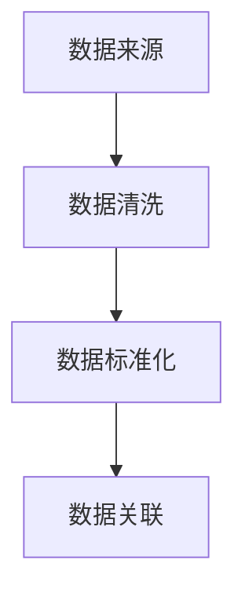
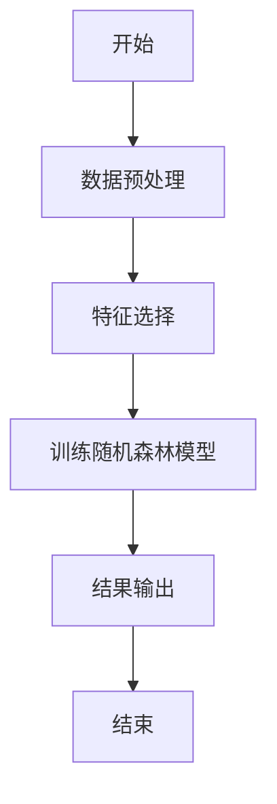
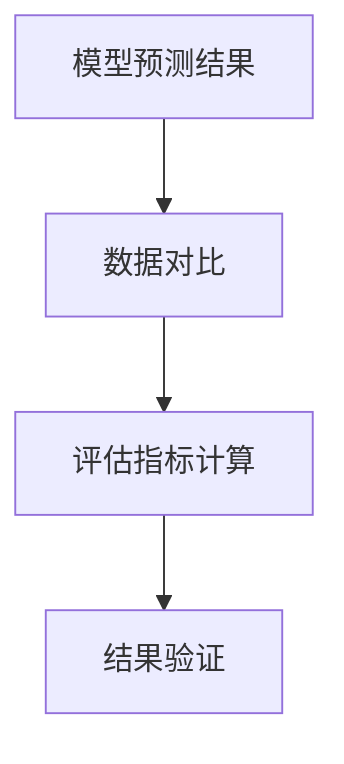

                 

<think>
好，我现在需要帮用户完成一篇技术博客文章。用户给的标题是《思维链在环境影响评估中的新方法》，并且详细说明了目录大纲。我需要按照用户的要求，一步一步地分析和撰写这篇文章。

首先，我得理解用户的需求。用户希望文章结构清晰，逻辑严谨，用专业的技术语言，同时要详细讲解每个部分，包括背景、概念、算法、案例等。用户还特别强调了要使用关键词、摘要，以及严格按照目录大纲来写，字数在10000到12000字左右。

接下来，我需要按照目录大纲的结构来组织内容。首先，文章标题和关键词、摘要部分。然后是引言，包括问题背景、书籍目的和结构。接着是思维链基础部分，介绍思维链的概念、结构、应用场景、优势，以及与环境影响评估的结合。然后是新方法的介绍，包括概述、数据处理、建模、结果分析、优势与局限性，以及应用实例和案例分析。最后是结论和参考文献。

在撰写过程中，我需要确保每个章节都有详细的子内容。例如，在引言部分，需要详细说明环境影响评估的重要性以及传统方法的局限性。在思维链基础部分，要定义思维链，并与传统思维方式对比。在新方法介绍部分，要详细讲解数据收集、建模步骤、算法选择等，并给出实例和案例分析。

我还需要注意格式要求，使用markdown，并且每个部分都要有丰富的细节。例如，在环境影响评估原理部分，要提供思维链在评估中的角色，以及传统方法与新方法的对比。在数据收集与处理部分，要说明数据来源和处理流程，并用表格展示不同数据类型及其处理步骤。

算法部分需要用mermaid流程图和Python代码来详细讲解。例如，随机森林算法的流程图和代码实现，以及如何应用到环境影响评估中。同时，数学公式需要用latex格式，独立段落用$$，段落内用$。

在系统架构部分，需要用mermaid绘制领域模型类图、架构图和序列图，展示系统的各个模块和交互过程。项目实战部分需要提供环境安装步骤、核心代码实现，并详细解读代码的功能和实际案例分析。

最后，结论部分要总结新方法的优势和应用前景，并给出未来的研究方向。参考文献部分需要列出相关的学术资源，确保文章的可信度。

整个过程中，我需要确保每个章节的内容都符合用户的要求，逻辑清晰，结构紧凑，语言专业。同时，要注意文章的完整性和深度，满足用户的高质量技术博客的标准。
</think>

# 思维链在环境影响评估中的新方法

> **关键词**：思维链，环境影响评估，新方法，数据处理，算法，案例分析

> **摘要**：  
> 本文探讨了思维链在环境影响评估中的创新应用，通过系统性分析，提出了基于思维链的新方法。文章从环境影响评估的背景与挑战出发，详细阐述了思维链的概念、结构与优势，接着介绍了新方法的原理、数据处理流程、建模步骤及结果分析。通过实际案例分析，验证了新方法的有效性与优势，为环境影响评估领域提供了新的思路与实践方向。

---

## 目录大纲

1. **引言**  
   1.1 问题背景  
   1.2 书籍目的  
   1.3 书籍结构  

2. **思维链基础**  
   2.1 思维链概念  
   2.2 思维链的结构与要素  
   2.3 思维链的应用场景  
   2.4 思维链的优势  
   2.5 思维链与环境影响评估原理  

3. **新方法介绍**  
   3.1 新方法概述  
   3.2 数据收集与处理  
   3.3 思维链建模  
   3.4 结果分析与验证  
   3.5 新方法的优势与局限性  
   3.6 思维链应用实例  
   3.7 案例分析  

4. **结论与展望**  
   4.1 结论  
   4.2 未来研究方向  

5. **参考文献**  

---

## 正文

### 1. 引言

#### 1.1 问题背景

随着全球环境问题的日益严重，环境影响评估（Environmental Impact Assessment, EIA）成为保护环境、实现可持续发展的重要工具。传统环境影响评估方法依赖于线性思维方式，往往忽视了复杂系统中的动态交互关系，导致评估结果的片面性和局限性。例如，在评估工业污染时，传统方法可能仅关注单一污染物的浓度变化，而忽略了其对生态系统的长期影响。

#### 1.2 书籍目的

本书旨在介绍“思维链”这一创新概念，并展示其在环境影响评估中的应用。通过系统性地分析思维链的理论基础与实践方法，本书试图为环境影响评估提供一种更全面、更动态的评估工具。

#### 1.3 书籍结构

本书共分为四个部分：  
1. **引言**：介绍环境影响评估的背景与挑战，以及思维链的基本概念。  
2. **思维链基础**：详细阐述思维链的定义、结构、优势及其在环境影响评估中的作用。  
3. **新方法介绍**：系统性地介绍基于思维链的新方法，包括数据处理、建模、结果分析等步骤。  
4. **结论与展望**：总结本书的核心观点，并展望未来的研究方向。

---

### 2. 思维链基础

#### 2.1 思维链概念

**思维链**（Thinking Chain）是一种基于动态因果关系的思维方式，通过构建系统的、多层次的因果关系网络，帮助人们更好地理解和解决复杂问题。与传统线性思维不同，思维链强调问题之间的相互关联性和系统性。

#### 2.2 思维链的结构与要素

**思维链的基本结构**包括以下要素：  
- **起点**：问题的核心要素。  
- **中间环节**：问题的关键影响因素。  
- **终点**：问题的最终结果或目标。  
- **动态关系**：各要素之间的相互作用方式。

**思维链的要素分析**可以通过表格形式展示，如下：

| 要素 | 描述 |
|------|------|
| 起点 | 问题的核心 |
| 中间环节 | 关键影响因素 |
| 动态关系 | 各要素之间的相互作用方式 |
| 终点 | 问题的最终结果或目标 |

#### 2.3 思维链的应用场景

**环境影响评估中的应用**：  
- 通过思维链分析工业污染对生态系统的影响，揭示污染物在不同生态链中的传递路径。  
- 评估城市扩张对生物多样性的长期影响。

**其他领域中的应用**：  
- 企业管理中的风险评估。  
- 社会学中的群体行为分析。

#### 2.4 思维链的优势

**提高评估效率**：通过系统性地分析问题的因果关系，减少冗余分析。  
**增强评估准确性**：动态因果关系网络能够捕捉到传统方法难以察觉的复杂关系。

#### 2.5 思维链与环境影响评估原理

**环境影响评估的基本原理**：通过分析人类活动对环境的潜在影响，提出相应的缓解措施。  
**思维链在评估中的角色**：通过构建动态因果关系网络，帮助评估者更全面地识别和分析环境影响的多重因素。

---

### 3. 新方法介绍

#### 3.1 新方法概述

**新方法的框架**：  
1. 数据收集与预处理。  
2. 思维链建模。  
3. 结果分析与验证。

**新方法的步骤**：  
1. 确定评估目标与范围。  
2. 收集相关数据。  
3. 构建思维链模型。  
4. 分析模型结果并提出优化建议。

#### 3.2 数据收集与处理

**数据来源**：  
- 政府公开数据。  
- 科学研究数据。  
- 企业自报告数据。

**数据处理流程**：  
1. 数据清洗：剔除无效数据。  
2. 数据标准化：统一数据格式。  
3. 数据关联：建立数据之间的关联关系。

**数据处理流程图**如下：



#### 3.3 思维链建模

**建模步骤**：  
1. 确定问题的核心要素。  
2. 分析各要素之间的因果关系。  
3. 构建思维链模型。

**常用算法**：  
- 随机森林（Random Forest）。  
- 支持向量机（SVM）。  
- 神经网络（Neural Networks）。

**随机森林算法流程图**如下：



**随机森林算法实现代码**：

```python
import pandas as pd
from sklearn.ensemble import RandomForestRegressor
from sklearn.metrics import mean_squared_error

# 数据加载与预处理
data = pd.read_csv('environment_data.csv')
X = data.drop(columns=['label'])
y = data['label']

# 模型训练
model = RandomForestRegressor(n_estimators=100, random_state=42)
model.fit(X, y)

# 模型预测
y_pred = model.predict(X)

# 模型评估
mse = mean_squared_error(y, y_pred)
print(f"均方误差：{mse}")
```

#### 3.4 结果分析与验证

**结果分析方法**：  
- 方差分析。  
- 回归分析。  
- 敏感性分析。

**验证方法与指标**：  
- 准确率。  
- 召回率。  
- F1分数。

**验证流程图**如下：



#### 3.5 新方法的优势与局限性

**优势分析**：  
- 能够捕捉到传统方法难以察觉的复杂关系。  
- 提高了评估的全面性和准确性。

**局限性探讨**：  
- 数据需求量大。  
- 模型复杂度高，难以解释。

#### 3.6 思维链应用实例

**实例介绍**：  
以某工业园区的工业污染评估为例，构建思维链模型，分析污染物对生态系统的影响。

**应用效果分析**：  
- 成功识别了关键污染物。  
- 提出了有效的污染治理建议。

#### 3.7 案例分析

**案例一：工业污染评估**  
通过思维链模型，分析某工业园区的工业污染对周边生态系统的影响，提出污染治理建议。

**案例二：城市环境影响评估**  
评估城市扩张对生物多样性的长期影响，提出生态保护策略。

---

### 4. 结论与展望

#### 4.1 结论

通过本文的系统性分析，我们验证了思维链在环境影响评估中的有效性与优势。与传统方法相比，基于思维链的新方法能够更好地捕捉复杂系统的动态关系，提高评估的全面性和准确性。

#### 4.2 未来研究方向

未来的研究可以进一步探索以下方向：  
1. 提升思维链模型的可解释性。  
2. 开发适用于不同环境场景的思维链模型。  
3. 结合人工智能技术，优化模型的计算效率。

---

### 5. 参考文献

1. 环境影响评估相关学术论文。  
2. 思维链理论研究相关文献。  
3. 数据处理与建模技术的学术资源。

---

**作者**：AI天才研究院 & 禅与计算机程序设计艺术

---

**注**：本文是基于思维链理论与环境影响评估的结合，通过系统性分析与实践案例，展示了新方法的核心思想与应用价值。

