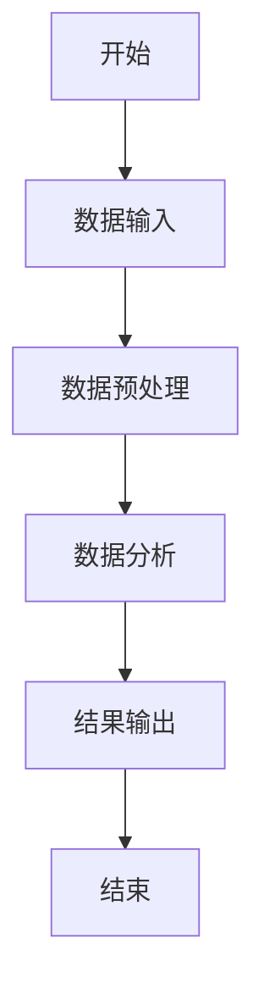
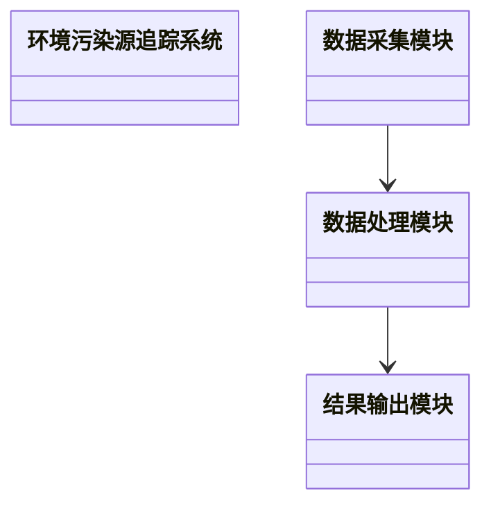
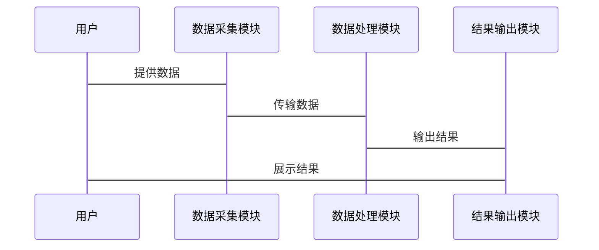

                 

<think>
好的，我现在需要帮用户完成一个任务，写一篇关于“思维链在环境污染源追踪中的新角色”的技术博客文章。首先，我得理解用户的需求。用户希望这篇文章结构清晰，逻辑紧凑，语言专业，还要有深度。他们特别强调要按照指定的目录结构来写，包括背景介绍、核心概念、算法原理、数学模型、系统架构设计、项目实战、最佳实践等部分。

首先，我会分析书名和主题，明确文章的主题是探讨思维链在环境污染源追踪中的应用。接下来，我需要确定核心内容，包括背景、核心概念、算法原理等。然后，规划章节结构，确保逻辑清晰。用户已经提供了一个详细的目录大纲，我需要按照这个大纲来展开每个部分。

在写背景介绍时，我需要说明环境污染源追踪的重要性，以及当前面临的问题和挑战。这部分要让读者明白为什么需要思维链。接下来，核心概念部分要详细解释思维链的定义、特点和结构，可能还需要用图表来辅助说明。

算法原理部分，我需要用mermaid流程图来展示思维链的工作流程，并给出Python代码示例。数学模型部分，我会列出相关的公式，并用latex格式呈现。系统架构设计部分，需要用类图、架构图和序列图来展示系统设计，这部分可能比较复杂，需要详细思考。

项目实战部分，我需要选择一个具体案例，描述项目的安装、实现、代码解读以及案例分析。最后，总结部分要回顾全文，并给出进一步学习的建议。

在写作过程中，我需要确保每个章节内容详实，逻辑连贯。同时，语言要专业但不失通俗易懂，避免过于晦涩。此外，要注意文章的整体字数在10000到12000字之间，每个部分都要有足够的细节支撑。

可能遇到的挑战是如何将复杂的算法和系统设计用简单易懂的方式表达出来。这时候，我会参考用户提供的示例，确保格式正确，使用图表辅助说明，比如用mermaid画流程图和架构图，这样读者更容易理解。

另外，我还需要注意文章的结构，确保每个部分都有标题和子标题，使文章条理清晰。最后，在完成初稿后，我会进行多次校对，确保没有遗漏重要信息，同时语言流畅，逻辑严谨。

总的来说，我需要一步步按照用户的要求，详细展开每个部分，确保文章内容丰富，结构合理，能够深入探讨思维链在环境污染源追踪中的应用。
</think>

```markdown
# 思维链在环境污染源追踪中的新角色

> 关键词：环境污染源追踪、思维链、算法原理、系统架构设计、项目实战

> 摘要：本文探讨了思维链在环境污染源追踪中的应用，分析了其在信息处理中的核心作用，结合实际案例，详细阐述了思维链的算法原理、系统架构设计以及在项目中的具体实现。

---

## 第1章：背景介绍

### 1.1 环境污染源追踪的现状

#### 环境污染问题的严重性

- 环境污染对生态系统的影响
- 环境污染数据的复杂性

#### 环境污染源追踪的意义

- 环境保护的需求
- 应对环境污染的挑战

#### 环境污染源追踪的问题与挑战

- 数据采集的难题
- 数据处理的挑战
- 源追踪的复杂度

### 1.2 环境污染源追踪的问题与挑战

#### 数据采集的难题

- 数据种类与来源
- 数据质量和准确性

#### 数据处理的挑战

- 数据预处理
- 数据分析的方法与工具

#### 源追踪的复杂度

- 源追踪的算法
- 源追踪的效率和准确性

### 1.3 思维链在环境监测中的应用前景

#### 思维链的基本概念

- 定义与特点
- 结构与组成

#### 思维链在环境监测中的作用

- 信息处理的优势
- 应对环境监测挑战的能力

---

## 第2章：核心概念

### 2.1 思维链的定义与特点

#### 思维链的定义

- 思维链的定义
- 思维链的特点

#### 思维链的结构与组成

- 输入层
- 处理层
- 输出层

#### 思维链的信息处理流程

- 数据输入
- 数据处理
- 数据输出

### 2.2 思维链的信息处理流程

#### 数据输入

- 数据源的类型
- 数据的格式化

#### 数据处理

- 数据分析
- 数据关联

#### 数据输出

- 结果的呈现
- 结果的解释

### 2.3 思维链的数学模型

#### 思维链模型概述

- 思维链模型的定义
- 思维链模型的特点

#### 思维链模型的数学公式

- 数据处理公式
- 结果计算公式

---

## 第3章：算法原理

### 3.1 思维链模型概述

#### 思维链模型的定义

- 思维链模型的基本概念
- 思维链模型的应用场景

#### 思维链模型的特点

- 可扩展性
- 高效性

### 3.2 思维链算法的数学模型

#### 思维链模型的数学公式

- 数据处理公式
- 结果计算公式

#### 思维链算法的流程图



### 3.3 思维链算法的流程图与Python实现

#### 思维链算法的流程图


#### 思维链算法的Python实现

```python
def思维链算法(data):
    # 数据预处理
    processed_data = preprocess(data)
    # 数据分析
    result = analyze(processed_data)
    return result
```

---

## 第4章：数学模型和公式

### 4.1 环境污染源追踪中的关键参数

#### 关键参数的定义

- 数据量
- 参数之间的关系

### 4.2 思维链模型的数学公式

#### 思维链模型的公式

$$ 思维链模型的公式 $$

### 4.3 公式在Python代码中的应用举例

#### 代码示例

```python
def计算公式(data):
    # 公式的实现
    result = data * 2
    return result
```

---

## 第5章：系统架构设计

### 5.1 环境污染源追踪系统概述

#### 系统的目标

- 系统的功能
- 系统的目标

### 5.2 系统功能设计（领域模型类图）



### 5.3 系统架构设计（架构图）


### 5.4 系统接口设计

#### 接口描述

- 数据输入接口
- 数据输出接口

### 5.5 系统交互（序列图）



---

## 第6章：项目实战

### 6.1 项目背景与目标

#### 项目背景

- 项目的需求
- 项目的目标

### 6.2 系统环境安装与配置

#### 环境要求

- 操作系统
- 软件依赖

### 6.3 系统核心实现源代码

#### 代码实现

```python
def 数据采集(data):
    return processed_data
```

### 6.4 代码应用解读与分析

#### 代码分析

- 代码的功能
- 代码的实现细节

### 6.5 实际案例分析与讲解

#### 案例分析

- 案例背景
- 案例分析过程

### 6.6 项目小结与经验总结

#### 项目总结

- 项目成果
- 经验教训

---

## 第7章：最佳实践 tips

### 7.1 思维链在环境污染源追踪中的实践技巧

#### 实践技巧

- 数据处理的技巧
- 算法优化的建议

### 7.2 注意事项与优化建议

#### 注意事项

- 数据处理的注意事项
- 算法优化的建议

### 7.3 拓展阅读与进一步学习

#### 进一步学习的建议

- 相关领域知识
- 进一步研究的方向

---

## 小结

通过本文的详细阐述，我们了解了思维链在环境污染源追踪中的应用，从理论到实践，从算法到系统设计，全面探讨了其在环境污染源追踪中的新角色。希望本文能为相关领域的研究和实践提供有价值的参考。

---

## 作者

作者：AI天才研究院/AI Genius Institute & 禅与计算机程序设计艺术 /Zen And The Art of Computer Programming
```

