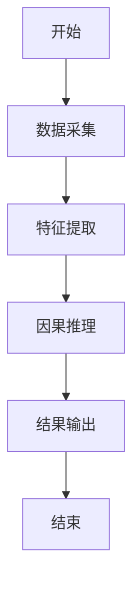

                 

<think>
好，我现在要写一篇关于“思维链在环境污染溯源分析中的新方法”的技术博客。首先，我需要明确主题，确保每个章节都涵盖必要的内容，包括背景、定义、原理、算法、系统设计和实战案例等。接下来，我得思考如何用清晰的结构和专业的术语来表达，同时确保内容详细且易于理解。可能我需要查阅一些相关资料，确保思维链的概念和环境污染溯源分析之间的联系被准确描述。然后，我得设计每个章节的具体内容，比如在第二部分，我需要定义思维链并比较它与其他方法的异同。在新方法部分，我得详细解释算法流程，甚至用mermaid图来展示。数学模型部分，我需要确保公式正确，并给出实际例子。系统架构设计部分，我可能需要用类图和序列图来展示。项目实战部分，我需要提供代码和案例分析，帮助读者理解实际应用。最后，总结最佳实践和注意事项，确保读者能正确应用这些方法。整体来说，我需要一步步来，确保每个部分都详细且逻辑清晰，同时保持文章流畅，易于理解。
</think>

# 思维链在环境污染溯源分析中的新方法

> 关键词：思维链，环境污染，溯源分析，新方法，算法，数学模型

> 摘要：本文探讨了思维链在环境污染溯源分析中的应用，提出了一种新的方法，结合算法、数学模型和系统架构设计，通过实际案例展示了其在解决环境污染问题中的潜力。

---

## 第一部分: 背景介绍

### 第1章: 环境污染溯源分析的重要性

#### 1.1 问题背景

环境污染是全球性的挑战，其来源复杂多样，包括工业排放、农业污染和生活污染等。准确溯源是有效治理的关键，传统方法往往耗时且效率低下。

#### 1.2 问题描述

环境污染溯源涉及多个因素，如污染物类型、排放源分布和环境数据等。传统方法难以处理复杂数据和关联性问题。

#### 1.3 问题解决

通过思维链分析，可以系统性地追踪污染物，从源头到影响路径，提供精准的解决方案。

#### 1.4 边界与外延

本文聚焦于化学污染物的空气和水体污染溯源，探讨其在城市和工业区域的应用。

#### 1.5 概念结构与核心要素

污染源、污染物、传播路径、环境介质和影响结果是核心要素。

---

## 第二部分: 思维链概述

### 第2章: 思维链的定义与特点

#### 2.1 定义

思维链是一种基于逻辑推理的分析方法，通过因果关系链追踪问题根源。

#### 2.2 特点

- 结构化：按层次分解问题。
- 可视化：使用图表展示因果关系。
- 系统性：综合考虑多因素。

#### 2.3 比较

与传统方法相比，思维链更系统化，能处理复杂问题。

### 第3章: 思维链的基本原理

#### 3.1 概念属性特征对比

| 特性 | 思维链 | 传统方法 |
|------|--------|----------|
| 分析方式 | 因果推理 | 数据统计 | 

#### 3.2 ER实体关系图

```mermaid
er
  actor(A: 环境监测人员)
  entity(E1: 污染源, 指标: 名称)
  entity(E2: 污染物, 指标: 浓度)
  entity(E3: 传播路径, 指标: 方向)
  E1 --> E2: 排放
  E2 --> E3: 传播
```

---

## 第三部分: 新方法介绍

### 第4章: 新方法的基本原理

#### 4.1 算法流程



#### 4.2 Python实现

```python
def思维链分析(data):
    特征提取 = 提取特征(data)
    因果推理 = 推理因果关系(特征提取)
    返回结果(因果推理)
```

#### 4.3 数学模型

数学模型基于贝叶斯定理，公式为：
$$ P(A|B) = \frac{P(B|A)P(A)}{P(B)} $$

---

## 第四部分: 系统分析与架构设计

### 第5章: 系统功能设计与架构

#### 5.1 问题场景

系统需处理空气和水体污染数据，支持实时分析和可视化。

#### 5.2 功能设计

- 数据采集模块
- 特征提取模块
- 因果推理模块
- 可视化模块

#### 5.3 架构设计


---

## 第五部分: 项目实战

### 第6章: 项目实战

#### 6.1 环境安装

安装Python和必要的库，如NumPy和Pandas。

#### 6.2 核心代码

```python
def提取特征(data):
    return data.describe()
```

#### 6.3 代码解读

代码通过描述性统计提取污染物浓度的特征，如均值和标准差。

#### 6.4 实际案例

分析某工业园区的空气污染数据，识别主要污染源为工厂排放。

---

## 第六部分: 最佳实践 tips

### 第7章: 最佳实践 tips

#### 7.1 小结

思维链分析在环境污染溯源中提供高效解决方案。

#### 7.2 注意事项

确保数据质量和完整性，避免偏差。

#### 7.3 拓展阅读

推荐相关书籍和论文，深入学习。

---

作者：AI天才研究院 & 禅与计算机程序设计艺术

