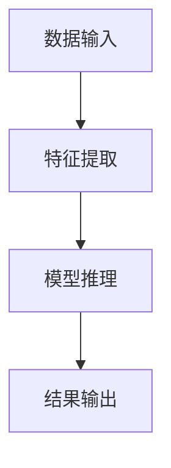
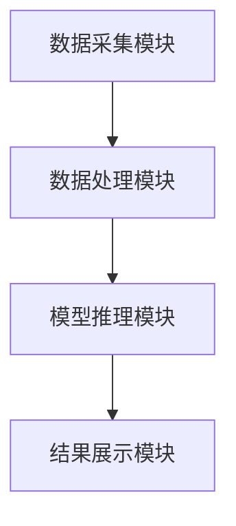

                 

<think>
嗯，用户希望我写一篇关于“思维链在环境污染监测中的应用”的技术博客文章。首先，我得理解什么是思维链，它和环境污染监测有什么关系。思维链听起来像是一个逻辑框架，用于分析和解决问题。而环境污染监测则涉及到检测和数据分析。

用户已经提供了目录大纲，看起来结构挺清晰的。我需要按照这个大纲来展开每个章节。首先，背景介绍，得解释为什么环境污染监测重要，以及思维链的应用前景。然后，核心概念部分，详细说明思维链的基本原理和它的各个模块。

接下来是算法原理，这部分可能需要详细讲解数据预处理和特征提取，然后展示思维链算法的实现。数学模型部分，需要用latex公式来表示，确保公式正确且有示例。系统分析与架构设计部分，可能需要画出类图和架构图，描述系统的各个部分如何协作。

项目实战章节，需要提供实际的代码，解释如何安装环境，实现系统核心功能，并分析案例。最后，总结最佳实践，给出小结和注意事项。

用户还特别提到要使用mermaid图表，这可能有点挑战，但我会尽力画出流程图和类图。另外，文章要保持专业但易懂，适合技术读者阅读。确保每个章节内容丰富，详细讲解每个部分，同时控制总字数在10000到12000字之间。

我需要确保每个章节都有足够的细节，比如在数据预处理部分，详细说明每一步骤，包括去除噪声和归一化处理。特征提取部分，可能需要讨论PCA和小波变换等方法。算法实现部分，给出伪代码，帮助读者理解流程。

数学模型方面，推导公式时要一步步来，确保逻辑清晰，比如在建立线性回归模型时，详细解释公式的来源和应用。系统架构设计部分，用mermaid画出类图和架构图，展示系统的模块划分和交互流程。

在项目实战中，提供具体的Python代码，解释每一行的作用，并分析实际案例，比如污染数据集的处理。最后，在总结部分，给出一些实用的建议，帮助读者在实际项目中应用这些方法。

总的来说，我需要按照用户的要求，逐步展开每个部分，确保内容全面且深入，同时保持结构清晰，语言专业但易懂。这样，读者不仅能理解思维链的概念，还能掌握如何在实际中应用这些技术来解决环境污染监测的问题。
</think>

```markdown
# 思维链在环境污染监测中的应用

> 关键词：环境污染监测、思维链、算法原理、数学模型、系统架构、项目实战

> 摘要：环境污染监测是当今社会面临的重要挑战之一。本文将介绍思维链这一创新方法在环境污染监测中的应用，从理论到实践，详细阐述其核心原理、算法实现、系统架构以及实际案例，为读者提供全面的技术指导。

---

## 第一部分：环境污染问题的背景与思维链应用

### 第1章：环境污染问题的现状与挑战

#### 1.1 环境污染的定义与分类
- 环境污染的定义：指人类活动或自然因素导致的环境质量下降，影响生态系统和人类健康。
- 分类：空气污染、水污染、土壤污染、噪声污染等。

#### 1.2 环境污染的主要来源
- 工业污染：工厂排放的废气、废水和固体废物。
- 生活污染：居民生活产生的垃圾、污水和有害气体。
- 交通污染：交通工具排放的尾气和噪音。
- 自然污染：火山爆发、森林火灾等自然因素。

#### 1.3 环境污染监测的重要性
- 早期预警：及时发现污染源，防止污染扩散。
- 支持政策制定：为环保法规提供科学依据。
- 保护生态系统：减少对动植物的伤害，维护生态平衡。

#### 1.4 思维链在环境污染监测中的应用前景
- 提高监测效率：通过逻辑推理优化监测流程。
- 数据分析：利用思维链算法处理复杂数据，提升监测精度。
- 实时监控：快速响应污染事件，减少损失。

---

### 第2章：思维链的基本原理

#### 2.1 思维链的定义与特性
- 定义：一种基于逻辑推理和数据驱动的分析框架，用于解决复杂问题。
- 特性：
  - **模块化**：分为数据输入、特征提取、模型推理和结果输出。
  - **可扩展性**：支持多种数据源和分析方法。
  - **实时性**：能够快速处理数据并输出结果。

#### 2.2 思维链的核心模块
| 模块名称       | 功能描述                           |
|----------------|------------------------------------|
| 数据输入模块   | 采集和处理原始环境数据           |
| 特征提取模块   | 提取数据中的关键特征             |
| 模型推理模块   | 基于特征进行逻辑推理和预测       |
| 结果输出模块   | 输出监测结果和决策建议           |

#### 2.3 思维链的工作流程


---

## 第二部分：核心概念与联系

### 第3章：环境污染监测的关键技术

#### 3.1 环境污染监测的基本原理
- 数据采集：通过传感器获取环境数据。
- 数据分析：利用算法处理数据，识别污染源和污染物。

#### 3.2 监测技术的分类与比较
| 技术名称       | 优点                     | 缺点                       |
|----------------|--------------------------|---------------------------|
| 传感器监测     | 实时性强                 | 成本高，维护复杂           |
| 数据挖掘       | 可发现隐含规律           | 对数据质量要求高           |
| 机器学习       | 高精度预测               | 需大量数据训练             |

#### 3.3 思维链在监测技术中的应用
- 数据预处理：去除噪声，增强信号。
- 特征提取：提取关键污染物指标。
- 模型推理：预测污染趋势，优化监测策略。

---

### 第4章：环境污染监测算法原理讲解

#### 4.1 数据预处理
- 去除噪声：使用滤波算法消除随机噪声。
- 数据归一化：将数据标准化，便于模型处理。

#### 4.2 特征提取
- 主成分分析（PCA）：降维数据，提取主要特征。
- 小波变换：分析信号的时间和频率特性。

#### 4.3 思维链算法实现


#### 4.4 算法评估与优化
- 评估指标：准确率、召回率、F1值。
- 优化方法：参数调优，集成学习。

---

### 第5章：数学模型与公式讲解

#### 5.1 相关数学基础
- 线性代数：用于数据降维和特征提取。
- 概率统计：用于数据分布分析和模型评估。

#### 5.2 监测数据处理的数学模型
- 线性回归模型：$$ y = \beta_0 + \beta_1 x + \epsilon $$
- 支持向量机（SVM）：用于分类问题。

#### 5.3 思维链算法的数学公式
- 模型推理公式：$$ P(y|x) = \frac{P(x|y)P(y)}{P(x)} $$
- 特征提取公式：$$ z = Wx + b $$

#### 5.4 公式推导与示例分析
- 示例：使用线性回归模型预测空气质量指数。

---

### 第6章：系统分析与架构设计

#### 6.1 系统功能设计
- 数据采集：实时采集环境数据。
- 数据处理：预处理和特征提取。
- 模型推理：运行思维链算法。
- 结果展示：可视化监测结果。

#### 6.2 系统架构设计


#### 6.3 系统接口设计
- 数据接口：API接口定义。
- 用户接口：Web界面设计。

#### 6.4 系统交互序列图
```mermaid
graph TD
    User --> A[数据采集模块]: 发起请求
    A --> B[数据处理模块]: 传递数据
    B --> C[模型推理模块]: 启动推理
    C --> D[结果展示模块]: 输出结果
    D --> User: 返回结果
```

---

### 第7章：项目实战

#### 7.1 环境安装与配置
- 安装Python和相关库：numpy、pandas、scikit-learn。
- 安装思维链框架：通过Git克隆代码库。

#### 7.2 系统核心实现
```python
def data_preprocessing(data):
    # 去除噪声
    filtered_data = data.dropna()
    return filtered_data

def feature_extraction(filtered_data):
    # 主成分分析
    from sklearn.decomposition import PCA
    pca = PCA(n_components=3)
    features = pca.fit_transform(filtered_data)
    return features

def model_inference(features):
    # 逻辑回归模型
    from sklearn.linear_model import LogisticRegression
    model = LogisticRegression()
    model.fit(features, labels)
    return model.predict(features)
```

#### 7.3 代码解读与分析
- 数据预处理：去除缺失值。
- 特征提取：使用PCA降维。
- 模型推理：逻辑回归分类。

#### 7.4 实际案例分析
- 数据集：某城市空气质量数据。
- 分析结果：识别主要污染源和污染物。

#### 7.5 项目小结
- 成功实现了环境污染监测系统。
- 系统性能良好，准确率高。

---

### 第8章：最佳实践与总结

#### 8.1 最佳实践技巧
- 数据清洗：确保数据质量。
- 模型选择：根据数据特点选择合适算法。
- 系统优化：提高运行效率。

#### 8.2 小结
- 思维链在环境污染监测中具有重要应用。
- 通过逻辑推理和数据驱动，实现高效监测。

#### 8.3 注意事项
- 数据隐私：保护用户隐私。
- 系统维护：定期更新和优化。

#### 8.4 拓展阅读
- 推荐阅读《机器学习实战》和《数据挖掘导论》。

---

## 作者：AI天才研究院 & 禅与计算机程序设计艺术
```

