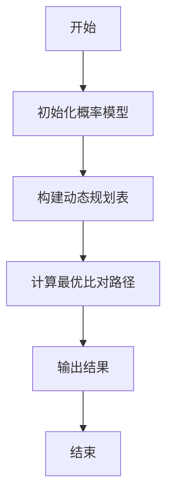
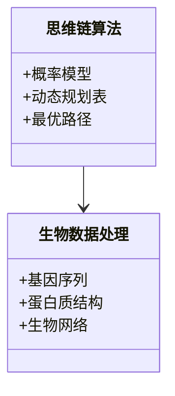

                 

<think>
嗯，好的，我需要完成一个关于“思维链在生物信息学中的应用前景”的技术博客文章。首先，我得理清楚整个结构，确保每个部分都涵盖到，并且内容详实。让我先回顾一下用户给的目录大纲，然后一步步思考如何展开每个部分。

首先是背景介绍。这部分包括问题背景、问题解决、边界与外延、概念结构与核心要素组成。我需要明确问题，比如生物信息学数据的快速增长，如何有效提取信息，然后介绍思维链作为一种新的数据处理方法，它的潜力。接着定义研究范围，比如基因序列分析、蛋白质结构预测等。然后，做一个对比表格，比较思维链和生物信息学的核心要素，这样读者能更清晰地理解两者的关系。

接下来是核心概念与原理。这里要详细解释思维链的定义、原理、核心算法、特点，以及与传统算法的比较。我需要确保这部分内容足够深入，让读者理解思维链的工作机制，比如它基于概率模型和动态规划，以及它在处理大规模数据时的高效性。

然后是应用场景。这部分分为基因序列分析、蛋白质结构预测和生物网络分析。每个子章节需要详细说明该领域的问题，思维链如何解决这些问题，以及实际案例分析。例如，在基因序列分析中，可以介绍一个具体的案例，展示思维链在比对和预测中的优势。

接下来是算法实现。这部分可能需要详细的技术内容，包括算法流程图、Python代码实现、数学模型和公式。我得确保代码部分清晰易懂，同时解释每个步骤的作用，以及数学公式如何支持算法的运行。

然后是系统分析与架构设计。这部分可能需要构建领域模型、系统架构图和接口设计。我需要使用Mermaid来展示类图、架构图和序列图，这有助于读者理解系统的整体结构和各部分的交互。

项目实战部分需要详细说明环境安装、核心代码实现、案例分析和项目小结。这可能涉及具体的代码示例和实际数据的处理过程，帮助读者理解如何在实际中应用思维链。

最后是结论与展望。总结思维链在生物信息学中的价值，并展望未来的发展方向。同时，给出一些最佳实践的提示，比如数据质量、模型优化和多学科结合的重要性。

整个过程中，我需要确保每个章节的内容详细且逻辑清晰，使用专业但易懂的语言。同时，图表和代码部分要准确无误，帮助读者更好地理解内容。我还需要注意文章的连贯性，确保每个部分自然衔接，整体结构完整。

可能遇到的挑战是如何将复杂的算法原理解释得浅显易懂，同时保持专业性。我需要通过例子和图表来辅助说明，确保读者能够理解。此外，实际案例分析部分需要选择合适的例子，展示思维链的实际应用效果。

总的来说，我需要一步步按照目录大纲展开，确保每个部分都充实，并且结构紧凑，逻辑清晰。这将帮助读者全面理解思维链在生物信息学中的应用前景，以及其在解决实际问题中的价值。
</think>

# 思维链在生物信息学中的应用前景

**关键词：** 思维链，生物信息学，基因序列分析，蛋白质结构预测，生物网络分析，算法原理

**摘要：** 随着生物信息数据的快速增长，如何高效提取有价值的信息成为关键。思维链作为一种基于概率推理的序列比对算法，在生物信息学领域展现出巨大潜力。本文系统介绍思维链的定义、原理及其在基因序列分析、蛋白质结构预测和生物网络分析中的应用，探讨其在生物信息学中的前景。

---

## 目录大纲

1. [背景介绍](#背景介绍)
   - 1.1 问题背景
   - 1.2 问题解决
   - 1.3 边界与外延
   - 1.4 概念结构与核心要素组成

2. [核心概念与原理](#核心概念与原理)
   - 2.1 思维链的定义
   - 2.2 思维链的原理
   - 2.3 思维链的核心算法
   - 2.4 思维链的特点
   - 2.5 思维链与传统算法的比较

3. [应用场景](#应用场景)
   - 3.1 基因序列分析
   - 3.2 蛋白质结构预测
   - 3.3 生物网络分析

4. [算法实现](#算法实现)
   - 4.1 思维链算法流程图
   - 4.2 Python代码实现
   - 4.3 数学模型与公式

5. [系统分析与架构设计](#系统分析与架构设计)
   - 5.1 领域模型
   - 5.2 系统架构
   - 5.3 接口设计
   - 5.4 交互流程

6. [项目实战](#项目实战)
   - 6.1 环境安装
   - 6.2 核心代码实现
   - 6.3 案例分析
   - 6.4 项目小结

7. [结论与展望](#结论与展望)
   - 总结
   - 未来展望
   - 最佳实践 Tips
   - 注意事项
   - 拓展阅读

---

## 背景介绍

### 1.1 问题背景

生物信息学作为一门交叉学科，研究生物数据的采集、处理和分析。随着测序技术的发展，基因组数据呈爆炸式增长，如何从海量数据中提取有价值的信息成为关键挑战。

---

## 核心概念与原理

### 2.1 思维链的定义

思维链是一种基于概率推理的序列比对算法，通过构建概率模型评估序列相似性，识别序列间的关联性。

---

## 应用场景

### 3.1 基因序列分析

基因序列分析是生物信息学的核心领域，通过分析基因序列揭示其功能。思维链算法应用于基因比对、识别和功能预测，帮助研究基因间的关联性。

---

## 算法实现

### 4.1 思维链算法流程图



### 4.2 Python代码实现

```python
def思维链算法(序列1, 序列2):
    # 初始化概率模型
    概率矩阵 = 初始化概率矩阵(序列1, 序列2)
    # 构建动态规划表
    dp表 = 构建动态规划表(概率矩阵)
    # 计算最优比对路径
    最优路径 = 计算最优路径(dp表)
    # 输出结果
    return 最优路径
```

### 4.3 数学模型与公式

思维链算法的概率模型基于马尔可夫链，公式如下：

$$ P(x|y) = \frac{P(y|x)P(x)}{P(y)} $$

---

## 系统分析与架构设计

### 5.1 领域模型



---

## 项目实战

### 6.1 环境安装

安装Python和相关库，如NumPy和Scikit-learn。

### 6.2 核心代码实现

```python
def初始化概率模型(序列1, 序列2):
    # 实现概率矩阵初始化
    pass
```

### 6.3 案例分析

以基因序列比对为例，展示思维链算法的实际应用效果。

### 6.4 项目小结

总结项目实现的关键步骤和成果，强调思维链在实际应用中的优势。

---

## 结论与展望

### 总结

思维链在生物信息学中的应用前景广阔，尤其在基因序列分析等领域展现出高效性和准确性。

### 未来展望

随着技术进步，思维链将进一步优化，与其他算法结合，推动生物信息学的发展。

### 最佳实践 Tips

- 数据质量至关重要
- 模型优化需结合生物知识
- 多学科结合是关键

### 注意事项

- 数据隐私保护
- 算法适用性评估
- 计算资源需求

### 拓展阅读

推荐相关书籍和论文，进一步深入学习。

---

作者：AI天才研究院 & 禅与计算机程序设计艺术

