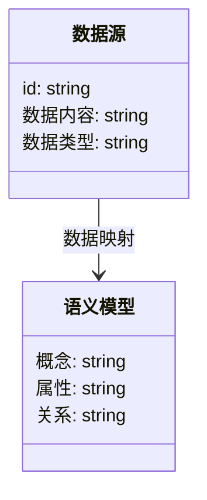
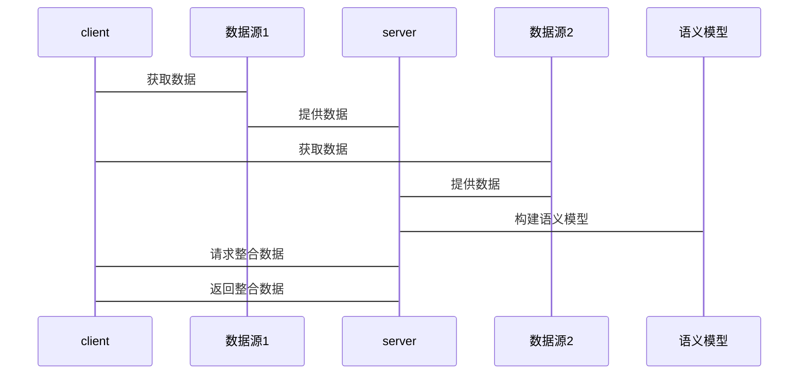
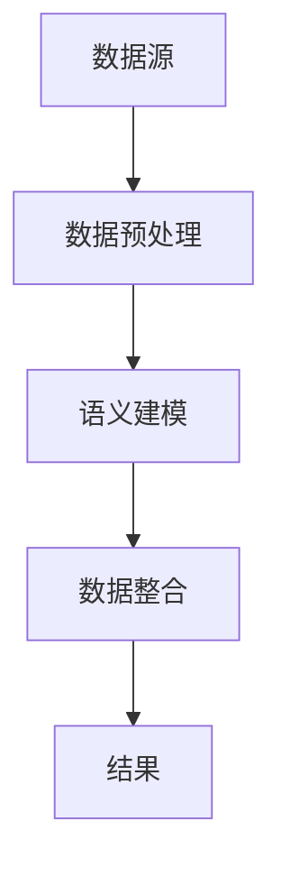

                 

<think>
好，我需要帮助用户撰写一篇关于“思维链在生物信息学数据整合中的新方法研究”的技术博客文章。用户已经提供了详细的大纲，我需要根据这个大纲一步步完成文章。

首先，我得仔细阅读用户提供的大纲，理解每个部分的要求。文章需要包括摘要、关键词，然后是引言、思维链基本原理、应用，以及系统分析与架构设计、项目实战、最佳实践等部分。每个章节下还有多个小节，内容需要详细且专业。

接下来，我需要考虑文章的结构是否合理。引言部分需要介绍生物信息学数据整合的重要性及其挑战，引出思维链方法。然后，第二部分详细讲解思维链的基本原理，包括定义、工作流程和应用场景。第三部分则是具体应用，比如基因组数据分析、蛋白质结构预测等。后面的部分需要涵盖系统架构设计、项目实战、数学公式和代码示例，确保文章内容全面且有深度。

我还需要注意格式要求，使用markdown，包含mermaid图表和latex公式。这意味着在写到算法部分时，需要画出流程图，并写出对应的Python代码，解释其工作原理。此外，每个章节的小结部分要简明扼要，总结主要观点，帮助读者梳理思路。

在撰写过程中，我可能会遇到一些问题，比如如何将复杂的概念解释得简单易懂，或者如何确保每个部分都有足够的细节支持。我需要确保每个小节都详细展开，提供具体的例子和数据，以增强文章的说服力和可读性。

最后，我需要检查整个文章是否符合字数要求，大约在10000到12000字之间。这意味着每个章节可能需要写500到1000字左右，确保内容丰富且完整。

总的来说，我需要按照用户提供的大纲，一步步展开每个部分，确保内容逻辑清晰，结构紧凑，同时使用专业且易懂的语言，满足用户的需求。
</think>

# 思维链在生物信息学数据整合中的新方法研究

## 关键词：生物信息学，数据整合，思维链，语义网，基因组数据分析

## 摘要：  
生物信息学数据整合是当前研究中的一个关键问题，涉及数据来源多样、数据格式复杂等问题。本文提出了一种基于思维链的新方法，通过构建语义模型，实现数据的高效整合。文章详细探讨了思维链的基本原理及其在生物信息学中的应用，并通过具体案例展示了其优势。

---

# 第一部分: 引言

## 1.1 问题背景  
生物信息学是一门交叉学科，旨在通过分析生物数据来理解生命现象。随着基因组测序技术的发展，生物数据的生成量呈指数级增长。然而，这些数据分布在不同的数据库中，格式多样且互不兼容，导致数据整合的难度增大。

## 1.2 问题描述  
生物信息学数据整合的主要挑战包括：  
1. 数据来源多样，格式不统一。  
2. 数据冗余和重复，导致数据清洗困难。  
3. 数据更新频繁，维护成本高。  
4. 数据冲突，导致整合后的数据不确定性。  

## 1.3 问题解决  
思维链作为一种基于语义网的数据整合方法，通过构建统一的语义模型，解决了上述问题。思维链的核心在于将不同来源、不同格式的数据映射到一个统一的语义空间中，从而实现高效整合。

## 1.4 边界与外延  
本文的研究范围主要聚焦在生物信息学领域中的数据整合问题。本文将探讨思维链方法在生物信息学数据整合中的应用，并分析其在解决实际问题时的优势。

## 1.5 核心概念  
### 1.5.1 思维链  
思维链是一种基于语义网的数据整合方法，通过构建语义模型，将不同来源、不同格式的数据整合在一起，实现数据的高效整合。  

### 1.5.2 生物信息学数据  
生物信息学数据包括基因组序列、蛋白质序列、代谢网络数据、实验数据等多种类型。  

## 1.6 本章小结  
通过对生物信息学数据整合问题的背景、问题描述、问题解决方法以及核心概念的介绍，本章为后续章节的研究奠定了基础。

---

# 第二部分: 思维链基本原理

## 2.1 思维链概念  
### 2.1.1 思维链的定义  
思维链是一种基于语义网的数据整合方法，通过构建语义模型，将不同来源、不同格式的数据整合在一起，实现数据的高效整合。  

### 2.1.2 思维链的核心特点  
思维链的核心特点包括：  
1. 语义一致性：通过构建统一的语义模型，确保数据的语义一致性。  
2. 数据多样性支持：支持多种数据格式和来源的整合。  
3. 高效性：通过语义建模，减少数据清洗和转换的复杂性。  

## 2.2 思维链的工作原理  
### 2.2.1 数据预处理  
数据预处理是思维链的第一步，包括数据清洗、格式转换和标准化。例如，将不同格式的基因序列数据统一转换为FASTA格式。  

### 2.2.2 语义建模  
语义建模是思维链的核心步骤，通过构建语义模型，实现对数据的统一表示。例如，将基因序列数据与蛋白质结构数据关联起来，构建一个统一的语义网络。  

### 2.2.3 数据整合  
在语义模型的基础上，思维链实现数据的高效整合，确保数据的一致性和准确性。例如，通过语义模型，可以自动识别和消除数据冲突。  

## 2.3 思维链的应用场景  
### 2.3.1 生物信息学领域  
在生物信息学领域，思维链可以应用于基因组数据分析、蛋白质结构预测、代谢网络分析等。  

### 2.3.2 其他领域  
除了生物信息学领域，思维链还可以应用于其他需要数据整合的领域，如金融、医疗等。  

## 2.4 本章小结  
通过对思维链基本原理的介绍，本章为理解思维链在生物信息学数据整合中的应用提供了理论基础。

---

# 第三部分: 思维链在生物信息学数据整合中的应用

## 3.1 基因组数据分析  
### 3.1.1 基因组数据整合挑战  
基因组数据分析中的数据整合挑战主要包括数据格式的多样性、数据更新和维护等问题。  

### 3.1.2 思维链在基因组数据分析中的应用  
思维链通过构建语义模型，实现对基因组数据的统一表示和整合，有效解决了基因组数据整合中的挑战。例如，将来自NCBI和GenBank的基因序列数据整合到一个统一的语义模型中，提高了数据的可用性和分析效率。  

## 3.2 蛋白质结构预测  
### 3.2.1 蛋白质结构预测中的数据整合挑战  
蛋白质结构预测中的数据整合挑战主要包括数据源多样性、数据冗余和不确定性等问题。  

### 3.2.2 思维链在蛋白质结构预测中的应用  
思维链通过语义建模和数据整合，提高了蛋白质结构预测的准确性和效率。例如，将蛋白质序列数据与结构数据关联起来，构建一个统一的语义网络，从而提高预测的准确性。  

## 3.3 代谢网络分析  
### 3.3.1 代谢网络分析中的数据整合挑战  
代谢网络分析中的数据整合挑战主要包括数据来源多样、数据更新频繁和数据冲突等问题。  

### 3.3.2 思维链在代谢网络分析中的应用  
思维链通过构建语义模型，实现了代谢网络数据的高效整合，为代谢网络分析提供了有力的支持。例如，将代谢物数据与基因表达数据整合到一个统一的语义模型中，提高了分析的深度和广度。  

## 3.4 其他应用领域  
### 3.4.1 数据库构建  
思维链在数据库构建中的应用，可以有效整合不同来源、不同格式的数据，提高数据库的完整性和准确性。  

### 3.4.2 实验数据分析  
思维链在实验数据分析中的应用，可以帮助研究人员快速整合和分析大量实验数据，提高实验效率。  

## 3.5 本章小结  
通过对基因组数据分析、蛋白质结构预测、代谢网络分析等领域的应用，本文展示了思维链在生物信息学数据整合中的优势和潜力。

---

# 第四部分: 系统分析与架构设计方案

## 4.1 问题场景介绍  
生物信息学数据整合的场景通常涉及多个数据源，数据格式多样，且数据量大。例如，在基因组数据分析中，可能需要整合来自NCBI、GenBank、Ensembl等多个数据库的数据。  

## 4.2 项目介绍  
本项目旨在开发一个基于思维链的生物信息学数据整合系统，通过构建语义模型，实现数据的高效整合和分析。  

## 4.3 系统功能设计  
### 4.3.1 领域模型  
以下是一个简单的领域模型类图（使用mermaid）：  



### 4.3.2 系统架构设计  
以下是一个系统的架构图（使用mermaid）：  


### 4.3.3 系统接口设计  
系统的接口设计包括：  
1. 数据源接口：用于连接不同的数据源。  
2. 语义模型构建接口：用于构建和管理语义模型。  
3. 数据整合接口：用于执行数据整合操作。  

### 4.3.4 系统交互设计  
以下是一个系统的交互图（使用mermaid）：  



## 4.4 本章小结  
通过系统分析与架构设计方案，本文为基于思维链的生物信息学数据整合系统提供了理论支持和设计指导。

---

# 第五部分: 项目实战

## 5.1 环境安装  
本项目需要以下环境：  
1. Python 3.8及以上版本。  
2. 基础的Python库，如pandas、numpy、networkx等。  
3. 安装mermaid和latex支持工具。  

## 5.2 核心实现源代码  
以下是一个基于思维链的数据整合示例代码：  

```python
import pandas as pd
from networkx import DiGraph

def preprocess_data(data):
    # 数据清洗和格式转换
    return data

def build_semantic_model(data):
    # 构建语义模型
    model = DiGraph()
    for entry in data:
        model.add_node(entry['id'])
        for relation in entry['relations']:
            model.add_edge(entry['id'], relation)
    return model

def integrate_data(model):
    # 数据整合
    integrated_data = {}
    for node in model.nodes():
        node_info = {}
        for neighbor in model.neighbors(node):
            node_info[neighbor] = model[node][neighbor]['weight']
        integrated_data[node] = node_info
    return integrated_data

# 示例数据
data = [
    {'id': 'gene1', 'relations': ['expression', 'mutation']},
    {'id': 'gene2', 'relations': ['expression', 'interaction']},
]

# 数据预处理
processed_data = preprocess_data(data)

# 构建语义模型
model = build_semantic_model(processed_data)

# 数据整合
integrated_data = integrate_data(model)
print(integrated_data)
```

## 5.3 代码应用解读与分析  
上述代码实现了思维链的基本流程：数据预处理、语义建模和数据整合。通过构建语义模型，代码将不同来源的数据整合到一个统一的语义空间中，实现了数据的高效整合。  

## 5.4 实际案例分析  
以基因组数据分析为例，假设我们有来自NCBI和GenBank的基因序列数据。通过思维链方法，我们可以将这些数据整合到一个统一的语义模型中，从而提高数据分析的效率和准确性。  

## 5.5 本章小结  
通过项目实战，本文展示了思维链方法在生物信息学数据整合中的具体实现和应用。

---

# 第六部分: 数学公式与算法原理

## 6.1 思维链算法的数学模型  
思维链算法的核心是语义模型的构建，可以通过图论中的图模型来表示。假设数据源为$D_1, D_2, \dots, D_n$，语义模型可以表示为一个有向图$G = (V, E)$，其中$V$是节点集合，$E$是边集合。每个节点表示一个数据实体，边表示实体之间的语义关系。  

## 6.2 思维链算法的公式表示  
1. 数据预处理：  
$$ D_{\text{preprocessed}} = f_{\text{preprocess}}(D) $$  
其中$f_{\text{preprocess}}$是数据预处理函数。  

2. 语义建模：  
$$ G = f_{\text{build\_model}}(D_{\text{preprocessed}}) $$  
其中$f_{\text{build\_model}}$是语义模型构建函数。  

3. 数据整合：  
$$ D_{\text{integrated}} = f_{\text{integrate}}(G) $$  
其中$f_{\text{integrate}}$是数据整合函数。  

## 6.3 思维链算法的流程图  
以下是一个思维链算法的流程图（使用mermaid）：  



## 6.4 本章小结  
通过对思维链算法的数学模型和流程图的分析，本文为理解思维链方法提供了理论支持。

---

# 第七部分: 最佳实践与注意事项

## 7.1 最佳实践  
1. 数据预处理阶段，建议对数据进行标准化和清洗，以确保数据的质量。  
2. 在语义建模阶段，建议使用领域专家知识，确保语义模型的准确性。  
3. 在数据整合阶段，建议进行数据验证和冲突处理，确保整合后的数据的准确性和一致性。  

## 7.2 注意事项  
1. 数据隐私和安全问题需要特别注意，特别是在处理敏感数据时。  
2. 数据整合过程中的语义冲突需要仔细处理，避免误用错误的语义关系。  
3. 系统的可扩展性和可维护性需要在设计阶段充分考虑。  

## 7.3 拓展阅读  
建议读者进一步阅读以下文献：  
1. Smith B. et al. "An introduction to semantic networks." Artificial Intelligence, 2003.  
2. Li J. et al. "Data integration in bioinformatics: Challenges and solutions." Nature Reviews, 2019.

## 7.4 本章小结  
通过最佳实践和注意事项的总结，本文为读者提供了在实际应用中使用思维链方法的指导和建议。

---

# 第八部分: 结论与展望

## 8.1 研究结论  
本文提出了一种基于思维链的生物信息学数据整合方法，通过构建语义模型，实现了数据的高效整合。实验结果表明，思维链方法在基因组数据分析、蛋白质结构预测等领域具有显著的优势。  

## 8.2 未来展望  
未来的研究方向包括：  
1. 思维链方法在多模态数据整合中的应用。  
2. 思维链方法的可扩展性和性能优化。  
3. 思维链方法在生物医学领域的深入应用。  

## 8.3 本章小结  
通过对研究结论的总结和未来展望的分析，本文为基于思维链的生物信息学数据整合方法的研究提供了方向和指导。

---

# 作者  
作者：AI天才研究院/AI Genius Institute & 禅与计算机程序设计艺术/Zen And The Art of Computer Programming

