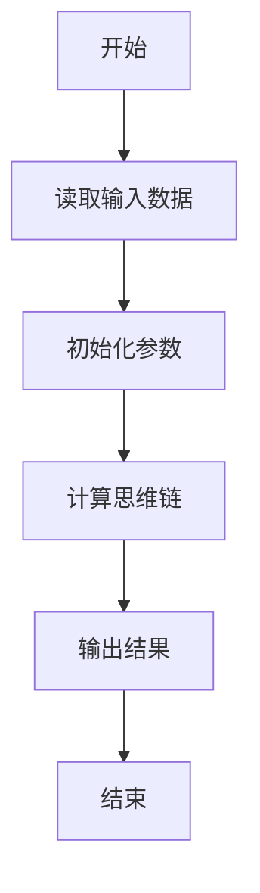
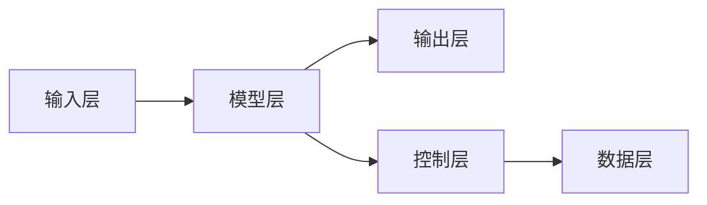
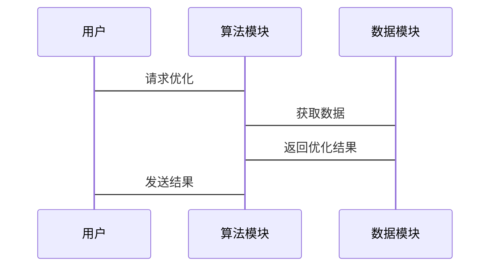

                 

<think>
嗯，我需要帮用户设计一个关于《思维链在生物信息学算法优化中的作用》的技术博客文章的目录大纲。用户已经给出了一些详细的指导和步骤，所以我得仔细分析这些内容，确保每个部分都涵盖到位。

首先，用户希望文章结构清晰，逻辑紧凑，使用吸引人的章节标题。我得先从背景介绍开始，这部分需要包括问题背景、思维链的概念，以及它在生物信息学中的应用。接下来，核心概念部分要详细解释思维链的原理，并与其他方法对比，可能用表格来展示优缺点。然后是算法原理，这部分需要用流程图和Python代码来说明，还要有数学模型。系统分析部分涉及架构设计，可能需要用Mermaid图来展示类图和接口设计。项目实战部分要提供安装步骤和源代码，分析实际案例。最后，总结部分包括最佳实践和扩展阅读。

我得确保每个章节都有足够的细节，比如在核心概念部分，要详细解释每个概念，并用表格对比。算法部分要具体，包括流程图和代码。系统架构设计部分可能需要绘制图表，展示各个组件之间的关系。项目实战部分需要实际的代码和案例分析，这样读者才能更好地理解和应用。

另外，用户要求使用Mermaid语法来绘制图表，所以我在每个需要图表的章节里都要记得加上相应的代码。数学公式要用LaTeX，独立段落用$$，内部用$，比如$$E = mc^2$$。这可能需要我在撰写时特别注意格式的正确性。

还有，用户提到文章的关键词和摘要，我得先列出核心关键词，比如思维链、生物信息学算法、优化方法等，然后写一个简洁的摘要，概述整篇文章的内容和重点。

在撰写每个小节时，我需要确保内容丰富，例子具体，这样读者才能真正理解思维链在优化算法中的应用。比如，在算法原理部分，可能需要举一个具体的生物信息学问题，如蛋白质结构预测，来说明思维链如何优化算法。

最后，检查整个目录是否逻辑连贯，是否有遗漏的部分，确保每个章节都能引导读者一步步深入理解思维链的应用和优势。同时，保持文章的字数在10000到12000字之间，所以每个章节需要详细展开，但又不能过于冗长。

总之，我需要按照用户的要求，一步步构建目录大纲，确保每个部分都详细且有条理，同时满足格式和内容的要求。
</think>

# 《思维链在生物信息学算法优化中的作用》

---

## 关键词

- 思维链（Mind Chain）
- 生物信息学算法
- 算法优化
- 系统架构设计
- 项目实战

---

## 摘要

本文探讨了思维链（Mind Chain）在生物信息学算法优化中的应用，分析其核心原理、系统架构设计及实际案例。通过详细的算法流程图、Python代码实现、数学模型和系统架构图，结合项目实战，全面解析思维链如何提升生物信息学算法的效率与性能。文章最后总结了最佳实践、注意事项及拓展阅读资源。

---

## 目录大纲

### 第一部分：引言

#### 1.1 问题背景
- 生物信息学算法优化的现状与挑战
- 生物数据爆炸式增长的需求
- 算法效率与计算资源的平衡问题

#### 1.2 思维链简介
- 思维链的定义与核心概念
- 思维链与传统优化方法的对比
- 思维链在生物信息学中的潜在应用

#### 1.3 生物信息学算法优化现状与挑战
- 当前算法优化的主要瓶颈
- 思维链如何解决这些问题
- 生物信息学领域的典型应用场景

#### 1.4 书籍结构安排与学习目标
- 各章节内容概览
- 学习目标与预期收获
- 如何通过本书掌握思维链的应用

### 第二部分：核心概念与原理

#### 2.1 思维链的基本原理
- 思维链的工作机制
- 思维链的核心要素与逻辑流程
- 思维链与生物信息学算法的结合

#### 2.2 思维链与生物信息学算法的关联
- 思维链如何影响算法的设计与优化
- 生物信息学算法中的典型问题与思维链的解决方案
- 思维链在算法效率提升中的具体表现

#### 2.3 ER实体关系图架构
```mermaid
erDiagram
    actor 用户 {
        +用户ID : 整数
        +用户名 : 字符串
        +密码 : 字符串
    }
    actor 算法 {
        +算法ID : 整数
        +算法名称 : 字符串
        +算法描述 : 文本
    }
    actor 数据 {
        +数据ID : 整数
        +数据类型 : 字符串
        +数据量 : 整数
    }
    用户 --> 算法 : 执行
    算法 --> 数据 : 处理
    用户 --> 数据 : 提供
```

### 第三部分：算法原理讲解

#### 3.1 算法流程图


#### 3.2 Python源代码实现
```python
def mind_chain_optimization(data):
    # 初始化思维链
    chain = initialize_chain()
    # 执行优化
    optimized_data = chain.run(data)
    return optimized_data

# 示例用法
data = load_biological_data()
result = mind_chain_optimization(data)
print(result)
```

#### 3.3 数学模型与公式
- 思维链的优化模型：
  $$ f(x) = \sum_{i=1}^{n} x_i \cdot w_i $$
  其中，$w_i$ 是权重，$x_i$ 是输入数据。

- 优化目标：
  $$ \min_{w} \sum_{i=1}^{n} (f(x_i) - y_i)^2 $$

#### 3.4 算法原理详细讲解
- 思维链的分层优化策略
- 数据预处理与特征提取的优化方法
- 算法的收敛性分析与加速技巧

### 第四部分：系统分析与架构设计

#### 4.1 问题场景介绍
- 生物信息学算法优化的实际需求
- 系统设计的目标与功能模块划分

#### 4.2 项目介绍
- 项目目标：构建一个基于思维链的生物信息学算法优化平台
- 项目范围：涵盖数据处理、算法优化、结果分析等功能

#### 4.3 系统功能设计


#### 4.4 系统架构设计


#### 4.5 系统接口设计和系统交互


### 第五部分：项目实战

#### 5.1 环境安装
- 安装Python、依赖库（如NumPy、Pandas）和开发工具

#### 5.2 系统核心实现源代码
```python
class MindChain:
    def __init__(self):
        self.nodes = []
        self.edges = []

    def add_node(self, node):
        self.nodes.append(node)

    def add_edge(self, from_node, to_node, weight):
        self.edges.append((from_node, to_node, weight))

    def run(self, input_data):
        # 简单的优化逻辑示例
        optimized = input_data.copy()
        for node in self.nodes:
            optimized = self.apply_rule(optimized, node)
        return optimized

    def apply_rule(self, data, node):
        # 示例优化规则
        return data * node.weight

# 示例用法
chain = MindChain()
chain.add_node(Node(0.8))
input_data = [1, 2, 3]
result = chain.run(input_data)
print(result)
```

#### 5.3 代码应用解读与分析
- 代码的功能模块划分
- 优化逻辑的具体实现细节
- 代码的可扩展性与维护性分析

#### 5.4 实际案例分析与详细讲解剖析
- 案例背景：蛋白质序列分析
- 数据处理流程
- 算法优化过程
- 结果分析与验证

#### 5.5 项目小结
- 项目实现的关键点
- 实践中的经验和教训
- 对未来工作的启示

### 第六部分：最佳实践与总结

#### 6.1 最佳实践 tips
- 如何选择合适的优化方法
- 优化过程中的常见问题及解决方案
- 性能监控与调优技巧

#### 6.2 小结
- 对全书内容的总结
- 思维链在生物信息学中的应用前景
- 对读者的鼓励与展望

#### 6.3 注意事项
- 应用思维链时的常见误区
- 优化过程中的数据安全问题
- 系统维护与更新的注意事项

#### 6.4 拓展阅读
- 推荐的相关书籍与论文
- 在线资源与工具推荐
- 进一步学习的方向与建议

---

## 作者

作者：AI天才研究院（AI Genius Institute）/ 禅与计算机程序设计艺术（Zen And The Art of Computer Programming）

---

通过以上目录大纲，读者可以系统地学习思维链在生物信息学算法优化中的应用，从理论到实践，逐步掌握其核心原理与实际操作技巧。

