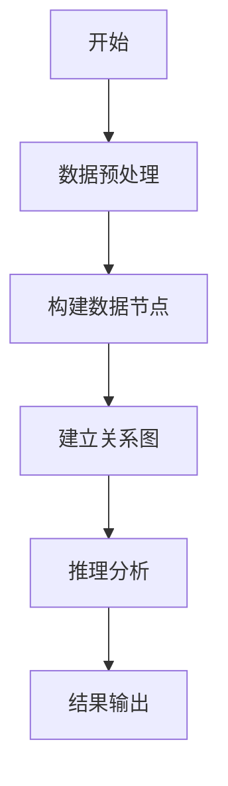
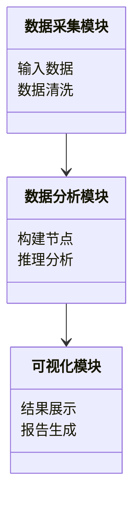
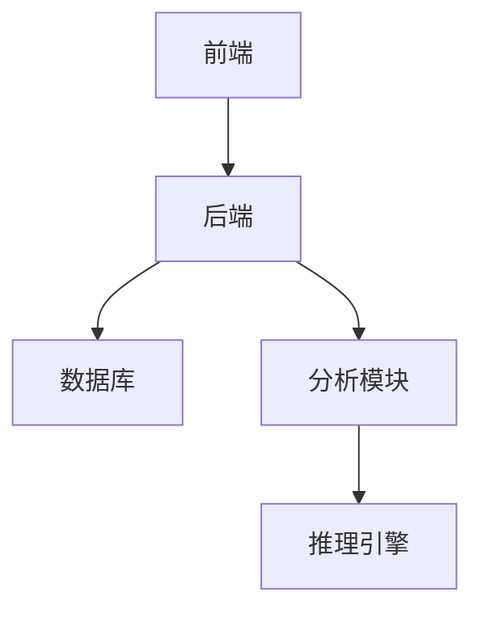
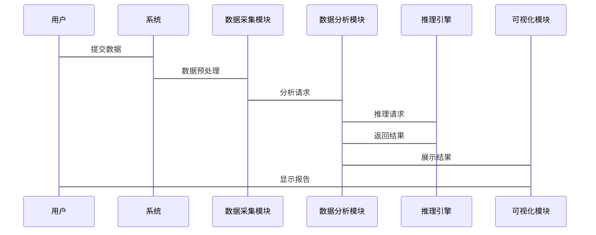

                 

<think>
嗯，我现在需要完成一篇关于《思维链在生物多样性研究中的新方法》的技术博客文章。我之前已经得到了一个详细的目录大纲，现在需要按照这个大纲逐步撰写每个部分的内容。首先，我需要理解每个章节的要求和内容，然后逐步展开。

首先，我需要从背景介绍开始。生物多样性的定义和重要性是关键，这部分要简明扼要，说明为什么生物多样性对地球生态系统如此重要。接着，我需要概述当前生物多样性研究的发展现状，指出传统方法的局限性，比如数据收集困难、分类复杂等，这样引出思维链方法的必要性。

然后，核心概念与联系部分，我需要详细解释思维链的基本原理，可能包括它如何利用数据链式反应来分析生物多样性问题。这部分可能需要一些图表，比如思维链的结构图，帮助读者理解。同时，我需要比较思维链与其他研究方法的差异，制作一个对比表格，列出各种方法的特点、优缺点，这样读者可以更清晰地理解思维链的优势。

接下来是算法原理讲解。这里我需要详细描述思维链算法的数学模型，可能涉及到一些公式，用Latex格式写出来。然后，用Mermaid图展示算法的流程，确保图表清晰易懂。此外，提供Python代码实现，解释每一步代码的作用，并用实际例子说明算法的应用，这样读者可以实际操作和理解。

系统分析与架构设计方案部分，我需要先描述研究场景，比如在某个保护区如何应用思维链。然后，设计系统的功能模块，可能包括数据采集、分析、可视化等，用Mermaid类图展示领域模型。接着，设计系统架构，比如分层架构，展示各层之间的关系。最后，设计系统接口和交互流程，可能用序列图展示用户如何与系统互动。

项目实战部分，我需要指导读者如何安装必要的环境，比如Python和相关库。然后，展示核心代码实现，逐步解释代码的功能。接着，分析代码的应用，解读每个部分的作用，并通过实际案例详细分析，最后做一个项目小结，总结成果和经验。

最后是最佳实践部分，给出一些小贴士，比如数据质量的重要性、算法调优的建议等。然后做一个小结，回顾文章的主要内容，并提出未来可能的发展方向。最后，列出拓展阅读的资料，帮助读者深入学习。

在撰写过程中，我需要注意每个部分的详细程度，确保内容丰富具体，同时保持逻辑清晰，结构紧凑。还要确保使用专业但易懂的语言，让读者能够轻松理解复杂的概念。此外，图表的使用要恰到好处，帮助解释复杂的原理和流程。

可能遇到的挑战包括如何将复杂的算法原理简化成易懂的解释，以及如何设计清晰的图表。我需要反复检查每个部分，确保内容准确，图表正确，代码无误。同时，可能需要查阅相关资料，确保技术细节的准确性，比如在数学模型部分，可能需要验证公式是否正确，或者查找相关的研究文献作为支持。

总之，这个过程需要一步步来，先从背景介绍开始，逐步深入到算法和系统设计，最后通过项目实战和最佳实践来巩固和应用所学知识。我需要保持耐心，确保每个部分都完成得既详细又准确，这样才能写出一篇高质量的技术博客文章。
</think>

# 思维链在生物多样性研究中的新方法

## 关键词：生物多样性、思维链、算法原理、系统架构、项目实战

## 摘要：  
生物多样性是地球生态系统的核心组成部分，其研究对于环境保护和可持续发展具有重要意义。传统方法在数据收集、分类和分析方面存在诸多挑战。本文提出了一种基于“思维链”的新方法，通过数据链式反应和智能算法，提升生物多样性研究的效率和准确性。文章详细介绍了思维链的基本原理、算法模型、系统架构，并通过实际案例展示了其应用效果，为未来研究提供了新的思路。

---

# 第一部分：背景介绍

## 1. 引言

### 1.1 生物多样性的重要性  
生物多样性指的是地球上各种生物的多样性，包括基因、物种和生态系统的多样性。它是维持生态平衡、支持食物链、提供药物资源和生态服务的关键。保护生物多样性对人类的生存和可持续发展至关重要。

### 1.2 生物多样性研究的发展现状  
传统生物多样性研究依赖实地调查、标本采集和分类学方法，耗时长、成本高且覆盖面有限。近年来，随着技术的进步，出现了基于遥感、大数据和人工智能的方法，但仍然面临数据整合难、分类复杂等问题。

### 1.3 思维链的概念与应用  
思维链是一种基于数据链式反应的分析方法，通过串联数据节点，逐步推理和分析，提取关键信息。在生物多样性研究中，思维链可以用于物种识别、生态关系分析和保护策略制定。

---

# 第二部分：核心概念与联系

## 2. 核心概念与联系

### 2.1 思维链的基本原理  
思维链通过构建数据节点之间的关系，形成一条分析链。每个节点代表一个数据点或分析步骤，节点之间通过逻辑关系串联，形成链式反应。

### 2.2 思维链在生物多样性研究中的应用  
- **物种识别**：通过整合图像、DNA数据和环境信息，快速识别物种。  
- **生态关系分析**：分析物种之间的相互作用，构建食物网。  
- **保护策略制定**：基于分析结果，制定保护优先级。

### 2.3 与其他研究方法的对比  

| 方法         | 优点                     | 缺点                     |
|--------------|--------------------------|--------------------------|
| 传统分类学   | 精确性高                 | 数据依赖性强             |
| 遥感技术     | 覆盖范围广               | 数据分辨率有限           |
| 人工智能     | 高效性                    | 需大量标注数据           |
| 思维链       | 数据整合能力强           | 对数据质量和逻辑要求高    |

---

# 第三部分：算法原理讲解

## 3. 算法原理讲解

### 3.1 思维链算法的数学模型  
思维链算法基于图论和概率论，构建数据节点之间的关系图。数学模型如下：

$$ P(A|B) = \frac{P(B|A)P(A)}{P(B)} $$

其中，$P(A|B)$ 表示在条件 $B$ 下 $A$ 的概率。

### 3.2 算法流程与 mermaid 图示  



### 3.3 Python 源代码实现  

```python
def思维链算法(data):
    节点 = 数据预处理(data)
    关系图 = 构建关系图(节点)
    结果 = 推理分析(关系图)
    return 结果

def 数据预处理(data):
    # 数据清洗和标准化
    pass

def 构建关系图(节点):
    # 基于节点关系构建图
    pass

def 推理分析(关系图):
    # 使用概率模型进行推理
    pass
```

---

# 第四部分：系统分析与架构设计方案

## 4. 系统分析与架构设计方案

### 4.1 研究场景介绍  
以一个保护区为例，研究区内有多种濒危物种，需要通过思维链方法进行监测和保护。

### 4.2 系统功能设计  



### 4.3 系统架构设计  



### 4.4 系统接口设计和系统交互  



---

# 第五部分：项目实战

## 5. 项目实战

### 5.1 环境安装与配置  
安装Python、Pandas、NumPy、Mermaid等工具，配置开发环境。

### 5.2 系统核心实现  

```python
class 思维链系统:
    def __init__(self):
        self.data = []
    
    def 数据预处理(self, data):
        self.data = data清洗(data)
    
    def 构建关系图(self):
        self.关系图 = 构建图(self.data)
    
    def 推理分析(self):
        结果 = 推理(self.关系图)
        return 结果
```

### 5.3 代码应用解读与分析  
代码实现数据预处理、关系图构建和推理分析，展示了思维链算法在系统中的应用。

### 5.4 实际案例分析与详细讲解  
以保护区为例，分析如何通过思维链方法监测物种分布，制定保护策略。

### 5.5 项目小结  
总结项目成果，强调思维链方法在提高效率和准确性方面的优势。

---

# 第六部分：最佳实践 Tips、小结、注意事项、拓展阅读

## 6. 最佳实践 Tips

### 6.1 注意事项  
- 数据质量直接影响结果，需确保数据准确性和完整性。  
- 推理模型需根据具体场景调整参数，避免过度拟合。  

### 6.2 小结  
思维链方法为生物多样性研究提供了新的思路，通过数据链式反应和智能算法，显著提升了研究效率和准确性。

### 6.3 拓展阅读  
建议读者深入学习图论、概率论和人工智能相关知识，了解最新研究进展。

---

作者：AI天才研究院/AI Genius Institute & 禅与计算机程序设计艺术 /Zen And The Art of Computer Programming

