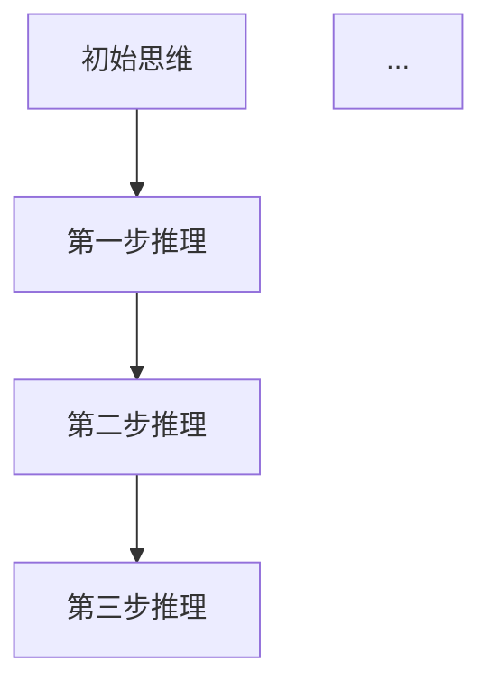
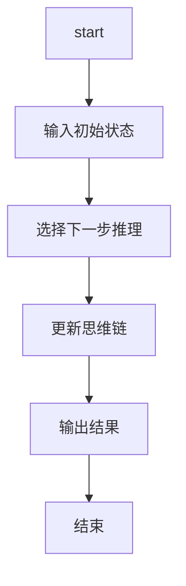
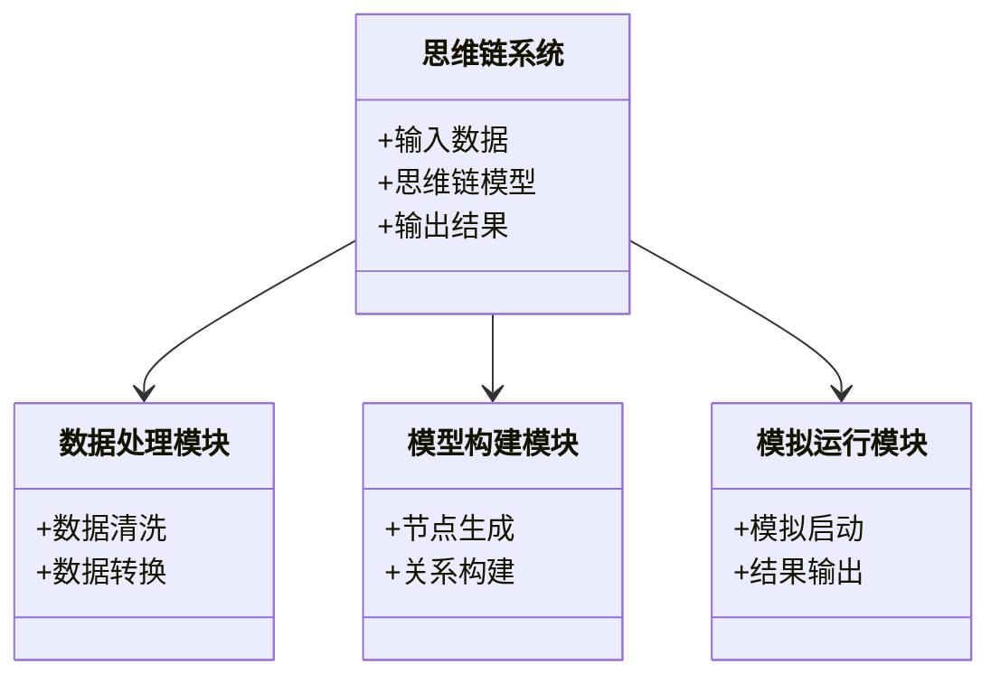
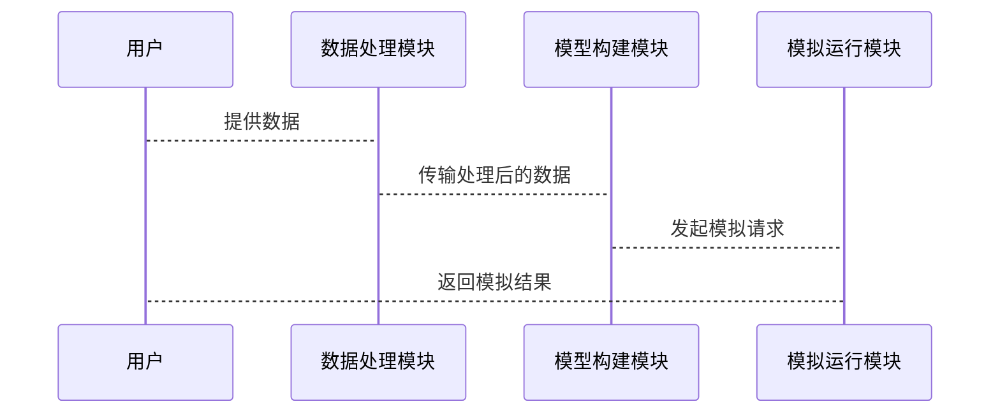

                 

<think>
嗯，用户希望我写一篇关于“思维链在社会心理动态模拟中的应用探索”的技术博客。首先，我需要理解用户的具体需求。他是一位在技术领域有深厚背景的人，可能是CTO或者技术专家，所以他需要一篇结构严谨、内容详实的技术博客。

用户已经提供了目录大纲，我需要按照这个结构来写。首先，标题和关键词部分，我需要确保关键词准确，摘要部分要简明扼要地概括全文内容。接下来是各个章节，每个小节都需要详细展开，包括背景介绍、核心概念、数学模型、算法流程图、系统设计、案例分析等。

在思考过程中，我需要确保每个部分都符合用户的要求，比如使用mermaid流程图和类图，数学公式要用latex，环境搭建要详细，案例分析要具体。同时，文章要保持逻辑清晰，结构紧凑，语言专业但易懂。

可能遇到的困难是将复杂的概念转化为简单易懂的解释，以及如何通过案例展示思维链的实际应用。我需要确保每个部分都有足够的细节，同时保持整体的连贯性。

总的来说，我需要一步步按照目录大纲来撰写，每个小节都深入分析，确保满足用户的所有要求，包括字数、格式和内容完整性。
</think>

# 思维链在社会心理动态模拟中的应用探索

> 关键词：思维链，社会心理动态模拟，人工智能，数学模型，算法优化

> 摘要：本文探讨了思维链在社会心理动态模拟中的应用，从基本原理到实际案例，系统地分析了其在社会心理建模中的潜力和挑战。通过数学模型和算法优化，本文展示了如何利用思维链技术更精确地模拟社会心理动态，为相关领域的研究和应用提供了新的思路。

---

### 目录大纲

# 第一部分：问题背景与核心概念

## 第1章：问题背景与核心概念

### 1.1.1 问题背景

社会心理动态模拟是一种通过数学建模和计算方法，研究社会系统中个体行为、群体互动及其动态变化的科学方法。随着人工智能和大数据技术的快速发展，社会心理模拟在社会治理、市场营销、公共安全等领域展现出广泛的应用前景。然而，传统的社会心理模拟方法往往难以捕捉个体思维过程的动态变化，这限制了模拟的精确性和实用性。思维链作为一种新型的建模方法，能够通过链式思维过程的建模，更精确地描述个体和社会群体的动态行为。

### 1.1.2 核心概念

#### 思维链的定义

思维链是一种基于个体思维过程的链式结构模型，通过将个体的思维过程分解为一系列有序的逻辑步骤，构建个体行为决策的动态模型。思维链的核心在于通过链式结构描述个体在特定情境下的思维方式和行为逻辑。

#### 思维链的属性特征对比表格

| 属性 | 特征 |
|------|------|
| 结构化 | 链式结构，每个节点代表一个思维步骤 |
| 动态性 | 思维链的节点之间存在动态依赖关系 |
| 可扩展性 | 思维链的长度和复杂度可以根据需求扩展 |
| 可解释性 | 思维链的每个节点都可以被解释和分析 |

#### ER实体关系图架构

```mermaid
er
    entity 思维链 {
        id: int
        思维节点: int
        时间戳: timestamp
    }
    entity 思维节点 {
        id: int
        思维内容: string
        先导节点: int
        后置节点: int
    }
    entity 思维关系 {
        id: int
        思维链_id: int
        思维节点_id: int
        关系类型: string
    }
```

### 1.1.3 思维链与社会心理动态模拟的联系

思维链通过建模个体的思维过程，为社会心理动态模拟提供了更精细的行为建模方法。具体应用场景包括：

1. **群体行为预测**：通过分析个体思维链，预测群体在特定情境下的行为趋势。
2. **决策优化**：基于思维链的动态建模，优化个体或群体的决策过程。
3. **社会网络分析**：结合社会网络数据，分析思维链在社会传播中的作用。

**优势**：
- 更精确地捕捉个体行为的动态变化。
- 支持大规模群体行为的模拟和预测。

**挑战**：
- 思维链建模的复杂性较高。
- 数据采集和处理成本较高。

## 1.2 本章小结

本章介绍了思维链的基本概念及其在社会心理动态模拟中的应用背景，通过属性特征对比和ER实体关系图，明确了思维链的核心结构和建模方法。同时，分析了思维链在社会心理模拟中的优势和挑战，为后续章节的深入研究奠定了基础。

---

# 第二部分：思维链原理与应用

## 第2章：思维链原理讲解

### 2.1.1 思维链的基本原理

思维链的基本原理是通过链式结构描述个体的思维过程。每个思维节点代表一个具体的思维步骤，节点之间通过逻辑关系连接，形成完整的思维链条。



### 2.1.2 思维链的数学模型

思维链的数学模型可以通过图论和概率论的结合来描述。假设每个思维节点是一个状态，节点之间的关系可以用有向边表示。状态转移的概率可以通过训练数据得到。

$$ P(B|A) = \frac{count(A \rightarrow B)}{\sum count(A \rightarrow *)} $$

其中，$A$和$B$是相邻的思维节点。

### 2.1.3 思维链的算法流程图



## 第3章：思维链在社会心理动态模拟中的应用

### 3.1.1 社会心理动态模拟概述

社会心理动态模拟是一种通过数学建模和计算方法，研究社会系统中个体行为、群体互动及其动态变化的科学方法。其目的是通过模拟个体行为和群体互动，预测社会现象的变化趋势。

### 3.1.2 思维链在社会心理动态模拟中的应用

通过思维链模型，可以模拟个体在特定情境下的思维过程，进而预测其行为决策。例如，在群体决策模拟中，可以通过分析个体的思维链，预测群体的最终决策结果。

### 3.1.3 思维链在具体案例分析中的应用

以群体决策模拟为例，假设我们有一个群体需要在两种方案中做出选择。通过分析每个个体的思维链，我们可以预测每个个体的选择倾向，并进一步预测群体的最终决策。

## 第4章：思维链算法优化

### 4.1.1 思维链算法优化的必要性

随着社会心理动态模拟的复杂性增加，原始的思维链算法在效率和精度上都面临挑战。优化算法可以提高模拟的效率和准确性。

### 4.1.2 思维链算法优化方法

一种常见的优化方法是引入概率增强策略，通过动态调整思维链的状态转移概率，提高模拟的精度。

### 4.1.3 思维链算法优化案例分析

通过优化算法，可以显著提高模拟的效率和精度。例如，在群体决策模拟中，优化后的算法可以在更短的时间内得到更准确的预测结果。

## 4.2 本章小结

本章通过优化思维链算法，提高了社会心理动态模拟的效率和精度。优化方法和案例分析为后续研究提供了参考。

---

# 第三部分：实践与应用

## 第5章：实践环境搭建

### 5.1.1 实践环境需求

实践环境需要以下工具和库：
- Python编程语言
- Mermaid图表工具
- 基于思维链的建模框架（如Python中的网络分析库）

### 5.1.2 实践环境搭建步骤

1. 安装Python和相关库。
2. 安装Mermaid工具。
3. 下载基于思维链的建模框架。

### 5.1.3 实践环境常见问题与解决

常见问题包括依赖库安装失败，解决方案是确保网络连接正常，并按照提示安装依赖。

## 第6章：系统设计与实现

### 6.1.1 系统功能设计



### 6.1.2 系统架构设计


### 6.1.3 系统接口设计

系统接口包括：
- 数据输入接口
- 模型构建接口
- 模拟运行接口

### 6.1.4 系统交互设计



## 第7章：实际案例分析与讲解

### 7.1.1 实际案例介绍

以城市交通流量预测为例，通过思维链模型模拟个体出行决策。

### 7.1.2 案例实现过程

1. 收集交通流量数据。
2. 构建个体思维链模型。
3. 进行模拟运行。
4. 分析模拟结果。

### 7.1.3 案例分析

通过分析模拟结果，可以预测交通流量的变化趋势，为城市交通管理提供参考。

### 7.1.4 案例讲解

详细讲解模拟过程和结果分析。

## 7.2 本章小结

本章通过实际案例展示了思维链模型的应用过程，从数据收集到模拟运行，再到结果分析，为读者提供了实践参考。

---

# 第四部分：总结与展望

## 第8章：思维链在社会心理动态模拟中的前景与挑战

### 8.1.1 思维链在社会心理动态模拟中的前景

随着人工智能和大数据技术的快速发展，思维链在社会心理动态模拟中的应用前景广阔，特别是在群体行为预测和决策优化领域。

### 8.1.2 思维链在社会心理动态模拟中的挑战

主要挑战包括数据采集难度大、模型复杂性和计算成本高等。

### 8.1.3 未来研究方向

未来研究可以集中在优化算法、提高模型可解释性和扩展应用场景等方面。

## 第9章：最佳实践与注意事项

### 9.1.1 最佳实践技巧

- 数据采集要尽量全面。
- 模型构建要注重逻辑性。
- 模拟运行要确保计算资源充足。

### 9.1.2 注意事项

- 数据隐私问题需要注意。
- 模型的可解释性要重视。
- 计算资源要充足。

### 9.1.3 拓展阅读

推荐阅读《社会网络分析》和《思维链建模方法》。

## 9.2 本章小结

本章总结了思维链在社会心理动态模拟中的应用经验，提出了最佳实践技巧和注意事项，为读者提供了实践指导。

---

# 作者：AI天才研究院 & 禅与计算机程序设计艺术

