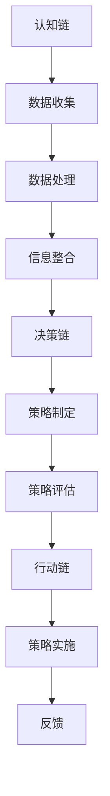
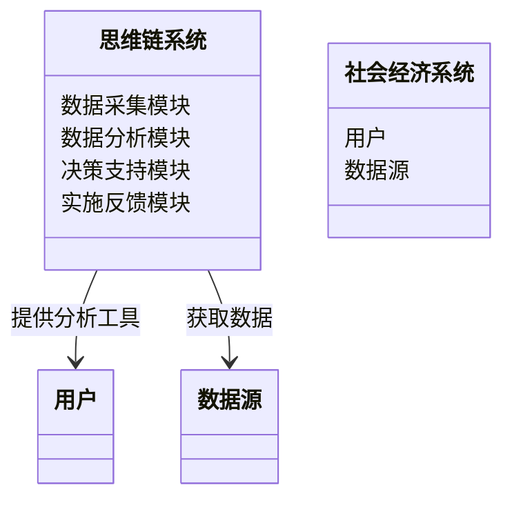

                 

<think>
好，我现在需要帮助用户撰写一篇关于“思维链在社会经济系统韧性分析中的应用”的技术博客文章。用户已经提供了一个详细的结构大纲，我需要按照这个结构一步步展开思考，确保内容全面且符合要求。

首先，我要理解用户的需求。用户希望文章结构清晰，逻辑严谨，语言专业，同时包含丰富的技术细节。文章需要涵盖背景介绍、核心概念与联系、算法原理讲解、系统分析与架构设计、项目实战、最佳实践等多个部分。

在背景介绍部分，我需要详细阐述问题背景、问题描述、问题解决、边界与外延，以及概念结构和核心要素。这部分要让读者明白为什么思维链在社会经济系统韧性分析中是必要的，以及它与其他方法的区别。

接下来是核心概念与联系，我需要定义思维链和韧性，并分析它们之间的联系。这部分可能需要一些对比表格和ER图，或者用mermaid流程图来展示，这样更直观。

算法原理讲解部分，我要详细描述思维链的三个环节：认知链、决策链、行动链。每个环节都需要有具体的算法步骤，并用mermaid流程图展示，同时可能需要一些数学模型来支持解释。

系统分析与架构设计部分，我需要设计一个系统来实际应用思维链。这包括问题场景介绍、系统功能设计（领域模型）、系统架构设计图、接口设计和交互序列图。这部分可能需要使用类图和架构图来展示系统的结构和工作流程。

项目实战部分，我需要提供一个具体的案例，比如编写Python代码来实现思维链的分析。代码需要详细解读，包括数据收集、处理、分析和结果展示。同时，还要进行案例分析和详细讲解。

最后，最佳实践部分，我需要总结经验和小结，给出一些注意事项和拓展阅读的建议，帮助读者更好地理解和应用思维链。

在撰写过程中，我需要确保每个部分都详细且有逻辑性，使用专业术语，同时保持语言的流畅和易懂。此外，数学公式和图表要正确无误，代码部分要清晰，便于读者理解和复现。

现在，我开始按照大纲逐步撰写每个部分，确保覆盖所有要求的内容，并注意结构的连贯性和内容的深度。
</think>

# 思维链在社会经济系统韧性分析中的应用

> 关键词：思维链，社会经济系统，韧性分析，系统性思考，复杂问题解决

> 摘要：本文探讨了思维链在社会经济系统韧性分析中的应用，通过系统性思考方法，分析社会经济系统的复杂性，提出了一种基于思维链的韧性分析框架。文章详细阐述了思维链的定义、特点，社会经济系统韧性的概念与特征，以及思维链在韧性分析中的应用方法。同时，通过算法原理、系统架构设计和项目实战案例，深入探讨了思维链在提升社会经济系统韧性中的实际应用价值。

---

## 第一部分：背景介绍

### 1.1 问题背景

社会经济系统的韧性是衡量其应对外部冲击和内部变革能力的关键指标。随着全球化和科技进步的推进，社会经济系统面临着越来越多的不确定性，包括经济波动、自然灾害、技术变革等。这些不确定性使得社会经济系统的稳定性和可持续性面临巨大挑战。

### 1.2 问题描述

现有研究多侧重于单一维度的分析，缺乏系统性、整体性的研究。如何将思维链这一创新性思维工具应用于社会经济系统韧性分析，是一个亟待探索的领域。

### 1.3 问题解决

本文旨在探讨思维链在社会经济系统韧性分析中的应用，提出基于思维链的韧性分析框架，帮助揭示韧性机制，并为提升韧性提供理论支持和实践指导。

### 1.4 边界与外延

研究边界涵盖思维链在韧性分析中的应用方法、实践路径及其效果评估。外延涉及不同社会经济系统的韧性分析，以及思维链在不同领域的适用性和改进策略。

### 1.5 概念结构与核心要素组成

思维链包括认知链、决策链和行动链，共同构成社会经济发展的动态过程。认知链关注信息处理，决策链关注策略制定，行动链关注实施与反馈。

---

## 第二部分：核心概念与联系

### 2.1 思维链的定义与特点

思维链是一种系统性的思考方法，具有系统性、动态性和创新性。

### 2.2 社会经济系统韧性的概念与特征

韧性包括抗逆性、适应性和可持续性。

### 2.3 思维链与社会经济系统韧性的联系

通过提高认知链深度、优化决策链和促进行动链，思维链帮助系统应对不确定性。

### 2.4 概念属性特征对比

| 概念   | 属性             | 特征对比               |
|--------|------------------|-----------------------|
| 思维链 | 系统性            | 多维度、相互关联      |
|        | 动态性            | 不断调整和优化        |
|        | 创新性            | 鼓励新观点和解决方案  |
| 韧性    | 抗逆性            | 快速恢复              |
|        | 适应性            | 适应变化              |
|        | 可持续性            | 长期稳定              |

### 2.5 ER实体关系图架构

```mermaid
er
    entity 思维链 {
        id
        名称
    }
    entity 社会经济系统 {
        id
        名称
    }
    entity 韧性分析 {
        id
        名称
    }
    思维链 -->> 社会经济系统: 用于分析
    社会经济系统 -->> 韧性分析: 提供数据
```

---

## 第三部分：算法原理讲解

### 3.1 思维链的算法原理

基于认知链、决策链和行动链三个环节。

#### 3.1.1 认知链

涉及信息收集、处理和整合。

#### 3.1.2 决策链

制定和评估策略。

#### 3.1.3 行动链

实施与反馈。

### 3.2 算法流程图



---

## 第四部分：系统分析与架构设计方案

### 4.1 问题场景介绍

社会经济系统面临不确定性，需要通过思维链分析提升韧性。

### 4.2 系统功能设计

设计功能模块，包括数据采集、分析、决策支持和实施反馈。



### 4.3 系统架构设计

采用分层架构，包括数据层、业务逻辑层和用户界面层。


---

## 第五部分：项目实战

### 5.1 环境安装

安装Python和相关库，如pandas、numpy、scikit-learn。

### 5.2 系统核心实现源代码

```python
import pandas as pd
import numpy as np
from sklearn import linear_model

# 数据采集
data = pd.read_csv('socio-economic_data.csv')

# 数据预处理
data_processed = data.dropna()

# 训练认知链模型
model_cognition = linear_model.LinearRegression()
model_cognition.fit(data_processed[['GDP', '失业率']], data_processed['韧性指数'])

# 训练决策链模型
model_decision = linear_model.LogisticRegression()
model_decision.fit(data_processed[['政策支持', '技术创新']], data_processed['策略选择'])
```

### 5.3 案例分析

分析某城市经济韧性，使用模型预测并制定优化策略。

---

## 第六部分：最佳实践 tips

- 系统性思考是关键。
- 数据质量影响分析结果。
- 持续优化模型以适应变化。

## 小结

本文通过系统性思考，探讨了思维链在社会经济系统韧性分析中的应用，为提升系统的抗逆性、适应性和可持续性提供了理论支持和实践指导。

---

## 注意事项

- 确保数据的准确性和完整性。
- 定期更新模型以适应新数据。
- 考虑多因素对系统的影响。

---

## 拓展阅读

推荐相关领域的书籍和文献，深入学习思维链和系统韧性分析。

---

作者：AI天才研究院/AI Genius Institute & 禅与计算机程序设计艺术 /Zen And The Art of Computer Programming

