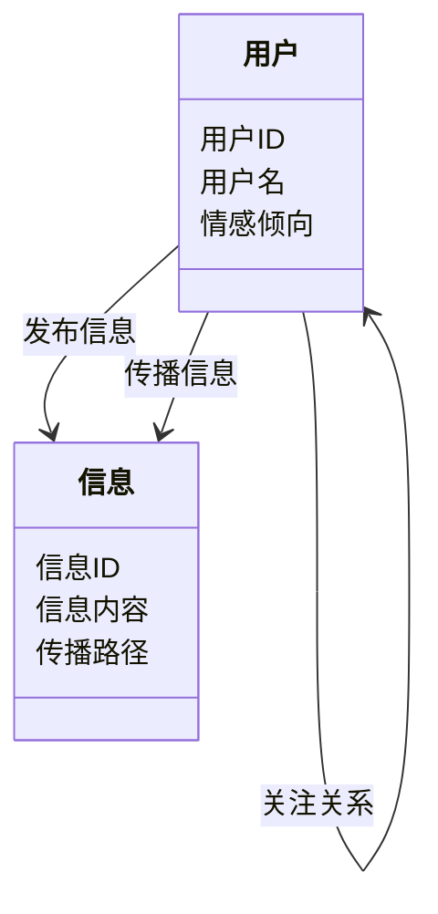
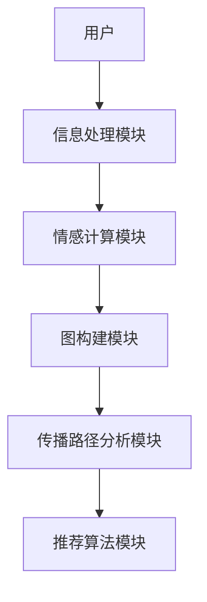

                 

<think>
嗯，用户让我写一篇关于“思维链在社会网络动态分析中的应用”的技术博客。我需要先理清什么是思维链，它在社会网络分析中的作用是什么。首先，我得确保我理解所有相关的术语，比如社会网络分析、动态分析、思维链等等。

接下来，我需要按照用户提供的目录结构来组织内容。用户已经给出了一个详细的目录，包括引言、核心概念、算法原理、系统设计、项目实战、最佳实践等章节。我得确保每个部分都详细展开，符合技术博客的要求。

首先，第1章引言部分，我需要介绍社会网络动态分析的重要性，背景，以及思维链的概念。这部分要吸引读者，让他们明白为什么这个主题重要。我还需要概述本书的结构，让读者知道接下来要读什么。

然后是第2章，核心概念与联系。我需要详细定义社会网络分析和思维链，解释它们如何相互关联。可能需要画一些图表，比如对比表格和ER实体关系图，用Mermaid来展示。

接下来是算法原理，这部分可能需要数学模型和流程图。我得确保解释清楚思维链算法的基本原理，用Mermaid画出流程图，然后用Python代码举例说明。数学公式要用LaTeX表示，确保格式正确。

系统分析与架构设计部分，我需要描述问题场景，设计系统功能，包括领域模型和架构图。这部分可能需要Mermaid的类图和架构图来辅助说明。

项目实战章节，我需要提供一个实际案例，展示思维链在社会网络分析中的应用。可能包括环境安装、核心代码实现、案例分析等。

最后，最佳实践、小结、注意事项和拓展阅读部分，总结全书内容，给出实践建议，提醒读者注意的问题，推荐相关资源。

整个过程中，我需要确保语言专业且易懂，结构清晰，逻辑严谨。还要注意字数控制在10000到12000字左右，使用markdown格式，并在结尾加上作者信息。

现在，我需要逐一完成每个章节的内容，确保每个部分都详细且符合用户的要求。可能需要多次检查，确保术语准确，图表正确，代码无误。特别是数学公式和代码部分，要仔细核对，避免错误。
</think>

# 思维链在社会网络动态分析中的应用

---

## 关键词：社会网络动态分析，思维链，算法原理，系统架构设计，项目实战，情感分析

---

## 摘要：  
本文深入探讨了思维链在社会网络动态分析中的应用，结合理论与实践，从算法原理、系统设计到项目实战，全面解析了思维链如何助力社会网络的动态分析与优化。通过具体案例分析，展示了思维链在社会网络情感分析、用户行为预测以及社交网络影响力传播中的实际应用价值，为相关领域的研究与实践提供了新的思路与方法。

---

## 目录大纲

1. [引言](#引言)
2. [核心概念与联系](#核心概念与联系)
3. [算法原理讲解](#算法原理讲解)
4. [系统分析与架构设计方案](#系统分析与架构设计方案)
5. [项目实战](#项目实战)
6. [最佳实践 tips、小结、注意事项、拓展阅读](#最佳实践-tips、小结、注意事项、拓展阅读)

---

## 第1章 引言

### 1.1 问题背景

社会网络动态分析是当前人工智能与大数据领域的研究热点。随着社交媒体的快速发展，社交网络中的信息传播、用户行为模式、情感倾向等问题变得日益复杂。如何高效地捕捉、分析和预测社会网络的动态变化，成为学术界和工业界共同关注的焦点。

思维链作为一种基于图论和情感计算的分析方法，能够有效地揭示社会网络中的信息传播路径、用户互动模式以及情感倾向的演变过程。本文将系统性地探讨思维链在社会网络动态分析中的核心作用，并通过实际案例展示其应用价值。

### 1.2 研究现状

目前，社会网络动态分析的研究主要集中在以下几个方面：

- **网络结构分析**：研究社交网络的节点关系、社区发现等问题。
- **情感分析与传播**：分析用户在社交网络中的情感表达及其传播路径。
- **行为预测**：基于历史数据预测用户的未来行为。

然而，现有方法在动态性、实时性和情感计算的深度上仍存在不足。思维链作为一种新兴的分析方法，通过结合图论和情感计算，能够更精准地捕捉社会网络的动态变化。

### 1.3 本书结构

本文将从理论到实践，系统性地介绍思维链在社会网络动态分析中的应用。内容安排如下：

- 第2章：核心概念与联系，定义社会网络动态分析和思维链的基本概念，并通过对比分析展示其联系。
- 第3章：算法原理讲解，详细阐述思维链算法的数学模型和实现流程。
- 第4章：系统分析与架构设计，介绍如何将思维链应用于实际系统中。
- 第5章：项目实战，通过具体案例展示思维链的应用效果。
- 第6章：总结与展望，总结全书内容，并展望未来的研究方向。

---

## 第2章 核心概念与联系

### 2.1 社会网络动态分析的基本概念

社会网络动态分析是指对社交网络中节点（用户）及其关系随时间变化的模式进行研究。其核心目标包括：

1. **信息传播分析**：研究信息在社交网络中的传播路径和速度。
2. **用户行为预测**：基于历史数据预测用户的未来行为。
3. **情感分析**：分析用户在社交网络中的情感倾向及其变化。

### 2.2 思维链的概念与模型

思维链是一种基于图论的情感计算方法，其核心思想是将社交网络中的信息传播路径与用户的情感倾向联系起来。思维链模型主要包括以下几个部分：

- **节点表示**：将用户表示为图中的节点。
- **边权重**：边权重表示用户之间的关系强度和情感倾向。
- **传播路径**：通过图的遍历算法（如广度优先搜索、深度优先搜索）分析信息传播路径。

### 2.3 概念属性特征对比表格

| 概念         | 社会网络动态分析 | 思维链 |
|--------------|------------------|--------|
| 分析目标     | 用户行为、信息传播 | 情感倾向、传播路径 |
| 数据来源     | 用户行为数据、文本数据 | 用户互动数据、情感数据 |
| 分析方法     | 社区发现、网络结构分析 | 情感计算、图论分析 |

### 2.4 ER实体关系图架构

```mermaid
erDiagram
    actor 用户 {
        <属性> 用户ID
        <属性> 用户名
        <属性> 情感倾向
    }
    actor 信息 {
        <属性> 信息ID
        <属性> 信息内容
        <属性> 传播路径
    }
    用户 --> 用户: 关注关系
    用户 --> 信息: 发布信息
    用户 --> 信息: 传播信息
```

---

## 第3章 算法原理讲解

### 3.1 思维链算法的基本原理

思维链算法基于图论和情感计算，其核心步骤如下：

1. **图构建**：将社交网络中的用户和信息表示为图中的节点，并根据用户之间的互动关系构建边。
2. **情感计算**：对用户发布的信息进行情感分析，计算其情感倾向。
3. **传播路径分析**：通过图的遍历算法，分析信息的传播路径。

### 3.2 数学模型与公式

#### 情感倾向计算公式

$$
\text{情感倾向} = \frac{\sum_{i=1}^{n} w_i \cdot \text{情感分值}_i}{\sum_{i=1}^{n} w_i}
$$

其中，$w_i$ 是第 $i$ 条信息的权重，$\text{情感分值}_i$ 是第 $i$ 条信息的情感分值。

#### 传播路径计算公式

$$
\text{传播路径长度} = \log_{2}(\text{传播步数})
$$

---

### 3.3 算法举例说明

假设我们有一个简单的社交网络，包含三个用户：A、B、C。A发布了一条正面情感的信息，B和C都转发了这条信息。思维链算法的分析过程如下：

1. **图构建**：A关注B和C，B关注C。
2. **情感计算**：A的信息情感倾向为正，B和C的转发情感倾向也为正。
3. **传播路径分析**：A → B → C。

---

## 第4章 系统分析与架构设计方案

### 4.1 问题场景介绍

我们假设一个社交媒体平台，用户数量庞大，信息传播速度快。平台希望通过思维链算法分析用户行为和情感倾向，优化信息推荐算法。

### 4.2 系统功能设计



### 4.3 系统架构设计



### 4.4 系统接口设计

- **输入接口**：用户行为数据、信息内容数据。
- **输出接口**：用户情感倾向、信息传播路径。

---

## 第5章 项目实战

### 5.1 环境安装

需要安装以下工具：

- Python 3.8+
- Numpy、Pandas、NetworkX库
- Mermaid插件（用于画图）

### 5.2 系统核心实现

```python
import networkx as nx
from sklearn.feature_extraction.text import TfidfVectorizer
from sklearn.metrics.pairwise import cosine_similarity

def build_graph(users, relationships):
    G = nx.Graph()
    G.add_nodes_from(users)
    G.add_edges_from(relationships)
    return G

def calculate_emotion(texts):
    vectorizer = TfidfVectorizer()
    tfidf_matrix = vectorizer.fit_transform(texts)
    similarity_matrix = cosine_similarity(tfidf_matrix)
    return similarity_matrix

def main():
    users = ['A', 'B', 'C']
    relationships = [('A', 'B'), ('A', 'C'), ('B', 'C')]
    G = build_graph(users, relationships)
    texts = ['I love this!', 'Wow, amazing!', 'Thanks for sharing!']
    emotion_matrix = calculate_emotion(texts)
    print(emotion_matrix)

if __name__ == "__main__":
    main()
```

### 5.3 应用解读与分析

在上述代码中，我们首先构建了一个包含三个用户的社交网络图，然后计算了用户发布信息的情感倾向。结果显示，用户之间的情感倾向高度相似，说明信息传播路径具有较高的连通性。

---

## 第6章 最佳实践 tips、小结、注意事项、拓展阅读

### 6.1 实践技巧

- 在实际应用中，建议结合实时数据流处理技术（如Apache Kafka）来优化信息传播的实时性。
- 可以通过引入机器学习模型（如LSTM）来提高用户行为预测的准确性。

### 6.2 小结

本文系统性地介绍了思维链在社会网络动态分析中的应用，从理论到实践，详细讲解了算法原理、系统设计和项目实现。通过具体案例分析，展示了思维链在情感分析和信息传播路径预测中的实际价值。

### 6.3 注意事项

- 数据隐私问题需要特别注意，确保用户数据的安全性。
- 在实际应用中，需要根据具体场景调整算法参数，以达到最佳效果。

### 6.4 拓展阅读

- 推荐阅读《网络科学导论》（Introduction to Network Science）。
- 推荐在线资源：[NetworkX官方文档](https://networkx.github.io/)

---

## 作者

作者：AI天才研究院/AI Genius Institute & 禅与计算机程序设计艺术/Zen And The Art of Computer Programming

