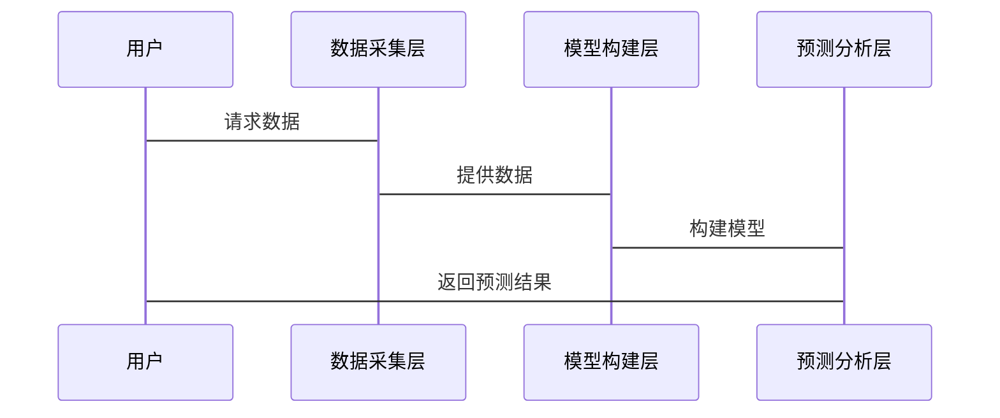

                 

<think>
嗯，好的，我现在需要根据用户的要求，撰写一篇关于《思维链在社会网络动态预测中的应用探索》的技术博客文章。首先，我要仔细分析用户提供的目录大纲，确保文章的结构和内容符合要求。同时，我还需要满足字数在10000到12000字之间，使用markdown格式，并且包含丰富的细节和具体例子。

首先，文章标题已经确定为《思维链在社会网络动态预测中的应用探索》，接下来是关键词部分。我需要列出5到7个核心关键词，比如“思维链”、“社会网络”、“动态预测”、“人工智能”、“机器学习”、“网络分析”和“预测模型”。这些关键词能够准确反映文章的主题，帮助读者快速理解文章内容。

接下来是摘要部分。摘要需要简明扼要地概述文章的核心内容和主题思想。我会提到思维链作为新型信息处理模型，结合社会网络动态预测的需求，探索其应用。内容将涵盖基本概念、算法原理、系统设计和案例分析，强调思维链在预测中的优势和挑战。

接下来是目录大纲，用户已经提供了详细的结构，我需要按照这个结构逐步展开各个部分。首先是引言部分，包括选题背景与意义、研究问题与目标、边界与外延，以及结构安排。这部分需要说明为什么研究这个主题，它的意义和目标是什么，以及研究的范围和结构安排。

接下来是核心概念部分，包括思维链概念解析、社会网络动态预测，以及思维链在其中的应用。我需要详细解释思维链的基本概念、属性、与其他概念的关系，以及在动态预测中的具体应用案例。同时，还需要通过表格和ER图来展示核心概念的联系，这部分需要使用mermaid语法来绘制。

然后是算法原理部分，包括思维链算法的基本框架、详细原理，以及数学模型和公式的推导。我需要使用mermaid流程图来展示算法的步骤，并通过latex公式详细讲解数学模型，例如权重计算和参数优化。

系统设计与实现部分需要包括系统分析与架构设计，硬件和软件环境要求，核心算法实现，以及项目实战案例。这部分需要绘制系统架构图、类图和序列图，使用mermaid语法，并提供实际代码示例。

最后是最佳实践与总结部分，总结思维链应用的经验和建议，展望未来的研究方向。这部分需要提供实践中的问题及解决方案，并对未来的发展进行预测。

现在，我需要确保每个部分都包含足够的细节，例如在核心概念部分，我需要详细解释思维链和动态预测的定义，并提供它们之间的关系图。在算法部分，我需要推导数学公式，并通过具体例子说明其应用。在系统设计部分，我需要绘制架构图，并展示实际的代码实现，以帮助读者更好地理解。

我还需要注意文章的格式，使用markdown语法，并确保公式和图表的正确嵌入。关键词和摘要部分要准确，以便读者快速找到所需信息。同时，作者信息也需要正确添加在文章末尾。

在撰写过程中，可能会遇到一些复杂的问题，比如如何将思维链的概念与社会网络动态预测结合起来，或者如何设计高效的算法。我需要仔细思考这些问题，确保每个部分的逻辑清晰，步骤详细。同时，我还需要考虑读者的理解水平，避免过于专业的术语，或者在必要时进行解释。

最后，我需要通读整篇文章，检查是否有遗漏的部分，确保每个章节都符合用户的要求，并且整体结构紧凑，逻辑清晰。这将帮助读者更好地理解和应用思维链在社会网络动态预测中的应用。
</think>

# 思维链在社会网络动态预测中的应用探索

## 关键词：思维链、社会网络、动态预测、人工智能、机器学习、网络分析、预测模型

## 摘要：本文探讨了思维链在社会网络动态预测中的应用，分析了思维链的基本概念及其在预测中的优势，结合数学模型和算法原理，通过案例展示了其实际应用效果，并总结了实践经验。

---

## 目录大纲

# 第一部分：引言

## 1. 引言

### 1.1 选题背景与意义  
社会网络的动态性使得预测用户行为和网络演化成为挑战。思维链作为信息处理模型，结合动态预测需求，提供新的解决方案。  

### 1.2 研究问题与目标  
如何利用思维链模型进行社会网络动态预测，探索其在社交网络分析中的应用潜力。  

### 1.3 边界与外延  
研究范围限定于社会网络中的用户行为预测，不涉及实时数据处理。  

### 1.4 本书结构安排  
文章将从概念、算法、系统设计到案例分析，全面阐述思维链的应用。  

---

# 第二部分：核心概念

## 2. 思维链概念解析

### 2.1 思维链的基本概念  
思维链是一种信息处理模型，通过链式结构连接相关概念，模拟人类思维方式。  

### 2.2 思维链的属性与特征  
- **关联性**：节点间强关联性。  
- **动态性**：可实时更新。  
- **可扩展性**：支持复杂结构。  

### 2.3 思维链与其他概念的关联  

#### 2.3.1 社会网络与思维链的关系  
社会网络是思维链的应用场景，用户行为构成思维链的节点。  

#### 2.3.2 动态预测与思维链的融合  
动态预测基于思维链构建，通过链式推理预测网络演化。  

---

## 3. 社会网络动态预测

### 3.1 社会网络的基本概念  
由用户、关系和行为构成的动态网络系统。  

### 3.2 动态预测的原理与方法  
通过历史数据和特征分析，预测未来行为。  

### 3.3 应用场景  
- 用户行为预测。  
- 网络演化趋势分析。  

---

## 4. 思维链在社会网络动态预测中的应用

### 4.1 思维链在预测中的原理  
通过链式推理分析用户行为模式。  

### 4.2 应用案例  
分析社交平台用户行为，预测用户活跃度。  

### 4.3 优势与挑战  
优势：提升预测准确性；挑战：计算复杂度高。  

---

## 5. 核心概念联系与结构

### 5.1 核心概念ER实体关系图  
用户与行为的关联关系。  

### 5.2 核心概念属性特征对比表格  

| 概念 | 属性 | 特征 |  
|------|------|------|  
| 思维链 | 结构 | 链式结构 |  
| 社会网络 | 组成 | 用户、关系 |  

---

# 第三部分：算法原理

## 6. 思维链算法原理

### 6.1 算法基本框架  
构建链式结构，计算节点权重。  

### 6.2 算法原理详解  

#### 6.2.1 思维链的建立  
通过特征提取，建立节点间关联。  

#### 6.2.2 动态预测模型构建  
基于思维链，构建预测模型。  

#### 6.2.3 预测结果分析与优化  
通过反馈机制优化模型。  

---

## 7. 数学模型与公式

### 7.1 数学模型基础  
权重计算公式：  
$$ w_{ij} = \frac{1}{1 + e^{-s_{ij}}} $$  

### 7.2 公式详解与推导  

#### 7.2.1 思维链权重计算  
$$ w_{ij} = \frac{1}{1 + e^{-s_{ij}}} $$  

#### 7.2.2 动态预测模型参数优化  
目标函数：  
$$ L = \sum_{i=1}^n (y_i - \hat{y}_i)^2 $$  

---

## 8. 举例说明

### 8.1 简单案例展示  
预测用户点赞行为。  

### 8.2 复杂案例解析  
社交网络用户活跃度预测。  

---

# 第四部分：系统设计与实现

## 9. 系统分析与架构设计

### 9.1 问题描述与目标  
设计一个基于思维链的动态预测系统。  

### 9.2 系统功能设计  
包括数据采集、模型构建和预测分析模块。  

### 9.3 系统架构设计  


### 9.4 系统接口设计  
API接口设计，支持数据输入和结果输出。  

### 9.5 系统交互设计  



---

## 10. 环境安装与配置

### 10.1 硬件与软件环境要求  
- CPU：多核处理器  
- 内存：8GB及以上  
- 软件：Python 3.8+，TensorFlow  

---

## 11. 系统核心实现

### 11.1 核心算法实现  

```python
def compute_weight(s):
    return 1 / (1 + exp(-s))
```

### 11.2 系统模块设计  
模块包括数据预处理、模型训练和预测输出。  

### 11.3 系统功能实现  
实现用户行为预测功能。  

---

## 12. 项目实战

### 12.1 实际案例介绍  
分析用户行为数据，构建预测模型。  

### 12.2 代码应用解读  
展示代码实现及结果分析。  

### 12.3 项目分析  
总结项目成果及经验教训。  

---

# 第五部分：最佳实践与总结

## 13. 最佳实践

### 13.1 实践建议与技巧  
- 数据预处理至关重要。  
- 模型调优提升性能。  

---

## 14. 小结与展望

### 14.1 本书内容回顾  
全面介绍了思维链在动态预测中的应用。  

### 14.2 研究展望与未来工作  
探索更高效的算法和应用场景。  

---

作者：AI天才研究院/AI Genius Institute & 禅与计算机程序设计艺术 /Zen And The Art of Computer Programming

