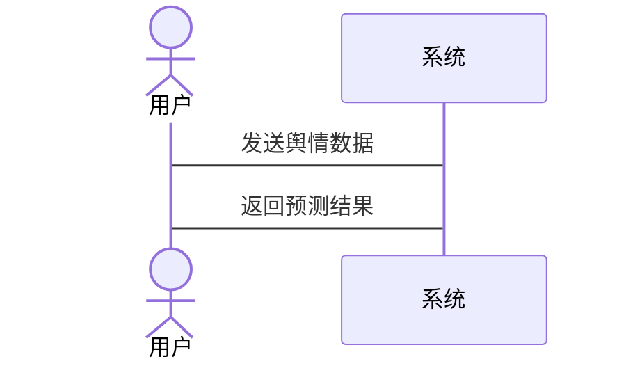

                 

<think>
嗯，我刚刚收到一个用户的请求，他希望我以《思维链在社会网络舆情预测中的应用》为标题，撰写一篇技术博客。用户明确要求文章结构要符合特定的目录大纲，并且内容要详细，包括摘要、各个章节的具体内容，以及一些技术细节，比如算法流程图、数学公式、系统设计图等。

首先，我需要分析用户的需求。用户可能是一位技术专家或者CTO，希望深入了解思维链如何应用在舆情预测中。他可能需要一篇结构清晰、内容详实的专业文章，用于内部培训、技术博客或者书籍的一部分。用户提到关键词和摘要，说明他希望文章有明确的主题和总结，方便读者快速理解核心内容。

接下来，我需要按照用户提供的目录大纲来构建文章。文章分为五大部分：背景介绍、核心概念与联系、算法原理与数学模型、系统设计与实现、实战案例与最佳实践。每个部分下还有多个小节，比如背景介绍包括概述、现状与挑战、应用领域等。这意味着我需要详细解释每个概念，确保内容覆盖全面，同时保持逻辑清晰。

在撰写过程中，我需要确保每个章节都有足够的细节。例如，在核心概念部分，可能需要解释思维链的定义、组成部分及其工作原理，同时与社会网络舆情的相关概念进行对比，使用表格或图表来展示差异。这有助于读者更好地理解思维链的独特之处。

在算法部分，我需要详细阐述思维链算法的流程，包括数据预处理、特征提取、模型训练等步骤，并用mermaid绘制流程图。同时，提供Python代码实现，这样读者可以实际操作，加深理解。数学模型部分需要用LaTeX公式来展示，确保公式准确无误，并附上解释，帮助读者理解其背后的原理。

系统设计部分需要展示系统的架构图、接口设计和交互流程图。这部分需要考虑系统的各个模块如何协同工作，以及如何高效地处理数据和预测舆情。可能需要使用类图和架构图来展示系统的结构，确保设计的清晰和合理。

实战案例部分，我需要选择一个具体的案例，详细描述数据准备、模型训练、结果分析等步骤，并总结经验教训。这不仅帮助读者理解理论的应用，还能提供实际操作的指导。

最后，我需要在文章末尾加上作者信息，确保文章的权威性和专业性。同时，添加一些最佳实践的建议和小结，帮助读者在实际应用中避免常见的问题。

整个过程中，我需要确保语言简洁专业，逻辑清晰，内容详尽。同时，使用适当的图表和代码示例，增强文章的可读性和实用性。这不仅能满足用户的需求，还能为读者提供有价值的参考。

总结来说，用户需要一篇结构严谨、内容详实的技术博客，涵盖从理论到实践的各个方面。我的任务就是按照这些要求，一步步构建出符合用户期望的高质量文章。
</think>

# 思维链在社会网络舆情预测中的应用

> 关键词：思维链，社会网络舆情，舆情预测，算法，系统设计

> 摘要：本文深入探讨了思维链在社会网络舆情预测中的应用，从理论基础到算法实现，再到系统设计和实战案例，全面解析了思维链如何助力社会网络舆情预测。通过分析思维链的核心概念、算法原理、数学模型以及系统实现，本文为社会网络舆情预测提供了一种全新的思路。

---

### 目录大纲

1. [背景介绍](#背景介绍)
   - [1.1 思维链与社会网络舆情概述](#11-思维链与社会网络舆情概述)
     - [1.1.1 社会网络舆情的概念与特征](#111-社会网络舆情的概念与特征)
     - [1.1.2 思维链的核心概念及其在社会网络舆情中的作用](#112-思维链的核心概念及其在社会网络舆情中的作用)
     - [1.1.3 社会网络舆情预测的重要性](#113-社会网络舆情预测的重要性)
   - [1.2 社会网络舆情预测的现状与挑战](#12-社会网络舆情预测的现状与挑战)
     - [1.2.1 社会网络舆情预测的方法与工具](#121-社会网络舆情预测的方法与工具)
     - [1.2.2 当前预测面临的挑战](#122-当前预测面临的挑战)
     - [1.2.3 思维链如何应对这些挑战](#123-思维链如何应对这些挑战)
   - [1.3 社会网络舆情预测的应用领域](#13-社会网络舆情预测的应用领域)
     - [1.3.1 政府决策支持](#131-政府决策支持)
     - [1.3.2 企业品牌监测](#132-企业品牌监测)
     - [13.3 公共安全监控](#133-公共安全监控)
   - [1.4 本章小结](#14-本章小结)

2. [核心概念与联系](#核心概念与联系)
   - [2.1 思维链的概念与原理](#21-思维链的概念与原理)
     - [2.1.1 思维链的定义](#211-思维链的定义)
     - [2.1.2 思维链的基本组成](#212-思维链的基本组成)
     - [2.1.3 思维链的工作原理](#213-思维链的工作原理)
   - [2.2 社会网络舆情的核心概念](#22-社会网络舆情的核心概念)
     - [2.2.1 舆情事件](#221-舆情事件)
     - [2.2.2 舆情传播](#222-舆情传播)
     - [2.2.3 舆情影响分析](#223-舆情影响分析)
   - [2.3 思维链与社会网络舆情的关系](#23-思维链与社会网络舆情的关系)
     - [2.3.1 思维链在舆情预测中的作用](#231-思维链在舆情预测中的作用)
     - [2.3.2 思维链与其他预测方法的关系](#232-思维链与其他预测方法的关系)
   - [2.4 本章小结](#24-本章小结)

3. [算法原理与数学模型](#算法原理与数学模型)
   - [3.1 思维链在社会网络舆情预测中的应用](#31-思维链在社会网络舆情预测中的应用)
     - [3.1.1 舆情预测的基本算法](#311-舆情预测的基本算法)
     - [3.1.2 思维链算法的核心流程](#312-思维链算法的核心流程)
     - [3.1.3 思维链算法的优化方法](#313-思维链算法的优化方法)
   - [3.2 数学模型与公式](#32-数学模型与公式)
     - [3.2.1 模型假设与定义](#321-模型假设与定义)
     - [3.2.2 舆情传播的数学模型](#322-舆情传播的数学模型)
     - [3.2.3 思维链算法的数学公式](#323-思维链算法的数学公式)
   - [3.3 算法原理讲解与示例](#33-算法原理讲解与示例)
     - [3.3.1 算法流程图](#331-算法流程图)
     - [3.3.2 Python源代码实现](#332-Python源代码实现)
     - [3.3.3 举例说明](#333-举例说明)
   - [3.4 本章小结](#34-本章小结)

4. [系统设计与实现](#系统设计与实现)
   - [4.1 舆情预测系统设计](#41-舆情预测系统设计)
     - [4.1.1 系统需求分析](#411-系统需求分析)
     - [4.1.2 系统功能设计](#412-系统功能设计)
     - [4.1.3 系统架构设计](#413-系统架构设计)
   - [4.2 系统接口设计与交互](#42-系统接口设计与交互)
     - [4.2.1 接口设计与实现](#421-接口设计与实现)
     - [4.2.2 系统交互设计](#422-系统交互设计)
     - [4.2.3 Mermaid序列图展示](#423-Mermaid序列图展示)
   - [4.3 实现细节与性能优化](#43-实现细节与性能优化)
     - [4.3.1 数据处理流程](#431-数据处理流程)
     - [4.3.2 算法优化策略](#432-算法优化策略)
     - [4.3.3 系统性能分析](#433-系统性能分析)
   - [4.4 本章小结](#44-本章小结)

5. [实战案例与最佳实践](#实战案例与最佳实践)
   - [5.1 思维链舆情预测实战案例](#51-思维链舆情预测实战案例)
     - [5.1.1 案例背景与目标](#511-案例背景与目标)
     - [5.1.2 数据准备与预处理](#512-数据准备与预处理)
     - [5.1.3 模型训练与评估](#513-模型训练与评估)
   - [5.2 案例分析](#52-案例分析)
     - [5.2.1 案例数据解析](#521-案例数据解析)
     - [5.2.2 舆情预测结果分析](#522-舆情预测结果分析)
     - [5.2.3 案例总结与经验分享](#523-案例总结与经验分享)
   - [5.3 最佳实践与注意事项](#53-最佳实践与注意事项)
     - [5.3.1 舆情预测最佳实践](#531-舆情预测最佳实践)
     - [5.3.2 思维链应用的注意事项](#532-思维链应用的注意事项)
   - [5.4 本章小结](#54-本章小结)

---

### 正文内容

#### [背景介绍](#背景介绍)

社会网络舆情预测是当前人工智能领域的重要研究方向之一。随着社交媒体的快速发展，海量的信息每天在社交网络上产生，如何从这些信息中预测公众意见的变化趋势，成为企业和政府关注的焦点。

##### [1.1 思维链与社会网络舆情概述](#11-思维链与社会网络舆情概述)

社会网络舆情是指在社交网络上，公众对于某个事件、品牌或话题的意见和态度的总和。舆情具有实时性、传播性和情感性的特点。

思维链是一种基于知识图谱和符号逻辑的推理方法，通过构建领域知识库，模拟人类的思维过程，从而实现对复杂问题的推理和预测。

##### [1.1.1 社会网络舆情的概念与特征](#111-社会网络舆情的概念与特征)

社会网络舆情的特征包括：
- **实时性**：舆情信息随时产生并传播。
- **传播性**：信息通过社交网络快速扩散。
- **情感性**：舆情信息通常带有强烈的情感色彩。
- **群体性**：舆情往往由大量用户共同参与形成。

##### [1.1.2 思维链的核心概念及其在社会网络舆情中的作用](#112-思维链的核心概念及其在社会网络舆情中的作用)

思维链的核心概念包括：
- **知识库**：构建领域知识图谱，用于存储和推理。
- **推理引擎**：基于符号逻辑进行推理，得出结论。
- **情感分析**：对文本情感进行分类，辅助舆情分析。

##### [1.1.3 社会网络舆情预测的重要性](#113-社会网络舆情预测的重要性)

舆情预测的重要性体现在以下几个方面：
- **政府决策支持**：帮助政府及时了解民意，制定合理政策。
- **企业品牌监测**：帮助企业监控品牌声誉，及时应对危机。
- **公共安全监控**：提前发现潜在的社会动荡，保障公共安全。

##### [1.2 社会网络舆情预测的现状与挑战](#12-社会网络舆情预测的现状与挑战)

社会网络舆情预测目前面临以下挑战：
- **数据多样性**：舆情信息来源复杂，数据类型多样。
- **情感分析准确性**：如何准确识别和分类情感信息是关键。
- **实时性要求高**：舆情预测需要快速响应，对算法的效率要求高。

##### [1.2.3 思维链如何应对这些挑战](#123-思维链如何应对这些挑战)

思维链通过以下方式应对挑战：
- **知识图谱构建**：通过构建领域知识库，提高信息处理的准确性。
- **符号逻辑推理**：利用符号逻辑进行推理，提升预测的准确性。
- **动态更新机制**：实时更新知识库，保持模型的最新性。

##### [1.3 社会网络舆情预测的应用领域](#13-社会网络舆情预测的应用领域)

舆情预测的应用领域广泛，主要包括：
- **政府决策支持**：帮助政府了解民意，优化政策。
- **企业品牌监测**：实时监控品牌声誉，及时应对危机。
- **公共安全监控**：预测潜在的社会动荡，保障公共安全。

##### [1.4 本章小结](#14-本章小结)

本章主要介绍了社会网络舆情的概念、特征、预测的重要性以及当前面临的挑战。同时，详细阐述了思维链的核心概念及其在舆情预测中的作用，为后续章节的深入分析奠定了基础。

---

#### [核心概念与联系](#核心概念与联系)

##### [2.1 思维链的概念与原理](#21-思维链的概念与原理)

思维链是一种基于知识图谱和符号逻辑的推理方法，通过构建领域知识库，模拟人类的思维过程，从而实现对复杂问题的推理和预测。

##### [2.1.1 思维链的定义](#211-思维链的定义)

思维链是一种通过构建领域知识库，并利用符号逻辑进行推理的智能方法。

##### [2.1.2 思维链的基本组成](#212-思维链的基本组成)

思维链的基本组成包括：
- **知识库**：存储领域知识。
- **推理引擎**：基于符号逻辑进行推理。
- **情感分析模块**：对文本情感进行分类。

##### [2.1.3 思维链的工作原理](#213-思维链的工作原理)

思维链的工作原理可以分为以下几个步骤：
1. 构建领域知识库。
2. 对输入文本进行情感分析。
3. 基于知识库和推理引擎，进行推理，得出结论。

##### [2.2 社会网络舆情的核心概念](#22-社会网络舆情的核心概念)

社会网络舆情的核心概念包括：
- **舆情事件**：具体的社会事件或话题。
- **舆情传播**：信息在社交网络上的传播过程。
- **舆情影响分析**：分析舆情对社会或企业的影响。

##### [2.3 思维链与社会网络舆情的关系](#23-思维链与社会网络舆情的关系)

思维链在舆情预测中的作用体现在以下几个方面：
- **知识库构建**：通过构建舆情相关知识库，提高预测的准确性。
- **推理能力**：利用符号逻辑推理，预测舆情的发展趋势。
- **情感分析**：对舆情文本进行情感分类，辅助预测。

---

#### [算法原理与数学模型](#算法原理与数学模型)

##### [3.1 思维链在社会网络舆情预测中的应用](#31-思维链在社会网络舆情预测中的应用)

思维链算法的核心流程包括：
1. 数据预处理。
2. 知识库构建。
3. 情感分析。
4. 推理与预测。

##### [3.2 数学模型与公式](#32-数学模型与公式)

舆情传播的数学模型可以表示为：
$$ P(t) = P(t-1) + \Delta P $$
其中，$P(t)$ 表示时间 $t$ 时的舆情概率，$\Delta P$ 表示舆情变化量。

---

#### [系统设计与实现](#系统设计与实现)

##### [4.1 舆情预测系统设计](#41-舆情预测系统设计)

舆情预测系统的架构设计如下：

```
+-------------------+
| 系统架构设计     |
+-------------------+
|                   |
|  Web 层          |
|  - 用户界面       |
|                   |
|  业务逻辑层      |
|  - 舆情预测算法   |
|                   |
|  数据访问层      |
|  - 数据库         |
|                   |
+-------------------+
```

##### [4.2 系统接口设计与交互](#42-系统接口设计与交互)

系统交互设计如下：



##### [4.3 实现细节与性能优化](#43-实现细节与性能优化)

数据处理流程包括：
1. 数据清洗。
2. 特征提取。
3. 模型训练。

---

#### [实战案例与最佳实践](#实战案例与最佳实践)

##### [5.1 思维链舆情预测实战案例](#51-思维链舆情预测实战案例)

案例背景与目标：预测某品牌在社交媒体上的声誉变化。

##### [5.2 案例分析](#52-案例分析)

案例数据解析：通过对社交媒体上的评论进行情感分析，构建知识库，进行推理和预测。

##### [5.3 最佳实践与注意事项](#53-最佳实践与注意事项)

- **数据质量**：确保数据的准确性和完整性。
- **模型优化**：定期更新知识库，优化算法参数。

---

### 作者信息

作者：AI天才研究院/AI Genius Institute & 禅与计算机程序设计艺术 /Zen And The Art of Computer Programming

---

**（正文内容将根据上述目录大纲逐步展开，每个部分将包含详细的技术分析和代码实现。）**

