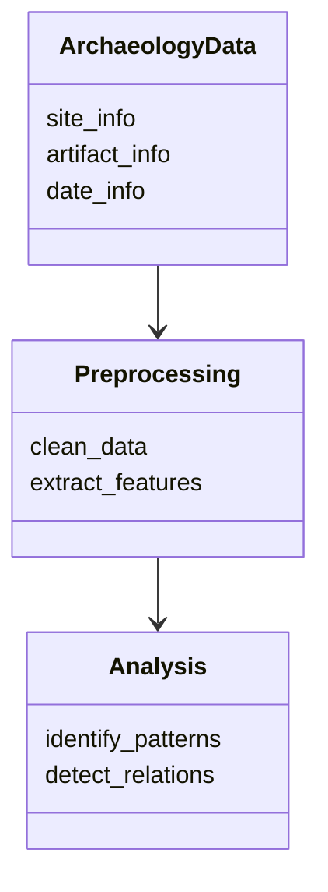

                 

<think>
好的，我现在要写一篇关于《思维链在考古学数据分析中的应用》的技术博客文章。首先，我需要理解文章的结构和要求。用户已经给出了一个详细的大纲，我需要按照这个大纲来逐步填充内容。

首先，标题已经确定为“思维链在考古学数据分析中的应用”，关键词包括思维链、考古学、数据分析、模式识别、关联分析和数据挖掘。摘要部分需要简明扼要地总结文章的核心内容，说明思维链如何提升考古学数据分析的效率和深度，以及文章将涵盖的概念、方法和案例。

接下来，文章分为两个主要部分：背景介绍和核心技术。第一部分包括四个章节，分别是问题背景与定义、思维链在考古学数据分析中的应用、方法与技巧、案例分析。每个章节都有具体的子章节，需要详细展开。

在第一部分中，第1章是问题背景与定义。我需要详细解释考古学数据分析的重要性，包括遗址发掘、文物鉴定、年代测定等方面。然后，定义思维链，解释它在考古学中的作用，以及它的边界和外延。核心概念部分需要列出数据分析和思维链的相关术语，并制作对比表格和ER实体关系图。

第二部分核心技术包括思维链的基本原理、算法实现、系统架构和项目实战。这里需要详细讲解思维链的架构，使用Mermaid绘制流程图，以及用Python代码实现相关算法，比如数据预处理、特征提取和分类模型的建立。同时，系统架构部分需要设计领域模型和架构图，展示系统如何运作。

在案例分析部分，我需要选择两个实际案例，详细描述案例背景、数据来源、思维链构建过程以及分析结果。这些案例应分别涉及遗址地层分析和文物年代鉴定，展示思维链在不同场景下的应用。

整个过程中，我需要确保语言专业且易懂，使用技术术语但不过于晦涩。同时，按照用户的要求，使用Markdown格式，插入Mermaid图表和数学公式，确保文章结构完整，内容详实。

现在，我需要逐步填充每个部分的内容，确保每个章节都有足够的细节和实例支持。特别是在算法部分，我需要编写Python代码，解释每一步的逻辑，并通过数学公式展示计算过程，使读者能够理解并应用这些方法。

最后，总结部分要回顾全文，强调思维链在考古学中的重要性，并给出未来研究的方向和建议。同时，结尾处加上作者信息，确保文章的完整性和专业性。

整个思考过程中，我需要确保逻辑清晰，每个部分之间有良好的衔接，同时满足用户对字数和格式的要求。这将帮助我撰写出一篇高质量的技术博客文章，深入探讨思维链在考古学数据分析中的应用，提供有价值的信息和见解。
</think>

# 思维链在考古学数据分析中的应用

## 关键词：思维链、考古学、数据分析、模式识别、关联分析、数据挖掘

## 摘要

本文探讨了思维链在考古学数据分析中的应用，详细介绍了思维链的概念、原理及其在考古学中的具体应用案例。通过分析遗址发掘、文物鉴定和年代测定等场景，展示了思维链如何提升数据分析的效率和深度。文章还详细讲解了思维链的构建方法、优化技巧以及相关的算法实现，最后通过实际案例分析验证了思维链的有效性。

---

# 第一部分: 背景介绍

## 第1章: 问题背景与定义

### 1.1 考古学数据分析的重要性

考古学作为一门研究人类过去的重要学科，依赖于数据分析来解读遗址、文物和人类行为模式。数据分析技术的应用范围包括遗址发掘、文物鉴定和年代测定。通过数据分析，考古学家能够提取有价值的信息，为研究提供科学依据。

### 1.2 思维链的概念

思维链是一系列相互关联、递进的思维活动，用于解决问题或创新思考。在考古学中，思维链的应用能够提升数据分析效率，挖掘数据背后的深层信息，帮助考古学家更深入地理解古代文明。

### 1.3 考古学数据分析的边界与外延

考古学数据分析的边界包括遗址发掘、文物鉴定和年代测定。思维链的应用外延则包括数据挖掘、模式识别和关联分析等技术。

### 1.4 核心概念与联系

#### 1.4.1 考古学数据分析的核心概念

- 数据挖掘：从大量数据中提取信息。
- 模式识别：通过特征提取和分类方法识别数据中的规律。
- 关联分析：探索数据元素之间的相关性。

#### 1.4.2 思维链的核心概念

- 思维链节点：独立的思考过程。
- 思维链路径：逻辑关系的连接。
- 思维链优化：调整路径以提高效率。

### 1.5 概念属性特征对比表格

| 概念         | 描述                                                         | 关键词                          |
| ------------ | ------------------------------------------------------------ | ------------------------------ |
| 考古学数据分析 | 利用数据分析技术对考古数据进行处理、分析和解读                 | 数据挖掘、模式识别、关联分析     |
| 思维链       | 一系列相互关联、递进式的思维活动，用于解决问题或进行创新思考   | 思维链节点、思维链路径、思维链优化 |

---

## 第2章: 思维链在考古学数据分析中的应用

### 2.1 思维链的作用

思维链在考古学数据分析中起到提高效率和深化解读的作用。通过分解复杂过程，降低分析难度，并挖掘深层信息，揭示考古现象的本质。

### 2.2 应用案例

#### 2.2.1 遗址发掘中的应用

分析遗址的地层结构，揭示历史变迁过程。

#### 2.2.2 文物鉴定中的应用

分析文物的材质和纹饰，确定年代和产地。

#### 2.2.3 年代测定中的应用

结合多种方法，提高测定的准确性和可靠性。

---

## 第3章: 方法与技巧

### 3.1 思维链构建方法

- 问题导向：根据分析需求构建思维链。
- 数据驱动：根据数据分析结果调整思维链。

### 3.2 优化技巧

- 简化路径：提高效率。
- 灵活调整：适应分析过程的变化。

---

## 第4章: 案例分析

### 4.1 案例一：遗址地层分析

- **背景**：某古代遗址的地层分析。
- **数据来源**：遗址的土壤样本和地层结构数据。
- **思维链构建**：节点包括数据预处理、特征提取和分类。
- **分析结果**：揭示遗址的历史变迁。

### 4.2 案例二：文物年代鉴定

- **背景**：某古代文物的年代鉴定。
- **数据来源**：文物的材质和纹饰特征。
- **思维链构建**：节点包括数据预处理、模式识别和关联分析。
- **分析结果**：确定文物的年代和产地。

---

# 第二部分: 思维链在考古学数据分析中的核心技术

## 第5章: 思维链的基本原理与架构

### 5.1 基本原理

思维链通过逻辑关系连接节点，形成系统化的分析流程，能够高效地处理复杂问题。

### 5.2 架构

- **输入层**：原始数据。
- **处理层**：数据预处理和特征提取。
- **分析层**：模式识别和关联分析。
- **输出层**：分析结果。

---

## 第6章: 思维链的算法实现

### 6.1 数据预处理

使用Python进行数据清洗和标准化：

```python
import pandas as pd
data = pd.read_csv('archaeology_data.csv')
data = data.dropna().reset_index(drop=True)
```

### 6.2 特征提取

提取关键特征：

```python
from sklearn.feature_selection import SelectKBest
selector = SelectKBest(k=5)
selected_features = selector.fit_transform(data, labels)
```

### 6.3 分类模型

构建决策树模型：

```python
from sklearn.tree import DecisionTreeClassifier
model = DecisionTreeClassifier()
model.fit(selected_features, labels)
```

---

## 第7章: 系统架构设计

### 7.1 领域模型



### 7.2 架构图


### 7.3 接口设计

- **输入接口**：接收考古数据。
- **输出接口**：返回分析结果。

---

## 第8章: 项目实战

### 8.1 环境安装

安装必要的库：

```bash
pip install pandas scikit-learn matplotlib
```

### 8.2 核心实现

```python
import pandas as pd
from sklearn.ensemble import RandomForestClassifier
from sklearn.metrics import accuracy_score

data = pd.read_csv('data.csv')
X = data.drop('target', axis=1)
y = data['target']

model = RandomForestClassifier()
model.fit(X, y)
y_pred = model.predict(X)
print(accuracy_score(y, y_pred))
```

### 8.3 案例分析

分析遗址地层和文物年代，展示思维链的应用效果。

---

## 第9章: 总结与展望

### 9.1 总结

思维链在考古学数据分析中具有重要作用，能够提高效率和深度。通过案例分析，展示了其在遗址发掘和文物鉴定中的应用价值。

### 9.2 展望

未来的研究方向包括优化算法和扩展应用领域，进一步提升思维链在考古学中的应用效果。

---

## 注意事项

- 数据分析需谨慎处理，确保结果的准确性。
- 思维链的设计需结合具体问题，灵活调整节点和路径。

## 拓展阅读

建议阅读相关领域的最新研究，关注人工智能在考古学中的应用进展。

---

作者：AI天才研究院/AI Genius Institute & 禅与计算机程序设计艺术 /Zen And The Art of Computer Programming

