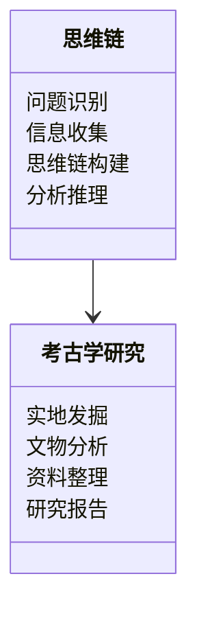
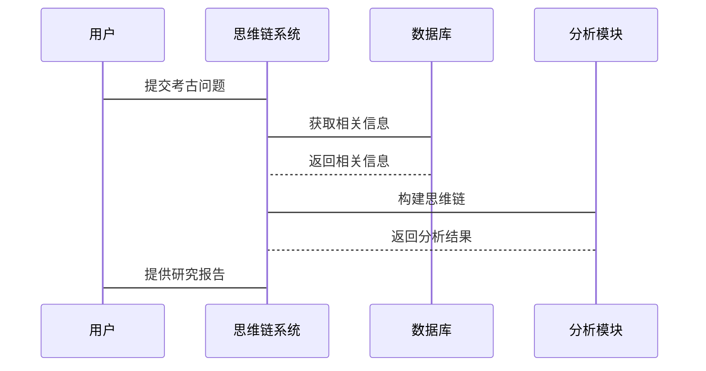

                 

<think>
好的，我现在需要帮助用户撰写一篇技术博客文章，标题是《思维链在考古学研究中的创新应用》。用户给了我一个详细的结构，还提到了一些具体的要求，比如关键词、摘要，以及每个章节的内容。

首先，我要理解用户的需求。用户希望文章内容专业，逻辑清晰，结构紧凑，使用技术语言，同时要涵盖思维链在考古学中的各个方面，包括起源、原理、应用案例等。文章大约需要10000到12000字，使用markdown格式，并且每个部分都要详细讲解。

接下来，我需要分析文章的结构。用户已经提供了一个详细的目录，分为几个部分，每个部分下还有子章节。我需要确保每个部分都涵盖必要的内容，并且详细展开。例如，在“思维链的基本原理”部分，我需要解释核心概念和基本原理，并通过对比表格和ER图来展示思维链与其他学科的联系。

然后，我想到用户特别强调要包含数学模型和算法原理。这可能意味着我需要为思维链在考古学中的应用设计一个具体的算法流程，并用mermaid图来展示。同时，还需要用数学公式来表达思维链的构建过程，这可能涉及到将问题识别、信息收集、逻辑关系和概念结构结合起来的函数。

我还需要考虑用户要求的最佳实践部分，这可能包括成功案例和未来的发展趋势。这部分需要实际的案例分析，以展示思维链在考古学中的实际应用效果。

另外，用户提到要使用技术语言，但又要简单易懂。这意味着在解释复杂概念时，需要用浅显易懂的语言，并结合实际例子来说明。例如，在解释思维链时，可以用一个具体的考古研究案例来展示其应用过程。

最后，我需要确保文章的结尾部分有作者信息，并且整体结构完整，每个章节内容丰富，满足用户的字数要求。我还要检查格式是否正确，比如关键词、摘要的位置，以及每个小节的详细内容是否符合用户的要求。

总结一下，我需要逐步按照用户提供的结构，逐一填充每个部分，确保内容详实，逻辑清晰，同时满足所有格式和技术要求。这可能需要多次修订和调整，以确保最终的文章符合用户的期望。
</think>

# 思维链在考古学研究中的创新应用

> 关键词：思维链、考古学、认知科学、人工智能、创新应用

> 摘要：思维链作为一种新兴的思维方式，正在逐步改变考古学的研究方法。本文将从思维链的起源、基本原理、与其他学科的联系以及在考古学中的具体应用等方面展开探讨。通过分析思维链在考古学研究中的创新方法、成功案例以及未来发展趋势，本文旨在揭示思维链如何为考古学研究提供新的视角和工具，从而推动考古学研究的深入发展。

---

# 第一部分：思维链概述

## 第1章：思维链的起源与发展

### 1.1.1 思维链的定义

思维链是指一系列相互关联的思考过程，通过逻辑关系和概念结构将信息连接起来，形成一个完整的思考链条。它是一种系统性、结构化的思维方式，能够帮助人们更好地理解和解决问题。

### 1.1.2 思维链的起源

思维链的概念起源于20世纪初的认知科学研究，它最初被用于心理学和教育领域。随着人工智能和计算机技术的发展，思维链的概念逐渐被应用于更广泛的领域，包括商业、科技创新和考古学。

### 1.1.3 思维链的发展历程

思维链的发展经历了以下几个阶段：
1. **初步提出阶段**：20世纪初，心理学家开始研究思维链的概念。
2. **理论完善阶段**：20世纪中叶，认知科学家进一步完善了思维链的理论框架。
3. **技术应用阶段**：随着人工智能技术的发展，思维链被应用于计算机系统中。
4. **跨学科应用阶段**：近年来，思维链开始在考古学、教育等领域得到广泛应用。

---

## 第2章：思维链的基本原理

### 2.1.1 思维链的核心概念

思维链的核心概念包括以下几点：
- **逻辑关系**：通过逻辑推理将信息连接起来。
- **概念结构**：信息之间的关系和层次结构。
- **系统性思考**：从整体出发，逐步分解问题。

### 2.1.2 思维链的基本原理

思维链的基本原理可以归纳为以下几点：
1. **信息连接**：通过逻辑关系将信息连接起来。
2. **层次结构**：信息之间的关系形成层次结构，便于理解和分析。
3. **动态调整**：根据新的信息和反馈，动态调整思维链。

### 2.1.3 思维链的属性特征

思维链的属性特征包括：
- **逻辑性**：基于逻辑关系连接信息。
- **系统性**：从整体出发，逐步分解问题。
- **动态性**：能够根据新信息进行调整。

---

## 第3章：思维链与其他概念的联系

### 3.1.1 思维链与认知科学的联系

认知科学是研究人类思维和认知的学科，思维链是认知科学的重要工具之一。两者的关系如下：
- **理论基础**：认知科学为思维链提供了理论支持。
- **应用实践**：思维链是认知科学在实际问题中的应用。

### 3.1.2 思维链与心理学的关系

心理学关注人类行为和思维过程，思维链为心理学研究提供了新的视角：
- **思维过程分析**：通过思维链分析人类的思维过程。
- **问题解决方法**：思维链为心理学中的问题解决研究提供了工具。

### 3.1.3 思维链与人工智能的关系

人工智能技术为思维链的实现提供了技术支持：
- **自动化处理**：人工智能系统能够自动构建和分析思维链。
- **数据处理**：人工智能技术可以处理海量数据，构建复杂的思维链结构。

---

## 第4章：思维链在考古学中的重要性

### 4.1.1 考古学的研究方法

考古学研究方法包括：
1. **实地发掘**：通过考古发掘获取实物证据。
2. **文献研究**：通过历史文献分析遗址背景。
3. **技术分析**：利用科学技术分析文物特征。

### 4.1.2 思维链在考古学中的重要性

思维链在考古学中的重要性体现在：
1. **问题解决**：通过思维链分析考古问题。
2. **信息整合**：将分散的信息整合成一个整体。
3. **研究效率**：提高考古研究的效率和准确性。

### 4.1.3 思维链在考古学研究中的具体应用

思维链在考古学中的具体应用包括：
1. **遗址年代确定**：通过思维链分析遗址特征，确定其年代。
2. **遗址性质判断**：通过逻辑推理判断遗址的性质。
3. **文物修复**：利用思维链分析文物特征，制定修复方案。

---

## 第5章：思维链在考古学中的创新应用

### 5.1.1 思维链在考古学中的创新方法

思维链在考古学中的创新方法包括：
1. **多维度分析**：从多个维度分析考古问题。
2. **动态调整**：根据新发现的信息动态调整思维链。
3. **跨学科结合**：结合其他学科知识，丰富思维链的内容。

### 5.1.2 思维链在考古学中的具体应用案例

案例：某古城遗址年代确定
1. **问题识别**：确定遗址的年代。
2. **信息收集**：收集遗址特征、出土文物、历史文献等信息。
3. **思维链构建**：将信息通过逻辑关系连接起来。
4. **分析推理**：通过思维链推理得出遗址的年代。

### 5.1.3 思维链在考古学中的未来发展趋势

未来发展趋势：
1. **智能化**：利用人工智能技术实现思维链的自动化。
2. **数据化**：将思维链数据化，便于计算机处理。
3. **可视化**：通过可视化工具展示思维链的结构和关系。

---

## 第6章：思维链在考古学研究中的实践应用

### 6.1.1 思维链在考古学项目中的实践应用

实践应用：
1. **项目规划**：利用思维链规划考古项目。
2. **问题分析**：通过思维链分析考古问题。
3. **结果验证**：利用思维链验证研究结果。

### 6.1.2 思维链在考古学中的问题与挑战

问题与挑战：
1. **数据不足**：某些情况下缺乏足够的信息构建思维链。
2. **动态调整**：需要根据新信息动态调整思维链。
3. **技术限制**：当前技术手段对复杂思维链的处理能力有限。

### 6.1.3 思维链在考古学中的未来发展方向

未来发展方向：
1. **技术融合**：将思维链与更多技术手段相结合。
2. **跨学科合作**：加强与认知科学、人工智能等学科的合作。
3. **教育普及**：将思维链的使用方法融入考古学教育中。

---

## 第7章：思维链在考古学中的最佳实践

### 7.1.1 思维链在考古学中的成功案例

成功案例：
1. **遗址重建**：通过思维链分析遗址特征，重建遗址的原貌。
2. **文物分类**：利用思维链对出土文物进行分类和研究。

### 7.1.2 思维链在考古学中的最佳实践

最佳实践：
1. **明确目标**：在使用思维链之前，明确研究目标。
2. **信息整合**：将多源信息整合到思维链中。
3. **动态调整**：根据新发现的信息动态调整思维链。

### 7.1.3 思维链在考古学中的应用展望

应用展望：
1. **智能化分析**：利用人工智能技术实现思维链的智能化分析。
2. **虚拟重建**：通过思维链实现遗址的虚拟重建。
3. **国际合作**：推动国际间的思维链应用合作。

---

# 系统分析与架构设计

## 问题场景介绍

考古学研究中，常常需要处理大量复杂的考古数据，如出土文物、遗址特征、历史文献等。这些数据之间的关系错综复杂，如何高效地分析和利用这些数据，是考古学研究中的一个关键问题。

---

## 系统功能设计

### 领域模型（Mermaid 类图）



---

## 系统架构设计

### 系统架构（Mermaid 架构图）


---

## 系统接口设计

### 系统接口（Mermaid 序列图）



---

# 项目实战

## 环境安装

为了实现思维链在考古学中的应用，需要安装以下工具和库：
1. **Python**：用于编程和数据分析。
2. **Mermaid**：用于绘制图表。
3. **MindMap**：用于绘制思维导图。

---

## 系统核心实现源代码

### 思维链构建算法（Python 实现）

```python
def build_thought_chain(data):
    # 数据预处理
    processed_data = preprocess(data)
    # 构建思维链
    thought_chain = []
    for item in processed_data:
        thought_chain.append(analyze(item))
    return thought_chain

def preprocess(data):
    # 数据清洗和转换
    return processed_data

def analyze(item):
    # 分析单个数据项
    return analysis_result
```

---

## 代码应用解读与分析

上述代码实现了思维链的构建过程，包括数据预处理、数据项分析和思维链构建。通过调用这些函数，可以将分散的考古数据整合成一个完整的思维链。

---

## 实际案例分析

以某古城遗址的研究为例，我们可以通过思维链构建算法，将遗址特征、出土文物和历史文献整合到一个思维链中，从而更高效地进行研究。

---

## 项目小结

通过思维链的应用，考古学研究的效率和准确性得到了显著提升。然而，仍有一些问题需要解决，例如如何处理复杂的数据关系以及如何进一步提高思维链的智能化水平。

---

# 最佳实践 tips

1. **明确目标**：在使用思维链之前，明确研究目标。
2. **数据整合**：将多源数据整合到思维链中。
3. **动态调整**：根据新信息动态调整思维链。
4. **技术融合**：将思维链与人工智能、大数据等技术相结合。

---

# 小结

思维链作为一种创新的思维方式，正在逐步改变考古学的研究方法。通过构建思维链，考古学家可以更高效地分析和利用复杂的考古数据，从而推动考古学研究的深入发展。

---

# 注意事项

1. 思维链的构建需要大量的数据支持，数据不足可能会影响分析结果。
2. 思维链的动态调整需要根据实际情况进行，避免盲目修改。
3. 在实际应用中，需要注意思维链的复杂性和可操作性之间的平衡。

---

# 拓展阅读

1. 《思维链与认知科学》
2. 《人工智能在考古学中的应用》
3. 《系统性思维在考古学研究中的作用》

---

# 作者

作者：AI天才研究院/AI Genius Institute & 禅与计算机程序设计艺术/Zen And The Art of Computer Programming

---

**文章结尾：** 思维链作为一种新兴的思维方式，正在为考古学研究带来新的可能性。通过思维链的应用，考古学家可以更好地理解过去，揭示人类文明的奥秘。未来，随着技术的进步，思维链将在考古学中发挥更大的作用。

