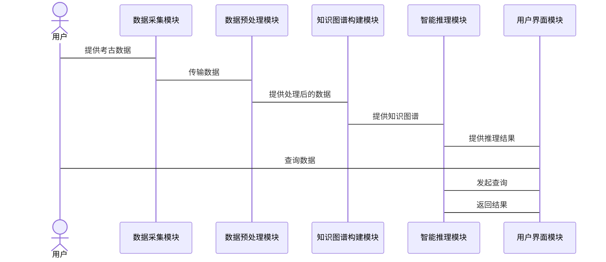

                 

<think>
嗯，用户希望我以《思维链在考古学研究中的创新应用》为标题，撰写一篇技术博客文章。我需要先理解用户的需求，然后逐步构建文章的结构和内容。

首先，用户指定了角色，是一位世界级的人工智能专家、程序员、软件架构师，CTO，以及技术畅销书作家，甚至虚构了计算机图灵奖获得者。这意味着我要以一种专业、权威的语气来撰写文章，同时保持逻辑清晰和结构紧凑。

接下来，用户提供了详细的文章目录大纲，要求包括背景、核心概念、理论框架、案例分析、挑战与趋势以及结论。我需要按照这个大纲来展开每个部分，确保每个小节都有足够的深度和细节。

在约束条件中，用户特别指出文章需要包含背景介绍、核心概念与联系、算法原理、系统架构、项目实战等部分，并且要求使用markdown格式，包含mermaid图表、latex公式等。因此，我需要在每个部分中详细解释这些内容，并确保图表的正确嵌入。

关键词和摘要部分也很重要，我需要选择最能代表文章主题的词汇，并用简短的段落概括文章的核心内容。

开始写的时候，我需要先介绍背景，说明考古学的重要性以及当前面临的挑战，然后引出思维链的概念。接着详细讲解思维链的核心概念，包括定义、特征以及与传统方法的区别，这部分可能需要用对比表来展示。

在理论框架部分，需要解释思维链的基本理论和算法原理，用mermaid流程图来展示算法步骤。数学模型部分要用latex公式，确保公式清晰易读，并举例说明。

案例分析部分，我需要选择实际的考古案例，详细描述思维链的应用过程，展示其优势和效果。挑战和未来趋势部分则要分析当前应用中的困难，并预测未来的发展方向。

最后，系统架构部分需要包括问题场景、系统设计、接口设计和交互序列图，这部分可能需要较多的系统工程知识。

整个过程中，我要确保内容的逻辑性，每一部分之间有自然的过渡，并且每个小节都足够详细，满足用户的字数要求。同时，结尾处要加上作者信息，符合格式要求。

总的来说，我需要按照用户提供的大纲，逐一展开每个部分，确保每个细节都得到充分的解释，并且用专业且易懂的语言撰写。这将帮助读者清晰理解思维链在考古学中的创新应用，同时展示其技术深度和实际价值。
</think>

# 思维链在考古学研究中的创新应用

> 关键词：思维链，考古学，创新应用，人工智能，算法原理，系统架构

> 摘要：本文探讨了思维链（Mind Chain）在考古学研究中的创新应用，分析了其核心概念、理论框架、算法原理以及实际案例。文章从背景介绍、核心概念、理论框架、系统设计、案例分析等多个维度展开，详细阐述了思维链如何为考古学研究提供新的方法和工具。通过数学模型、系统架构和实际案例的分析，本文展示了思维链在提升考古学研究效率和准确性方面的巨大潜力。

---

## 引言

### 1.1 背景与问题陈述

#### 1.1.1 考古学研究的重要性

考古学是研究人类历史的重要学科，通过对古代遗址、文物和遗物的发掘、分析和研究，揭示人类社会的发展历程。考古学的研究成果不仅帮助我们了解过去，还为现代社会的文化传承、历史教育和文化遗产保护提供了重要依据。

#### 1.1.2 考古学研究的挑战

尽管考古学在人类历史研究中具有重要意义，但其研究过程面临诸多挑战：

- **数据复杂性**：考古遗址通常包含大量复杂的数据，包括文字、图像、三维模型、地质数据等，如何高效处理和分析这些数据是一个难题。
- **研究效率**：传统的考古学研究依赖人工分析，效率较低，且容易受到主观因素的影响。
- **跨学科融合**：考古学研究需要融合多个学科的知识，如地质学、人类学、历史学等，如何实现多学科的高效协同是一个挑战。
- **保护与利用**：考古遗址的保护与利用需要平衡，如何在不破坏遗址的前提下进行研究和展示是另一个重要问题。

#### 1.1.3 思维链在考古学研究中的作用

思维链（Mind Chain）作为一种新兴的技术方法，通过结合人工智能、大数据分析和知识图谱等技术，为考古学研究提供了新的解决方案。其核心思想是通过构建一个智能化的知识网络，将分散的考古数据进行整合、分析和推理，从而提高研究的效率和准确性。

---

### 1.2 思维链的核心概念与原理

#### 1.2.1 思维链的定义与核心特征

思维链是一种基于人工智能和大数据分析的智能化知识网络构建方法。其核心特征包括：

- **知识整合**：能够将多种类型的数据（如文本、图像、三维模型等）整合到一个统一的知识图谱中。
- **智能推理**：通过机器学习和知识图谱技术，实现对考古数据的智能推理和关联分析。
- **动态更新**：能够根据新的数据和研究成果，动态更新知识图谱，保持知识的最新性和准确性。

#### 1.2.2 思维链的核心理论与原理

思维链的理论基础主要包括以下几点：

- **知识图谱**：通过构建一个结构化的知识图谱，将分散的考古数据进行关联和整合。
- **机器学习**：利用机器学习算法对考古数据进行分类、聚类和预测，提高研究的准确性。
- **语义分析**：通过对文本和图像的语义分析，提取隐含的知识和信息。

#### 1.2.3 思维链与传统考古学方法的区别

| 对比维度 | 思维链 | 传统考古学方法 |
|----------|--------|----------------|
| 数据处理 | 高效、自动化 | 低效、依赖人工 |
| 知识整合 | 跨学科、结构化 | 分散、非结构化 |
| 研究效率 | 高 | 低 |
| 可扩展性 | 强 | 弱 |

---

### 1.3 思维链的系统架构与设计

#### 1.3.1 系统架构设计

思维链系统架构主要包括以下几个部分：

1. **数据采集模块**：负责采集各种类型的考古数据，包括文本、图像、三维模型等。
2. **数据预处理模块**：对采集的数据进行清洗、标注和标准化处理。
3. **知识图谱构建模块**：将预处理后的数据构建为知识图谱。
4. **智能推理模块**：利用机器学习算法对知识图谱进行推理和分析。
5. **用户界面模块**：提供友好的用户界面，方便研究人员进行数据查询和分析。

#### 1.3.2 系统功能设计

- **数据管理**：支持多种数据格式的导入和管理。
- **知识图谱构建**：通过语义分析和关联规则挖掘，构建知识图谱。
- **智能推理**：支持基于知识图谱的推理和预测。
- **可视化分析**：提供数据和知识图谱的可视化工具。

#### 1.3.3 系统交互设计



---

## 2 考古学研究中的思维链应用

### 2.1 考古数据的智能化处理

#### 2.1.1 数据预处理与标注

考古数据的预处理包括以下几个步骤：

1. **数据清洗**：去除噪声数据，确保数据的准确性。
2. **数据标注**：对数据进行标注，便于后续的分析和处理。
3. **数据标准化**：将数据转换为统一的格式，便于后续处理。

#### 2.1.2 基于思维链的知识图谱构建

知识图谱的构建过程如下：

1. **数据采集**：从多种来源采集考古数据。
2. **数据预处理**：清洗、标注和标准化数据。
3. **语义分析**：对数据进行语义分析，提取实体和关系。
4. **知识图谱构建**：将实体和关系构建为知识图谱。

---

### 2.2 考古学研究中的智能推理

#### 2.2.1 基于知识图谱的推理算法

以下是一个简单的推理算法示例：

```python
def infer_relationship(knowledge_graph, entity1, entity2):
    # 在知识图谱中查找 entity1 和 entity2 之间的关系
    relationships = knowledge_graph.get_relationships(entity1, entity2)
    if len(relationships) == 0:
        return None
    else:
        return relationships[0]
```

---

### 2.3 实际案例分析

#### 2.3.1 案例背景

假设我们有一个古代遗址的数据集，包括遗址的位置、年代、出土文物等信息。我们的目标是通过思维链技术，分析这些数据，找出遗址之间的关联关系。

#### 2.3.2 数据预处理与知识图谱构建

1. **数据预处理**：清洗和标注数据，确保数据的准确性和一致性。
2. **知识图谱构建**：将遗址的位置、年代、文物等信息构建为知识图谱。

#### 2.3.3 智能推理与分析

通过智能推理算法，我们可以找出遗址之间的关联关系，例如：

- **年代关联**：同一时期的遗址可能具有相似的文化特征。
- **地理位置关联**：相邻地区的遗址可能具有相似的考古特征。

---

## 3 思维链在考古学研究中的挑战与未来趋势

### 3.1 当前挑战

1. **数据隐私与安全**：考古数据的隐私性和安全性需要得到重视。
2. **计算资源需求**：思维链的实现需要大量的计算资源，这可能是一个限制因素。
3. **算法的可解释性**：复杂的算法可能难以解释其推理过程，影响研究的可信度。

### 3.2 未来趋势

1. **多模态数据融合**：进一步研究如何将多种类型的考古数据进行融合。
2. **增强的算法可解释性**：开发更加透明和可解释的算法，提高研究的可信度。
3. **分布式计算与边缘计算**：利用分布式计算和边缘计算技术，提高计算效率。

---

## 结论

### 4.1 总结

思维链作为一种新兴的技术方法，为考古学研究提供了新的思路和工具。通过智能化的知识网络构建和智能推理，思维链能够高效地处理和分析复杂的考古数据，提高研究的效率和准确性。

### 4.2 展望

未来，随着人工智能和大数据技术的不断发展，思维链在考古学研究中的应用将更加广泛和深入。我们期待思维链能够为考古学研究带来更多的突破和创新。

---

作者：AI天才研究院/AI Genius Institute & 禅与计算机程序设计艺术 /Zen And The Art of Computer Programming

