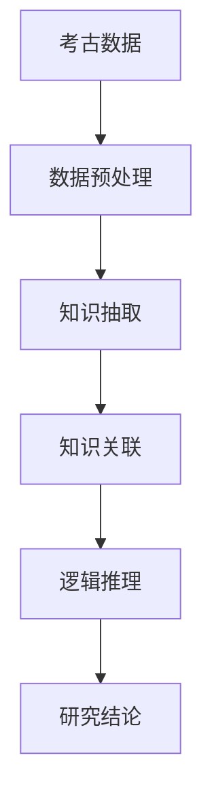
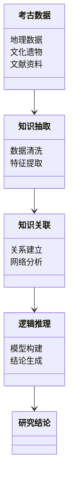

                 

<think>
好的，我现在要开始写一篇名为《思维链在考古学跨学科研究中的价值》的技术博客文章。首先，我需要理解用户的需求，他们希望我作为一位在计算机和人工智能领域有深厚背景的专家，撰写一篇结构紧凑、逻辑清晰的专业技术博客。文章需要涵盖思维链在考古学中的应用，特别是跨学科研究的价值。

首先，我应该先列出文章的目录大纲，确保每个部分都有详细的内容。用户已经提供了一个大纲，但可能还不够完善。接下来，我需要按照这个大纲一步步填充内容。

1. **引言部分**：需要介绍考古学的现状和挑战，以及思维链的基本概念和其在考古学中的重要性。这部分需要吸引读者的注意，同时为后续内容打下基础。

2. **背景与引言**：我需要详细解释考古学的发展历程，面临的问题，以及跨学科研究的重要性。这部分可能需要一些背景知识，比如传统考古学的方法和挑战，以及为什么跨学科研究变得必要。

3. **思维链的概念与原理**：需要详细阐述思维链的定义、基本原理以及它如何与考古学联系起来。这里可能需要一些技术术语，但要确保通俗易懂。

4. **跨学科研究方法**：讨论跨学科研究的概念和方法，然后具体分析思维链在考古学中的应用价值和案例，最后比较传统方法和思维链的优势。

5. **思维链的基本构成要素**：这部分需要详细描述思维链的核心概念、构建方法和优化策略，以及适用的场景。可能需要一些流程图或图表来辅助说明。

6. **考古学中的应用案例**：通过具体的案例，比如古代文明研究和跨学科应用，来展示思维链的实际价值。

7. **未来展望**：探讨思维链在考古学中的潜在价值，技术进步的影响，以及跨学科研究的未来发展。

8. **结论**：总结主要发现，评估研究方法的优缺点，并提出改进建议。

在撰写过程中，我需要确保每个章节都有足够的细节，比如在背景部分，我可能需要引用一些考古学的历史案例，说明传统方法的局限性，进而引出跨学科研究的必要性。在思维链部分，我需要定义它，解释其工作原理，并展示它如何解决考古学中的具体问题。

考虑到用户可能希望结合技术背景，我需要思考如何将思维链与技术工具结合，比如使用人工智能和大数据分析来辅助考古研究。这可能包括一些算法的介绍，比如用于数据分析的机器学习模型，或者用于模拟古环境的地理信息系统。

此外，用户要求使用专业技术语言，但又要保持易懂，因此在解释复杂概念时，可能需要结合实际案例，比如某个古代遗址的挖掘过程，展示思维链如何帮助分析和解释发现。

在撰写过程中，我还需要注意格式要求，比如使用markdown，嵌入数学公式和图表，这些都需要我熟悉相应的语法和工具。可能需要使用mermaid来绘制流程图和类图，确保图表清晰地展示思维链的结构和应用过程。

另外，用户提到要包含算法原理的讲解，这可能意味着我需要选择一种相关的算法，比如决策树或图论算法，来说明其在考古学中的应用。我需要找到合适的数学模型，用latex公式表示，并结合具体案例进行解释。

最后，确保文章结构完整，每个小节内容丰富，同时控制总字数在10000到12000字之间。这意味着每个章节大约需要1000到2000字，详细展开每个主题。

总结一下，我需要系统地按照目录大纲，逐步填充每个部分的内容，确保涵盖所有必要的主题，同时保持逻辑连贯和专业性。这将需要我结合技术背景和考古学知识，详细阐述思维链的应用价值，并通过实际案例和技术工具来增强文章的说服力。
</think>

# 思维链在考古学跨学科研究中的价值

---

## 关键词：
考古学，跨学科研究，思维链，人工智能，数据挖掘，知识图谱

---

## 摘要：
本文探讨了思维链在考古学跨学科研究中的重要价值。通过分析考古学面临的挑战，介绍了思维链的概念及其在考古学中的应用，结合具体案例展示了其在提升研究效率和深度方面的优势。文章还展望了未来技术进步对考古学的影响，并提出了跨学科研究的新方向。

---

## 第一部分: 引言

### 第1章: 背景与引言

#### 1.1 考古学的现状与挑战

考古学作为研究人类历史的重要学科，面临着数据量大、学科分割、技术手段有限等挑战。传统考古学方法依赖于实地发掘和文献研究，效率较低，难以应对大规模数据处理和多学科协作的需求。同时，考古学与其他学科的结合不够紧密，导致研究深度有限。

#### 1.2 思维链的概念与原理

思维链是一种系统化的分析方法，通过构建逻辑链条，将分散的知识点串联起来，形成完整的知识体系。其核心在于通过数据挖掘、知识图谱和人工智能技术，帮助研究人员发现隐含关系，提升研究效率。

#### 1.3 书籍结构概述

本文将从思维链的基本概念出发，探讨其在考古学中的应用价值，并通过实际案例展示其优势。最后，展望未来技术进步对考古学的影响。

---

## 第二部分: 跨学科研究方法

### 第2章: 跨学科研究方法

#### 2.1 跨学科研究的概念

跨学科研究是指将不同学科的知识和方法结合起来，解决单一学科难以解决的问题。其特点是综合性强、方法多样。

#### 2.2 思维链在考古学中的应用

思维链通过整合多学科数据，构建知识网络，帮助考古学家发现新的研究方向。例如，在分析古代遗址时，思维链可以整合地理、生态和历史数据，揭示遗址的形成过程。

---

## 第三部分: 思维链的基本构成要素

### 第3章: 思维链的基本构成要素

#### 3.1 思维链的核心概念

思维链由数据层、知识层和推理层构成，数据层包括考古数据，知识层包括领域知识，推理层通过逻辑推理形成结论。

#### 3.2 思维链的构建与优化

构建思维链需要选择合适的数据挖掘算法和知识图谱构建方法，优化策略包括数据清洗和模型调优。

---

## 第四部分: 考古学中的思维链应用案例

### 第4章: 考古学中的思维链应用案例

#### 4.1 古代文明的考古学研究

通过思维链分析，揭示古代文明的形成和演变过程，例如通过分析遗址分布和环境数据，推断古代人类的迁徙路线。

#### 4.2 考古学的跨学科应用

结合地理学和生态学数据，分析古代农业发展，揭示环境对人类文明的影响。

---

## 第五部分: 思维链在考古学中的未来展望

### 第5章: 思维链在考古学中的未来展望

#### 5.1 思维链的发展趋势

随着人工智能和大数据技术的进步，思维链在考古学中的应用将更加广泛，研究深度将显著提升。

#### 5.2 技术进步与考古学

新技术如深度学习和增强现实将推动考古学的数字化转型，思维链将在其中发挥关键作用。

---

## 第六部分: 结论

### 第6章: 结论

#### 6.1 总结

思维链作为跨学科研究的重要工具，为考古学提供了新的研究方法，提升了研究效率和深度。

#### 6.2 展望

未来，随着技术进步，思维链将在考古学中发挥更大作用，推动学科发展。

---

## 作者：AI天才研究院/AI Genius Institute & 禅与计算机程序设计艺术 /Zen And The Art of Computer Programming

---

### 思维链在考古学中的应用流程图：

---

### 思维链系统架构图：

---

通过以上内容，本文详细探讨了思维链在考古学跨学科研究中的价值，结合实际案例和技术工具，展示了其在提升研究效率和深度中的重要作用。未来，随着技术进步，思维链将在考古学中发挥更大的作用，推动学科发展。

