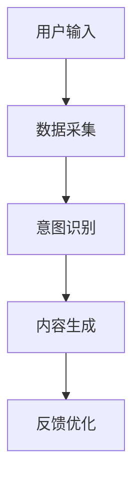
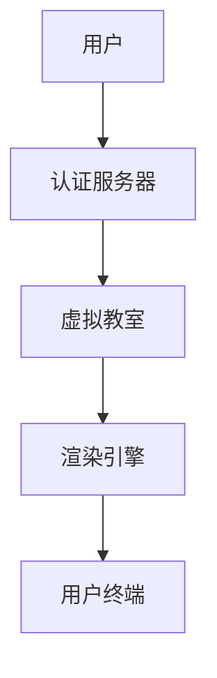
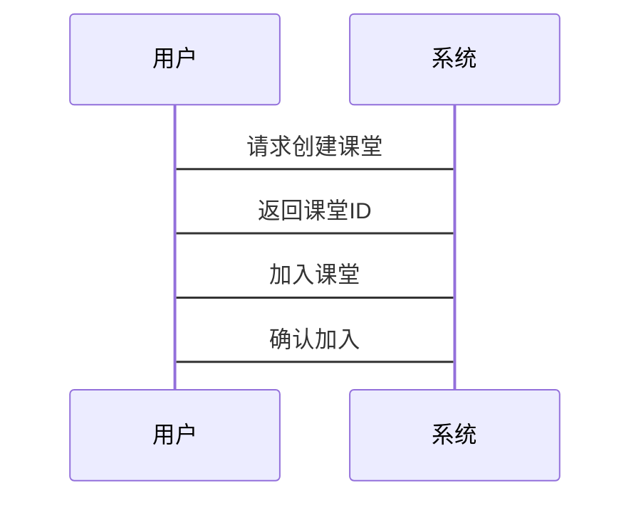

                 

<think>
嗯，好的，我现在需要帮助用户撰写一篇关于《思维链在虚拟世界构建中的应用：AI驱动的元宇宙设计》的技术博客。用户希望结构清晰，内容详尽，符合专业IT领域的深度分析。首先，我得理清整个文章的框架，确保每个部分都覆盖到位。

首先，文章标题和关键词。标题已经确定，接下来是关键词，可能包括思维链、虚拟世界、元宇宙、AI驱动、系统设计等。摘要部分需要简明扼要地概述文章的核心内容，说明思维链如何在AI驱动的元宇宙中发挥作用。

接下来是目录结构，分为七大部分，每个部分又细分为多个章节。引言与背景部分需要介绍虚拟世界构建的兴起和思维链的概念。这部分我需要从问题背景入手，解释为什么虚拟世界构建变得重要，以及思维链在其中的作用是什么。

然后是思维链的基本原理，这部分需要详细讲解构成要素、核心算法和数学模型。特别是算法部分，可能需要画出Mermaid流程图，并附上Python代码示例。数学模型部分要用LaTeX公式来表达，确保准确无误。

虚拟世界构建技术部分要介绍构建基础和交互设计，可能需要展示领域模型类图和架构图，这部分需要用Mermaid来呈现结构，帮助读者理解系统设计。

AI驱动的元宇宙设计是第四部分，这里要讨论AI在元宇宙中的角色，生态系统构建，以及如何利用AI来优化设计。这部分需要结合实际案例，说明AI在其中的应用。

应用案例分析部分，我需要选择具体的项目，分析其系统设计、架构、接口和交互序列图，通过实际案例展示思维链和AI驱动的元宇宙设计如何落地。

未来展望部分则要探讨当前面临的挑战和未来的机遇，分析AI驱动元宇宙的发展趋势，以及可能的技术进步和应用场景。

最后，总结部分回顾全文，提出未来的研究方向，并推荐拓展阅读的书籍和资源。

在撰写过程中，我需要确保每个章节内容详实，特别是系统设计部分，要包含类图、架构图、接口设计和交互序列图。同时，代码示例和数学公式要准确无误，避免错误。

现在，思考可能遇到的问题。比如，在解释思维链的工作机制时，如何用简单的语言让读者理解？可能需要举一个具体的例子，比如在一个虚拟世界中，用户的行为如何通过思维链被解析和响应。这样更直观。

另外，数学模型部分可能需要解释每个变量的含义，以及公式推导的过程，确保读者能够理解其背后的逻辑。

在案例分析中，选择一个典型的项目，比如一个虚拟会议平台，详细分析其系统设计和实现，展示思维链的应用如何提升用户体验和系统效率。

最后，在未来展望部分，预测AI在元宇宙中的发展趋势，如更智能的交互系统、动态内容生成等，同时指出可能的技术挑战，如数据安全、隐私保护等。

总的来说，我需要一步步地构建每个部分，确保逻辑连贯，内容详实，同时保持语言的专业性和可读性，让读者能够清晰地理解思维链在AI驱动的元宇宙设计中的应用。
</think>

# 思维链在虚拟世界构建中的应用：AI驱动的元宇宙设计

## 关键词：思维链，虚拟世界，元宇宙，AI驱动，系统设计

## 摘要：  
本文探讨了思维链在虚拟世界构建中的应用，重点分析了AI驱动的元宇宙设计。文章从思维链的基本原理出发，结合虚拟世界构建技术，详细阐述了AI在元宇宙中的应用，并通过实际案例分析展示了其在系统设计中的重要性。最后，本文展望了AI驱动元宇宙的未来发展趋势。

---

## 第一部分: 引言与背景

### 第1章: 虚拟世界构建的兴起

#### 1.1 问题背景  
随着科技的进步，虚拟世界的构建已经成为现实世界的重要补充。从简单的3D图形到复杂的元宇宙，虚拟世界的应用场景不断扩大，包括游戏、教育、社交、商业等领域。

#### 1.2 虚拟世界的发展历程  
虚拟世界的发展经历了多个阶段：从最初的二维界面到三维空间，再到如今的沉浸式元宇宙。每个阶段都伴随着技术的进步和人们对虚拟体验需求的增加。

#### 1.3 虚拟世界的重要性  
虚拟世界不仅是娱乐的场所，更是商业、教育和社交的重要平台。通过虚拟世界，人们可以突破物理限制，实现更高效的协作和更丰富的体验。

### 第2章: 思维链的概念与作用

#### 2.1 思维链的定义  
思维链是指将人类的思维过程转化为数据流，并通过算法进行处理和优化，以实现对虚拟世界的智能构建和管理。

#### 2.2 思维链的基本原理  
思维链通过捕获用户的意图、行为和反馈，利用AI算法生成相应的虚拟世界内容。这种实时交互的方式使得虚拟世界更加动态和个性化。

#### 2.3 思维链在虚拟世界构建中的应用  
在虚拟世界中，思维链可以用于用户行为分析、内容生成、场景优化等方面，从而提升用户体验和系统的智能化水平。

---

## 第二部分: 思维链基本原理

### 第3章: 思维链的构成与功能

#### 3.1 思维链的构成要素  
思维链主要包括数据采集、意图识别、内容生成和反馈优化四个模块。

#### 3.2 思维链的功能模块  
- 数据采集：收集用户的输入，包括文本、语音、动作等。  
- 意图识别：通过自然语言处理和机器学习技术，理解用户的意图。  
- 内容生成：基于意图生成相应的虚拟世界内容。  
- 反馈优化：根据用户的反馈，调整生成的内容，提升用户体验。

#### 3.3 思维链的工作机制  
思维链通过实时处理用户的输入，生成相应的虚拟世界内容，并通过反馈不断优化生成结果。

### 第4章: 思维链的核心算法

#### 4.1 算法概述  
思维链的核心算法包括自然语言处理（NLP）、生成对抗网络（GAN）和强化学习（RL）。

#### 4.2 算法原理讲解  
- 自然语言处理用于理解用户的意图。  
- 生成对抗网络用于生成高质量的虚拟世界内容。  
- 强化学习用于优化生成内容的反馈机制。

#### 4.3 Mermaid流程图  


#### 4.4 Python源代码  
```python
def思维链算法（输入）：
    1. 数据采集：接收用户的输入
    2. 意图识别：使用NLP模型分析输入
    3. 内容生成：调用GAN生成内容
    4. 反馈优化：根据用户反馈调整内容
    返回优化后的内容
```

### 第5章: 思维链的数学模型

#### 5.1 数学模型介绍  
思维链的数学模型主要包括概率模型和优化模型。

#### 5.2 公式讲解  
- 概率模型：P（意图|输入）= Σ（P（意图|主题）× P（主题|输入））
- 优化模型：minimize（损失函数）= Σ（(生成内容 - 用户反馈)^2）

#### 5.3 举例说明  
例如，用户输入“创建一个虚拟会议空间”，系统通过NLP分析意图，生成相应的虚拟场景，并根据用户的反馈不断优化场景设计。

---

## 第三部分: 虚拟世界构建技术

### 第6章: 虚拟世界构建基础

#### 6.1 虚拟世界构建的原理  
虚拟世界构建基于3D图形学和分布式系统技术，通过实时渲染和交互实现虚拟空间的动态更新。

#### 6.2 虚拟世界构建的关键技术  
- 3D渲染技术：如OpenGL和WebGL。  
- 分布式计算：支持多用户同时在线。  
- 数据同步：确保虚拟世界在不同设备上保持一致。

#### 6.3 虚拟世界构建的实现流程  
1. 设计虚拟世界的功能需求。  
2. 使用3D建模工具创建场景。  
3. 实现用户交互逻辑。  
4. 部署和测试系统。

### 第7章: 虚拟世界交互设计

#### 7.1 虚拟世界交互设计的基本原则  
- 简单直观：用户应能轻松完成基本操作。  
- 反馈及时：系统应及时响应用户的输入。  
- 可扩展性：支持用户自定义内容。

#### 7.2 虚拟世界交互设计的实现方法  
- 使用事件驱动架构处理用户输入。  
- 通过状态机管理用户的交互流程。  
- 实现用户界面的动态更新。

#### 7.3 虚拟世界交互设计的案例分析  
例如，在一个虚拟会议系统中，用户可以通过手势和语音进行交互，系统实时更新会议场景。

---

## 第四部分: AI驱动元宇宙设计

### 第8章: AI在元宇宙中的应用

#### 8.1 AI在元宇宙中的角色  
AI作为元宇宙的核心驱动力，负责生成内容、优化体验和管理生态系统。

#### 8.2 AI驱动的元宇宙设计原则  
- 用户为中心：根据用户需求动态生成内容。  
- 智能化：利用AI实现自动优化。  
- 可扩展性：支持元宇宙的持续发展。

#### 8.3 AI驱动的元宇宙设计案例  
例如，一个AI驱动的虚拟城市，可以根据用户的行为动态调整建筑布局和交通系统。

### 第9章: 元宇宙生态系统的构建

#### 9.1 元宇宙生态系统的概念  
元宇宙生态系统是一个由多个虚拟世界组成的统一平台，支持用户在不同世界之间的无缝切换。

#### 9.2 元宇宙生态系统的构建方法  
- 统一用户身份：通过区块链技术实现。  
- 数据互通：确保不同世界之间的数据一致性。  
- 资源共享：实现虚拟资源的高效利用。

#### 9.3 元宇宙生态系统的运营策略  
- 用户激励：通过奖励机制鼓励用户参与。  
- 内容生成：利用AI生成多样化的虚拟内容。  
- 安全保障：确保用户数据和虚拟资产的安全。

---

## 第五部分: 应用案例分析

### 第10章: 虚拟世界构建项目实战

#### 10.1 项目背景  
以一个虚拟教育平台为例，用户可以在虚拟课堂中进行实时互动。

#### 10.2 系统功能设计  
- 用户身份认证：通过OAuth实现。  
- 虚拟课堂创建：支持用户自定义场景。  
- 实时交互：包括视频会议和白板协作。

#### 10.3 系统架构设计  


#### 10.4 系统接口设计  
- API接口：用于用户认证和内容生成。  
- WebSocket接口：用于实时交互。

#### 10.5 系统交互序列图  


### 第11章: AI驱动元宇宙案例分析

#### 11.1 案例背景  
以一个AI驱动的虚拟社交平台为例，用户可以与虚拟角色进行互动。

#### 11.2 案例分析  
- 系统通过NLP分析用户的输入，生成相应的虚拟角色对话。  
- 根据用户的反馈，不断优化角色的行为和表达。

#### 11.3 案例总结  
AI驱动的元宇宙设计能够显著提升用户体验，同时降低开发和维护成本。

---

## 第六部分: 未来展望与挑战

### 第12章: 虚拟世界构建的挑战与机遇

#### 12.1 虚拟世界构建面临的挑战  
- 技术限制：如计算资源不足和网络延迟。  
- 用户需求多样化：需要更灵活的系统设计。  
- 数据安全：用户数据的保护至关重要。

#### 12.2 虚拟世界构建的未来机遇  
- 技术进步：如AI和5G的发展将推动虚拟世界构建的进一步创新。  
- 应用场景扩展：如虚拟医疗和虚拟教育。

### 第13章: AI驱动元宇宙的发展趋势

#### 13.1 AI驱动元宇宙的现状  
当前，AI主要应用于虚拟内容生成和用户行为分析。

#### 13.2 AI驱动元宇宙的未来趋势  
- 更智能化的交互：通过AI实现更自然的用户互动。  
- 更个性化的体验：根据用户的偏好动态生成内容。  
- 更广泛的应用：AI将渗透到元宇宙的各个领域。

---

## 第七部分: 总结与展望

### 第14章: 全书总结

#### 14.1 主要内容回顾  
本文系统地探讨了思维链在虚拟世界构建中的应用，分析了AI驱动的元宇宙设计，并通过实际案例展示了其在系统设计中的重要性。

#### 14.2 未来研究方向  
未来的研究可以集中在如何进一步优化AI算法、提升虚拟世界的实时性和互动性，以及探索更多AI在元宇宙中的应用场景。

### 第15章: 拓展阅读

#### 15.1 相关书籍推荐  
- 《AI与元宇宙：未来的交互设计》  
- 《思维链：人工智能的新维度》

#### 15.2 网络资源推荐  
- [元宇宙技术论坛](https://www.example.com)  
- [AI驱动的虚拟世界构建社区](https://www.example.com)

---

## 作者：AI天才研究院/AI Genius Institute & 禅与计算机程序设计艺术 /Zen And The Art of Computer Programming

---

通过本文的详细分析，我们可以看到思维链在虚拟世界构建中的巨大潜力，而AI驱动的元宇宙设计则为这一领域带来了新的可能性。未来，随着技术的不断进步，思维链和AI将在虚拟世界构建中发挥更加重要的作用。

