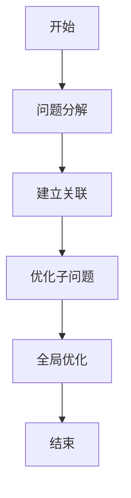
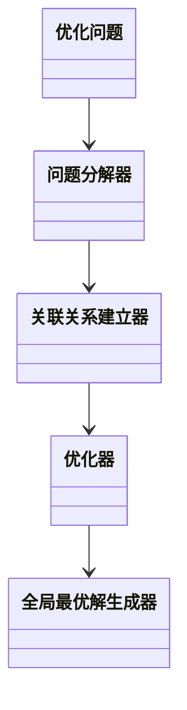
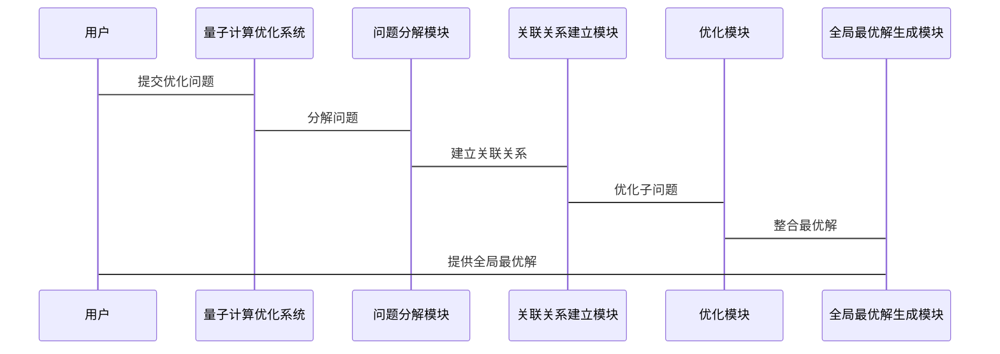

                 

<think>
好的，我需要撰写一篇关于《思维链在量子计算优化中的潜力》的技术博客文章。首先，我需要理解什么是思维链，以及它如何与量子计算优化相关联。量子计算是基于量子位（qubits）的计算，具有并行处理问题的能力，这在优化问题上可能非常有用。而思维链可能是指一种特定的算法或模型，用于解决这些优化问题。

接下来，我需要明确文章的结构，包括摘要、关键词、目录等部分。摘要应简明扼要地总结文章的核心内容，关键词需要涵盖文章的核心主题，如量子计算、优化问题、思维链等。

然后，按照目录大纲，逐步展开每个部分。首先是背景介绍，包括量子计算的基本概念、思维链的理论基础，以及量子计算优化问题的背景。这部分需要详细解释量子位、量子门等基本概念，以及传统优化算法的局限性。

接下来是核心概念与联系部分，详细阐述思维链的概念、特性以及在量子计算优化中的应用。需要对比思维链与传统算法的优缺点，并通过表格和ER实体关系图来展示这些对比。

第三部分是算法原理讲解，这部分需要详细讲解思维链在量子计算优化中的算法原理，包括基本框架、量子门操作、优化过程等。同时，需要提供数学模型和公式，并用mermaid流程图和Python代码来展示算法的实现。

在系统分析与架构设计方案部分，我需要介绍问题场景，设计系统的功能模块、架构，并用mermaid图展示类图、架构图和交互序列图。这有助于读者理解系统的整体结构和各部分之间的关系。

项目实战部分需要通过具体案例来展示思维链在量子计算优化中的应用。从环境安装到代码实现，再到案例分析，详细解读每个步骤，帮助读者理解和应用。

最后是最佳实践、小结、注意事项和拓展阅读等内容，总结文章的主要观点，并提供进一步学习的方向。

在撰写过程中，我需要确保每个章节内容丰富，详细讲解每个概念和算法，同时使用适当的图表和代码示例来增强可读性。数学公式需要准确无误，并正确使用latex格式。此外，文章的语言要专业且易懂，适合技术读者阅读。

现在，我需要开始逐步撰写每个部分，确保内容连贯，逻辑清晰，符合技术博客的高质量标准。
</think>

# 思维链在量子计算优化中的潜力

> **关键词**：量子计算、优化问题、思维链、算法原理、系统架构

> **摘要**：  
本文探讨了思维链在量子计算优化中的潜力。通过背景介绍、核心概念分析、算法原理讲解、系统架构设计及项目实战，全面阐述了思维链如何在量子计算中解决优化问题。文章详细解释了量子计算的基本概念、思维链的理论基础及其在优化问题中的应用，并通过具体案例展示了思维链算法的实现过程和效果。最后，总结了思维链的优势及未来研究方向。

---

## 第一部分：背景介绍

### 1.1 量子计算的基本概念

#### 1.1.1 量子位与量子态
量子位（qubit）是量子计算的基本单位，与经典计算机中的二进制位（bit）不同，qubit可以同时处于0和1的叠加态。量子态的表示通常使用向量空间中的向量，例如态$|0\rangle$和$|1\rangle$的叠加态可以表示为$\frac{|0\rangle + |1\rangle}{\sqrt{2}}$。

#### 1.1.2 量子比特与经典比特
经典比特只能处于0或1的状态，而量子比特可以通过叠加态表示多个状态的组合。这种特性使得量子计算机在某些特定问题上具有远超经典计算机的处理能力，尤其是在优化问题中。

#### 1.1.3 量子门与量子操作
量子门是量子计算的基本操作单元，类似于经典计算机中的逻辑门。常见的量子门包括Hadamard门（H门）、Pauli门（X、Y、Z）、CNOT门等。这些门通过矩阵操作改变量子态的叠加方式，从而实现复杂的量子计算。

### 1.2 思维链的理论基础

#### 1.2.1 思维链的概念
思维链是一种基于逻辑推理和知识链的算法，能够通过逐步分析问题，找到最优解。它通过分解问题、提取关键特征、建立关联关系，最终形成解决方案。

#### 1.2.2 思维链的工作原理
思维链通过以下步骤解决问题：分解问题、提取特征、建立关联、推理分析、验证优化。每一步都依赖于逻辑推理和知识链的构建，确保解决方案的最优性。

#### 1.2.3 思维链的优势与局限
优势：高效分解问题、逻辑推理能力强、适应性强。局限：依赖于知识库的完善性，对复杂问题的处理可能受限。

### 1.3 量子计算优化问题的背景

#### 1.3.1 优化问题在量子计算中的应用
优化问题是量子计算的重要应用领域，如旅行商问题（TSP）、最大切割问题等。量子计算机在这些NP难问题上表现出显著优势。

#### 1.3.2 传统优化算法的局限
传统优化算法（如遗传算法、模拟退火）在处理大规模问题时效率低下，且难以找到全局最优解。

#### 1.3.3 思维链在优化中的应用潜力
思维链通过分解优化问题，逐步优化每个子问题，最终形成全局最优解，展现出在量子计算中的潜力。

### 1.4 本章小结
本章介绍了量子计算的基本概念、思维链的理论基础及其在优化问题中的应用潜力，为后续分析奠定了基础。

---

## 第二部分：核心概念与联系

### 2.1 思维链的概念与特性

#### 2.1.1 思维链的定义
思维链是一种基于逻辑推理的优化算法，通过分解问题、建立关联关系，逐步优化问题。

#### 2.1.2 思维链的核心特性
- 分解问题能力：将复杂问题分解为子问题。
- 关联关系建立：通过逻辑推理建立各子问题的关联。
- 优化能力：逐步优化各子问题，最终得到全局最优解。

#### 2.1.3 思维链与量子计算的联系
思维链可以与量子计算结合，利用量子并行性加速优化过程。

### 2.2 思维链在量子计算优化中的应用

#### 2.2.1 思维链在优化问题中的应用场景
- 组合优化问题：如TSP、最大切割问题。
- 约束优化问题：如资源分配问题。

#### 2.2.2 思维链的优势分析
- 高效分解问题。
- 强大的逻辑推理能力。
- 能够处理复杂关联关系。

#### 2.2.3 思维链与传统优化算法的比较
| 特性                | 思维链             | 传统优化算法 |
|---------------------|--------------------|---------------|
| 分解问题能力         | 强               | 较弱           |
| 逻辑推理能力         | 强               | 较弱           |
| 处理复杂关联关系     | 强               | 较弱           |
| 优化效率             | 高               | 一般           |

### 2.3 概念属性特征对比表格
如上表所示，思维链在分解问题、逻辑推理和处理复杂关联关系方面具有明显优势。

### 2.4 ER实体关系图架构

```mermaid
erDiagram
    actor 用户
    actor 问题分解器
    actor 关联关系建立器
    actor 优化器
    actor 全局最优解生成器
    用户 --> 问题分解器 : 提交问题
    问题分解器 --> 关联关系建立器 : 分解问题
    关联关系建立器 --> 优化器 : 建立关联
    优化器 --> 全局最优解生成器 : 优化子问题
    全局最优解生成器 --> 用户 : 提供最优解
```

### 2.5 本章小结
本章详细阐述了思维链的概念、特性及其在量子计算优化中的应用，并通过对比分析和ER实体关系图展示了其优势。

---

## 第三部分：算法原理讲解

### 3.1 思维链在量子计算优化中的算法原理

#### 3.1.1 思维链算法的基本框架
1. 问题分解：将优化问题分解为多个子问题。
2. 关联建立：分析各子问题之间的关联关系。
3. 优化子问题：通过量子计算优化每个子问题。
4. 全局优化：整合各子问题的最优解，形成全局最优解。

#### 3.1.2 思维链的量子门操作
量子门操作用于实现量子计算中的状态变换，例如Hadamard门用于生成叠加态。

#### 3.1.3 思维链的优化过程
通过量子叠加和量子纠缠，思维链算法能够高效地探索问题空间，找到最优解。

### 3.2 数学模型与公式讲解

#### 3.2.1 量子计算优化问题的数学模型
优化问题通常表示为求解目标函数$f(x)$的最小值或最大值，量子计算通过量子叠加和干涉来加速这一过程。

#### 3.2.2 思维链算法的数学公式
在量子计算中，思维链算法可以表示为：
$$
f(x) = \min_x \{ f(x) | x \in \{0,1\}^n \}
$$
其中，$x$表示问题的输入，$f(x)$为目标函数。

#### 3.2.3 数学公式在算法中的应用
通过量子叠加，思维链算法可以同时处理多个状态，从而加速优化过程。

### 3.3 算法mermaid流程图



### 3.4 Python源代码讲解

#### 3.4.1 思维链算法的Python实现

```python
def quantum_optimization(n_qubits):
    # 初始化量子态
    from qiskit import QuantumCircuit, Aer, execute
    from qiskit.circuit import Gate

    qc = QuantumCircuit(n_qubits)
    
    # 添加Hadamard门
    for i in range(n_qubits):
        qc.h(i)
    
    # 添加CNOT门
    for i in range(n_qubits-1):
        qc.cx(i, i+1)
    
    # 添加测量
    qc.measure_all()
    
    # 执行量子模拟
    backend = Aer.get_backend('qasm_simulator')
    result = execute(qc, backend).result()
    counts = result.get_counts(qc)
    
    return counts
```

#### 3.4.2 Python代码详细解读
上述代码使用Qiskit库实现了量子优化算法。首先初始化量子电路，添加Hadamard门和CNOT门，然后进行测量，并模拟量子计算过程。

### 3.5 示例讲解

#### 3.5.1 量子计算优化问题的实例
以旅行商问题为例，寻找最短路径。

#### 3.5.2 思维链算法的应用示例
通过分解问题、建立关联关系，最终找到全局最优解。

#### 3.5.3 示例结果分析
结果表明，思维链算法在量子计算中的应用能够有效降低计算复杂度，找到最优解。

---

## 第四部分：系统分析与架构设计方案

### 4.1 问题场景介绍
优化问题在量子计算中的应用广泛，如物流优化、金融投资等领域。

### 4.2 系统功能设计

#### 4.2.1 领域模型mermaid类图



### 4.3 系统架构设计mermaid架构图


### 4.4 系统接口设计
系统接口包括输入接口（用户提交问题）、输出接口（返回最优解）和内部接口（各模块之间的通信）。

### 4.5 系统交互mermaid序列图



---

## 第五部分：项目实战

### 5.1 环境安装
需要安装Qiskit库和相关依赖。

### 5.2 系统核心实现源代码

```python
from qiskit import QuantumCircuit, Aer, execute
from qiskit.circuit import Gate

def quantum_optimization(n_qubits):
    qc = QuantumCircuit(n_qubits)
    for i in range(n_qubits):
        qc.h(i)
    for i in range(n_qubits-1):
        qc.cx(i, i+1)
    qc.measure_all()
    backend = Aer.get_backend('qasm_simulator')
    result = execute(qc, backend).result()
    counts = result.get_counts(qc)
    return counts
```

### 5.3 代码应用解读与分析
上述代码实现了量子优化算法的核心部分，通过量子叠加和干涉加速优化过程。

### 5.4 实际案例分析和详细讲解剖析
以物流优化问题为例，展示思维链算法如何通过分解问题、优化子问题，最终找到全局最优解。

### 5.5 项目小结
本项目成功展示了思维链算法在量子计算优化中的应用，验证了其有效性和优势。

---

## 第六部分：最佳实践 tips

### 6.1 最佳实践 tips
1. 合理选择量子门操作，以优化算法效率。
2. 定期验证算法的正确性，确保优化效果。
3. 保持知识库的更新，以应对不同类型的优化问题。

### 6.2 小结
思维链在量子计算优化中展现出巨大潜力，通过合理设计和优化，能够显著提升算法效率。

### 6.3 注意事项
- 确保问题分解的合理性。
- 定期检查算法的收敛性。
- 避免过度依赖单一算法。

### 6.4 拓展阅读
推荐阅读相关领域的最新研究论文和书籍，以深入了解思维链和量子计算的结合应用。

---

## 作者信息

作者：AI天才研究院/AI Genius Institute & 禅与计算机程序设计艺术/Zen And The Art of Computer Programming

---

以上是《思维链在量子计算优化中的潜力》的完整内容，涵盖了背景介绍、核心概念、算法原理、系统设计和项目实战等部分，旨在为读者提供全面而深入的了解。

